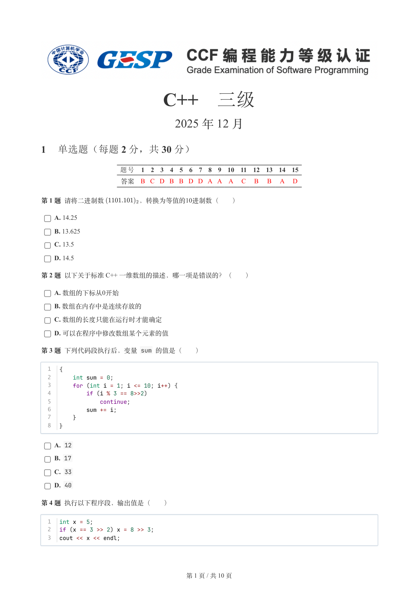
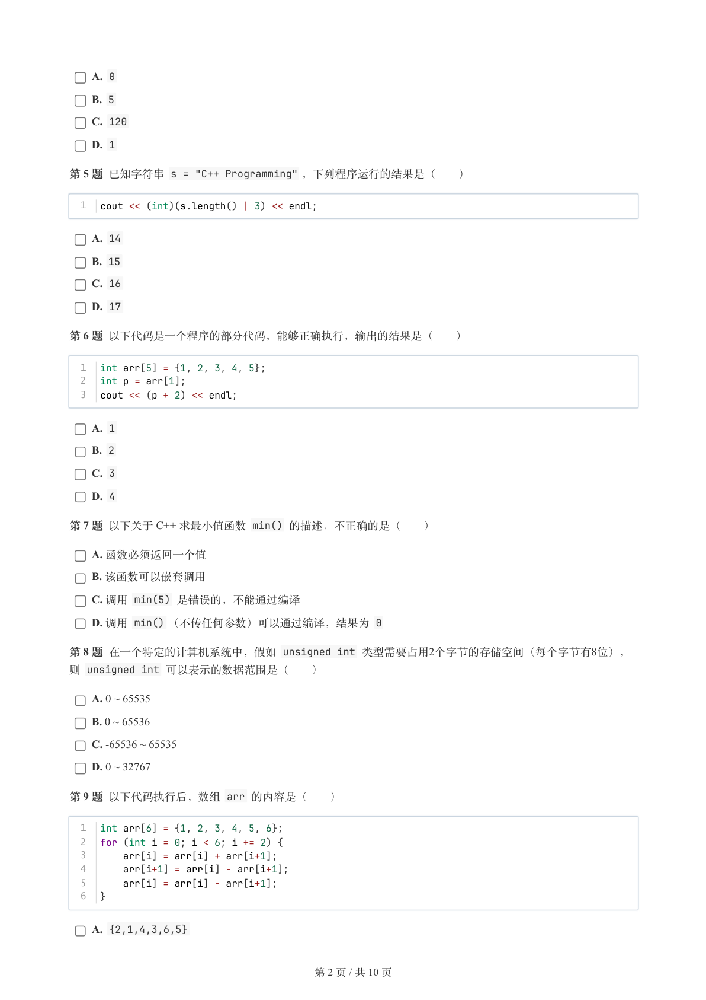
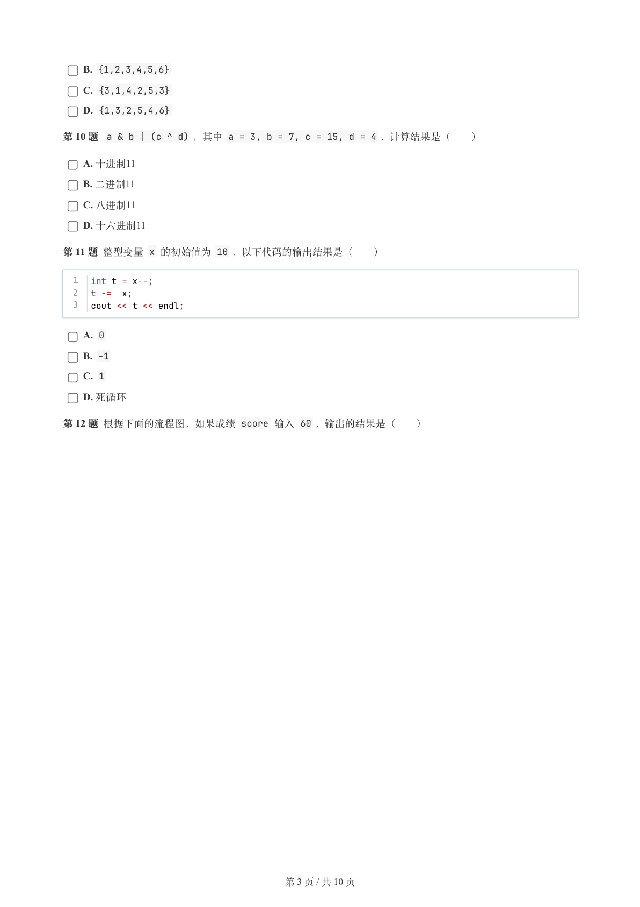
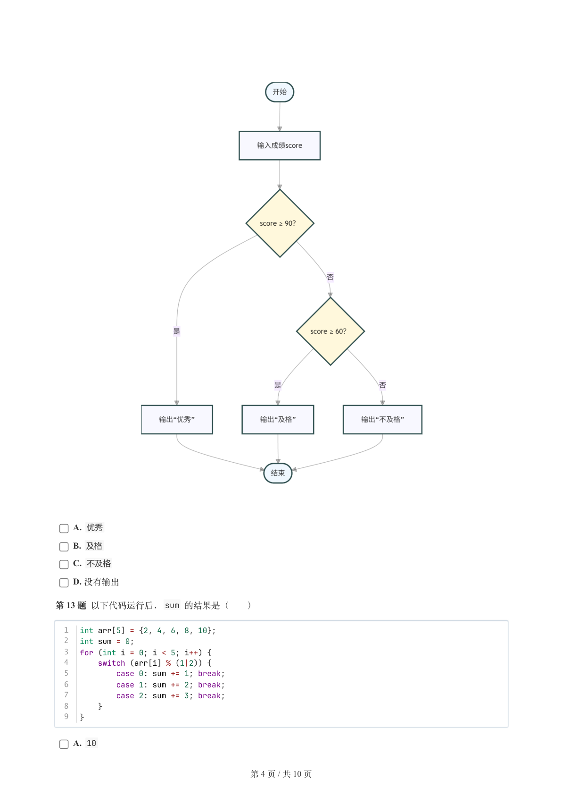
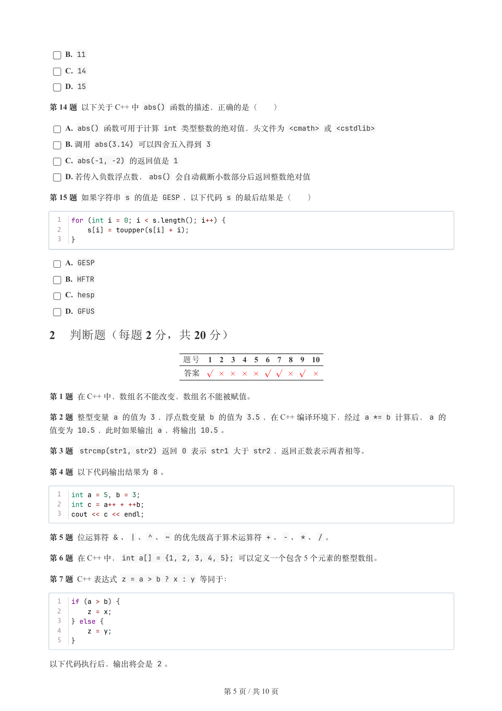
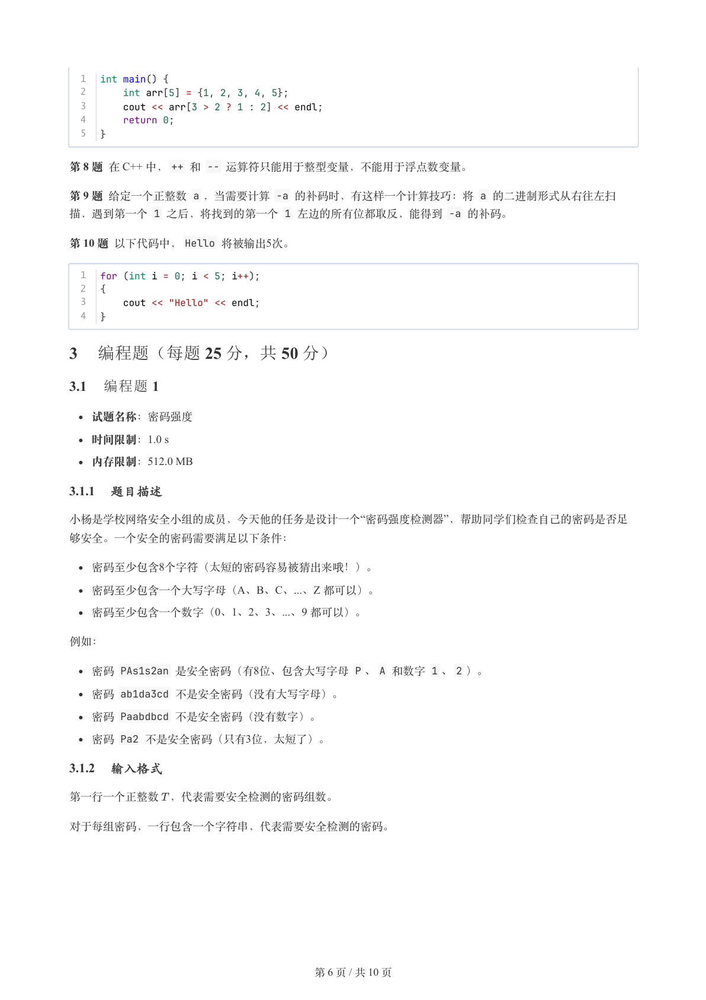
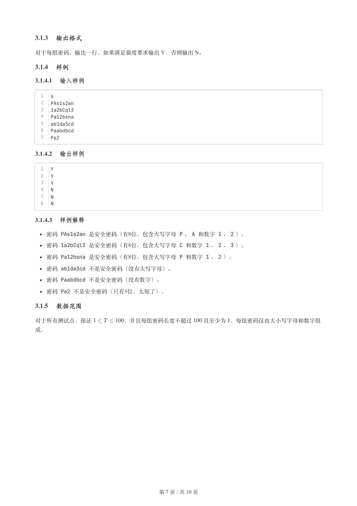
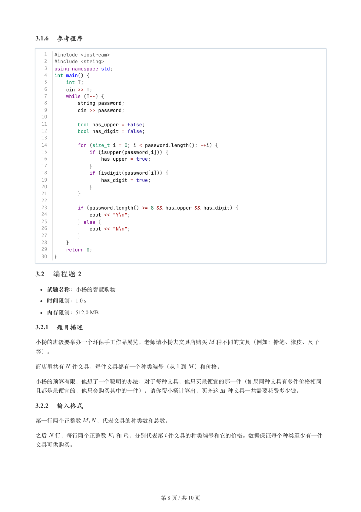
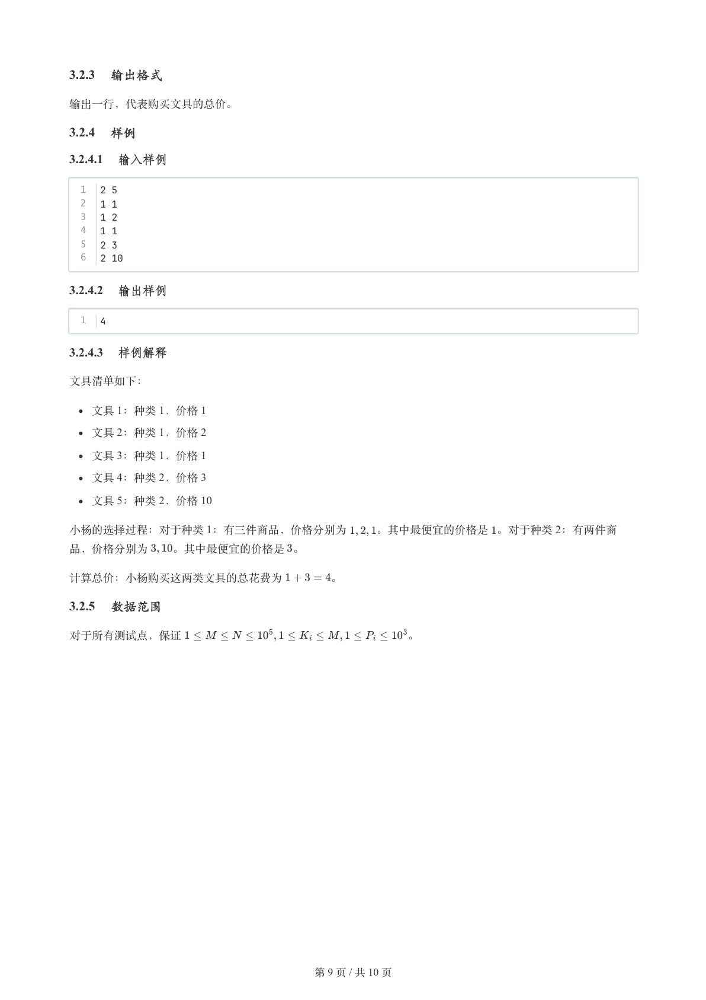
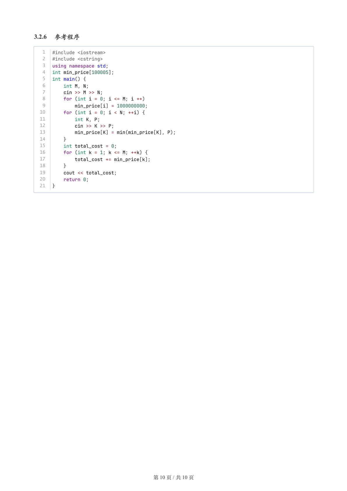

# 2025年12月-C++3级

- 原始 PDF：[`pdfs/2025年12月-C++3级.pdf`](../pdfs/2025年12月-C++3级.pdf)
- 页数：10
- 转换脚本：[`scripts/convert_pdfs_to_markdown.py`](../scripts/convert_pdfs_to_markdown.py)

> 为尽量避免信息丢失，每页均附带页面图片；文本提取结果保留原有顺序与换行特征，个别公式、图形、特殊排版请以页面图片为准。

## 第 1 页



### 提取文本

```
C++　三级

                      2025 年 12 月

1 单选题（每题 2 分，共 30 分）


           题号  1  2  3  4  5  6  7  8  9  10  11  12  13  14  15
            答案 B C D B B D D A A A  C  B  B  A  D


第 1 题 请将二进制数      ，转换为等值的10进制数（　　）

    A. 14.25

    B. 13.625

    C. 13.5

    D. 14.5

第 2 题 以下关于标准 C++ 一维数组的描述，哪一项是错误的？（　　）

    A. 数组的下标从0开始

    B. 数组在内存中是连续存放的

    C. 数组的长度只能在运行时才能确定

    D. 可以在程序中修改数组某个元素的值

第 3 题 下列代码段执行后，变量 sum 的值是（　　）


  1  {
  2      int sum = 0;
  3      for (int i = 1; i <= 10; i++) {
  4          if (i % 3 == 8>>2)
  5              continue;
  6          sum += i;
  7      }
  8  }

    A. 12

    B. 17

    C. 33

    D. 40

第 4 题 执行以下程序段，输出值是（　　）


  1  int x = 5;
  2  if (x == 3 >> 2) x = 8 >> 3;
  3  cout << x << endl;


                       第 1 页 / 共 10 页
```

## 第 2 页



### 提取文本

```
A. 0

    B. 5

    C. 120

    D. 1

第 5 题 已知字符串 s = "C++ Programming" ，下列程序运行的结果是（　　）


  1  cout << (int)(s.length() | 3) << endl;

    A. 14

    B. 15

    C. 16

    D. 17

第 6 题 以下代码是一个程序的部分代码，能够正确执行，输出的结果是（　　）


  1  int arr[5] = {1, 2, 3, 4, 5};
  2  int p = arr[1];
  3  cout << (p + 2) << endl;

    A. 1

    B. 2

    C. 3

    D. 4

第 7 题 以下关于 C++ 求最小值函数 min() 的描述，不正确的是（　　）

    A. 函数必须返回一个值

    B. 该函数可以嵌套调用

    C. 调用 min(5) 是错误的，不能通过编译

    D. 调用 min() （不传任何参数）可以通过编译，结果为 0

第 8 题 在一个特定的计算机系统中，假如 unsigned int 类型需要占用2个字节的存储空间（每个字节有8位），
则 unsigned int 可以表示的数据范围是（　　）

    A. 0 ~ 65535

    B. 0 ~ 65536

    C. -65536 ~ 65535

    D. 0 ~ 32767

第 9 题 以下代码执行后，数组 arr 的内容是（　　）


  1  int arr[6] = {1, 2, 3, 4, 5, 6};
  2  for (int i = 0; i < 6; i += 2) {
  3      arr[i] = arr[i] + arr[i+1];
  4      arr[i+1] = arr[i] - arr[i+1];
  5      arr[i] = arr[i] - arr[i+1];
  6  }

    A. {2,1,4,3,6,5}


                       第 2 页 / 共 10 页
```

## 第 3 页



### 提取文本

```
B. {1,2,3,4,5,6}

    C. {3,1,4,2,5,3}

    D. {1,3,2,5,4,6}

第 10 题  a & b | (c ^ d) ，其中 a = 3, b = 7, c = 15, d = 4 ，计算结果是（　　）

    A. 十进制11

    B. 二进制11

    C. 八进制11

    D. 十六进制11

第 11 题 整型变量 x 的初始值为 10 ，以下代码的输出结果是（　　）


  1  int t = x--;
  2  t -=  x;
  3  cout << t << endl;

    A. 0

    B. -1

    C. 1

    D. 死循环

第 12 题 根据下面的流程图，如果成绩 score 输入 60 ，输出的结果是（　　）


                       第 3 页 / 共 10 页
```

## 第 4 页



### 提取文本

```
A. 优秀

    B. 及格

    C. 不及格

    D. 没有输出

第 13 题 以下代码运行后，sum 的结果是（　　）


  1  int arr[5] = {2, 4, 6, 8, 10};
  2  int sum = 0;
  3  for (int i = 0; i < 5; i++) {
  4      switch (arr[i] % (1|2)) {
  5          case 0: sum += 1; break;
  6          case 1: sum += 2; break;
  7          case 2: sum += 3; break;
  8      }
  9  }

    A. 10


                       第 4 页 / 共 10 页
```

## 第 5 页



### 提取文本

```
B. 11

    C. 14

    D. 15

第 14 题 以下关于 C++ 中 abs() 函数的描述，正确的是（　　）

    A. abs() 函数可用于计算 int 类型整数的绝对值，头文件为 <cmath> 或 <cstdlib>

    B. 调用 abs(3.14) 可以四舍五入得到 3

    C. abs(-1, -2) 的返回值是 1

    D. 若传入负数浮点数，abs() 会自动截断小数部分后返回整数绝对值

第 15 题 如果字符串 s 的值是 GESP ，以下代码 s 的最后结果是（　　）


  1  for (int i = 0; i < s.length(); i++) {
  2      s[i] = toupper(s[i] + i);
  3  }

    A. GESP

    B. HFTR

    C. hesp

    D. GFUS

2 判断题（每题 2 分，共 20 分）


                题号  1  2  3  4  5  6  7  8  9  10

                 答案


第 1 题 在 C++ 中，数组名不能改变，数组名不能被赋值。

第 2 题 整型变量 a 的值为 3 ，浮点数变量 b 的值为 3.5 ，在 C++ 编译环境下，经过 a *= b 计算后，a 的
值变为 10.5 ，此时如果输出 a ，将输出 10.5 。

第 3 题  strcmp(str1, str2) 返回 0 表示 str1 大于 str2 ，返回正数表示两者相等。

第 4 题 以下代码输出结果为 8 。


  1  int a = 5, b = 3;
  2  int c = a++ + ++b;
  3  cout << c << endl;

第 5 题 位运算符 & 、| 、^ 、~ 的优先级高于算术运算符 + 、- 、* 、/ 。

第 6 题 在 C++ 中，int a[] = {1, 2, 3, 4, 5}; 可以定义一个包含 5 个元素的整型数组。

第 7 题 C++ 表达式 z = a > b ? x : y 等同于：


  1  if (a > b) {
  2      z = x;
  3  } else {
  4      z = y;
  5  }

以下代码执行后，输出将会是 2 。


                       第 5 页 / 共 10 页
```

## 第 6 页



### 提取文本

```
1  int main() {
  2      int arr[5] = {1, 2, 3, 4, 5};
  3      cout << arr[3 > 2 ? 1 : 2] << endl;
  4      return 0;
  5  }

第 8 题 在 C++ 中，++ 和 -- 运算符只能用于整型变量，不能用于浮点数变量。

第 9 题 给定一个正整数 a ，当需要计算 -a 的补码时，有这样一个计算技巧：将 a 的二进制形式从右往左扫
描，遇到第一个 1 之后，将找到的第一个 1 左边的所有位都取反，能得到 -a 的补码。

第 10 题 以下代码中，Hello 将被输出5次。


  1  for (int i = 0; i < 5; i++);
  2  {
  3      cout << "Hello" << endl;
  4  }

3 编程题（每题 25 分，共 50 分）

3.1 编程题 1


  试题名称：密码强度

   时间限制：1.0 s

   内存限制：512.0 MB

3.1.1 题目描述

小杨是学校网络安全小组的成员，今天他的任务是设计一个“密码强度检测器”，帮助同学们检查自己的密码是否足

够安全。一个安全的密码需要满足以下条件：

  密码至少包含8个字符（太短的密码容易被猜出来哦！）。

  密码至少包含一个大写字母（A、B、C、...、Z 都可以）。

  密码至少包含一个数字（0、1、2、3、...、9 都可以）。


例如：

  密码 PAs1s2an 是安全密码（有8位、包含大写字母 P 、A 和数字 1 、2 ）。

  密码 ab1da3cd 不是安全密码（没有大写字母）。

  密码 Paabdbcd 不是安全密码（没有数字）。

  密码 Pa2 不是安全密码（只有3位，太短了）。

3.1.2 输入格式

第一行一个正整数 ，代表需要安全检测的密码组数。


对于每组密码，一行包含一个字符串，代表需要安全检测的密码。


                       第 6 页 / 共 10 页
```

## 第 7 页



### 提取文本

```
3.1.3 输出格式

对于每组密码，输出一行，如果满足强度要求输出 Y，否则输出 N。

3.1.4 样例

3.1.4.1 输入样例

  1  6
  2  PAs1s2an
  3  1a2bCql3
  4  Pa12bsna
  5  ab1da3cd
  6  Paabdbcd
  7  Pa2

3.1.4.2 输出样例

  1  Y
  2  Y
  3  Y
  4  N
  5  N
  6  N

3.1.4.3 样例解释

  密码 PAs1s2an 是安全密码（有8位、包含大写字母 P 、A 和数字 1 、2 ）。

  密码 1a2bCql3 是安全密码（有8位、包含大写字母 C 和数字 1 、2 、3 ）。

  密码 Pa12bsna 是安全密码（有8位、包含大写字母 P 和数字 1 、2 ）。

  密码 ab1da3cd 不是安全密码（没有大写字母）。

  密码 Paabdbcd 不是安全密码（没有数字）。

  密码 Pa2 不是安全密码（只有3位，太短了）。

3.1.5 数据范围

对于所有测试点，保证      ，并且每组密码长度不超过  且至少为 ，每组密码仅由大小写字母和数字组

成。


                       第 7 页 / 共 10 页
```

## 第 8 页



### 提取文本

```
3.1.6 参考程序

   1  #include <iostream>
   2  #include <string>
   3  using namespace std;
   4  int main() {
   5      int T;
   6      cin >> T;
   7      while (T--) {
   8          string password;
   9          cin >> password;
  10
  11          bool has_upper = false;
  12          bool has_digit = false;
  13
  14          for (size_t i = 0; i < password.length(); ++i) {
  15              if (isupper(password[i])) {
  16                  has_upper = true;
  17              }
  18              if (isdigit(password[i])) {
  19                  has_digit = true;
  20              }
  21          }
  22
  23          if (password.length() >= 8 && has_upper && has_digit) {
  24              cout << "Y\n";
  25          } else {
  26              cout << "N\n";
  27          }
  28      }
  29      return 0;
  30  }

3.2 编程题 2


  试题名称：小杨的智慧购物

   时间限制：1.0 s

   内存限制：512.0 MB

3.2.1 题目描述

小杨的班级要举办一个环保手工作品展览，老师请小杨去文具店购买  种不同的文具（例如：铅笔、橡皮、尺子

等）。


商店里共有 件文具，每件文具都有一个种类编号（从 到 ）和价格。


小杨的预算有限，他想了一个聪明的办法：对于每种文具，他只买最便宜的那一件（如果同种文具有多件价格相同

且都是最便宜的，他只会购买其中的一件）。请你帮小杨计算出，买齐这  种文具一共需要花费多少钱。

3.2.2 输入格式

第一行两个正整数   ，代表文具的种类数和总数。


之后 行，每行两个正整数  和 ，分别代表第 件文具的种类编号和它的价格。数据保证每个种类至少有一件

文具可供购买。


                       第 8 页 / 共 10 页
```

## 第 9 页



### 提取文本

```
3.2.3 输出格式

输出一行，代表购买文具的总价。

3.2.4 样例

3.2.4.1 输入样例

  1  2 5
  2  1 1
  3  1 2
  4  1 1
  5  2 3
  6  2 10

3.2.4.2 输出样例

  1  4

3.2.4.3 样例解释

文具清单如下：

  文具 1：种类 1，价格 1

  文具 2：种类 1，价格 2

  文具 3：种类 1，价格 1

  文具 4：种类 2，价格 3

  文具 5：种类 2，价格 10

小杨的选择过程：对于种类 1：有三件商品，价格分别为   。其中最便宜的价格是 。对于种类 2：有两件商

品，价格分别为  。其中最便宜的价格是 。


计算总价：小杨购买这两类文具的总花费为    。

3.2.5 数据范围

对于所有测试点，保证                    。


                       第 9 页 / 共 10 页
```

## 第 10 页



### 提取文本

```
3.2.6 参考程序

   1  #include <iostream>
   2  #include <cstring>
   3  using namespace std;
   4  int min_price[100005];
   5  int main() {
   6      int M, N;
   7      cin >> M >> N;
   8      for (int i = 0; i <= M; i ++)
   9          min_price[i] = 1000000000;
  10      for (int i = 0; i < N; ++i) {
  11          int K, P;
  12          cin >> K >> P;
  13          min_price[K] = min(min_price[K], P);
  14      }
  15      int total_cost = 0;
  16      for (int k = 1; k <= M; ++k) {
  17          total_cost += min_price[k];
  18      }
  19      cout << total_cost;
  20      return 0;
  21  }


                       第 10 页 / 共 10 页
```
