# 2025年12月-C++4级

- 原始 PDF：[`pdfs/2025年12月-C++4级.pdf`](../pdfs/2025年12月-C++4级.pdf)
- 页数：12
- 转换脚本：[`scripts/convert_pdfs_to_markdown.py`](../scripts/convert_pdfs_to_markdown.py)

> 为尽量避免信息丢失，每页均附带页面图片；文本提取结果保留原有顺序与换行特征，个别公式、图形、特殊排版请以页面图片为准。

## 第 1 页

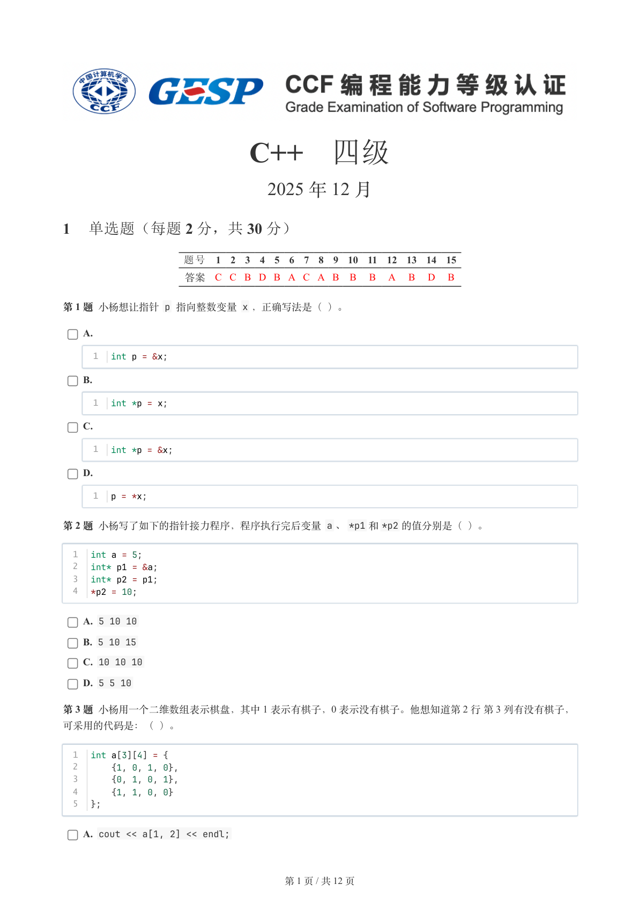

### 提取文本

```
C++　四级

                      2025 年 12 月

1 单选题（每题 2 分，共 30 分）


           题号  1  2  3  4  5  6  7  8  9  10  11  12  13  14  15
            答案 C C B D B A C A B  B  B  A  B  D  B


第 1 题 小杨想让指针 p 指向整数变量 x ，正确写法是（ ）。

    A.

      1  int p = &x;

    B.

      1  int *p = x;

    C.

      1  int *p = &x;

    D.

      1  p = *x;

第 2 题 小杨写了如下的指针接力程序，程序执行完后变量 a 、*p1 和*p2 的值分别是（ ）。


  1  int a = 5;
  2  int* p1 = &a;
  3  int* p2 = p1;
  4  *p2 = 10;

    A. 5 10 10

    B. 5 10 15

    C. 10 10 10

    D. 5 5 10

第 3 题 小杨用一个二维数组表示棋盘，其中 1 表示有棋子，0 表示没有棋子。他想知道第 2 行 第 3 列有没有棋子，

可采用的代码是：（ ）。


  1  int a[3][4] = {
  2      {1, 0, 1, 0},
  3      {0, 1, 0, 1},
  4      {1, 1, 0, 0}
  5  };

    A. cout << a[1, 2] << endl;


                       第 1 页 / 共 12 页
```

## 第 2 页

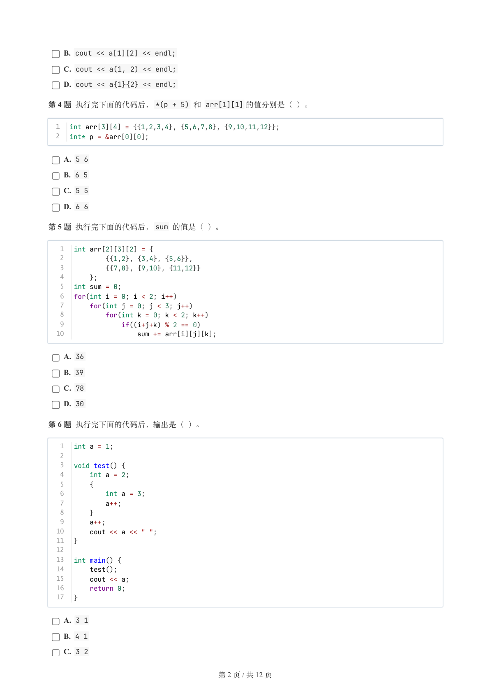

### 提取文本

```
B. cout << a[1][2] << endl;

    C. cout << a(1, 2) << endl;

    D. cout << a{1}{2} << endl;

第 4 题 执行完下面的代码后，*(p + 5) 和 arr[1][1] 的值分别是（ ）。


  1  int arr[3][4] = {{1,2,3,4}, {5,6,7,8}, {9,10,11,12}};
  2  int* p = &arr[0][0];

    A. 5 6

    B. 6 5

    C. 5 5

    D. 6 6

第 5 题 执行完下面的代码后，sum 的值是（ ）。


   1  int arr[2][3][2] = {
   2          {{1,2}, {3,4}, {5,6}},
   3          {{7,8}, {9,10}, {11,12}}
   4      };
   5  int sum = 0;
   6  for(int i = 0; i < 2; i++)
   7      for(int j = 0; j < 3; j++)
   8          for(int k = 0; k < 2; k++)
   9              if((i+j+k) % 2 == 0)
  10                  sum += arr[i][j][k];

    A. 36

    B. 39

    C. 78

    D. 30

第 6 题 执行完下面的代码后，输出是（ ）。


   1  int a = 1;
   2
   3  void test() {
   4      int a = 2;
   5      {
   6          int a = 3;
   7          a++;
   8      }
   9      a++;
  10      cout << a << " ";
  11  }
  12
  13  int main() {
  14      test();
  15      cout << a;
  16      return 0;
  17  }

    A. 3 1

    B. 4 1

    C. 3 2


                       第 2 页 / 共 12 页
```

## 第 3 页

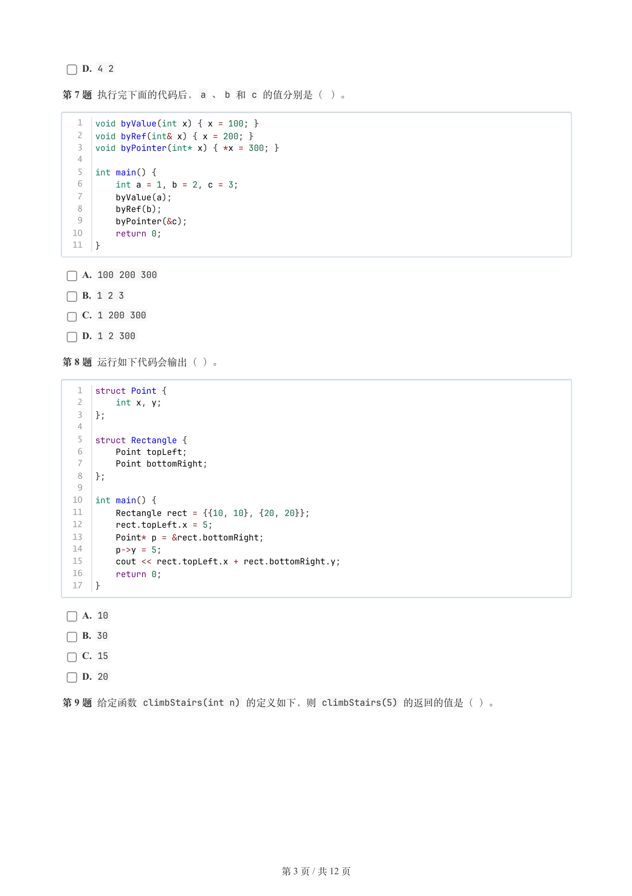

### 提取文本

```
D. 4 2

第 7 题 执行完下面的代码后，a 、b 和 c 的值分别是（ ）。


   1  void byValue(int x) { x = 100; }
   2  void byRef(int& x) { x = 200; }
   3  void byPointer(int* x) { *x = 300; }
   4
   5  int main() {
   6      int a = 1, b = 2, c = 3;
   7      byValue(a);
   8      byRef(b);
   9      byPointer(&c);
  10      return 0;
  11  }

    A. 100 200 300

    B. 1 2 3

    C. 1 200 300

    D. 1 2 300

第 8 题 运行如下代码会输出（ ）。


   1  struct Point {
   2      int x, y;
   3  };
   4
   5  struct Rectangle {
   6      Point topLeft;
   7      Point bottomRight;
   8  };
   9
  10  int main() {
  11      Rectangle rect = {{10, 10}, {20, 20}};
  12      rect.topLeft.x = 5;
  13      Point* p = &rect.bottomRight;
  14      p->y = 5;
  15      cout << rect.topLeft.x + rect.bottomRight.y;
  16      return 0;
  17  }

    A. 10

    B. 30

    C. 15

    D. 20

第 9 题 给定函数 climbStairs(int n) 的定义如下，则 climbStairs(5) 的返回的值是（ ）。


                       第 3 页 / 共 12 页
```

## 第 4 页

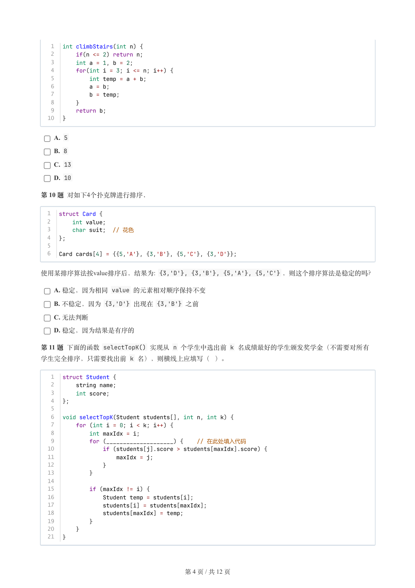

### 提取文本

```
1  int climbStairs(int n) {
   2      if(n <= 2) return n;
   3      int a = 1, b = 2;
   4      for(int i = 3; i <= n; i++) {
   5          int temp = a + b;
   6          a = b;
   7          b = temp;
   8      }
   9      return b;
  10  }

    A. 5

    B. 8

    C. 13

    D. 10

第 10 题 对如下4个扑克牌进行排序，


  1  struct Card {
  2      int value;
  3      char suit;  // 花色
  4  };
  5
  6  Card cards[4] = {{5,'A'}, {3,'B'}, {5,'C'}, {3,'D'}};

使用某排序算法按value排序后，结果为: {3,'D'}, {3,'B'}, {5,'A'}, {5,'C'} ，则这个排序算法是稳定的吗？

    A. 稳定，因为相同 value 的元素相对顺序保持不变

    B. 不稳定，因为 {3,'D'} 出现在 {3,'B'} 之前

    C. 无法判断

    D. 稳定，因为结果是有序的

第 11 题 下面的函数 selectTopK() 实现从 n 个学生中选出前 k 名成绩最好的学生颁发奖学金（不需要对所有
学生完全排序，只需要找出前 k 名），则横线上应填写（ ）。


   1  struct Student {
   2      string name;
   3      int score;
   4  };
   5
   6  void selectTopK(Student students[], int n, int k) {
   7      for (int i = 0; i < k; i++) {
   8          int maxIdx = i;
   9          for (____________________) {    // 在此处填入代码
  10              if (students[j].score > students[maxIdx].score) {
  11                  maxIdx = j;
  12              }
  13          }
  14
  15          if (maxIdx != i) {
  16              Student temp = students[i];
  17              students[i] = students[maxIdx];
  18              students[maxIdx] = temp;
  19          }
  20      }
  21  }


                       第 4 页 / 共 12 页
```

## 第 5 页

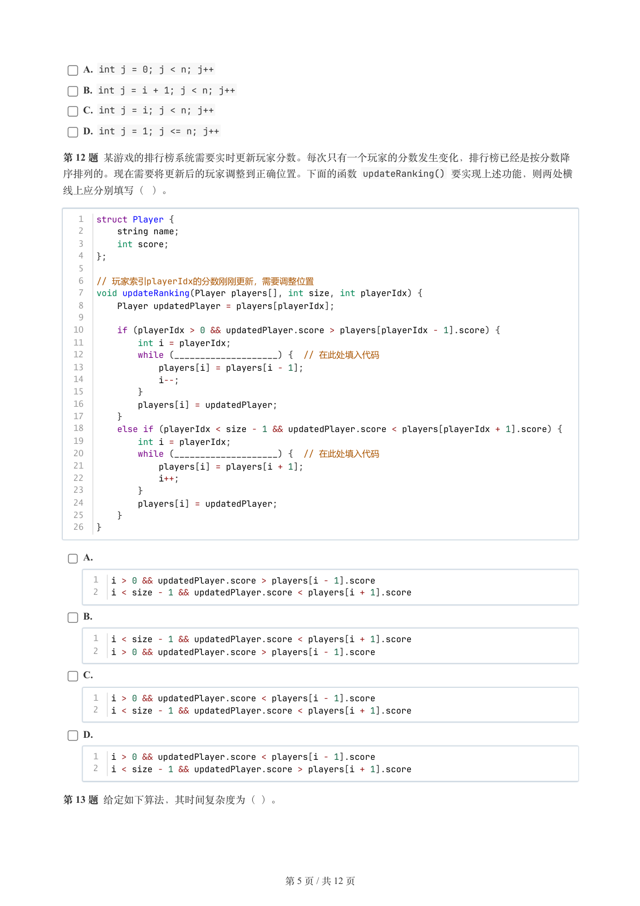

### 提取文本

```
A. int j = 0; j < n; j++

    B. int j = i + 1; j < n; j++

    C. int j = i; j < n; j++

    D. int j = 1; j <= n; j++

第 12 题 某游戏的排行榜系统需要实时更新玩家分数。每次只有一个玩家的分数发生变化，排行榜已经是按分数降
序排列的。现在需要将更新后的玩家调整到正确位置。下面的函数 updateRanking() 要实现上述功能，则两处横

线上应分别填写（ ）。


   1  struct Player {
   2      string name;
   3      int score;
   4  };
   5
   6  // 玩家索引playerIdx的分数刚刚更新，需要调整位置
   7  void updateRanking(Player players[], int size, int playerIdx) {
   8      Player updatedPlayer = players[playerIdx];
   9
  10      if (playerIdx > 0 && updatedPlayer.score > players[playerIdx - 1].score) {
  11          int i = playerIdx;
  12          while (____________________) {  // 在此处填入代码
  13              players[i] = players[i - 1];
  14              i--;
  15          }
  16          players[i] = updatedPlayer;
  17      }
  18      else if (playerIdx < size - 1 && updatedPlayer.score < players[playerIdx + 1].score) {
  19          int i = playerIdx;
  20          while (____________________) {  // 在此处填入代码
  21              players[i] = players[i + 1];
  22              i++;
  23          }
  24          players[i] = updatedPlayer;
  25      }
  26  }


    A.

      1  i > 0 && updatedPlayer.score > players[i - 1].score
      2  i < size - 1 && updatedPlayer.score < players[i + 1].score

    B.

      1  i < size - 1 && updatedPlayer.score < players[i + 1].score
      2  i > 0 && updatedPlayer.score > players[i - 1].score

    C.

      1  i > 0 && updatedPlayer.score < players[i - 1].score
      2  i < size - 1 && updatedPlayer.score < players[i + 1].score

    D.

      1  i > 0 && updatedPlayer.score < players[i - 1].score
      2  i < size - 1 && updatedPlayer.score > players[i + 1].score


第 13 题 给定如下算法，其时间复杂度为（ ）。


                       第 5 页 / 共 12 页
```

## 第 6 页

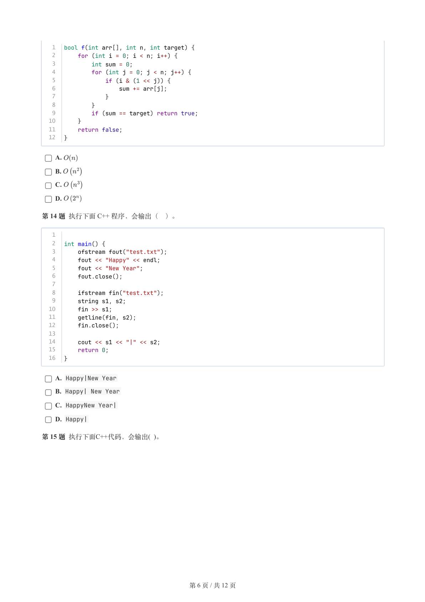

### 提取文本

```
1  bool f(int arr[], int n, int target) {
   2      for (int i = 0; i < n; i++) {
   3          int sum = 0;
   4          for (int j = 0; j < n; j++) {
   5              if (i & (1 << j)) {
   6                  sum += arr[j];
   7              }
   8          }
   9          if (sum == target) return true;
  10      }
  11      return false;
  12  }


    A.

    B.

    C.

    D.

第 14 题 执行下面 C++ 程序，会输出（ ）。


   1
   2  int main() {
   3      ofstream fout("test.txt");
   4      fout << "Happy" << endl;
   5      fout << "New Year";
   6      fout.close();
   7
   8      ifstream fin("test.txt");
   9      string s1, s2;
  10      fin >> s1;
  11      getline(fin, s2);
  12      fin.close();
  13
  14      cout << s1 << "|" << s2;
  15      return 0;
  16  }

    A. Happy|New Year

    B. Happy| New Year

    C. HappyNew Year|

    D. Happy|

第 15 题 执行下面C++代码，会输出( )。


                       第 6 页 / 共 12 页
```

## 第 7 页

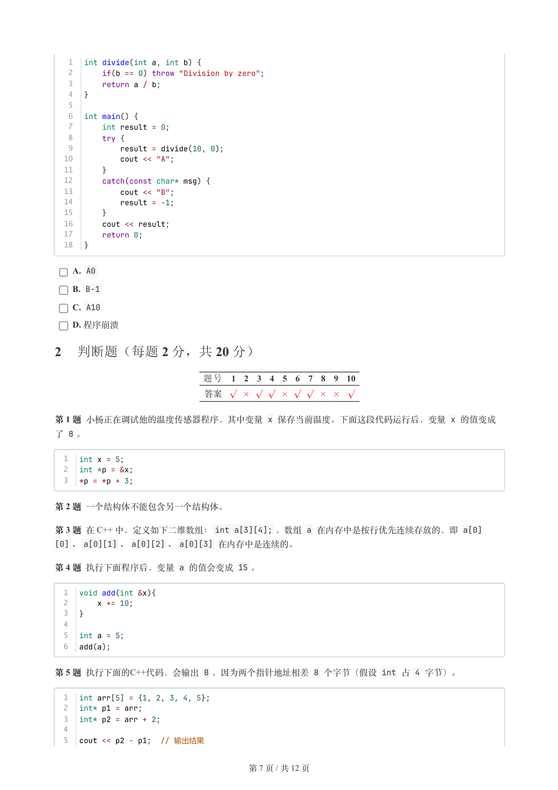

### 提取文本

```
1  int divide(int a, int b) {
   2      if(b == 0) throw "Division by zero";
   3      return a / b;
   4  }
   5
   6  int main() {
   7      int result = 0;
   8      try {
   9          result = divide(10, 0);
  10          cout << "A";
  11      }
  12      catch(const char* msg) {
  13          cout << "B";
  14          result = -1;
  15      }
  16      cout << result;
  17      return 0;
  18  }

    A. A0

    B. B-1

    C. A10

    D. 程序崩溃

2 判断题（每题 2 分，共 20 分）

                题号  1  2  3  4  5  6  7  8  9  10

                 答案


第 1 题 小杨正在调试他的温度传感器程序，其中变量 x 保存当前温度。下面这段代码运行后，变量 x 的值变成
了 8 。


  1  int x = 5;
  2  int *p = &x;
  3  *p = *p + 3;


第 2 题 一个结构体不能包含另一个结构体。

第 3 题 在 C++ 中，定义如下二维数组：int a[3][4]; ，数组 a 在内存中是按行优先连续存放的，即 a[0]
[0] 、a[0][1] 、a[0][2] 、a[0][3] 在内存中是连续的。

第 4 题 执行下面程序后，变量 a 的值会变成 15 。


  1  void add(int &x){
  2      x += 10;
  3  }
  4
  5  int a = 5;
  6  add(a);

第 5 题 执行下面的C++代码，会输出 8 ，因为两个指针地址相差 8 个字节（假设 int 占 4 字节）。


  1  int arr[5] = {1, 2, 3, 4, 5};
  2  int* p1 = arr;
  3  int* p2 = arr + 2;
  4
  5  cout << p2 - p1;  // 输出结果


                       第 7 页 / 共 12 页
```

## 第 8 页

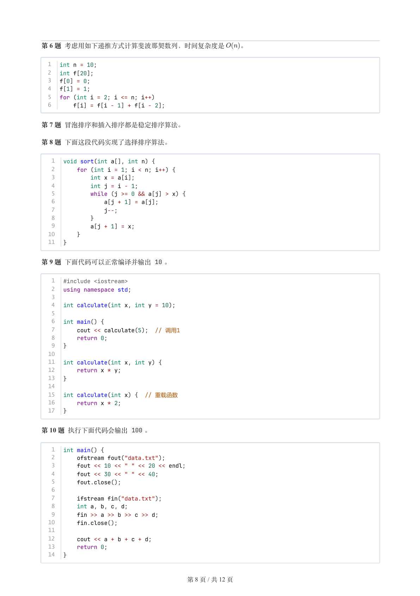

### 提取文本

```
第 6 题 考虑用如下递推方式计算斐波那契数列，时间复杂度是  。


  1  int n = 10;
  2  int f[20];
  3  f[0] = 0;
  4  f[1] = 1;
  5  for (int i = 2; i <= n; i++)
  6      f[i] = f[i - 1] + f[i - 2];


第 7 题 冒泡排序和插入排序都是稳定排序算法。

第 8 题 下面这段代码实现了选择排序算法。


   1  void sort(int a[], int n) {
   2      for (int i = 1; i < n; i++) {
   3          int x = a[i];
   4          int j = i - 1;
   5          while (j >= 0 && a[j] > x) {
   6              a[j + 1] = a[j];
   7              j--;
   8          }
   9          a[j + 1] = x;
  10      }
  11  }

第 9 题 下面代码可以正常编译并输出 10 。


   1  #include <iostream>
   2  using namespace std;
   3
   4  int calculate(int x, int y = 10);
   5
   6  int main() {
   7      cout << calculate(5);  // 调用1
   8      return 0;
   9  }
  10
  11  int calculate(int x, int y) {
  12      return x * y;
  13  }
  14
  15  int calculate(int x) {  // 重载函数
  16      return x * 2;
  17  }

第 10 题 执行下面代码会输出 100 。


   1  int main() {
   2      ofstream fout("data.txt");
   3      fout << 10 << " " << 20 << endl;
   4      fout << 30 << " " << 40;
   5      fout.close();
   6
   7      ifstream fin("data.txt");
   8      int a, b, c, d;
   9      fin >> a >> b >> c >> d;
  10      fin.close();
  11
  12      cout << a + b + c + d;
  13      return 0;
  14  }


                       第 8 页 / 共 12 页
```

## 第 9 页

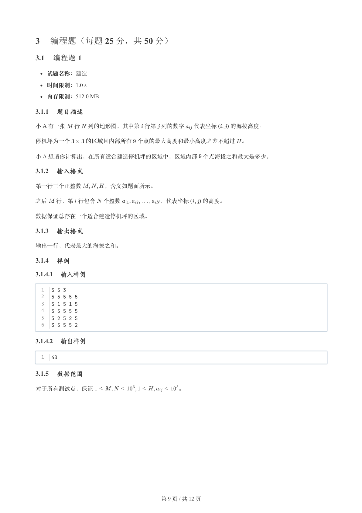

### 提取文本

```
3 编程题（每题 25 分，共 50 分）

3.1 编程题 1


  试题名称：建造

   时间限制：1.0 s

   内存限制：512.0 MB

3.1.1 题目描述

小 A 有一张  行 列的地形图，其中第 行第 列的数字  代表坐标 (    ) 的海拔高度。


停机坪为一个   的区域且内部所有 个点的最大高度和最小高度之差不超过 。

小 A 想请你计算出，在所有适合建造停机坪的区域中，区域内部 个点海拔之和最大是多少。

3.1.2 输入格式

第一行三个正整数    ，含义如题面所示。

之后  行，第 行包含 个整数       ，代表坐标 (    ) 的高度。


数据保证总存在一个适合建造停机坪的区域。

3.1.3 输出格式

输出一行，代表最大的海拔之和。

3.1.4 样例

3.1.4.1 输入样例

  1  5 5 3
  2  5 5 5 5 5
  3  5 1 5 1 5
  4  5 5 5 5 5
  5  5 2 5 2 5
  6  3 5 5 5 2

3.1.4.2 输出样例

  1  40

3.1.5 数据范围

对于所有测试点，保证               。


                       第 9 页 / 共 12 页
```

## 第 10 页

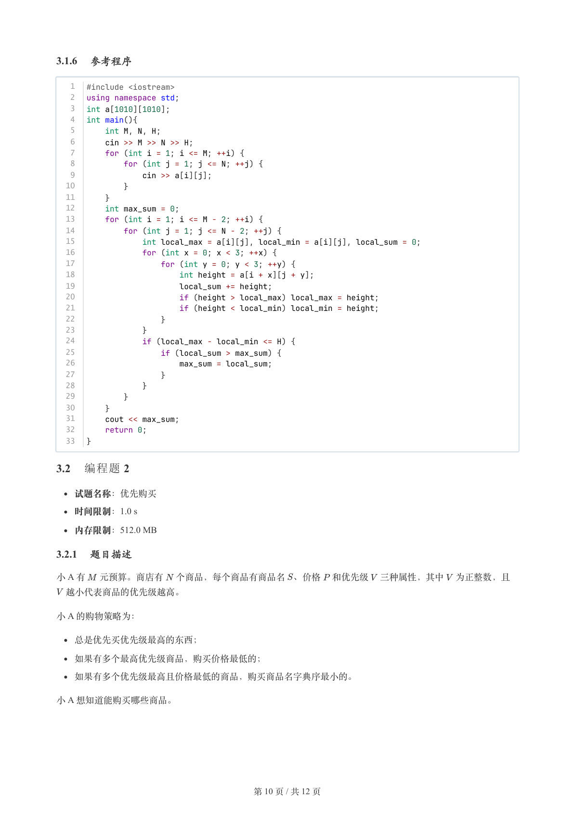

### 提取文本

```
3.1.6 参考程序

   1  #include <iostream>
   2  using namespace std;
   3  int a[1010][1010];
   4  int main(){
   5      int M, N, H;
   6      cin >> M >> N >> H;
   7      for (int i = 1; i <= M; ++i) {
   8          for (int j = 1; j <= N; ++j) {
   9              cin >> a[i][j];
  10          }
  11      }
  12      int max_sum = 0;
  13      for (int i = 1; i <= M - 2; ++i) {
  14          for (int j = 1; j <= N - 2; ++j) {
  15              int local_max = a[i][j], local_min = a[i][j], local_sum = 0;
  16              for (int x = 0; x < 3; ++x) {
  17                  for (int y = 0; y < 3; ++y) {
  18                      int height = a[i + x][j + y];
  19                      local_sum += height;
  20                      if (height > local_max) local_max = height;
  21                      if (height < local_min) local_min = height;
  22                  }
  23              }
  24              if (local_max - local_min <= H) {
  25                  if (local_sum > max_sum) {
  26                      max_sum = local_sum;
  27                  }
  28              }
  29          }
  30      }
  31      cout << max_sum;
  32      return 0;
  33  }

3.2 编程题 2


  试题名称：优先购买

   时间限制：1.0 s

   内存限制：512.0 MB

3.2.1 题目描述

小 A 有  元预算。商店有 个商品，每个商品有商品名 、价格 和优先级 三种属性，其中 为正整数，且

 越小代表商品的优先级越高。

小 A 的购物策略为：


  总是优先买优先级最高的东西；

  如果有多个最高优先级商品，购买价格最低的；

  如果有多个优先级最高且价格最低的商品，购买商品名字典序最小的。

小 A 想知道能购买哪些商品。


                       第 10 页 / 共 12 页
```

## 第 11 页

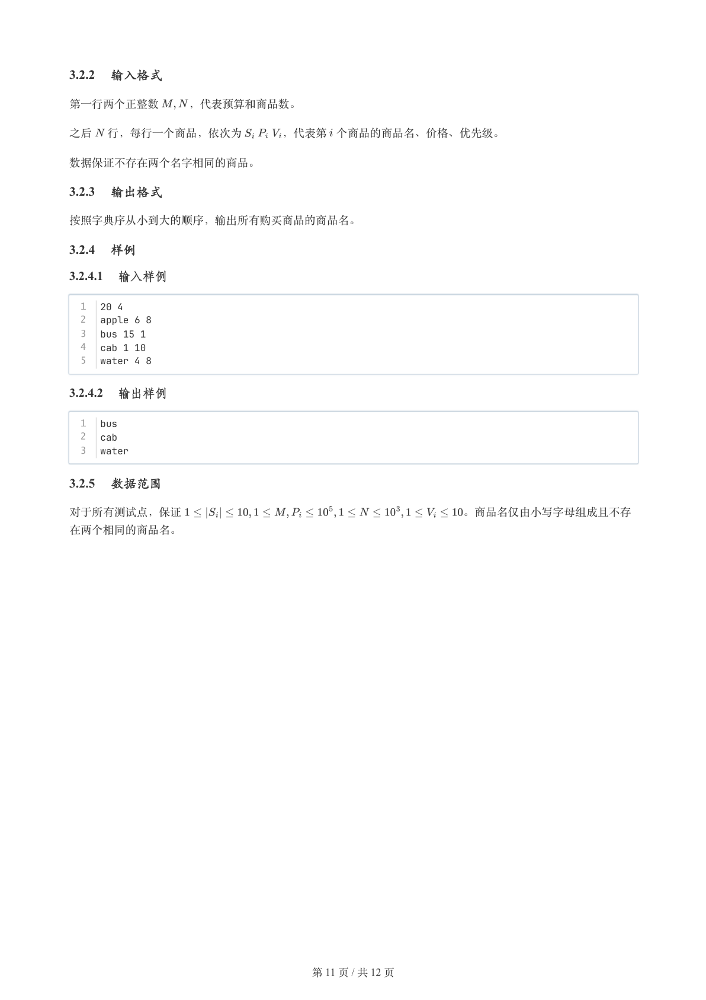

### 提取文本

```
3.2.2 输入格式

第一行两个正整数   ，代表预算和商品数。


之后 行，每行一个商品，依次为    ，代表第 个商品的商品名、价格、优先级。


数据保证不存在两个名字相同的商品。

3.2.3 输出格式

按照字典序从小到大的顺序，输出所有购买商品的商品名。

3.2.4 样例

3.2.4.1 输入样例

  1  20 4
  2  apple 6 8
  3  bus 15 1
  4  cab 1 10
  5  water 4 8

3.2.4.2 输出样例

  1  bus
  2  cab
  3  water

3.2.5 数据范围

对于所有测试点，保证                         。商品名仅由小写字母组成且不存

在两个相同的商品名。


                       第 11 页 / 共 12 页
```

## 第 12 页

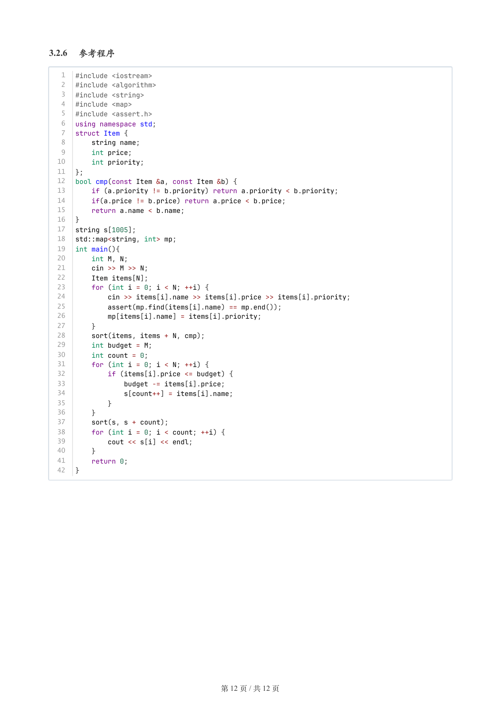

### 提取文本

```
3.2.6 参考程序

   1  #include <iostream>
   2  #include <algorithm>
   3  #include <string>
   4  #include <map>
   5  #include <assert.h>
   6  using namespace std;
   7  struct Item {
   8      string name;
   9      int price;
  10      int priority;
  11  };
  12  bool cmp(const Item &a, const Item &b) {
  13      if (a.priority != b.priority) return a.priority < b.priority;
  14      if(a.price != b.price) return a.price < b.price;
  15      return a.name < b.name;
  16  }
  17  string s[1005];
  18  std::map<string, int> mp;
  19  int main(){
  20      int M, N;
  21      cin >> M >> N;
  22      Item items[N];
  23      for (int i = 0; i < N; ++i) {
  24          cin >> items[i].name >> items[i].price >> items[i].priority;
  25          assert(mp.find(items[i].name) == mp.end());
  26          mp[items[i].name] = items[i].priority;
  27      }
  28      sort(items, items + N, cmp);
  29      int budget = M;
  30      int count = 0;
  31      for (int i = 0; i < N; ++i) {
  32          if (items[i].price <= budget) {
  33              budget -= items[i].price;
  34              s[count++] = items[i].name;
  35          }
  36      }
  37      sort(s, s + count);
  38      for (int i = 0; i < count; ++i) {
  39          cout << s[i] << endl;
  40      }
  41      return 0;
  42  }


                       第 12 页 / 共 12 页
```
