# 2025年12月-C++5级

- 原始 PDF：[`pdfs/2025年12月-C++5级.pdf`](../pdfs/2025年12月-C++5级.pdf)
- 页数：13
- 转换脚本：[`scripts/convert_pdfs_to_markdown.py`](../scripts/convert_pdfs_to_markdown.py)

> 为尽量避免信息丢失，每页均附带页面图片；文本提取结果保留原有顺序与换行特征，个别公式、图形、特殊排版请以页面图片为准。

## 第 1 页

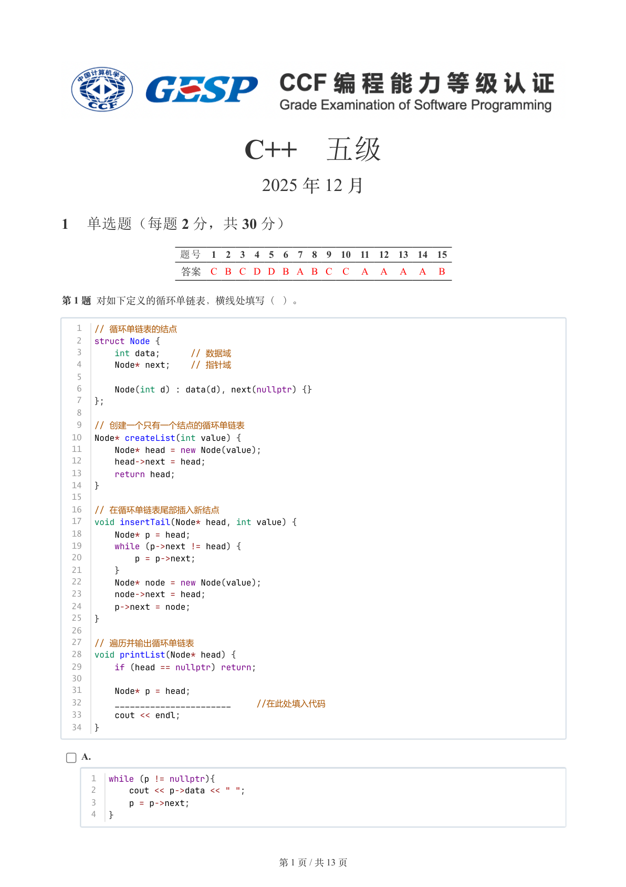

### 提取文本

```
C++　五级

                      2025 年 12 月

1 单选题（每题 2 分，共 30 分）


           题号  1  2  3  4  5  6  7  8  9  10  11  12  13  14  15
            答案 C B C D D B A B C  C  A  A  A  A  B


第 1 题 对如下定义的循环单链表，横线处填写（ ）。

   1  // 循环单链表的结点
   2  struct Node {
   3      int data;      // 数据域
   4      Node* next;    // 指针域
   5
   6      Node(int d) : data(d), next(nullptr) {}
   7  };
   8
   9  // 创建一个只有一个结点的循环单链表
  10  Node* createList(int value) {
  11      Node* head = new Node(value);
  12      head->next = head;
  13      return head;
  14  }
  15
  16  // 在循环单链表尾部插入新结点
  17  void insertTail(Node* head, int value) {
  18      Node* p = head;
  19      while (p->next != head) {
  20          p = p->next;
  21      }
  22      Node* node = new Node(value);
  23      node->next = head;
  24      p->next = node;
  25  }
  26
  27  // 遍历并输出循环单链表
  28  void printList(Node* head) {
  29      if (head == nullptr) return;
  30
  31      Node* p = head;
  32      _______________________   //在此处填入代码
  33      cout << endl;
  34  }


    A.

      1  while (p != nullptr){
      2      cout << p->data << " ";
      3      p = p->next;
      4  }


                       第 1 页 / 共 13 页
```

## 第 2 页

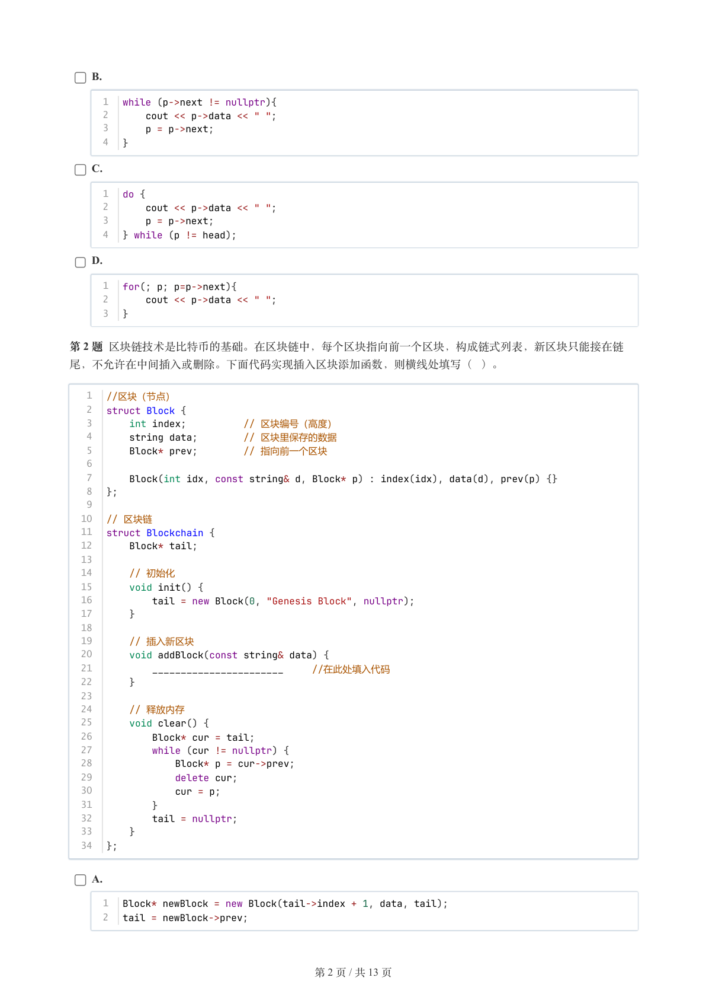

### 提取文本

```
B.

      1  while (p->next != nullptr){
      2      cout << p->data << " ";
      3      p = p->next;
      4  }

    C.

      1  do {
      2      cout << p->data << " ";
      3      p = p->next;
      4  } while (p != head);

    D.

      1  for(; p; p=p->next){
      2      cout << p->data << " ";
      3  }


第 2 题 区块链技术是比特币的基础。在区块链中，每个区块指向前一个区块，构成链式列表，新区块只能接在链

尾，不允许在中间插入或删除。下面代码实现插入区块添加函数，则横线处填写（ ）。


   1  //区块（节点）
   2  struct Block {
   3      int index;          // 区块编号（高度）
   4      string data;        // 区块里保存的数据
   5      Block* prev;        // 指向前一个区块
   6
   7      Block(int idx, const string& d, Block* p) : index(idx), data(d), prev(p) {}
   8  };
   9
  10  // 区块链
  11  struct Blockchain {
  12      Block* tail;
  13
  14      // 初始化
  15      void init() {
  16          tail = new Block(0, "Genesis Block", nullptr);
  17      }
  18
  19      // 插入新区块
  20      void addBlock(const string& data) {
  21          _______________________   //在此处填入代码
  22      }
  23
  24      // 释放内存
  25      void clear() {
  26          Block* cur = tail;
  27          while (cur != nullptr) {
  28              Block* p = cur->prev;
  29              delete cur;
  30              cur = p;
  31          }
  32          tail = nullptr;
  33      }
  34  };


    A.

      1  Block* newBlock = new Block(tail->index + 1, data, tail);
      2  tail = newBlock->prev;


                       第 2 页 / 共 13 页
```

## 第 3 页

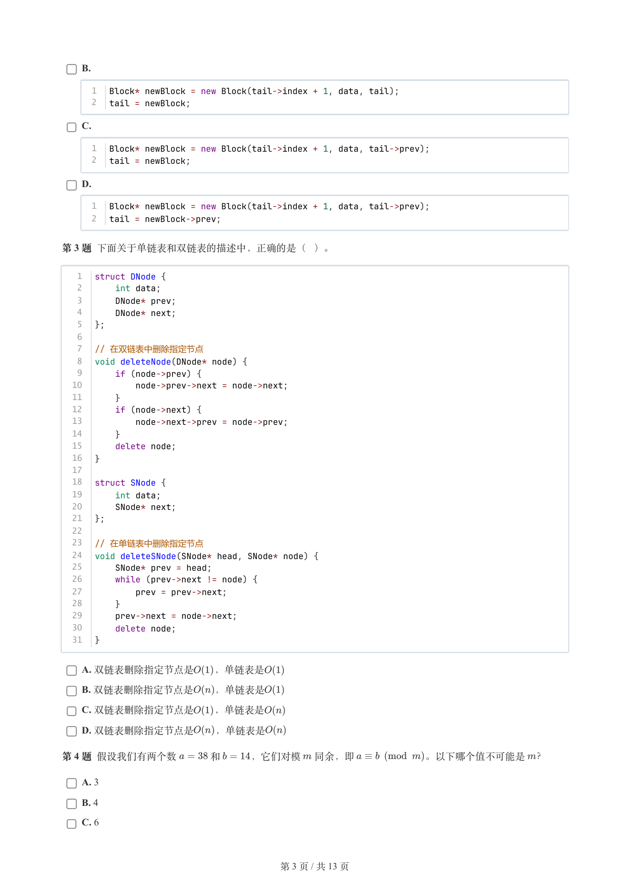

### 提取文本

```
B.

      1  Block* newBlock = new Block(tail->index + 1, data, tail);
      2  tail = newBlock;

    C.

      1  Block* newBlock = new Block(tail->index + 1, data, tail->prev);
      2  tail = newBlock;

    D.

      1  Block* newBlock = new Block(tail->index + 1, data, tail->prev);
      2  tail = newBlock->prev;


第 3 题 下面关于单链表和双链表的描述中，正确的是（ ）。


   1  struct DNode {
   2      int data;
   3      DNode* prev;
   4      DNode* next;
   5  };
   6
   7  // 在双链表中删除指定节点
   8  void deleteNode(DNode* node) {
   9      if (node->prev) {
  10          node->prev->next = node->next;
  11      }
  12      if (node->next) {
  13          node->next->prev = node->prev;
  14      }
  15      delete node;
  16  }
  17
  18  struct SNode {
  19      int data;
  20      SNode* next;
  21  };
  22
  23  // 在单链表中删除指定节点
  24  void deleteSNode(SNode* head, SNode* node) {
  25      SNode* prev = head;
  26      while (prev->next != node) {
  27          prev = prev->next;
  28      }
  29      prev->next = node->next;
  30      delete node;
  31  }


    A. 双链表删除指定节点是  ，单链表是

    B. 双链表删除指定节点是  ，单链表是

    C. 双链表删除指定节点是  ，单链表是

    D. 双链表删除指定节点是  ，单链表是

第 4 题 假设我们有两个数   和   ，它们对模 同余，即       。以下哪个值不可能是 ？

    A. 3

    B. 4

    C. 6


                       第 3 页 / 共 13 页
```

## 第 4 页

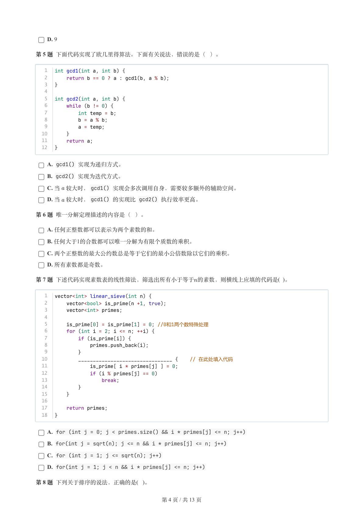

### 提取文本

```
D. 9

第 5 题 下面代码实现了欧几里得算法。下面有关说法，错误的是（ ）。


   1  int gcd1(int a, int b) {
   2      return b == 0 ? a : gcd1(b, a % b);
   3  }
   4
   5  int gcd2(int a, int b) {
   6      while (b != 0) {
   7          int temp = b;
   8          b = a % b;
   9          a = temp;
  10      }
  11      return a;
  12  }

    A. gcd1() 实现为递归方式。

    B. gcd2() 实现为迭代方式。

    C. 当 较大时，gcd1() 实现会多次调用自身，需要较多额外的辅助空间。

    D. 当 较大时，gcd1() 的实现比 gcd2() 执行效率更高。

第 6 题 唯一分解定理描述的内容是（ ）。

    A. 任何正整数都可以表示为两个素数的和。

    B. 任何大于1的合数都可以唯一分解为有限个质数的乘积。

    C. 两个正整数的最大公约数总是等于它们的最小公倍数除以它们的乘积。

    D. 所有素数都是奇数。

第 7 题 下述代码实现素数表的线性筛法，筛选出所有小于等于的素数，则横线上应填的代码是( )。


   1  vector<int> linear_sieve(int n) {
   2      vector<bool> is_prime(n +1, true);
   3      vector<int> primes;
   4
   5      is_prime[0] = is_prime[1] = 0; //0和1两个数特殊处理
   6      for (int i = 2; i <= n; ++i) {
   7          if (is_prime[i]) {
   8              primes.push_back(i);
   9          }
  10          ________________________________ {    // 在此处填入代码
  11              is_prime[ i * primes[j] ] = 0;
  12              if (i % primes[j] == 0)
  13                  break;
  14          }
  15      }
  16
  17      return primes;
  18  }

    A. for (int j = 0; j < primes.size() && i * primes[j] <= n; j++)

    B. for(int j = sqrt(n); j <= n && i * primes[j] <= n; j++)

    C. for (int j = 1; j <= sqrt(n); j++)

    D. for(int j = 1; j < n && i * primes[j] <= n; j++)

第 8 题 下列关于排序的说法，正确的是( )。


                       第 4 页 / 共 13 页
```

## 第 5 页

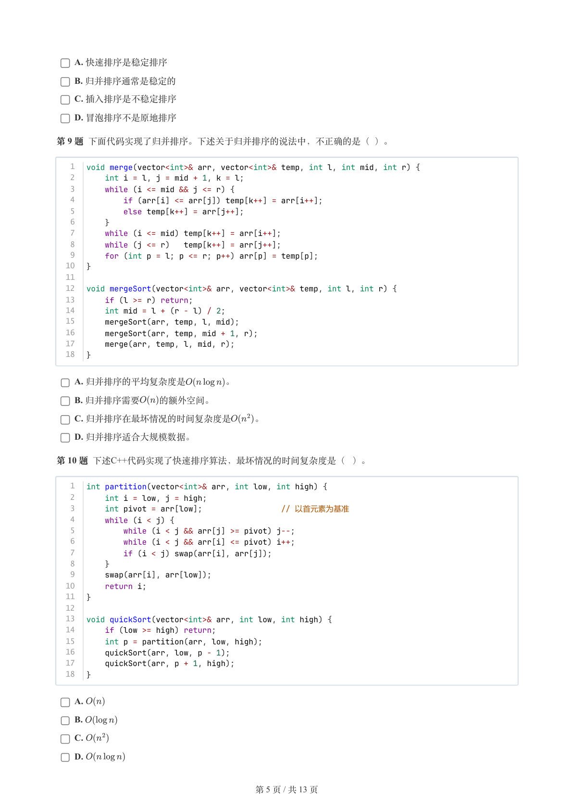

### 提取文本

```
A. 快速排序是稳定排序

    B. 归并排序通常是稳定的

    C. 插入排序是不稳定排序

    D. 冒泡排序不是原地排序

第 9 题 下面代码实现了归并排序。下述关于归并排序的说法中，不正确的是（ ）。


   1  void merge(vector<int>& arr, vector<int>& temp, int l, int mid, int r) {
   2      int i = l, j = mid + 1, k = l;
   3      while (i <= mid && j <= r) {
   4          if (arr[i] <= arr[j]) temp[k++] = arr[i++];
   5          else temp[k++] = arr[j++];
   6      }
   7      while (i <= mid) temp[k++] = arr[i++];
   8      while (j <= r)   temp[k++] = arr[j++];
   9      for (int p = l; p <= r; p++) arr[p] = temp[p];
  10  }
  11
  12  void mergeSort(vector<int>& arr, vector<int>& temp, int l, int r) {
  13      if (l >= r) return;
  14      int mid = l + (r - l) / 2;
  15      mergeSort(arr, temp, l, mid);
  16      mergeSort(arr, temp, mid + 1, r);
  17      merge(arr, temp, l, mid, r);
  18  }


    A. 归并排序的平均复杂度是    。

    B. 归并排序需要  的额外空间。

    C. 归并排序在最坏情况的时间复杂度是   。

    D. 归并排序适合大规模数据。

第 10 题 下述C++代码实现了快速排序算法，最坏情况的时间复杂度是（ ）。


   1  int partition(vector<int>& arr, int low, int high) {
   2      int i = low, j = high;
   3      int pivot = arr[low];                 // 以首元素为基准
   4      while (i < j) {
   5          while (i < j && arr[j] >= pivot) j--;
   6          while (i < j && arr[i] <= pivot) i++;
   7          if (i < j) swap(arr[i], arr[j]);
   8      }
   9      swap(arr[i], arr[low]);
  10      return i;
  11  }
  12
  13  void quickSort(vector<int>& arr, int low, int high) {
  14      if (low >= high) return;
  15      int p = partition(arr, low, high);
  16      quickSort(arr, low, p - 1);
  17      quickSort(arr, p + 1, high);
  18  }


    A.

    B.

    C.

    D.


                       第 5 页 / 共 13 页
```

## 第 6 页

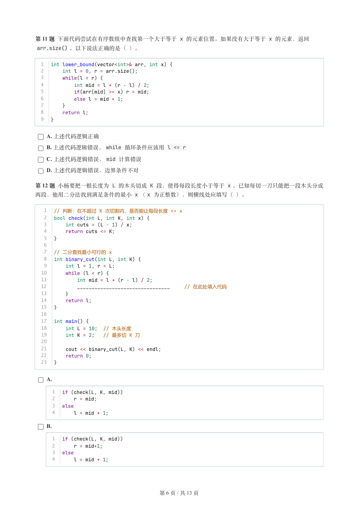

### 提取文本

```
第 11 题 下面代码尝试在有序数组中查找第一个大于等于 x 的元素位置。如果没有大于等于 x 的元素，返回
 arr.size() 。以下说法正确的是（ ）。


  1  int lower_bound(vector<int>& arr, int x) {
  2      int l = 0, r = arr.size();
  3      while(l < r) {
  4          int mid = l + (r - l) / 2;
  5          if(arr[mid] >= x) r = mid;
  6          else l = mid + 1;
  7      }
  8      return l;
  9  }


    A. 上述代码逻辑正确

    B. 上述代码逻辑错误，while 循环条件应该用 l <= r

    C. 上述代码逻辑错误，mid 计算错误

    D. 上述代码逻辑错误，边界条件不对

第 12 题 小杨要把一根长度为 L 的木头切成 K 段，使得每段长度小于等于 x 。已知每切一刀只能把一段木头分成
两段，他用二分法找到满足条件的最小 x （x 为正整数），则横线处应填写（ ）。

   1  // 判断：在不超过 K 次切割内，是否能让每段长度 <= x
   2  bool check(int L, int K, int x) {
   3      int cuts = (L - 1) / x;
   4      return cuts <= K;
   5  }
   6
   7  // 二分查找最小可行的 x
   8  int binary_cut(int L, int K) {
   9      int l = 1, r = L;
  10      while (l < r) {
  11          int mid = l + (r - l) / 2;
  12          ________________________________     // 在此处填入代码
  13      }
  14      return l;
  15  }
  16
  17  int main() {
  18      int L = 10;  // 木头长度
  19      int K = 2;   // 最多切 K 刀
  20
  21      cout << binary_cut(L, K) << endl;
  22      return 0;
  23  }


    A.

      1  if (check(L, K, mid))
      2      r = mid;
      3  else
      4      l = mid + 1;

    B.

      1  if (check(L, K, mid))
      2      r = mid+1;
      3  else
      4      l = mid + 1;


                       第 6 页 / 共 13 页
```

## 第 7 页

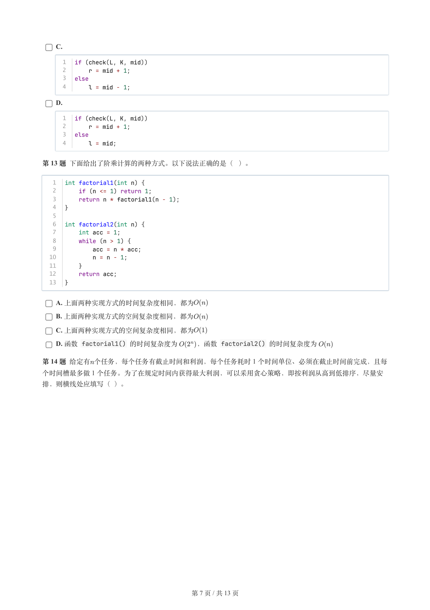

### 提取文本

```
C.

      1  if (check(L, K, mid))
      2      r = mid + 1;
      3  else
      4      l = mid - 1;

    D.

      1  if (check(L, K, mid))
      2      r = mid + 1;
      3  else
      4      l = mid;


第 13 题 下面给出了阶乘计算的两种方式。以下说法正确的是（ ）。


   1  int factorial1(int n) {
   2      if (n <= 1) return 1;
   3      return n * factorial1(n - 1);
   4  }
   5
   6  int factorial2(int n) {
   7      int acc = 1;
   8      while (n > 1) {
   9          acc = n * acc;
  10          n = n - 1;
  11      }
  12      return acc;
  13  }


    A. 上面两种实现方式的时间复杂度相同，都为

    B. 上面两种实现方式的空间复杂度相同，都为

    C. 上面两种实现方式的空间复杂度相同，都为

    D. 函数 factorial1() 的时间复杂度为   ，函数 factorial2() 的时间复杂度为

第 14 题 给定有个任务，每个任务有截止时间和利润，每个任务耗时 1 个时间单位、必须在截止时间前完成，且每
个时间槽最多做 1 个任务。为了在规定时间内获得最大利润，可以采用贪心策略，即按利润从高到低排序，尽量安

排，则横线处应填写（ ）。


                       第 7 页 / 共 13 页
```

## 第 8 页

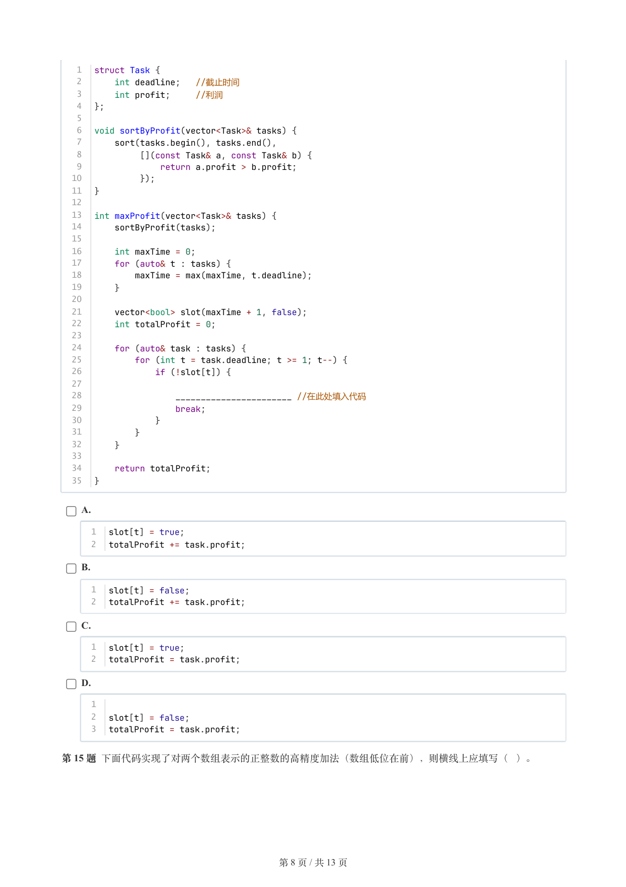

### 提取文本

```
1  struct Task {
   2      int deadline;  //截止时间
   3      int profit;    //利润
   4  };
   5
   6  void sortByProfit(vector<Task>& tasks) {
   7      sort(tasks.begin(), tasks.end(),
   8           [](const Task& a, const Task& b) {
   9               return a.profit > b.profit;
  10           });
  11  }
  12
  13  int maxProfit(vector<Task>& tasks) {
  14      sortByProfit(tasks);
  15
  16      int maxTime = 0;
  17      for (auto& t : tasks) {
  18          maxTime = max(maxTime, t.deadline);
  19      }
  20
  21      vector<bool> slot(maxTime + 1, false);
  22      int totalProfit = 0;
  23
  24      for (auto& task : tasks) {
  25          for (int t = task.deadline; t >= 1; t--) {
  26              if (!slot[t]) {
  27
  28                  _______________________ //在此处填入代码
  29                  break;
  30              }
  31          }
  32      }
  33
  34      return totalProfit;
  35  }


    A.

      1  slot[t] = true;
      2  totalProfit += task.profit;

    B.

      1  slot[t] = false;
      2  totalProfit += task.profit;

    C.

      1  slot[t] = true;
      2  totalProfit = task.profit;

    D.

      1
      2  slot[t] = false;
      3  totalProfit = task.profit;


第 15 题 下面代码实现了对两个数组表示的正整数的高精度加法（数组低位在前），则横线上应填写（ ）。


                       第 8 页 / 共 13 页
```

## 第 9 页

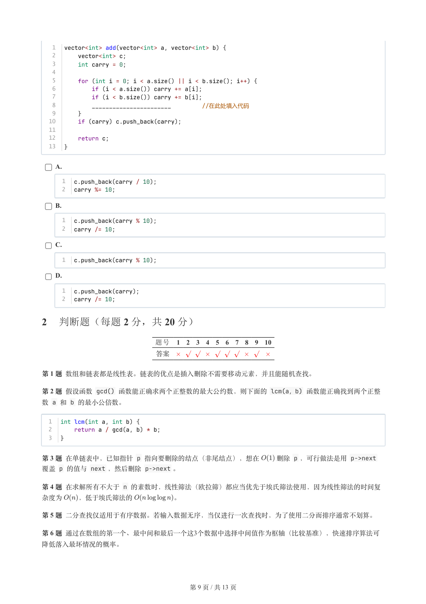

### 提取文本

```
1  vector<int> add(vector<int> a, vector<int> b) {
   2      vector<int> c;
   3      int carry = 0;
   4
   5      for (int i = 0; i < a.size() || i < b.size(); i++) {
   6          if (i < a.size()) carry += a[i];
   7          if (i < b.size()) carry += b[i];
   8          _______________________      //在此处填入代码
   9      }
  10      if (carry) c.push_back(carry);
  11
  12      return c;
  13  }


    A.

      1  c.push_back(carry / 10);
      2  carry %= 10;

    B.

      1  c.push_back(carry % 10);
      2  carry /= 10;

    C.

      1  c.push_back(carry % 10);

    D.

      1  c.push_back(carry);
      2  carry /= 10;

2 判断题（每题 2 分，共 20 分）

                题号  1  2  3  4  5  6  7  8  9  10

                 答案


第 1 题 数组和链表都是线性表。链表的优点是插入删除不需要移动元素，并且能随机查找。

第 2 题 假设函数 gcd() 函数能正确求两个正整数的最大公约数，则下面的 lcm(a，b) 函数能正确找到两个正整
数 a 和 b 的最小公倍数。


  1  int lcm(int a, int b) {
  2      return a / gcd(a, b) * b;
  3  }

第 3 题 在单链表中，已知指针 p 指向要删除的结点（非尾结点），想在   删除 p ，可行做法是用 p->next
覆盖 p 的值与 next ，然后删除 p->next 。

第 4 题 在求解所有不大于 n 的素数时，线性筛法（欧拉筛）都应当优先于埃氏筛法使用，因为线性筛法的时间复

杂度为  ，低于埃氏筛法的      。

第 5 题 二分查找仅适用于有序数据。若输入数据无序，当仅进行一次查找时，为了使用二分而排序通常不划算。

第 6 题 通过在数组的第一个、最中间和最后一个这3个数据中选择中间值作为枢轴（比较基准），快速排序算法可

降低落入最坏情况的概率。


                       第 9 页 / 共 13 页
```

## 第 10 页

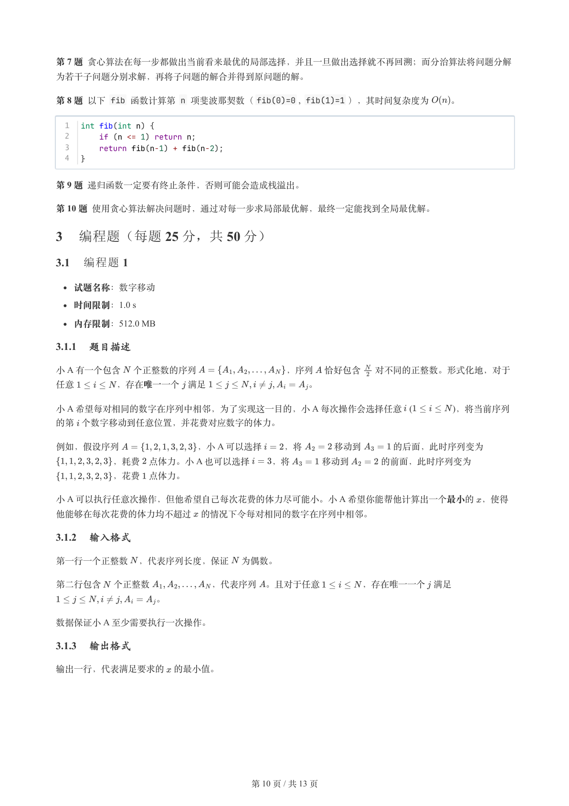

### 提取文本

```
第 7 题 贪心算法在每一步都做出当前看来最优的局部选择，并且一旦做出选择就不再回溯；而分治算法将问题分解

为若干子问题分别求解，再将子问题的解合并得到原问题的解。

第 8 题 以下 fib 函数计算第 n 项斐波那契数（fib(0)=0 , fib(1)=1 ），其时间复杂度为  。


  1  int fib(int n) {
  2      if (n <= 1) return n;
  3      return fib(n-1) + fib(n-2);
  4  }


第 9 题 递归函数一定要有终止条件，否则可能会造成栈溢出。

第 10 题 使用贪心算法解决问题时，通过对每一步求局部最优解，最终一定能找到全局最优解。

3 编程题（每题 25 分，共 50 分）

3.1 编程题 1


  试题名称：数字移动

   时间限制：1.0 s

   内存限制：512.0 MB

3.1.1 题目描述

小 A 有一个包含 个正整数的序列          ，序列 恰好包含  对不同的正整数。形式化地，对于

任意     ，存在唯一一个 满足           。

小 A 希望每对相同的数字在序列中相邻，为了实现这一目的，小 A 每次操作会选择任意   (     )，将当前序列

的第 个数字移动到任意位置，并花费对应数字的体力。

例如，假设序列         ，小 A 可以选择  ，将    移动到    的后面，此时序列变为
      ，耗费 点体力。小 A 也可以选择  ，将    移动到    的前面，此时序列变为

      ，花费 点体力。

小 A 可以执行任意次操作，但他希望自己每次花费的体力尽可能小。小 A 希望你能帮他计算出一个最小的 ，使得

他能够在每次花费的体力均不超过 的情况下令每对相同的数字在序列中相邻。

3.1.2 输入格式

第一行一个正整数 ，代表序列长度，保证 为偶数。


第二行包含 个正整数       ，代表序列 。且对于任意     ，存在唯一一个 满足

           。

数据保证小 A 至少需要执行一次操作。

3.1.3 输出格式

输出一行，代表满足要求的 的最小值。


                       第 10 页 / 共 13 页
```

## 第 11 页

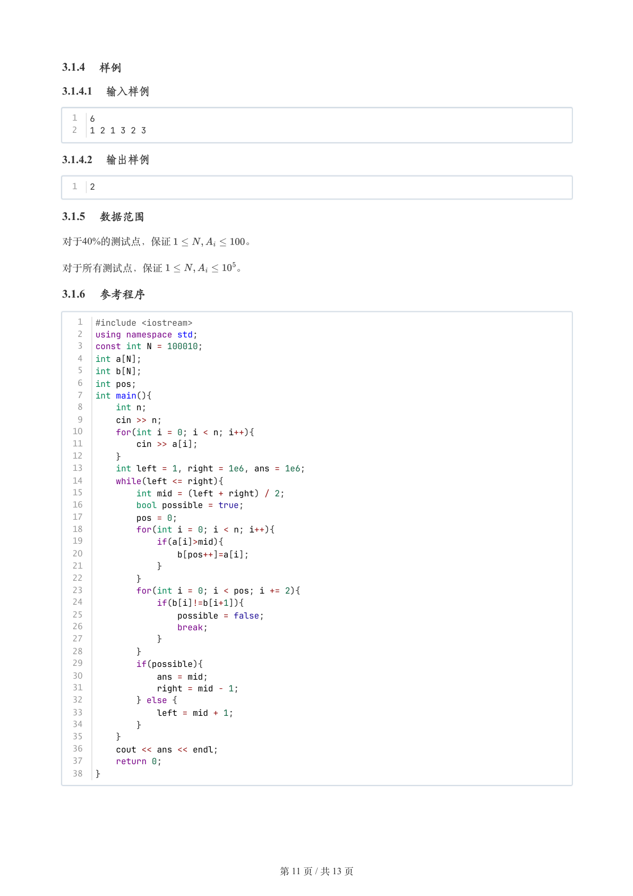

### 提取文本

```
3.1.4 样例

3.1.4.1 输入样例

  1  6
  2  1 2 1 3 2 3

3.1.4.2 输出样例

  1  2

3.1.5 数据范围

对于40%的测试点，保证       。


对于所有测试点，保证       。

3.1.6 参考程序

   1  #include <iostream>
   2  using namespace std;
   3  const int N = 100010;
   4  int a[N];
   5  int b[N];
   6  int pos;
   7  int main(){
   8      int n;
   9      cin >> n;
  10      for(int i = 0; i < n; i++){
  11          cin >> a[i];
  12      }
  13      int left = 1, right = 1e6, ans = 1e6;
  14      while(left <= right){
  15          int mid = (left + right) / 2;
  16          bool possible = true;
  17          pos = 0;
  18          for(int i = 0; i < n; i++){
  19              if(a[i]>mid){
  20                  b[pos++]=a[i];
  21              }
  22          }
  23          for(int i = 0; i < pos; i += 2){
  24              if(b[i]!=b[i+1]){
  25                  possible = false;
  26                  break;
  27              }
  28          }
  29          if(possible){
  30              ans = mid;
  31              right = mid - 1;
  32          } else {
  33              left = mid + 1;
  34          }
  35      }
  36      cout << ans << endl;
  37      return 0;
  38  }


                       第 11 页 / 共 13 页
```

## 第 12 页

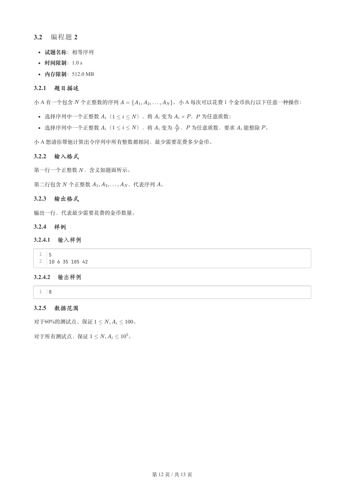

### 提取文本

```
3.2 编程题 2


  试题名称：相等序列

   时间限制：1.0 s

   内存限制：512.0 MB

3.2.1 题目描述

小 A 有一个包含 个正整数的序列          。小 A 每次可以花费 1 个金币执行以下任意一种操作：


  选择序列中一个正整数 （    ），将  变为   ， 为任意质数；

  选择序列中一个正整数 （    ），将  变为 ， 为任意质数，要求  能整除 。

小 A 想请你帮他计算出令序列中所有整数都相同，最少需要花费多少金币。

3.2.2 输入格式

第一行一个正整数 ，含义如题面所示。


第二行包含 个正整数       ，代表序列 。

3.2.3 输出格式

输出一行，代表最少需要花费的金币数量。

3.2.4 样例

3.2.4.1 输入样例

  1  5
  2  10 6 35 105 42

3.2.4.2 输出样例

  1  8

3.2.5 数据范围

对于60%的测试点，保证       。


对于所有测试点，保证       。


                       第 12 页 / 共 13 页
```

## 第 13 页

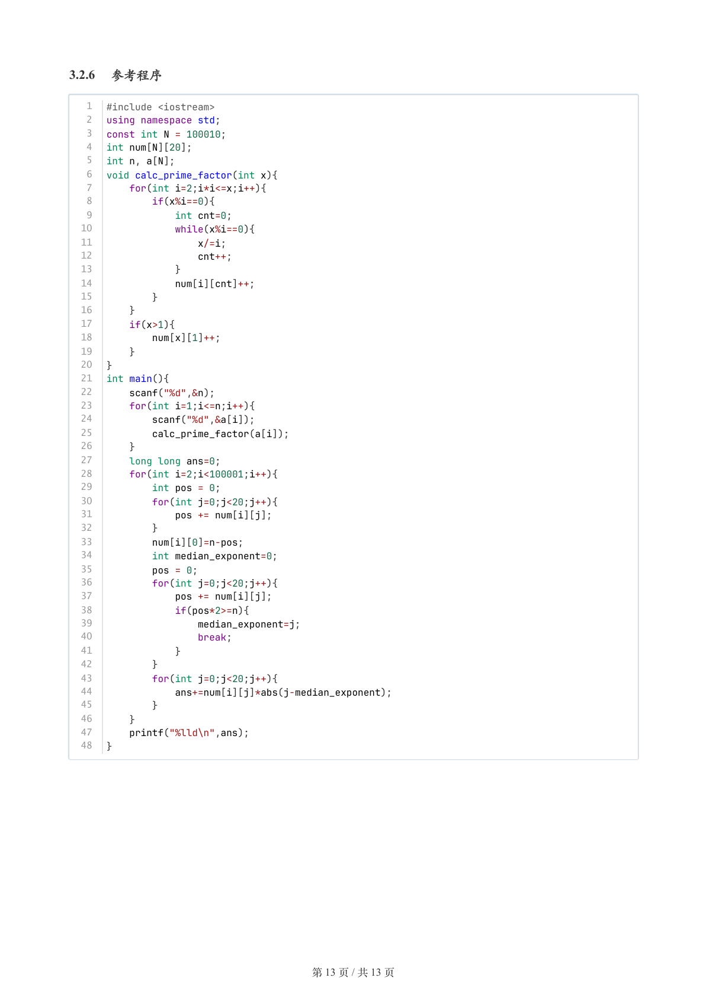

### 提取文本

```
3.2.6 参考程序

   1  #include <iostream>
   2  using namespace std;
   3  const int N = 100010;
   4  int num[N][20];
   5  int n, a[N];
   6  void calc_prime_factor(int x){
   7      for(int i=2;i*i<=x;i++){
   8          if(x%i==0){
   9              int cnt=0;
  10              while(x%i==0){
  11                  x/=i;
  12                  cnt++;
  13              }
  14              num[i][cnt]++;
  15          }
  16      }
  17      if(x>1){
  18          num[x][1]++;
  19      }
  20  }
  21  int main(){
  22      scanf("%d",&n);
  23      for(int i=1;i<=n;i++){
  24          scanf("%d",&a[i]);
  25          calc_prime_factor(a[i]);
  26      }
  27      long long ans=0;
  28      for(int i=2;i<100001;i++){
  29          int pos = 0;
  30          for(int j=0;j<20;j++){
  31              pos += num[i][j];
  32          }
  33          num[i][0]=n-pos;
  34          int median_exponent=0;
  35          pos = 0;
  36          for(int j=0;j<20;j++){
  37              pos += num[i][j];
  38              if(pos*2>=n){
  39                  median_exponent=j;
  40                  break;
  41              }
  42          }
  43          for(int j=0;j<20;j++){
  44              ans+=num[i][j]*abs(j-median_exponent);
  45          }
  46      }
  47      printf("%lld\n",ans);
  48  }


                       第 13 页 / 共 13 页
```
