# 2025年12月-C++6级

- 原始 PDF：[`pdfs/2025年12月-C++6级.pdf`](../pdfs/2025年12月-C++6级.pdf)
- 页数：13
- 转换脚本：[`scripts/convert_pdfs_to_markdown.py`](../scripts/convert_pdfs_to_markdown.py)

> 为尽量避免信息丢失，每页均附带页面图片；文本提取结果保留原有顺序与换行特征，个别公式、图形、特殊排版请以页面图片为准。

## 第 1 页

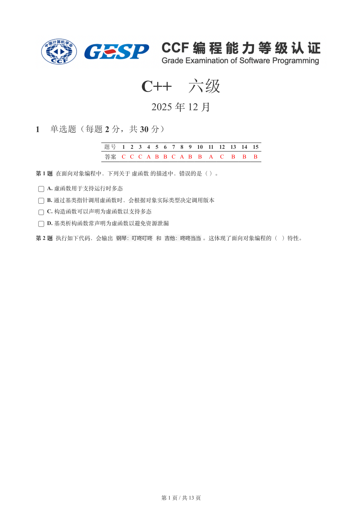

### 提取文本

```
C++　六级

                      2025 年 12 月

1 单选题（每题 2 分，共 30 分）


           题号  1  2  3  4  5  6  7  8  9  10  11  12  13  14  15
            答案 C C C A B B C A B  B  A  C  B  B  B


第 1 题 在面向对象编程中，下列关于 虚函数 的描述中，错误的是（ ）。

    A. 虚函数用于支持运行时多态

    B. 通过基类指针调用虚函数时，会根据对象实际类型决定调用版本

    C. 构造函数可以声明为虚函数以支持多态

    D. 基类析构函数常声明为虚函数以避免资源泄漏

第 2 题 执行如下代码，会输出 钢琴：叮咚叮咚 和 吉他：咚咚当当。这体现了面向对象编程的（ ）特性。


                       第 1 页 / 共 13 页
```

## 第 2 页

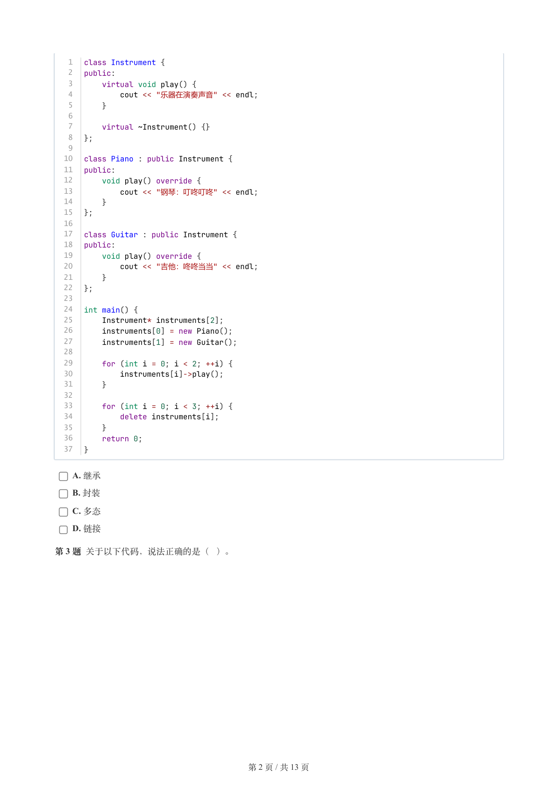

### 提取文本

```
1  class Instrument {
   2  public:
   3      virtual void play() {
   4          cout << "乐器在演奏声音" << endl;
   5      }
   6
   7      virtual ~Instrument() {}
   8  };
   9
  10  class Piano : public Instrument {
  11  public:
  12      void play() override {
  13          cout << "钢琴：叮咚叮咚" << endl;
  14      }
  15  };
  16
  17  class Guitar : public Instrument {
  18  public:
  19      void play() override {
  20          cout << "吉他：咚咚当当" << endl;
  21      }
  22  };
  23
  24  int main() {
  25      Instrument* instruments[2];
  26      instruments[0] = new Piano();
  27      instruments[1] = new Guitar();
  28
  29      for (int i = 0; i < 2; ++i) {
  30          instruments[i]->play();
  31      }
  32
  33      for (int i = 0; i < 3; ++i) {
  34          delete instruments[i];
  35      }
  36      return 0;
  37  }


    A. 继承

    B. 封装

    C. 多态

    D. 链接

第 3 题 关于以下代码，说法正确的是（ ）。


                       第 2 页 / 共 13 页
```

## 第 3 页

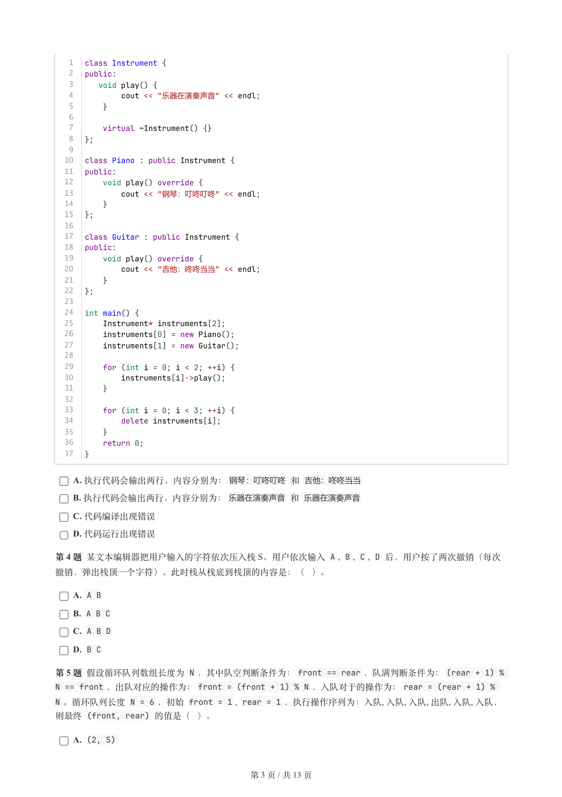

### 提取文本

```
1  class Instrument {
   2  public:
   3     void play() {
   4          cout << "乐器在演奏声音" << endl;
   5      }
   6
   7      virtual ~Instrument() {}
   8  };
   9
  10  class Piano : public Instrument {
  11  public:
  12      void play() override {
  13          cout << "钢琴：叮咚叮咚" << endl;
  14      }
  15  };
  16
  17  class Guitar : public Instrument {
  18  public:
  19      void play() override {
  20          cout << "吉他：咚咚当当" << endl;
  21      }
  22  };
  23
  24  int main() {
  25      Instrument* instruments[2];
  26      instruments[0] = new Piano();
  27      instruments[1] = new Guitar();
  28
  29      for (int i = 0; i < 2; ++i) {
  30          instruments[i]->play();
  31      }
  32
  33      for (int i = 0; i < 3; ++i) {
  34          delete instruments[i];
  35      }
  36      return 0;
  37  }

    A. 执行代码会输出两行，内容分别为：钢琴：叮咚叮咚 和 吉他：咚咚当当

    B. 执行代码会输出两行，内容分别为：乐器在演奏声音 和 乐器在演奏声音

    C. 代码编译出现错误

    D. 代码运行出现错误

第 4 题 某文本编辑器把用户输入的字符依次压入栈 S。用户依次输入 A , B , C , D 后，用户按了两次撤销（每次

撤销，弹出栈顶一个字符）。此时栈从栈底到栈顶的内容是：（ ）。

    A. A B

    B. A B C

    C. A B D

    D. B C

第 5 题 假设循环队列数组长度为 N ，其中队空判断条件为：front == rear ，队满判断条件为：(rear + 1) %
N == front ，出队对应的操作为：front = (front + 1) % N ，入队对于的操作为：rear = (rear + 1) %
N 。循环队列长度 N = 6 ，初始 front = 1 , rear = 1 ，执行操作序列为：入队, 入队, 入队, 出队, 入队, 入队，
则最终 (front, rear) 的值是（ ）。

    A. (2, 5)


                       第 3 页 / 共 13 页
```

## 第 4 页

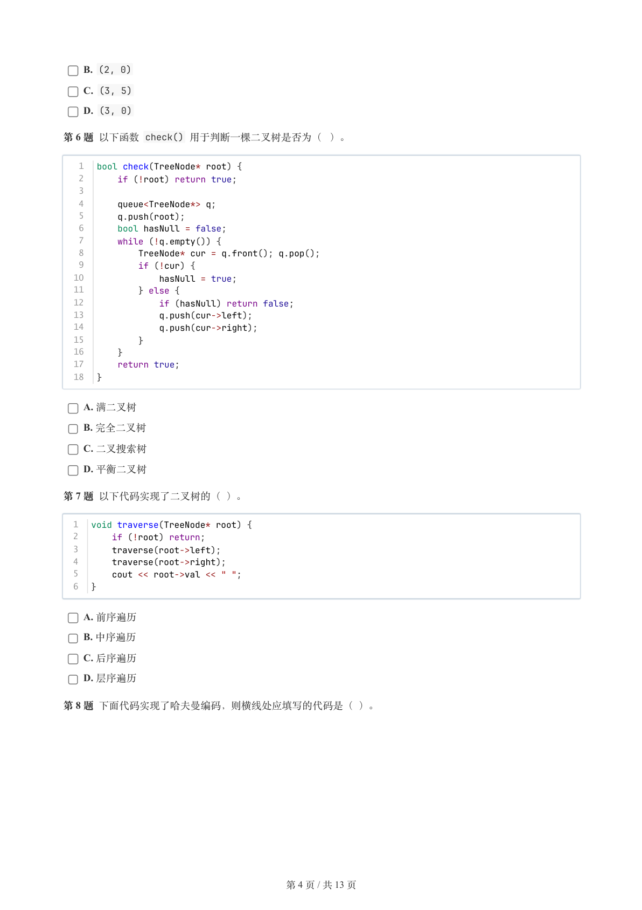

### 提取文本

```
B. (2, 0)

    C. (3, 5)

    D. (3, 0)

第 6 题 以下函数 check() 用于判断一棵二叉树是否为（ ）。


   1  bool check(TreeNode* root) {
   2      if (!root) return true;
   3
   4      queue<TreeNode*> q;
   5      q.push(root);
   6      bool hasNull = false;
   7      while (!q.empty()) {
   8          TreeNode* cur = q.front(); q.pop();
   9          if (!cur) {
  10              hasNull = true;
  11          } else {
  12              if (hasNull) return false;
  13              q.push(cur->left);
  14              q.push(cur->right);
  15          }
  16      }
  17      return true;
  18  }


    A. 满二叉树

    B. 完全二叉树

    C. 二叉搜索树

    D. 平衡二叉树

第 7 题 以下代码实现了二叉树的（ ）。


  1  void traverse(TreeNode* root) {
  2      if (!root) return;
  3      traverse(root->left);
  4      traverse(root->right);
  5      cout << root->val << " ";
  6  }


    A. 前序遍历

    B. 中序遍历

    C. 后序遍历

    D. 层序遍历

第 8 题 下面代码实现了哈夫曼编码，则横线处应填写的代码是（ ）。


                       第 4 页 / 共 13 页
```

## 第 5 页

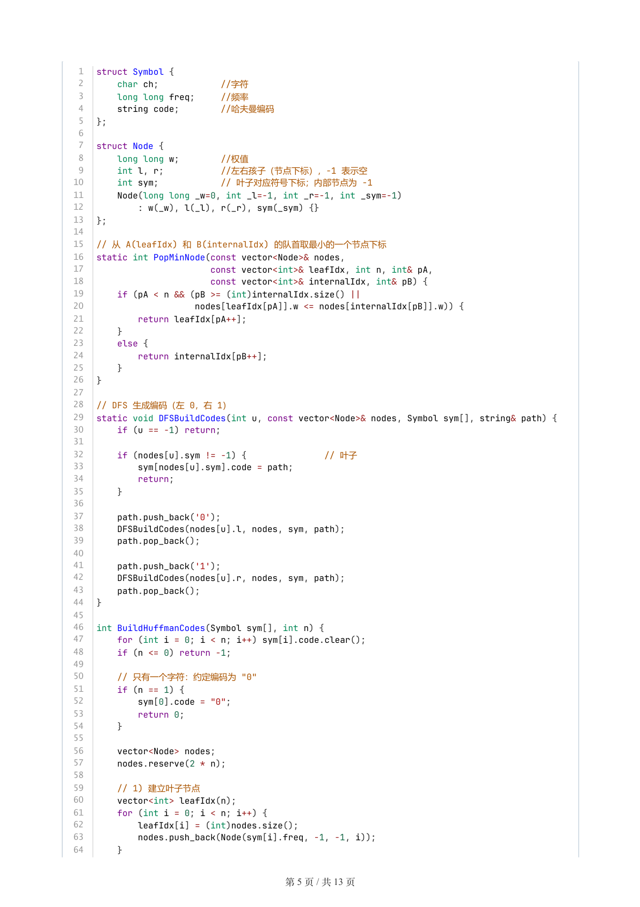

### 提取文本

```
1  struct Symbol {
 2      char ch;         //字符
 3      long long freq;    //频率
 4      string code;     //哈夫曼编码
 5  };
 6
 7  struct Node {
 8      long long w;      //权值
 9      int l, r;       //左右孩子（节点下标），-1 表示空
10      int sym;            // 叶子对应符号下标；内部节点为 -1
11      Node(long long _w=0, int _l=-1, int _r=-1, int _sym=-1)
12          : w(_w), l(_l), r(_r), sym(_sym) {}
13  };
14
15  // 从 A(leafIdx) 和 B(internalIdx) 的队首取最小的一个节点下标
16  static int PopMinNode(const vector<Node>& nodes,
17                        const vector<int>& leafIdx, int n, int& pA,
18                        const vector<int>& internalIdx, int& pB) {
19      if (pA < n && (pB >= (int)internalIdx.size() ||
20                     nodes[leafIdx[pA]].w <= nodes[internalIdx[pB]].w)) {
21          return leafIdx[pA++];
22      }
23      else {
24          return internalIdx[pB++];
25      }
26  }
27
28  // DFS 生成编码（左 0，右 1）
29  static void DFSBuildCodes(int u, const vector<Node>& nodes, Symbol sym[], string& path) {
30      if (u == -1) return;
31
32      if (nodes[u].sym != -1) {               // 叶子
33          sym[nodes[u].sym].code = path;
34          return;
35      }
36
37      path.push_back('0');
38      DFSBuildCodes(nodes[u].l, nodes, sym, path);
39      path.pop_back();
40
41      path.push_back('1');
42      DFSBuildCodes(nodes[u].r, nodes, sym, path);
43      path.pop_back();
44  }
45
46  int BuildHuffmanCodes(Symbol sym[], int n) {
47      for (int i = 0; i < n; i++) sym[i].code.clear();
48      if (n <= 0) return -1;
49
50      // 只有一个字符：约定编码为 "0"
51      if (n == 1) {
52          sym[0].code = "0";
53          return 0;
54      }
55
56      vector<Node> nodes;
57      nodes.reserve(2 * n);
58
59      // 1) 建立叶子节点
60      vector<int> leafIdx(n);
61      for (int i = 0; i < n; i++) {
62          leafIdx[i] = (int)nodes.size();
63          nodes.push_back(Node(sym[i].freq, -1, -1, i));
64      }


                      第 5 页 / 共 13 页
```

## 第 6 页

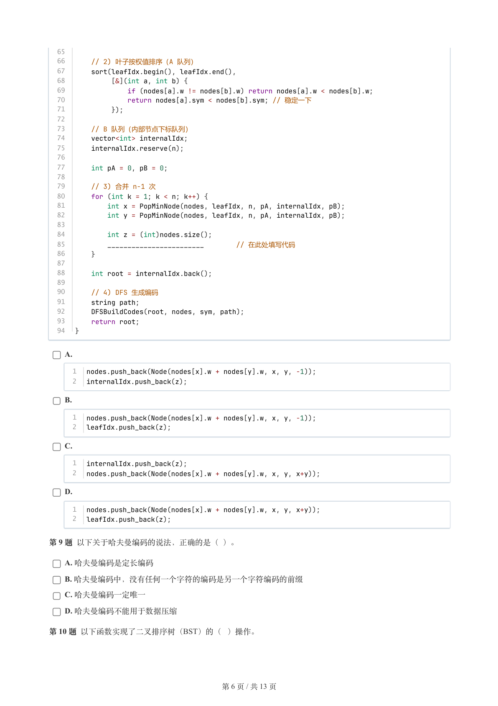

### 提取文本

```
65
  66      // 2) 叶子按权值排序（A 队列）
  67      sort(leafIdx.begin(), leafIdx.end(),
  68           [&](int a, int b) {
  69               if (nodes[a].w != nodes[b].w) return nodes[a].w < nodes[b].w;
  70               return nodes[a].sym < nodes[b].sym; // 稳定一下
  71           });
  72
  73      // B 队列（内部节点下标队列）
  74      vector<int> internalIdx;
  75      internalIdx.reserve(n);
  76
  77      int pA = 0, pB = 0;
  78
  79      // 3) 合并 n-1 次
  80      for (int k = 1; k < n; k++) {
  81          int x = PopMinNode(nodes, leafIdx, n, pA, internalIdx, pB);
  82          int y = PopMinNode(nodes, leafIdx, n, pA, internalIdx, pB);
  83
  84          int z = (int)nodes.size();
  85          ________________________        // 在此处填写代码
  86      }
  87
  88      int root = internalIdx.back();
  89
  90      // 4) DFS 生成编码
  91      string path;
  92      DFSBuildCodes(root, nodes, sym, path);
  93      return root;
  94  }


    A.

      1  nodes.push_back(Node(nodes[x].w + nodes[y].w, x, y, -1));
      2  internalIdx.push_back(z);

    B.

      1  nodes.push_back(Node(nodes[x].w + nodes[y].w, x, y, -1));
      2  leafIdx.push_back(z);

    C.

      1  internalIdx.push_back(z);
      2  nodes.push_back(Node(nodes[x].w + nodes[y].w, x, y, x+y));

    D.

      1  nodes.push_back(Node(nodes[x].w + nodes[y].w, x, y, x+y));
      2  leafIdx.push_back(z);


第 9 题 以下关于哈夫曼编码的说法，正确的是（ ）。

    A. 哈夫曼编码是定长编码

    B. 哈夫曼编码中，没有任何一个字符的编码是另一个字符编码的前缀

    C. 哈夫曼编码一定唯一

    D. 哈夫曼编码不能用于数据压缩

第 10 题 以下函数实现了二叉排序树（BST）的（ ）操作。


                       第 6 页 / 共 13 页
```

## 第 7 页

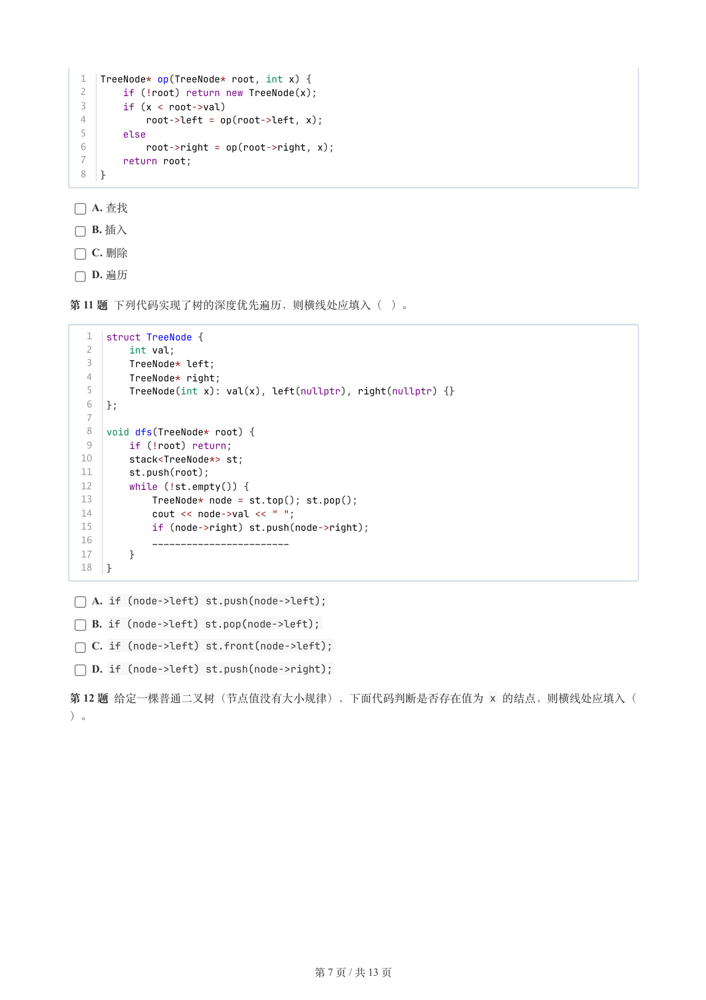

### 提取文本

```
1  TreeNode* op(TreeNode* root, int x) {
  2      if (!root) return new TreeNode(x);
  3      if (x < root->val)
  4          root->left = op(root->left, x);
  5      else
  6          root->right = op(root->right, x);
  7      return root;
  8  }


    A. 查找

    B. 插入

    C. 删除

    D. 遍历

第 11 题 下列代码实现了树的深度优先遍历，则横线处应填入（ ）。


   1  struct TreeNode {
   2      int val;
   3      TreeNode* left;
   4      TreeNode* right;
   5      TreeNode(int x): val(x), left(nullptr), right(nullptr) {}
   6  };
   7
   8  void dfs(TreeNode* root) {
   9      if (!root) return;
  10      stack<TreeNode*> st;
  11      st.push(root);
  12      while (!st.empty()) {
  13          TreeNode* node = st.top(); st.pop();
  14          cout << node->val << " ";
  15          if (node->right) st.push(node->right);
  16          ________________________
  17      }
  18  }

    A. if (node->left) st.push(node->left);

    B. if (node->left) st.pop(node->left);

    C. if (node->left) st.front(node->left);

    D. if (node->left) st.push(node->right);

第 12 题 给定一棵普通二叉树（节点值没有大小规律），下面代码判断是否存在值为 x 的结点，则横线处应填入（

）。


                       第 7 页 / 共 13 页
```

## 第 8 页

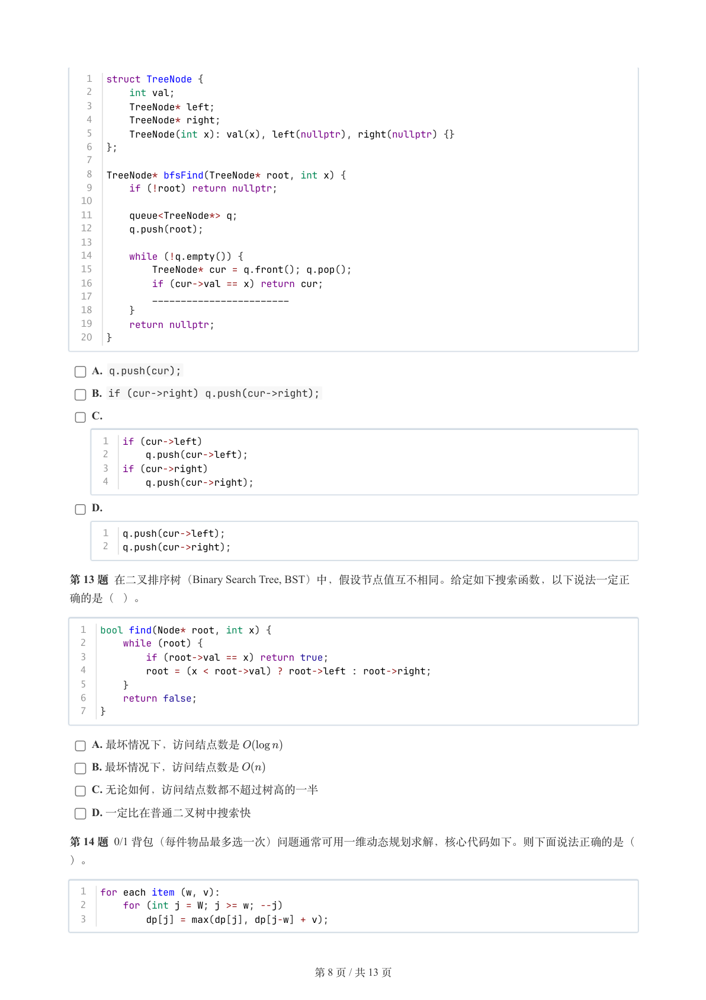

### 提取文本

```
1  struct TreeNode {
   2      int val;
   3      TreeNode* left;
   4      TreeNode* right;
   5      TreeNode(int x): val(x), left(nullptr), right(nullptr) {}
   6  };
   7
   8  TreeNode* bfsFind(TreeNode* root, int x) {
   9      if (!root) return nullptr;
  10
  11      queue<TreeNode*> q;
  12      q.push(root);
  13
  14      while (!q.empty()) {
  15          TreeNode* cur = q.front(); q.pop();
  16          if (cur->val == x) return cur;
  17          ________________________
  18      }
  19      return nullptr;
  20  }

    A. q.push(cur);

    B. if (cur->right) q.push(cur->right);

    C.

      1  if (cur->left)
      2      q.push(cur->left);
      3  if (cur->right)
      4      q.push(cur->right);

    D.

      1  q.push(cur->left);
      2  q.push(cur->right);


第 13 题 在二叉排序树（Binary Search Tree, BST）中，假设节点值互不相同。给定如下搜索函数，以下说法一定正

确的是（ ）。


  1  bool find(Node* root, int x) {
  2      while (root) {
  3          if (root->val == x) return true;
  4          root = (x < root->val) ? root->left : root->right;
  5      }
  6      return false;
  7  }


    A. 最坏情况下，访问结点数是

    B. 最坏情况下，访问结点数是

    C. 无论如何，访问结点数都不超过树高的一半

    D. 一定比在普通二叉树中搜索快

第 14 题 0/1 背包（每件物品最多选一次）问题通常可用一维动态规划求解，核心代码如下。则下面说法正确的是（

）。


  1  for each item (w, v):
  2      for (int j = W; j >= w; --j)
  3          dp[j] = max(dp[j], dp[j-w] + v);


                       第 8 页 / 共 13 页
```

## 第 9 页

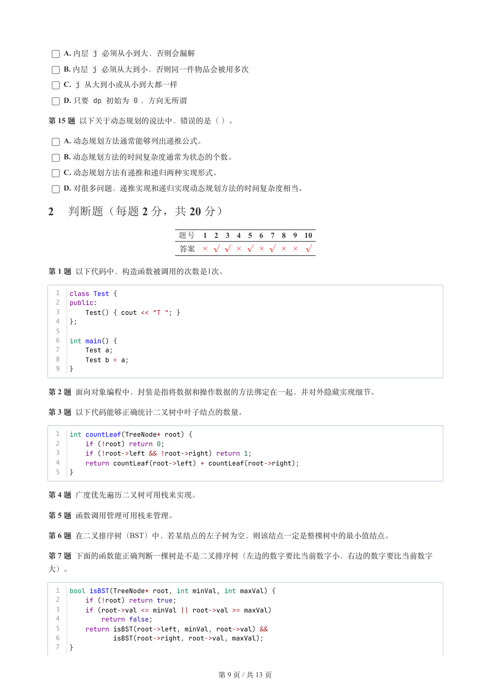

### 提取文本

```
A. 内层 j 必须从小到大，否则会漏解

    B. 内层 j 必须从大到小，否则同一件物品会被用多次

    C. j 从大到小或从小到大都一样

    D. 只要 dp 初始为 0 ，方向无所谓

第 15 题 以下关于动态规划的说法中，错误的是（ ）。

    A. 动态规划方法通常能够列出递推公式。

    B. 动态规划方法的时间复杂度通常为状态的个数。

    C. 动态规划方法有递推和递归两种实现形式。

    D. 对很多问题，递推实现和递归实现动态规划方法的时间复杂度相当。

2 判断题（每题 2 分，共 20 分）


                题号  1  2  3  4  5  6  7  8  9  10

                 答案


第 1 题 以下代码中，构造函数被调用的次数是1次。


  1  class Test {
  2  public:
  3      Test() { cout << "T "; }
  4  };
  5
  6  int main() {
  7      Test a;
  8      Test b = a;
  9  }


第 2 题 面向对象编程中，封装是指将数据和操作数据的方法绑定在一起，并对外隐藏实现细节。

第 3 题 以下代码能够正确统计二叉树中叶子结点的数量。


  1  int countLeaf(TreeNode* root) {
  2      if (!root) return 0;
  3      if (!root->left && !root->right) return 1;
  4      return countLeaf(root->left) + countLeaf(root->right);
  5  }


第 4 题 广度优先遍历二叉树可用栈来实现。

第 5 题 函数调用管理可用栈来管理。

第 6 题 在二叉排序树（BST）中，若某结点的左子树为空，则该结点一定是整棵树中的最小值结点。

第 7 题 下面的函数能正确判断一棵树是不是二叉排序树（左边的数字要比当前数字小，右边的数字要比当前数字

大）。


  1  bool isBST(TreeNode* root, int minVal, int maxVal) {
  2      if (!root) return true;
  3      if (root->val <= minVal || root->val >= maxVal)
  4          return false;
  5      return isBST(root->left, minVal, root->val) &&
  6             isBST(root->right, root->val, maxVal);
  7  }


                       第 9 页 / 共 13 页
```

## 第 10 页

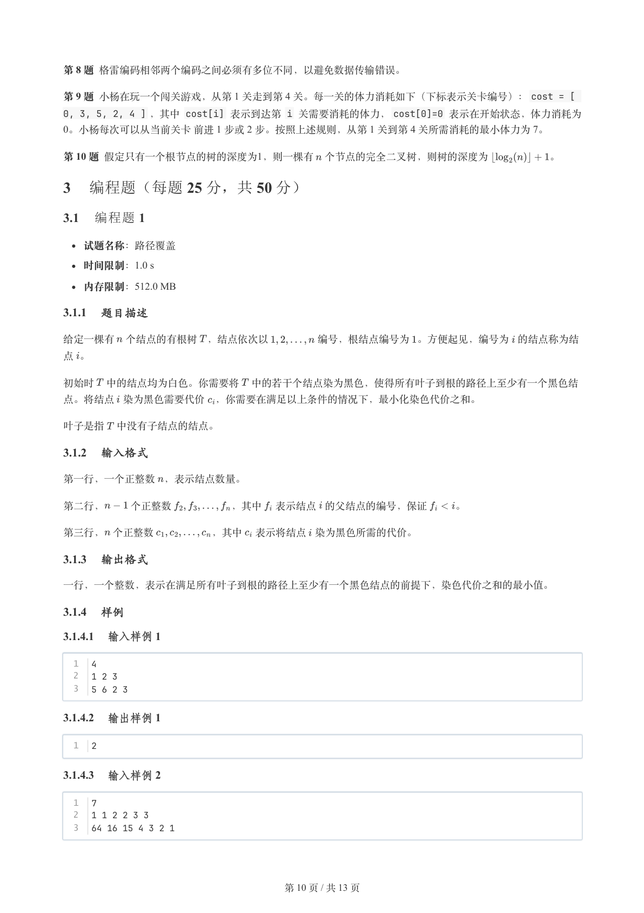

### 提取文本

```
第 8 题 格雷编码相邻两个编码之间必须有多位不同，以避免数据传输错误。

第 9 题 小杨在玩一个闯关游戏，从第 1 关走到第 4 关。每一关的体力消耗如下（下标表示关卡编号）：cost = [
0, 3, 5, 2, 4 ] ，其中 cost[i] 表示到达第 i 关需要消耗的体力，cost[0]=0 表示在开始状态，体力消耗为
0。小杨每次可以从当前关卡 前进 1 步或 2 步。按照上述规则，从第 1 关到第 4 关所需消耗的最小体力为 7。

第 10 题 假定只有一个根节点的树的深度为1，则一棵有 个节点的完全二叉树，则树的深度为      。

3 编程题（每题 25 分，共 50 分）

3.1 编程题 1


  试题名称：路径覆盖

   时间限制：1.0 s

   内存限制：512.0 MB

3.1.1 题目描述

给定一棵有 个结点的有根树 ，结点依次以     编号，根结点编号为 。方便起见，编号为 的结点称为结

点 。


初始时 中的结点均为白色。你需要将 中的若干个结点染为黑色，使得所有叶子到根的路径上至少有一个黑色结

点。将结点 染为黑色需要代价 ，你需要在满足以上条件的情况下，最小化染色代价之和。


叶子是指 中没有子结点的结点。

3.1.2 输入格式

第一行，一个正整数 ，表示结点数量。


第二行，   个正整数      ，其中 表示结点 的父结点的编号，保证   。


第三行， 个正整数      ，其中 表示将结点 染为黑色所需的代价。

3.1.3 输出格式

一行，一个整数，表示在满足所有叶子到根的路径上至少有一个黑色结点的前提下，染色代价之和的最小值。

3.1.4 样例

3.1.4.1 输入样例 1

  1  4
  2  1 2 3
  3  5 6 2 3

3.1.4.2 输出样例 1

  1  2

3.1.4.3 输入样例 2

  1  7
  2  1 1 2 2 3 3
  3  64 16 15 4 3 2 1


                       第 10 页 / 共 13 页
```

## 第 11 页

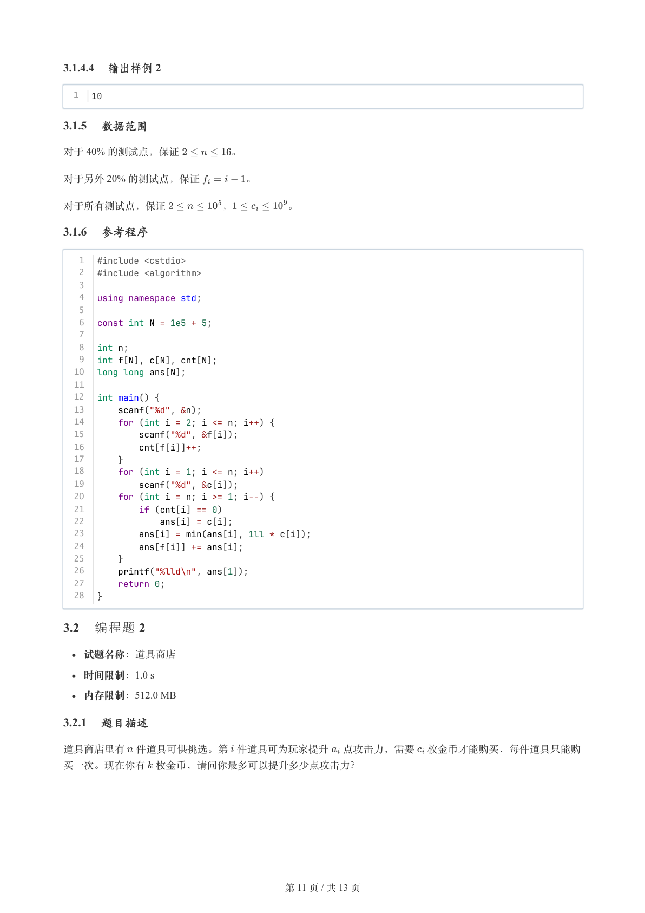

### 提取文本

```
3.1.4.4 输出样例 2

  1  10

3.1.5 数据范围

对于 40% 的测试点，保证     。

对于另外 20% 的测试点，保证     。


对于所有测试点，保证      ，     。

3.1.6 参考程序

   1  #include <cstdio>
   2  #include <algorithm>
   3
   4  using namespace std;
   5
   6  const int N = 1e5 + 5;
   7
   8  int n;
   9  int f[N], c[N], cnt[N];
  10  long long ans[N];
  11
  12  int main() {
  13      scanf("%d", &n);
  14      for (int i = 2; i <= n; i++) {
  15          scanf("%d", &f[i]);
  16          cnt[f[i]]++;
  17      }
  18      for (int i = 1; i <= n; i++)
  19          scanf("%d", &c[i]);
  20      for (int i = n; i >= 1; i--) {
  21          if (cnt[i] == 0)
  22              ans[i] = c[i];
  23          ans[i] = min(ans[i], 1ll * c[i]);
  24          ans[f[i]] += ans[i];
  25      }
  26      printf("%lld\n", ans[1]);
  27      return 0;
  28  }

3.2 编程题 2

  试题名称：道具商店

   时间限制：1.0 s

   内存限制：512.0 MB

3.2.1 题目描述

道具商店里有 件道具可供挑选。第 件道具可为玩家提升 点攻击力，需要 枚金币才能购买，每件道具只能购

买一次。现在你有 枚金币，请问你最多可以提升多少点攻击力？


                       第 11 页 / 共 13 页
```

## 第 12 页

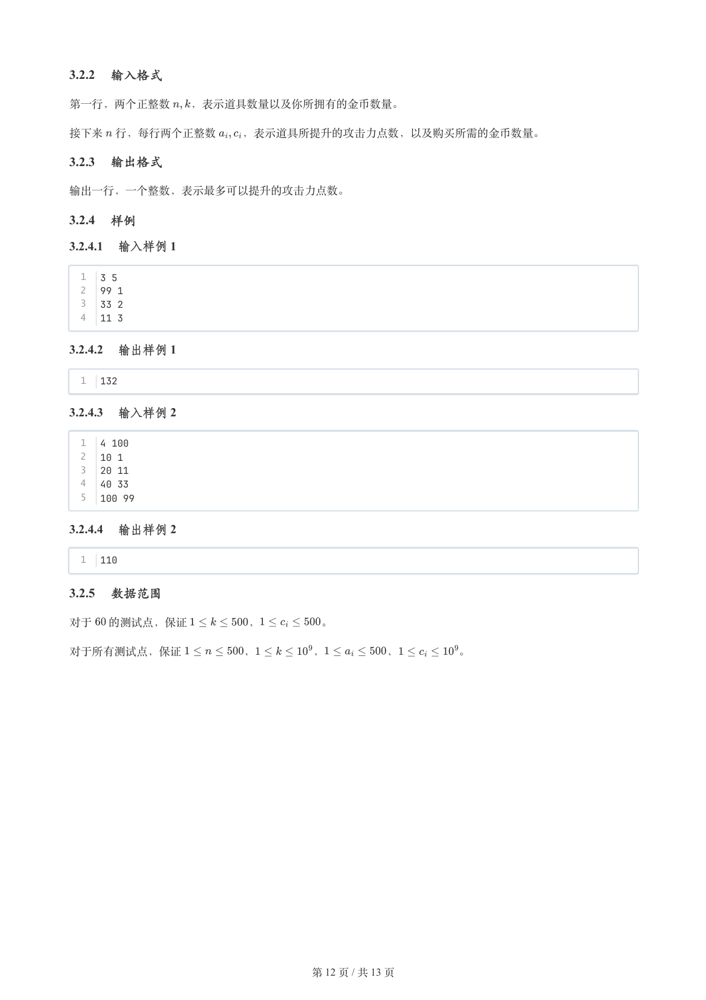

### 提取文本

```
3.2.2 输入格式

第一行，两个正整数  ，表示道具数量以及你所拥有的金币数量。


接下来 行，每行两个正整数  ，表示道具所提升的攻击力点数，以及购买所需的金币数量。

3.2.3 输出格式

输出一行，一个整数，表示最多可以提升的攻击力点数。

3.2.4 样例

3.2.4.1 输入样例 1

  1  3 5
  2  99 1
  3  33 2
  4  11 3

3.2.4.2 输出样例 1

  1  132

3.2.4.3 输入样例 2

  1  4 100
  2  10 1
  3  20 11
  4  40 33
  5  100 99

3.2.4.4 输出样例 2

  1  110

3.2.5 数据范围

对于  的测试点，保证     ，     。


对于所有测试点，保证      ，     ，      ，     。


                       第 12 页 / 共 13 页
```

## 第 13 页

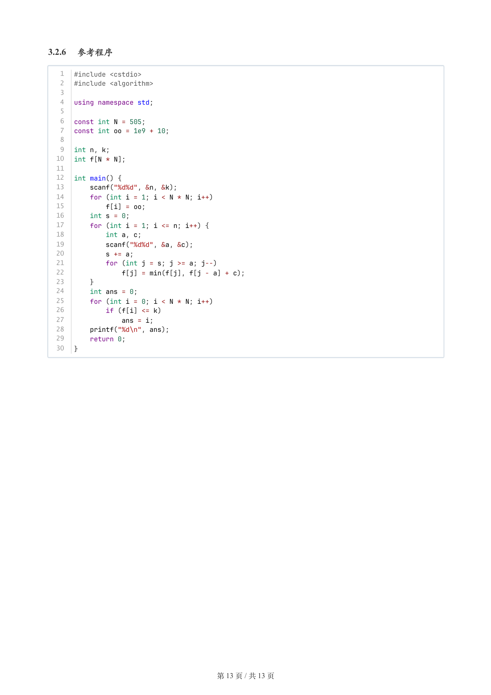

### 提取文本

```
3.2.6 参考程序

   1  #include <cstdio>
   2  #include <algorithm>
   3
   4  using namespace std;
   5
   6  const int N = 505;
   7  const int oo = 1e9 + 10;
   8
   9  int n, k;
  10  int f[N * N];
  11
  12  int main() {
  13      scanf("%d%d", &n, &k);
  14      for (int i = 1; i < N * N; i++)
  15          f[i] = oo;
  16      int s = 0;
  17      for (int i = 1; i <= n; i++) {
  18          int a, c;
  19          scanf("%d%d", &a, &c);
  20          s += a;
  21          for (int j = s; j >= a; j--)
  22              f[j] = min(f[j], f[j - a] + c);
  23      }
  24      int ans = 0;
  25      for (int i = 0; i < N * N; i++)
  26          if (f[i] <= k)
  27              ans = i;
  28      printf("%d\n", ans);
  29      return 0;
  30  }


                       第 13 页 / 共 13 页
```
