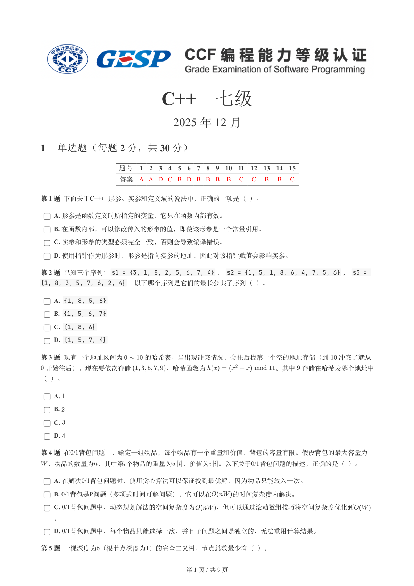
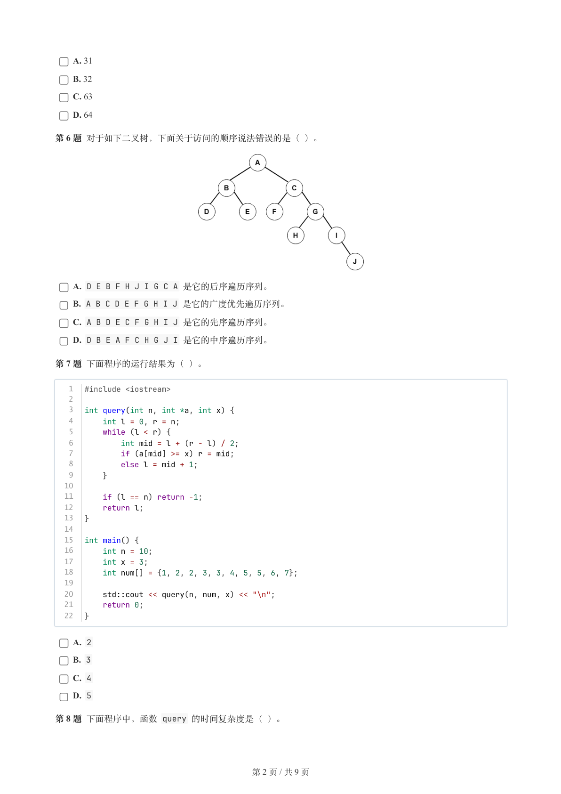
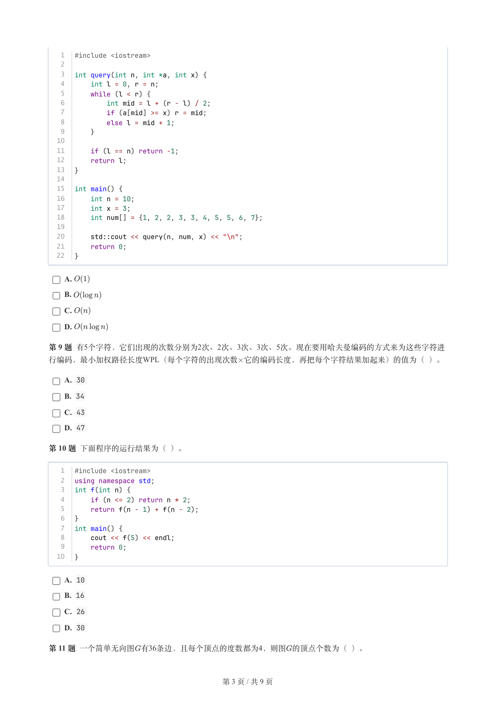
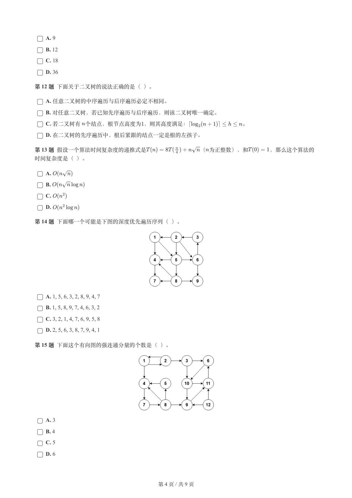
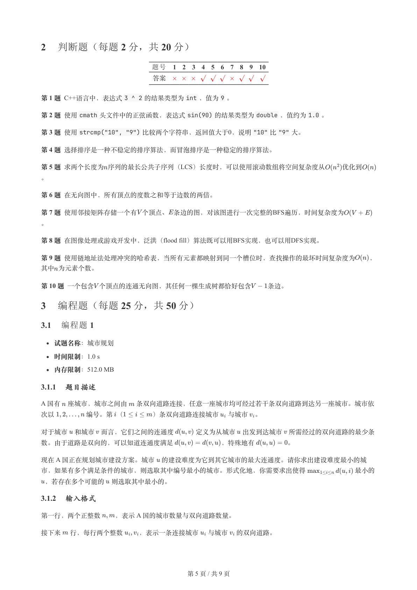
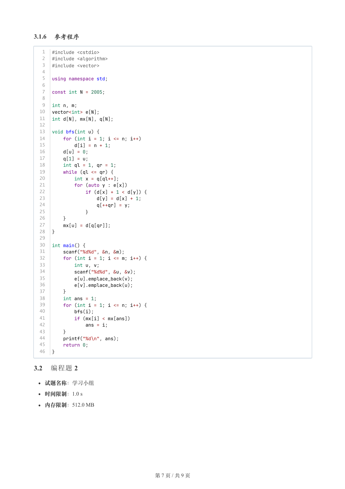
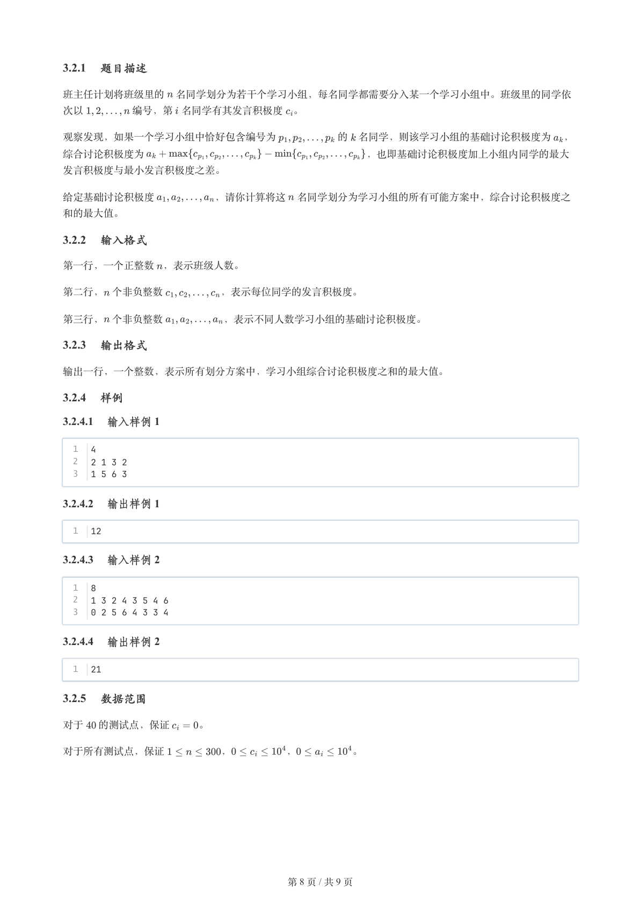
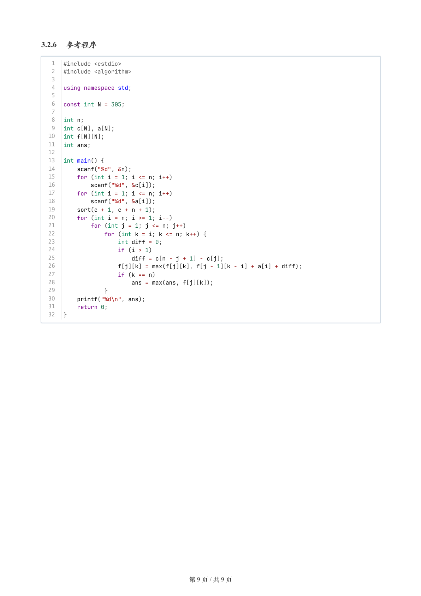

# 2025年12月-C++7级

- 原始 PDF：[`pdfs/2025年12月-C++7级.pdf`](../pdfs/2025年12月-C++7级.pdf)
- 页数：9
- 转换脚本：[`scripts/convert_pdfs_to_markdown.py`](../scripts/convert_pdfs_to_markdown.py)

> 为尽量避免信息丢失，每页均附带页面图片；文本提取结果保留原有顺序与换行特征，个别公式、图形、特殊排版请以页面图片为准。

## 第 1 页



### 提取文本

```
C++　七级

                      2025 年 12 月

1 单选题（每题 2 分，共 30 分）


           题号  1  2  3  4  5  6  7  8  9  10  11  12  13  14  15
            答案 A A D C B D B B B  B  C  C  B  B  C


第 1 题 下面关于C++中形参、实参和定义域的说法中，正确的一项是（ ）。

    A. 形参是函数定义时所指定的变量，它只在函数内部有效。

    B. 在函数内部，可以修改传入的形参的值，即使该形参是一个常量引用。

    C. 实参和形参的类型必须完全一致，否则会导致编译错误。

    D. 使用指针作为形参时，形参是指向实参的地址，因此对该指针赋值会影响实参。

第 2 题 已知三个序列：s1 = {3, 1, 8, 2, 5, 6, 7, 4} ， s2 = {1, 5, 1, 8, 6, 4, 7, 5, 6} ， s3 =
{1, 8, 3, 5, 7, 6, 2, 4} 。以下哪个序列是它们的最长公共子序列（ ）。

    A. {1, 8, 5, 6}

    B. {1, 5, 6, 7}

    C. {1, 8, 6}

    D. {1, 5, 7, 4}

第 3 题 现有一个地址区间为   的哈希表，当出现冲突情况，会往后找第一个空的地址存储（到  冲突了就从

 开始往后），现在要依次存储     ，哈希函数为           。其中 存储在哈希表哪个地址中

（ ）。

    A.

    B.

    C.

    D.

第 4 题 在0/1背包问题中，给定一组物品，每个物品有一个重量和价值，背包的容量有限。假设背包的最大容量为
 ，物品的数量为，其中第个物品的重量为  ，价值为  。以下关于0/1背包问题的描述，正确的是（ ）。

    A. 在解决0/1背包问题时，使用贪心算法可以保证找到最优解，因为物品只能放入一次。

    B. 0/1背包是P问题（多项式时间可解问题），它可以在   的时间复杂度内解决。

    C. 0/1背包问题中，动态规划解法的空间复杂度为   ，但可以通过滚动数组技巧将空间复杂度优化到

  。

    D. 0/1背包问题中，每个物品只能选择一次，并且子问题之间是独立的，无法重用计算结果。

第 5 题 一棵深度为6（根节点深度为1）的完全二叉树，节点总数最少有（ ）。


                       第 1 页 / 共 9 页
```

## 第 2 页



### 提取文本

```
A. 31

    B. 32

    C. 63

    D. 64

第 6 题 对于如下二叉树，下面关于访问的顺序说法错误的是（ ）。


    A. D E B F H J I G C A 是它的后序遍历序列。

    B. A B C D E F G H I J 是它的广度优先遍历序列。

    C. A B D E C F G H I J 是它的先序遍历序列。

    D. D B E A F C H G J I 是它的中序遍历序列。

第 7 题 下面程序的运行结果为（ ）。


   1  #include <iostream>
   2
   3  int query(int n, int *a, int x) {
   4      int l = 0, r = n;
   5      while (l < r) {
   6          int mid = l + (r - l) / 2;
   7          if (a[mid] >= x) r = mid;
   8          else l = mid + 1;
   9      }
  10
  11      if (l == n) return -1;
  12      return l;
  13  }
  14
  15  int main() {
  16      int n = 10;
  17      int x = 3;
  18      int num[] = {1, 2, 2, 3, 3, 4, 5, 5, 6, 7};
  19
  20      std::cout << query(n, num, x) << "\n";
  21      return 0;
  22  }

    A. 2

    B. 3

    C. 4

    D. 5

第 8 题 下面程序中，函数 query 的时间复杂度是（ ）。


                       第 2 页 / 共 9 页
```

## 第 3 页



### 提取文本

```
1  #include <iostream>
   2
   3  int query(int n, int *a, int x) {
   4      int l = 0, r = n;
   5      while (l < r) {
   6          int mid = l + (r - l) / 2;
   7          if (a[mid] >= x) r = mid;
   8          else l = mid + 1;
   9      }
  10
  11      if (l == n) return -1;
  12      return l;
  13  }
  14
  15  int main() {
  16      int n = 10;
  17      int x = 3;
  18      int num[] = {1, 2, 2, 3, 3, 4, 5, 5, 6, 7};
  19
  20      std::cout << query(n, num, x) << "\n";
  21      return 0;
  22  }


    A.

    B.

    C.

    D.

第 9 题 有5个字符，它们出现的次数分别为2次、2次、3次、3次、5次。现在要用哈夫曼编码的方式来为这些字符进
行编码，最小加权路径长度WPL（每个字符的出现次数它的编码长度，再把每个字符结果加起来）的值为（ ）。

    A. 30

    B. 34

    C. 43

    D. 47

第 10 题 下面程序的运行结果为（ ）。


   1  #include <iostream>
   2  using namespace std;
   3  int f(int n) {
   4      if (n <= 2) return n * 2;
   5      return f(n - 1) + f(n - 2);
   6  }
   7  int main() {
   8      cout << f(5) << endl;
   9      return 0;
  10  }

    A. 10

    B. 16

    C. 26

    D. 30

第 11 题 一个简单无向图有36条边，且每个顶点的度数都为4，则图的顶点个数为（ ）。


                       第 3 页 / 共 9 页
```

## 第 4 页



### 提取文本

```
A. 9

    B. 12

    C. 18

    D. 36

第 12 题 下面关于二叉树的说法正确的是（ ）。

    A. 任意二叉树的中序遍历与后序遍历必定不相同。

    B. 对任意二叉树，若已知先序遍历与后序遍历，则该二叉树唯一确定。

    C. 若二叉树有 个结点，根节点高度为，则其高度满足：          。

    D. 在二叉树的先序遍历中，根后紧跟的结点一定是根的左孩子。

第 13 题 假设一个算法时间复杂度的递推式是         （为正整数），和    ，那么这个算法的

时间复杂度是（ ）。

    A.

    B.

    C.

    D.

第 14 题 下面哪一个可能是下图的深度优先遍历序列（ ）。


    A. 1, 5, 6, 3, 2, 8, 9, 4, 7

    B. 1, 5, 8, 9, 7, 4, 6, 3, 2

    C. 3, 2, 1, 4, 7, 6, 9, 5, 8

    D. 2, 5, 6, 3, 8, 7, 9, 4, 1

第 15 题 下面这个有向图的强连通分量的个数是（ ）。


    A. 3

    B. 4

    C. 5

    D. 6


                       第 4 页 / 共 9 页
```

## 第 5 页



### 提取文本

```
2 判断题（每题 2 分，共 20 分）

                题号  1  2  3  4  5  6  7  8  9  10

                 答案


第 1 题 C++语言中，表达式3 ^ 2 的结果类型为int ，值为9 。

第 2 题 使用cmath 头文件中的正弦函数，表达式sin(90) 的结果类型为double ，值约为1.0 。

第 3 题 使用strcmp("10", "9") 比较两个字符串，返回值大于0，说明"10" 比"9" 大。

第 4 题 选择排序是一种不稳定的排序算法，而冒泡排序是一种稳定的排序算法。

第 5 题 求两个长度为序列的最长公共子序列（LCS）长度时，可以使用滚动数组将空间复杂度从   优化到

。

第 6 题 在无向图中，所有顶点的度数之和等于边数的两倍。

第 7 题 使用邻接矩阵存储一个有个顶点、条边的图，对该图进行一次完整的BFS遍历，时间复杂度为

。

第 8 题 在图像处理或游戏开发中，泛洪（flood fill）算法既可以用BFS实现，也可以用DFS实现。

第 9 题 使用链地址法处理冲突的哈希表，当所有元素都映射到同一个槽位时，查找操作的最坏时间复杂度为  ，

其中为元素个数。

第 10 题 一个包含个顶点的连通无向图，其任何一棵生成树都恰好包含   条边。

3 编程题（每题 25 分，共 50 分）

3.1 编程题 1


  试题名称：城市规划

   时间限制：1.0 s

   内存限制：512.0 MB

3.1.1 题目描述

A 国有 座城市，城市之间由 条双向道路连接，任意一座城市均可经过若干条双向道路到达另一座城市。城市依

次以     编号。第 （    ）条双向道路连接城市 与城市 。


对于城市 和城市 而言，它们之间的连通度   定义为从城市 出发到达城市 所需经过的双向道路的最少条

数。由于道路是双向的，可以知道连通度满足       ，特殊地有     。

现在 A 国正在规划城市建设方案。城市 的建设难度为它到其它城市的最大连通度。请你求出建设难度最小的城

市，如果有多个满足条件的城市，则选取其中编号最小的城市。形式化地，你需要求出使得       最小的

 ，若存在多个可能的 则选取其中最小的。

3.1.2 输入格式

第一行，两个正整数  ，表示 A 国的城市数量与双向道路数量。


接下来 行，每行两个整数  ，表示一条连接城市 与城市 的双向道路。


                       第 5 页 / 共 9 页
```

## 第 6 页


### 提取文本

```
3.1.3 输出格式

输出一行，一个整数，表示建设难度最小的城市编号。如果有多个满足条件的城市，则选取其中编号最小的城市。

3.1.4 样例

3.1.4.1 输入样例 1

  1  3 3
  2  1 2
  3  1 3
  4  2 3

3.1.4.2 输出样例 1

  1  1

3.1.4.3 输入样例 2

  1  4 4
  2  1 2
  3  2 3
  4  3 4
  5  2 4

3.1.4.4 输出样例 2

  1  2

3.1.5 数据范围

对于  的测试点，保证      。


对于所有测试点，保证      ，      ，      。


                       第 6 页 / 共 9 页
```

## 第 7 页



### 提取文本

```
3.1.6 参考程序

   1  #include <cstdio>
   2  #include <algorithm>
   3  #include <vector>
   4
   5  using namespace std;
   6
   7  const int N = 2005;
   8
   9  int n, m;
  10  vector<int> e[N];
  11  int d[N], mx[N], q[N];
  12
  13  void bfs(int u) {
  14      for (int i = 1; i <= n; i++)
  15          d[i] = n + 1;
  16      d[u] = 0;
  17      q[1] = u;
  18      int ql = 1, qr = 1;
  19      while (ql <= qr) {
  20          int x = q[ql++];
  21          for (auto y : e[x])
  22              if (d[x] + 1 < d[y]) {
  23                  d[y] = d[x] + 1;
  24                  q[++qr] = y;
  25              }
  26      }
  27      mx[u] = d[q[qr]];
  28  }
  29
  30  int main() {
  31      scanf("%d%d", &n, &m);
  32      for (int i = 1; i <= m; i++) {
  33          int u, v;
  34          scanf("%d%d", &u, &v);
  35          e[u].emplace_back(v);
  36          e[v].emplace_back(u);
  37      }
  38      int ans = 1;
  39      for (int i = 1; i <= n; i++) {
  40          bfs(i);
  41          if (mx[i] < mx[ans])
  42              ans = i;
  43      }
  44      printf("%d\n", ans);
  45      return 0;
  46  }

3.2 编程题 2


  试题名称：学习小组

   时间限制：1.0 s

   内存限制：512.0 MB


                       第 7 页 / 共 9 页
```

## 第 8 页



### 提取文本

```
3.2.1 题目描述

班主任计划将班级里的 名同学划分为若干个学习小组，每名同学都需要分入某一个学习小组中。班级里的同学依

次以     编号，第 名同学有其发言积极度 。


观察发现，如果一个学习小组中恰好包含编号为      的 名同学，则该学习小组的基础讨论积极度为 ，

综合讨论积极度为                      ，也即基础讨论积极度加上小组内同学的最大

发言积极度与最小发言积极度之差。


给定基础讨论积极度      ，请你计算将这 名同学划分为学习小组的所有可能方案中，综合讨论积极度之

和的最大值。

3.2.2 输入格式

第一行，一个正整数 ，表示班级人数。


第二行， 个非负整数      ，表示每位同学的发言积极度。


第三行， 个非负整数      ，表示不同人数学习小组的基础讨论积极度。

3.2.3 输出格式

输出一行，一个整数，表示所有划分方案中，学习小组综合讨论积极度之和的最大值。

3.2.4 样例

3.2.4.1 输入样例 1

  1  4
  2  2 1 3 2
  3  1 5 6 3

3.2.4.2 输出样例 1

  1  12

3.2.4.3 输入样例 2

  1  8
  2  1 3 2 4 3 5 4 6
  3  0 2 5 6 4 3 3 4

3.2.4.4 输出样例 2

  1  21

3.2.5 数据范围

对于  的测试点，保证   。


对于所有测试点，保证      ，     ，      。


                       第 8 页 / 共 9 页
```

## 第 9 页



### 提取文本

```
3.2.6 参考程序

   1  #include <cstdio>
   2  #include <algorithm>
   3
   4  using namespace std;
   5
   6  const int N = 305;
   7
   8  int n;
   9  int c[N], a[N];
  10  int f[N][N];
  11  int ans;
  12
  13  int main() {
  14      scanf("%d", &n);
  15      for (int i = 1; i <= n; i++)
  16          scanf("%d", &c[i]);
  17      for (int i = 1; i <= n; i++)
  18          scanf("%d", &a[i]);
  19      sort(c + 1, c + n + 1);
  20      for (int i = n; i >= 1; i--)
  21          for (int j = 1; j <= n; j++)
  22              for (int k = i; k <= n; k++) {
  23                  int diff = 0;
  24                  if (i > 1)
  25                      diff = c[n - j + 1] - c[j];
  26                  f[j][k] = max(f[j][k], f[j - 1][k - i] + a[i] + diff);
  27                  if (k == n)
  28                      ans = max(ans, f[j][k]);
  29              }
  30      printf("%d\n", ans);
  31      return 0;
  32  }


                       第 9 页 / 共 9 页
```
