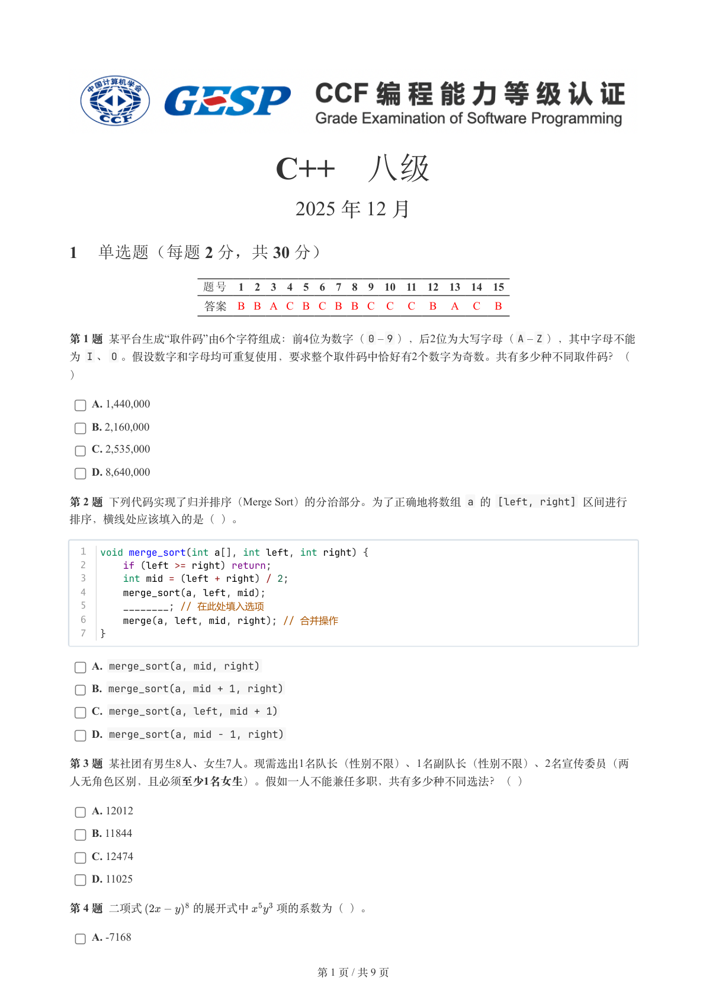
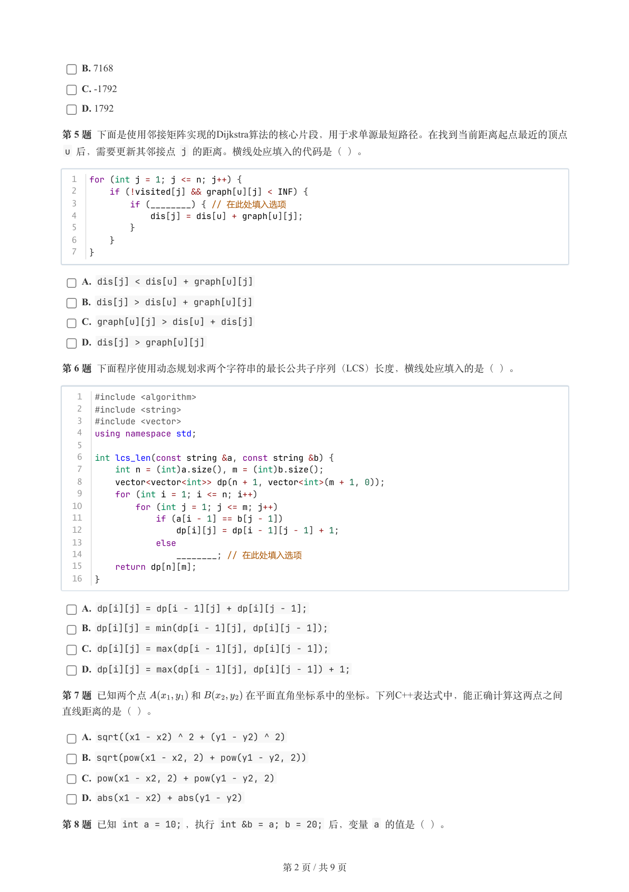
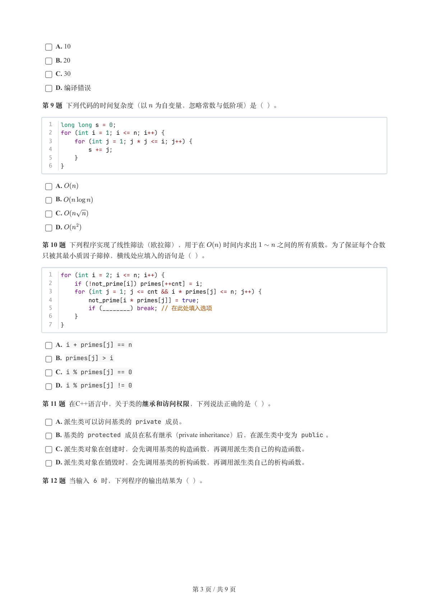
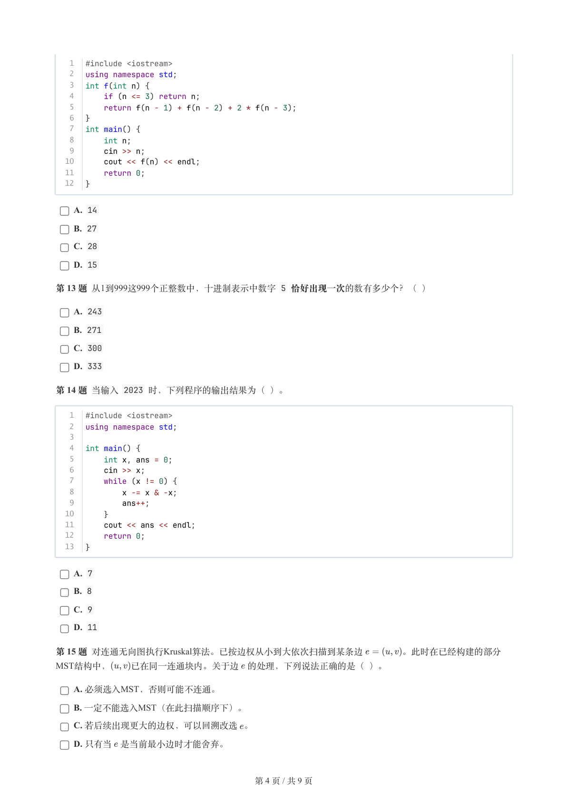
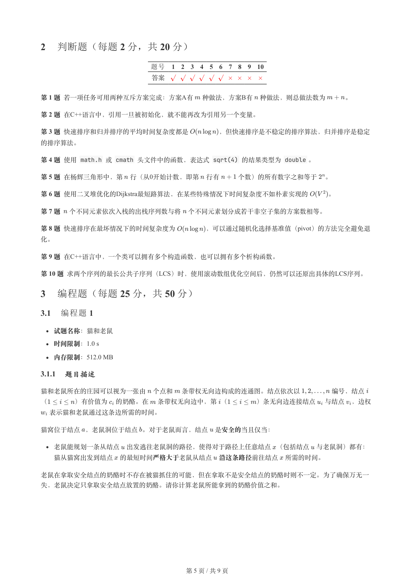
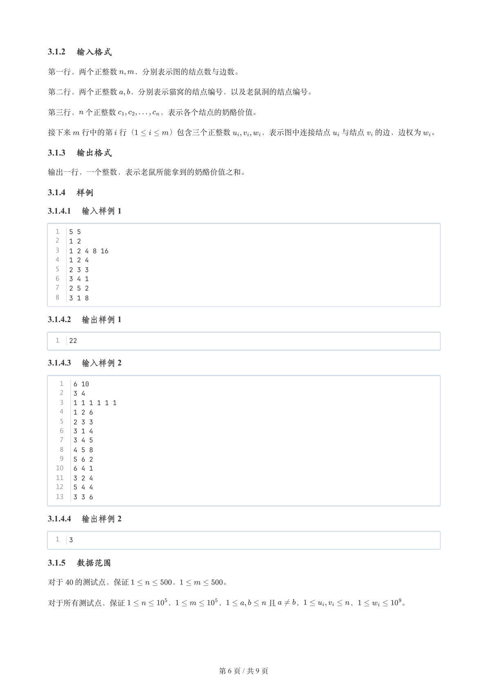
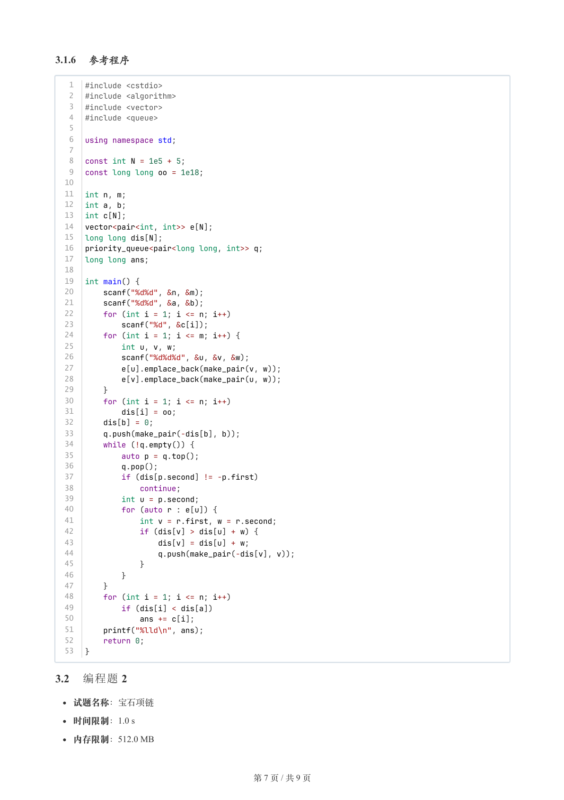
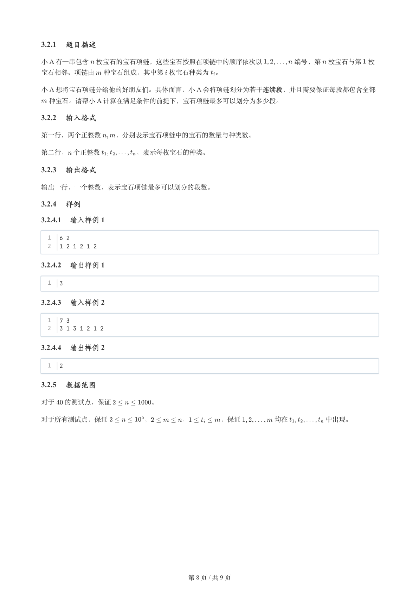
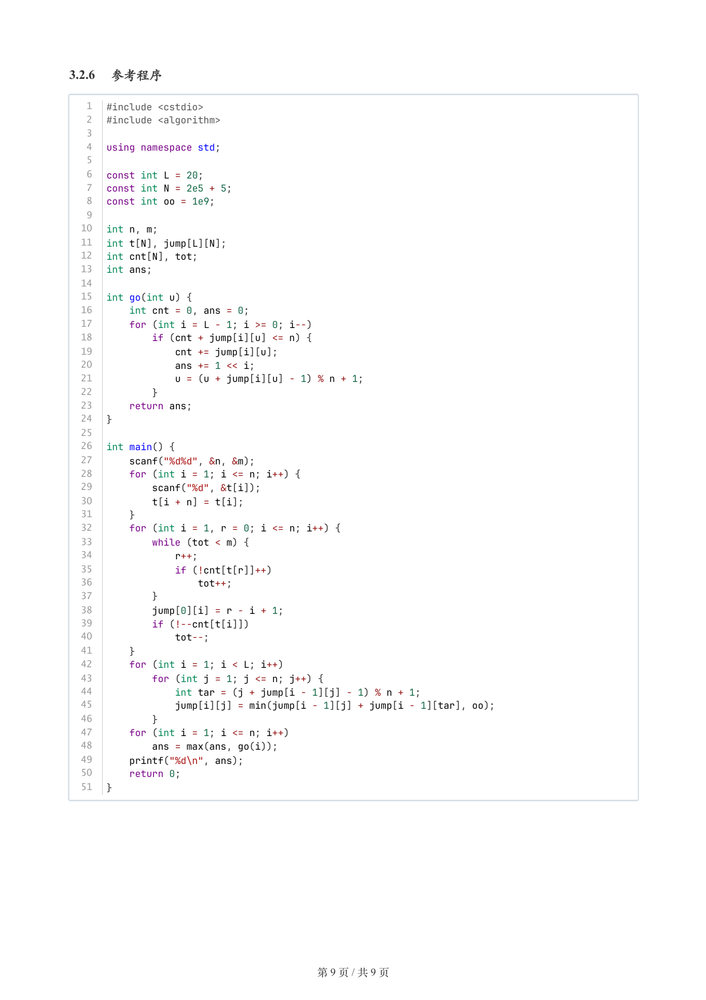

# 2025年12月-C++8级

- 原始 PDF：[`pdfs/2025年12月-C++8级.pdf`](../pdfs/2025年12月-C++8级.pdf)
- 页数：9
- 转换脚本：[`scripts/convert_pdfs_to_markdown.py`](../scripts/convert_pdfs_to_markdown.py)

> 为尽量避免信息丢失，每页均附带页面图片；文本提取结果保留原有顺序与换行特征，个别公式、图形、特殊排版请以页面图片为准。

## 第 1 页



### 提取文本

```
C++　八级

                      2025 年 12 月

1 单选题（每题 2 分，共 30 分）


           题号  1  2  3  4  5  6  7  8  9  10  11  12  13  14  15
            答案 B B A C B C B B C  C  C  B  A  C  B


第 1 题 某平台生成“取件码”由6个字符组成：前4位为数字（0 – 9 ），后2位为大写字母（A – Z ），其中字母不能
为 I 、O 。假设数字和字母均可重复使用，要求整个取件码中恰好有2个数字为奇数。共有多少种不同取件码？（

）

    A. 1,440,000

    B. 2,160,000

    C. 2,535,000

    D. 8,640,000

第 2 题 下列代码实现了归并排序（Merge Sort）的分治部分。为了正确地将数组 a 的 [left, right] 区间进行

排序，横线处应该填入的是（ ）。


  1  void merge_sort(int a[], int left, int right) {
  2      if (left >= right) return;
  3      int mid = (left + right) / 2;
  4      merge_sort(a, left, mid);
  5      ________; // 在此处填入选项
  6      merge(a, left, mid, right); // 合并操作
  7  }

    A. merge_sort(a, mid, right)

    B. merge_sort(a, mid + 1, right)

    C. merge_sort(a, left, mid + 1)

    D. merge_sort(a, mid - 1, right)

第 3 题 某社团有男生8人、女生7人。现需选出1名队长（性别不限）、1名副队长（性别不限）、2名宣传委员（两
人无角色区别，且必须至少1名女生）。假如一人不能兼任多职，共有多少种不同选法？（ ）

    A. 12012

    B. 11844

    C. 12474

    D. 11025

第 4 题 二项式     的展开式中  项的系数为（ ）。

    A. -7168


                       第 1 页 / 共 9 页
```

## 第 2 页



### 提取文本

```
B. 7168

    C. -1792

    D. 1792

第 5 题 下面是使用邻接矩阵实现的Dijkstra算法的核心片段，用于求单源最短路径。在找到当前距离起点最近的顶点
 u 后，需要更新其邻接点 j 的距离。横线处应填入的代码是（ ）。


  1  for (int j = 1; j <= n; j++) {
  2      if (!visited[j] && graph[u][j] < INF) {
  3          if (________) { // 在此处填入选项
  4              dis[j] = dis[u] + graph[u][j];
  5          }
  6      }
  7  }

    A. dis[j] < dis[u] + graph[u][j]

    B. dis[j] > dis[u] + graph[u][j]

    C. graph[u][j] > dis[u] + dis[j]

    D. dis[j] > graph[u][j]

第 6 题 下面程序使用动态规划求两个字符串的最长公共子序列（LCS）长度，横线处应填入的是（ ）。


   1  #include <algorithm>
   2  #include <string>
   3  #include <vector>
   4  using namespace std;
   5
   6  int lcs_len(const string &a, const string &b) {
   7      int n = (int)a.size(), m = (int)b.size();
   8      vector<vector<int>> dp(n + 1, vector<int>(m + 1, 0));
   9      for (int i = 1; i <= n; i++)
  10          for (int j = 1; j <= m; j++)
  11              if (a[i - 1] == b[j - 1])
  12                  dp[i][j] = dp[i - 1][j - 1] + 1;
  13              else
  14                  ________; // 在此处填入选项
  15      return dp[n][m];
  16  }

    A. dp[i][j] = dp[i - 1][j] + dp[i][j - 1];

    B. dp[i][j] = min(dp[i - 1][j], dp[i][j - 1]);

    C. dp[i][j] = max(dp[i - 1][j], dp[i][j - 1]);

    D. dp[i][j] = max(dp[i - 1][j], dp[i][j - 1]) + 1;

第 7 题 已知两个点    和     在平面直角坐标系中的坐标。下列C++表达式中，能正确计算这两点之间

直线距离的是（ ）。

    A. sqrt((x1 - x2) ^ 2 + (y1 - y2) ^ 2)

    B. sqrt(pow(x1 - x2, 2) + pow(y1 - y2, 2))

    C. pow(x1 - x2, 2) + pow(y1 - y2, 2)

    D. abs(x1 - x2) + abs(y1 - y2)

第 8 题 已知 int a = 10; ，执行 int &b = a; b = 20; 后，变量 a 的值是（ ）。


                       第 2 页 / 共 9 页
```

## 第 3 页



### 提取文本

```
A. 10

    B. 20

    C. 30

    D. 编译错误

第 9 题 下列代码的时间复杂度（以 为自变量，忽略常数与低阶项）是（ ）。


  1  long long s = 0;
  2  for (int i = 1; i <= n; i++) {
  3      for (int j = 1; j * j <= i; j++) {
  4          s += j;
  5      }
  6  }


    A.

    B.

    C.

    D.

第 10 题 下列程序实现了线性筛法（欧拉筛），用于在   时间内求出   之间的所有质数。为了保证每个合数

只被其最小质因子筛掉，横线处应填入的语句是（ ）。


  1  for (int i = 2; i <= n; i++) {
  2      if (!not_prime[i]) primes[++cnt] = i;
  3      for (int j = 1; j <= cnt && i * primes[j] <= n; j++) {
  4          not_prime[i * primes[j]] = true;
  5          if (________) break; // 在此处填入选项
  6      }
  7  }

    A. i + primes[j] == n

    B. primes[j] > i

    C. i % primes[j] == 0

    D. i % primes[j] != 0

第 11 题 在C++语言中，关于类的继承和访问权限，下列说法正确的是（ ）。

    A. 派生类可以访问基类的 private 成员。

    B. 基类的 protected 成员在私有继承（private inheritance）后，在派生类中变为 public 。

    C. 派生类对象在创建时，会先调用基类的构造函数，再调用派生类自己的构造函数。

    D. 派生类对象在销毁时，会先调用基类的析构函数，再调用派生类自己的析构函数。

第 12 题 当输入 6 时，下列程序的输出结果为（ ）。


                       第 3 页 / 共 9 页
```

## 第 4 页



### 提取文本

```
1  #include <iostream>
   2  using namespace std;
   3  int f(int n) {
   4      if (n <= 3) return n;
   5      return f(n - 1) + f(n - 2) + 2 * f(n - 3);
   6  }
   7  int main() {
   8      int n;
   9      cin >> n;
  10      cout << f(n) << endl;
  11      return 0;
  12  }

    A. 14

    B. 27

    C. 28

    D. 15

第 13 题 从1到999这999个正整数中，十进制表示中数字 5 恰好出现一次的数有多少个？（ ）

    A. 243

    B. 271

    C. 300

    D. 333

第 14 题 当输入 2023 时，下列程序的输出结果为（ ）。


   1  #include <iostream>
   2  using namespace std;
   3
   4  int main() {
   5      int x, ans = 0;
   6      cin >> x;
   7      while (x != 0) {
   8          x -= x & -x;
   9          ans++;
  10      }
  11      cout << ans << endl;
  12      return 0;
  13  }

    A. 7

    B. 8

    C. 9

    D. 11

第 15 题 对连通无向图执行Kruskal算法。已按边权从小到大依次扫描到某条边    。此时在已经构建的部分
MST结构中，  已在同一连通块内。关于边 的处理，下列说法正确的是（ ）。

    A. 必须选入MST，否则可能不连通。

    B. 一定不能选入MST（在此扫描顺序下）。

    C. 若后续出现更大的边权，可以回溯改选 。

    D. 只有当 是当前最小边时才能舍弃。


                       第 4 页 / 共 9 页
```

## 第 5 页



### 提取文本

```
2 判断题（每题 2 分，共 20 分）

                题号  1  2  3  4  5  6  7  8  9  10

                 答案


第 1 题 若一项任务可用两种互斥方案完成：方案A有 种做法，方案B有 种做法，则总做法数为   。

第 2 题 在C++语言中，引用一旦被初始化，就不能再改为引用另一个变量。

第 3 题 快速排序和归并排序的平均时间复杂度都是     ，但快速排序是不稳定的排序算法，归并排序是稳定

的排序算法。

第 4 题 使用 math.h 或 cmath 头文件中的函数，表达式 sqrt(4) 的结果类型为 double 。

第 5 题 在杨辉三角形中，第 行（从0开始计数，即第 行有   个数）的所有数字之和等于 。

第 6 题 使用二叉堆优化的Dijkstra最短路算法，在某些特殊情况下时间复杂度不如朴素实现的   。

第 7 题 个不同元素依次入栈的出栈序列数与将 个不同元素划分成若干非空子集的方案数相等。

第 8 题 快速排序在最坏情况下的时间复杂度为     ，可以通过随机化选择基准值（pivot）的方法完全避免退

化。

第 9 题 在C++语言中，一个类可以拥有多个构造函数，也可以拥有多个析构函数。

第 10 题 求两个序列的最长公共子序列（LCS）时，使用滚动数组优化空间后，仍然可以还原出具体的LCS序列。

3 编程题（每题 25 分，共 50 分）

3.1 编程题 1


  试题名称：猫和老鼠

   时间限制：1.0 s

   内存限制：512.0 MB

3.1.1 题目描述

猫和老鼠所在的庄园可以视为一张由 个点和 条带权无向边构成的连通图。结点依次以     编号，结点

（    ）有价值为 的奶酪。在 条带权无向边中，第 （    ）条无向边连接结点 与结点 ，边权

 表示猫和老鼠通过这条边所需的时间。


猫窝位于结点 ，老鼠洞位于结点 。对于老鼠而言，结点 是安全的当且仅当：


  老鼠能规划一条从结点 出发逃往老鼠洞的路径，使得对于路径上任意结点 （包括结点 与老鼠洞）都有：

  猫从猫窝出发到结点 的最短时间严格大于老鼠从结点 沿这条路径前往结点 所需的时间。


老鼠在拿取安全结点的奶酪时不存在被猫抓住的可能，但在拿取不是安全结点的奶酪时则不一定。为了确保万无一

失，老鼠决定只拿取安全结点放置的奶酪。请你计算老鼠所能拿到的奶酪价值之和。


                       第 5 页 / 共 9 页
```

## 第 6 页



### 提取文本

```
3.1.2 输入格式

第一行，两个正整数  ，分别表示图的结点数与边数。


第二行，两个正整数  ，分别表示猫窝的结点编号，以及老鼠洞的结点编号。


第三行， 个正整数      ，表示各个结点的奶酪价值。


接下来 行中的第 行（    ）包含三个正整数    ，表示图中连接结点 与结点 的边，边权为 。

3.1.3 输出格式

输出一行，一个整数，表示老鼠所能拿到的奶酪价值之和。

3.1.4 样例

3.1.4.1 输入样例 1

  1  5 5
  2  1 2
  3  1 2 4 8 16
  4  1 2 4
  5  2 3 3
  6  3 4 1
  7  2 5 2
  8  3 1 8

3.1.4.2 输出样例 1

  1  22

3.1.4.3 输入样例 2

   1  6 10
   2  3 4
   3  1 1 1 1 1 1
   4  1 2 6
   5  2 3 3
   6  3 1 4
   7  3 4 5
   8  4 5 8
   9  5 6 2
  10  6 4 1
  11  3 2 4
  12  5 4 4
  13  3 3 6

3.1.4.4 输出样例 2

  1  3

3.1.5 数据范围

对于  的测试点，保证      ，      。


对于所有测试点，保证      ，      ，     且   ，      ，      。


                       第 6 页 / 共 9 页
```

## 第 7 页



### 提取文本

```
3.1.6 参考程序

   1  #include <cstdio>
   2  #include <algorithm>
   3  #include <vector>
   4  #include <queue>
   5
   6  using namespace std;
   7
   8  const int N = 1e5 + 5;
   9  const long long oo = 1e18;
  10
  11  int n, m;
  12  int a, b;
  13  int c[N];
  14  vector<pair<int, int>> e[N];
  15  long long dis[N];
  16  priority_queue<pair<long long, int>> q;
  17  long long ans;
  18
  19  int main() {
  20      scanf("%d%d", &n, &m);
  21      scanf("%d%d", &a, &b);
  22      for (int i = 1; i <= n; i++)
  23          scanf("%d", &c[i]);
  24      for (int i = 1; i <= m; i++) {
  25          int u, v, w;
  26          scanf("%d%d%d", &u, &v, &w);
  27          e[u].emplace_back(make_pair(v, w));
  28          e[v].emplace_back(make_pair(u, w));
  29      }
  30      for (int i = 1; i <= n; i++)
  31          dis[i] = oo;
  32      dis[b] = 0;
  33      q.push(make_pair(-dis[b], b));
  34      while (!q.empty()) {
  35          auto p = q.top();
  36          q.pop();
  37          if (dis[p.second] != -p.first)
  38              continue;
  39          int u = p.second;
  40          for (auto r : e[u]) {
  41              int v = r.first, w = r.second;
  42              if (dis[v] > dis[u] + w) {
  43                  dis[v] = dis[u] + w;
  44                  q.push(make_pair(-dis[v], v));
  45              }
  46          }
  47      }
  48      for (int i = 1; i <= n; i++)
  49          if (dis[i] < dis[a])
  50              ans += c[i];
  51      printf("%lld\n", ans);
  52      return 0;
  53  }

3.2 编程题 2

  试题名称：宝石项链

   时间限制：1.0 s

   内存限制：512.0 MB


                       第 7 页 / 共 9 页
```

## 第 8 页



### 提取文本

```
3.2.1 题目描述

小 A 有一串包含 枚宝石的宝石项链，这些宝石按照在项链中的顺序依次以     编号，第 枚宝石与第 枚

宝石相邻。项链由 种宝石组成，其中第 枚宝石种类为 。

小 A 想将宝石项链分给他的好朋友们。具体而言，小 A 会将项链划分为若干连续段，并且需要保证每段都包含全部
 种宝石。请帮小 A 计算在满足条件的前提下，宝石项链最多可以划分为多少段。

3.2.2 输入格式

第一行，两个正整数  ，分别表示宝石项链中的宝石的数量与种类数。


第二行， 个正整数     ，表示每枚宝石的种类。

3.2.3 输出格式

输出一行，一个整数，表示宝石项链最多可以划分的段数。

3.2.4 样例

3.2.4.1 输入样例 1

  1  6 2
  2  1 2 1 2 1 2

3.2.4.2 输出样例 1

  1  3

3.2.4.3 输入样例 2

  1  7 3
  2  3 1 3 1 2 1 2

3.2.4.4 输出样例 2

  1  2

3.2.5 数据范围

对于  的测试点，保证      。


对于所有测试点，保证      ，     ，     ，保证     均在      中出现。


                       第 8 页 / 共 9 页
```

## 第 9 页



### 提取文本

```
3.2.6 参考程序

   1  #include <cstdio>
   2  #include <algorithm>
   3
   4  using namespace std;
   5
   6  const int L = 20;
   7  const int N = 2e5 + 5;
   8  const int oo = 1e9;
   9
  10  int n, m;
  11  int t[N], jump[L][N];
  12  int cnt[N], tot;
  13  int ans;
  14
  15  int go(int u) {
  16      int cnt = 0, ans = 0;
  17      for (int i = L - 1; i >= 0; i--)
  18          if (cnt + jump[i][u] <= n) {
  19              cnt += jump[i][u];
  20              ans += 1 << i;
  21              u = (u + jump[i][u] - 1) % n + 1;
  22          }
  23      return ans;
  24  }
  25
  26  int main() {
  27      scanf("%d%d", &n, &m);
  28      for (int i = 1; i <= n; i++) {
  29          scanf("%d", &t[i]);
  30          t[i + n] = t[i];
  31      }
  32      for (int i = 1, r = 0; i <= n; i++) {
  33          while (tot < m) {
  34              r++;
  35              if (!cnt[t[r]]++)
  36                  tot++;
  37          }
  38          jump[0][i] = r - i + 1;
  39          if (!--cnt[t[i]])
  40              tot--;
  41      }
  42      for (int i = 1; i < L; i++)
  43          for (int j = 1; j <= n; j++) {
  44              int tar = (j + jump[i - 1][j] - 1) % n + 1;
  45              jump[i][j] = min(jump[i - 1][j] + jump[i - 1][tar], oo);
  46          }
  47      for (int i = 1; i <= n; i++)
  48          ans = max(ans, go(i));
  49      printf("%d\n", ans);
  50      return 0;
  51  }


                       第 9 页 / 共 9 页
```
