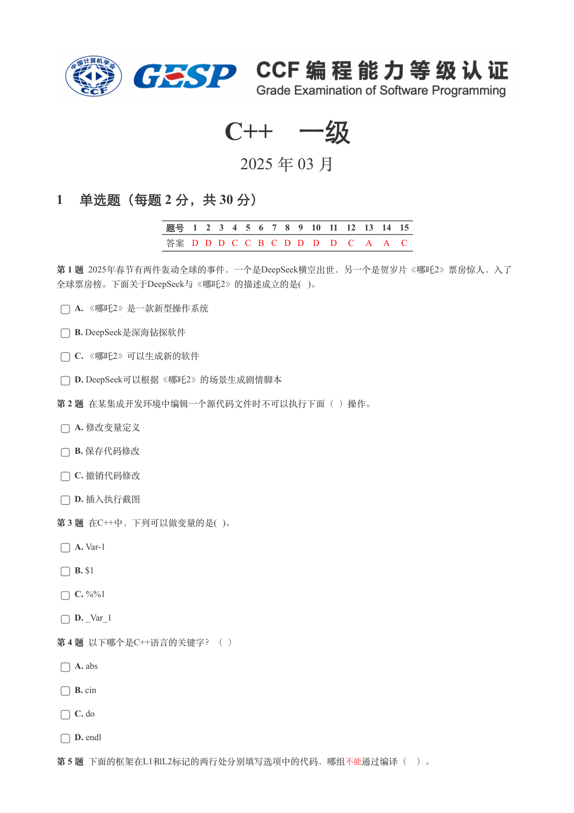
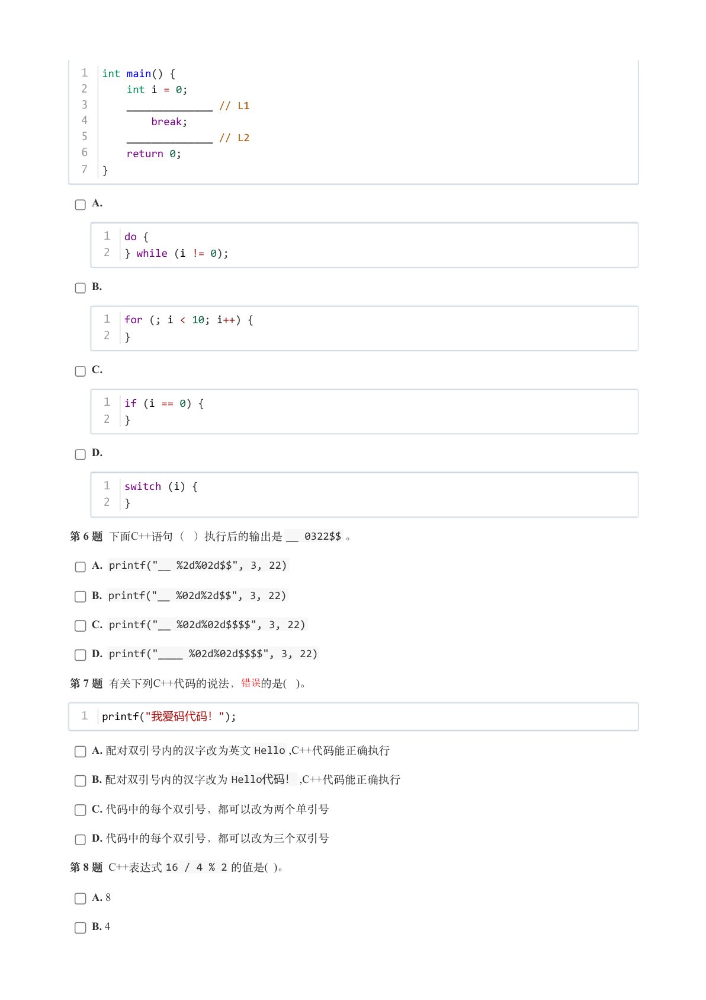
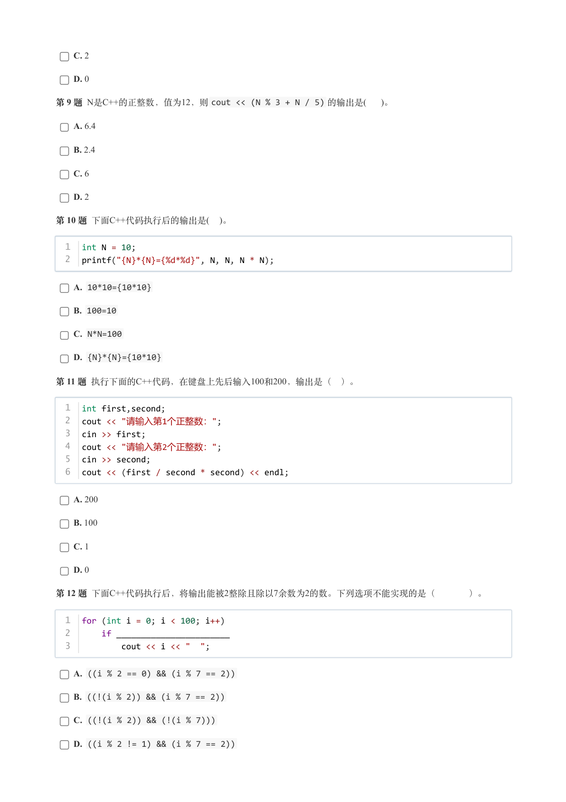
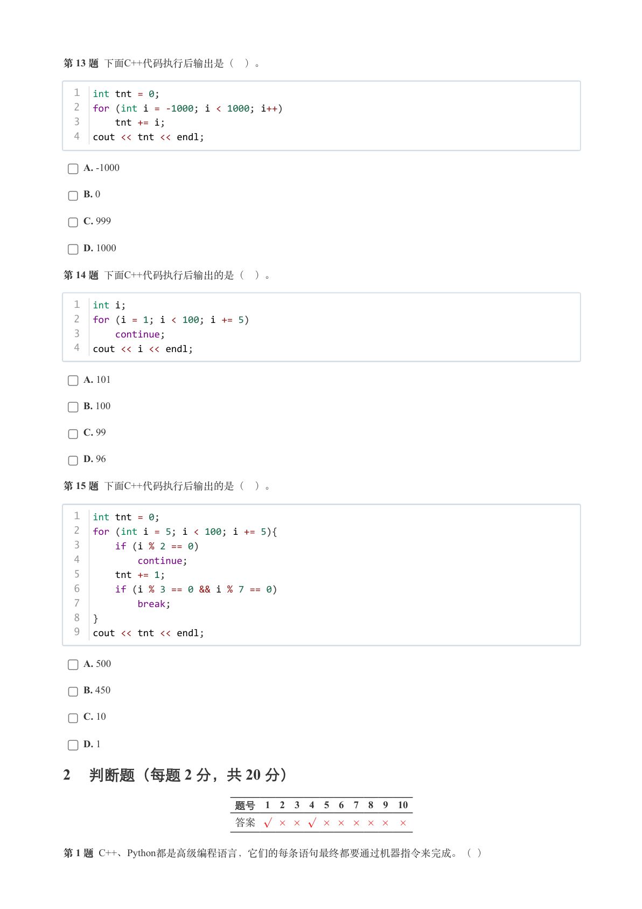
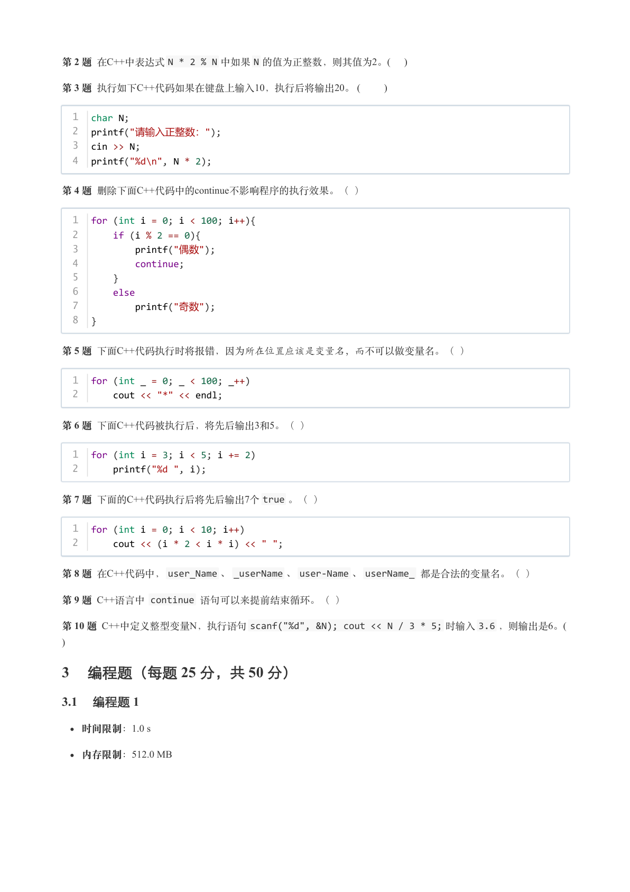
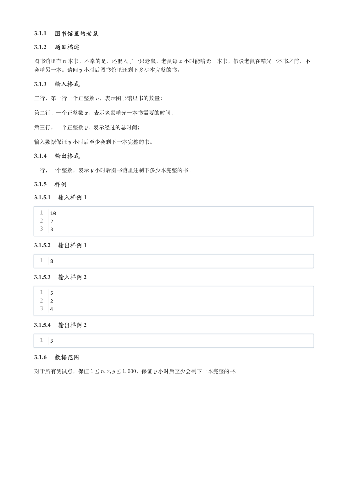
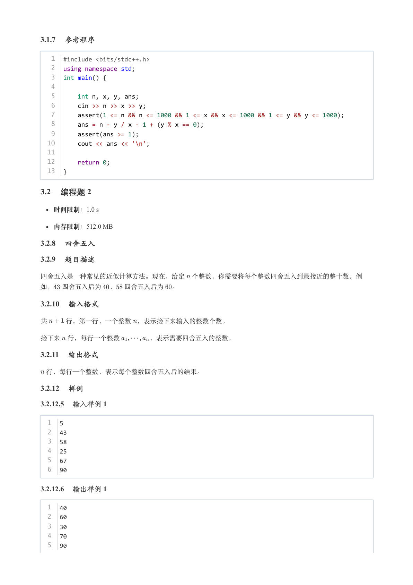
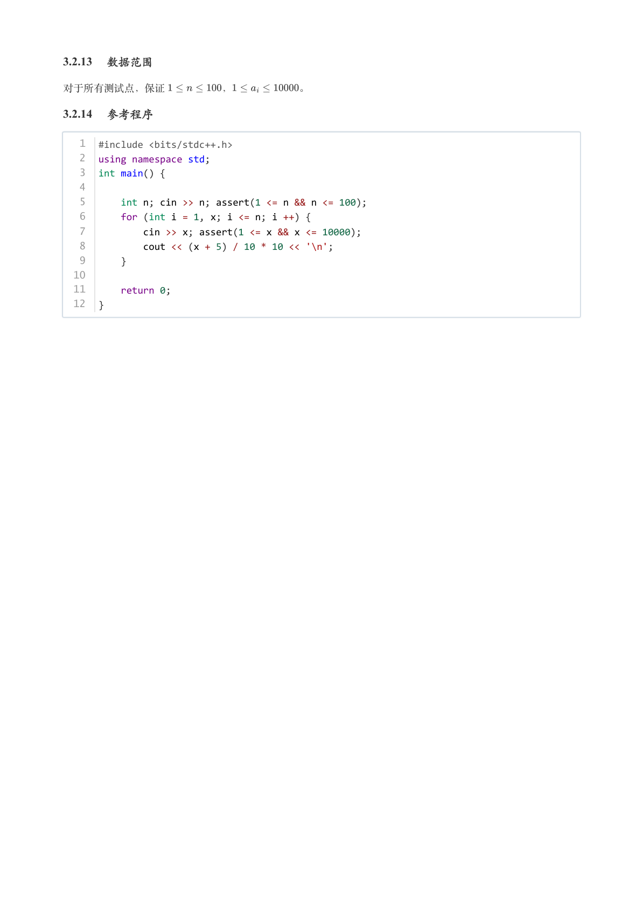

# 2025年3月-C++1级

- 原始 PDF：[`pdfs/2025年3月-C++1级.pdf`](../pdfs/2025年3月-C++1级.pdf)
- 页数：8
- 转换脚本：[`scripts/convert_pdfs_to_markdown.py`](../scripts/convert_pdfs_to_markdown.py)

> 为尽量避免信息丢失，每页均附带页面图片；文本提取结果保留原有顺序与换行特征，个别公式、图形、特殊排版请以页面图片为准。

## 第 1 页



### 提取文本

```
C++　一级

                      2025 年 03 月

1 单选题（每题 2 分，共 30 分）


            题号  1  2  3  4  5  6  7  8  9  10  11  12  13  14  15
            答案 D D D C C B C D D D  D  C  A  A  C


第 1 题 2025年春节有两件轰动全球的事件，一个是DeepSeek横空出世，另一个是贺岁片《哪吒2》票房惊人，入了
全球票房榜。下面关于DeepSeek与《哪吒2》的描述成立的是( )。

    A. 《哪吒2》是一款新型操作系统

    B. DeepSeek是深海钻探软件

    C. 《哪吒2》可以生成新的软件

    D. DeepSeek可以根据《哪吒2》的场景生成剧情脚本

第 2 题 在某集成开发环境中编辑一个源代码文件时不可以执行下面（ ）操作。

    A. 修改变量定义

    B. 保存代码修改

    C. 撤销代码修改

    D. 插入执行截图

第 3 题 在C++中，下列可以做变量的是( )。

    A. Var-1

    B. $1

    C. %%1

    D. _Var_1

第 4 题 以下哪个是C++语言的关键字？（ ）

    A. abs

    B. cin

    C. do

    D. endl

第 5 题 下面的框架在L1和L2标记的两行处分别填写选项中的代码，哪组 不能通过编译（ ）。
```

## 第 2 页



### 提取文本

```
1  int main() {
  2      int i = 0;
  3      ______________ // L1
  4          break;
  5      ______________ // L2
  6      return 0;
  7  }


    A.


     1  do {
     2  } while (i != 0);


    B.


     1  for (; i < 10; i++) {
     2  }


    C.


     1  if (i == 0) {
     2  }


    D.


     1  switch (i) {
     2  }

第 6 题 下面C++语句（ ）执行后的输出是__ 0322$$ 。

    A. printf("__ %2d%02d$$", 3, 22)

    B. printf("__ %02d%2d$$", 3, 22)

    C. printf("__ %02d%02d$$$$", 3, 22)

    D. printf("____ %02d%02d$$$$", 3, 22)

第 7 题 有关下列C++代码的说法， 错误的是( )。

  1  printf("我爱码代码！");


    A. 配对双引号内的汉字改为英文Hello ,C++代码能正确执行

    B. 配对双引号内的汉字改为Hello代码！,C++代码能正确执行

    C. 代码中的每个双引号，都可以改为两个单引号

    D. 代码中的每个双引号，都可以改为三个双引号

第 8 题 C++表达式16 / 4 % 2 的值是( )。

    A. 8

    B. 4
```

## 第 3 页



### 提取文本

```
C. 2

    D. 0

第 9 题 N是C++的正整数，值为12，则cout << (N % 3 + N / 5) 的输出是(  )。

    A. 6.4

    B. 2.4

    C. 6

    D. 2

第 10 题 下面C++代码执行后的输出是(  )。


  1  int N = 10;
  2  printf("{N}*{N}={%d*%d}", N, N, N * N);


    A. 10*10={10*10}

    B. 100=10

    C. N*N=100

    D. {N}*{N}={10*10}

第 11 题 执行下面的C++代码，在键盘上先后输入100和200，输出是（ ）。


  1  int first,second;
  2  cout << "请输入第1个正整数：";
  3  cin >> first;
  4  cout << "请输入第2个正整数：";
  5  cin >> second;
  6  cout << (first / second * second) << endl;


    A. 200

    B. 100

    C. 1

    D. 0

第 12 题 下面C++代码执行后，将输出能被2整除且除以7余数为2的数。下列选项不能实现的是（    ）。


  1  for (int i = 0; i < 100; i++)
  2      if _______________________
  3          cout << i << "  ";


    A. ((i % 2 == 0) && (i % 7 == 2))

    B. ((!(i % 2)) && (i % 7 == 2))

    C. ((!(i % 2)) && (!(i % 7)))

    D. ((i % 2 != 1) && (i % 7 == 2))
```

## 第 4 页



### 提取文本

```
第 13 题 下面C++代码执行后输出是（ ）。


  1  int tnt = 0;
  2  for (int i = -1000; i < 1000; i++)
  3      tnt += i;
  4  cout << tnt << endl;


    A. -1000

    B. 0

    C. 999

    D. 1000

第 14 题 下面C++代码执行后输出的是（ ）。


  1  int i;
  2  for (i = 1; i < 100; i += 5)
  3      continue;
  4  cout << i << endl;


    A. 101

    B. 100

    C. 99

    D. 96

第 15 题 下面C++代码执行后输出的是（ ）。


  1  int tnt = 0;
  2  for (int i = 5; i < 100; i += 5){
  3      if (i % 2 == 0)
  4          continue;
  5      tnt += 1;
  6      if (i % 3 == 0 && i % 7 == 0)
  7          break;
  8  }
  9  cout << tnt << endl;


    A. 500

    B. 450

    C. 10

    D. 1

2 判断题（每题 2 分，共 20 分）

                 题号  1  2  3  4  5  6  7  8  9  10

                 答案


第 1 题 C++、Python都是高级编程语言，它们的每条语句最终都要通过机器指令来完成。（ ）
```

## 第 5 页



### 提取文本

```
第 2 题 在C++中表达式N * 2 % N 中如果N 的值为正整数，则其值为2。(    )

第 3 题 执行如下C++代码如果在键盘上输入10，执行后将输出20。 (       )


  1  char N;
  2  printf("请输入正整数：");
  3  cin >> N;
  4  printf("%d\n", N * 2);


第 4 题 删除下面C++代码中的continue不影响程序的执行效果。（ ）


  1  for (int i = 0; i < 100; i++){
  2      if (i % 2 == 0){
  3         printf("偶数");
  4          continue;
  5      }
  6      else
  7         printf("奇数");
  8  }


第 5 题 下面C++代码执行时将报错，因为所在位置应该是变量名，而不可以做变量名。（ ）


  1  for (int _ = 0; _ < 100; _++)
  2      cout << "*" << endl;


第 6 题 下面C++代码被执行后，将先后输出3和5。（ ）


  1  for (int i = 3; i < 5; i += 2)
  2      printf("%d ", i);


第 7 题 下面的C++代码执行后将先后输出7个true 。（ ）


  1  for (int i = 0; i < 10; i++)
  2      cout << (i * 2 < i * i) << " ";


第 8 题 在C++代码中，user_Name 、_userName 、user-Name 、userName_ 都是合法的变量名。（ ）

第 9 题 C++语言中 continue 语句可以来提前结束循环。（ ）

第 10 题 C++中定义整型变量N，执行语句scanf("%d", &N); cout << N / 3 * 5; 时输入3.6 ，则输出是6。(
)

3 编程题（每题 25 分，共 50 分）

3.1 编程题 1

   时间限制：1.0 s

   内存限制：512.0 MB
```

## 第 6 页



### 提取文本

```
3.1.1 图书馆里的老鼠

3.1.2 题目描述

图书馆里有 本书，不幸的是，还混入了一只老鼠，老鼠每 小时能啃光一本书，假设老鼠在啃光一本书之前，不

会啃另一本。请问 小时后图书馆里还剩下多少本完整的书。

3.1.3 输入格式

三行，第一行一个正整数 ，表示图书馆里书的数量；


第二行，一个正整数 ，表示老鼠啃光一本书需要的时间；


第三行，一个正整数 ，表示经过的总时间；


输入数据保证 小时后至少会剩下一本完整的书。

3.1.4 输出格式

一行，一个整数，表示 小时后图书馆里还剩下多少本完整的书。

3.1.5 样例

3.1.5.1 输入样例 1

  1  10
  2  2
  3  3

3.1.5.2 输出样例 1

  1  8

3.1.5.3 输入样例 2

  1  5
  2  2
  3  4

3.1.5.4 输出样例 2

  1  3

3.1.6 数据范围

对于所有测试点，保证         ，保证 小时后至少会剩下一本完整的书。
```

## 第 7 页



### 提取文本

```
3.1.7 参考程序

   1  #include <bits/stdc++.h>
   2  using namespace std;
   3  int main() {
   4
   5      int n, x, y, ans;
   6      cin >> n >> x >> y;
   7      assert(1 <= n && n <= 1000 && 1 <= x && x <= 1000 && 1 <= y && y <= 1000);
   8      ans = n - y / x - 1 + (y % x == 0);
   9      assert(ans >= 1);
  10      cout << ans << '\n';
  11
  12      return 0;
  13  }

3.2 编程题 2

   时间限制：1.0 s

   内存限制：512.0 MB

3.2.8 四舍五入

3.2.9 题目描述

四舍五入是一种常见的近似计算方法。现在，给定 个整数，你需要将每个整数四舍五入到最接近的整十数。例

如， 四舍五入后为 ， 四舍五入后为 。

3.2.10 输入格式

共   行，第一行，一个整数 ，表示接下来输入的整数个数。


接下来 行，每行一个整数     ，表示需要四舍五入的整数。

3.2.11 输出格式

 行，每行一个整数，表示每个整数四舍五入后的结果。

3.2.12 样例

3.2.12.5 输入样例 1

  1  5
  2  43
  3  58
  4  25
  5  67
  6  90

3.2.12.6 输出样例 1

  1  40
  2  60
  3  30
  4  70
  5  90
```

## 第 8 页



### 提取文本

```
3.2.13 数据范围

对于所有测试点，保证      ，       。

3.2.14 参考程序

   1  #include <bits/stdc++.h>
   2  using namespace std;
   3  int main() {
   4
   5      int n; cin >> n; assert(1 <= n && n <= 100);
   6      for (int i = 1, x; i <= n; i ++) {
   7          cin >> x; assert(1 <= x && x <= 10000);
   8          cout << (x + 5) / 10 * 10 << '\n';
   9      }
  10
  11      return 0;
  12  }
```
