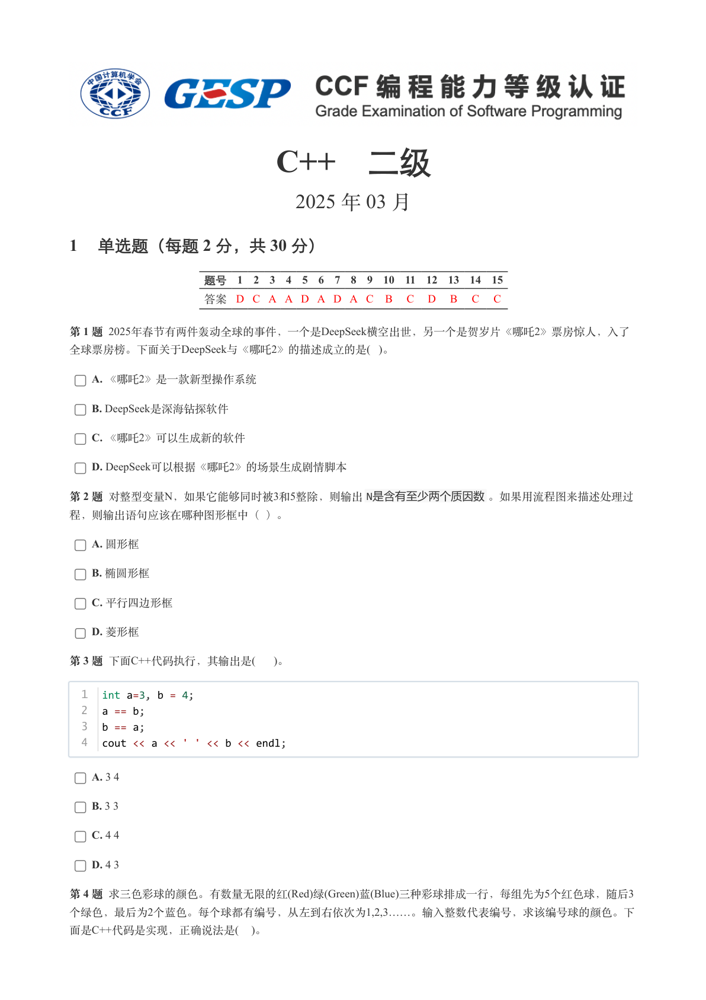
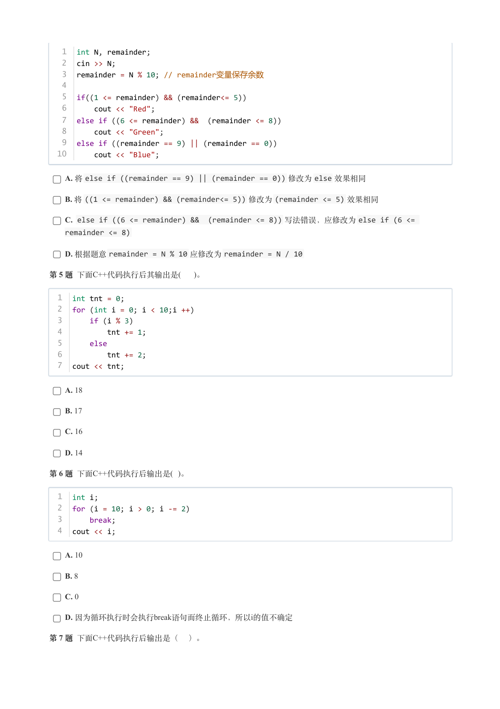
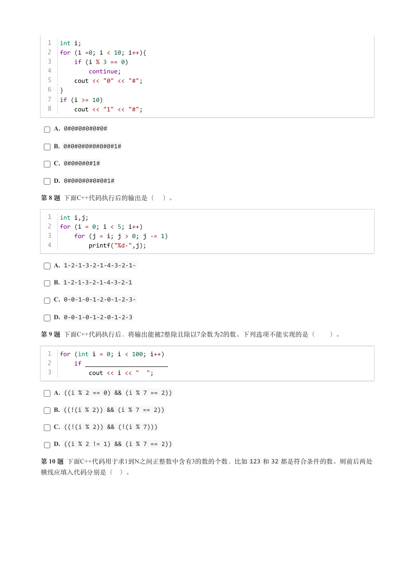
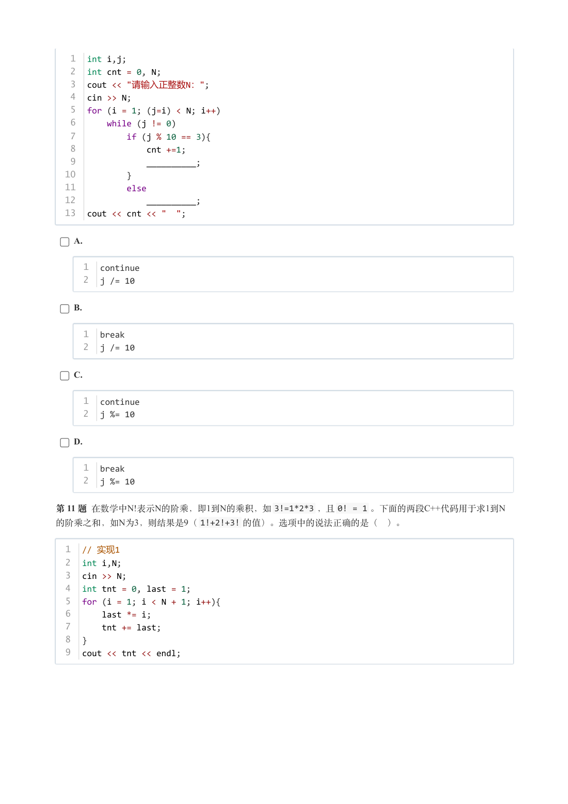
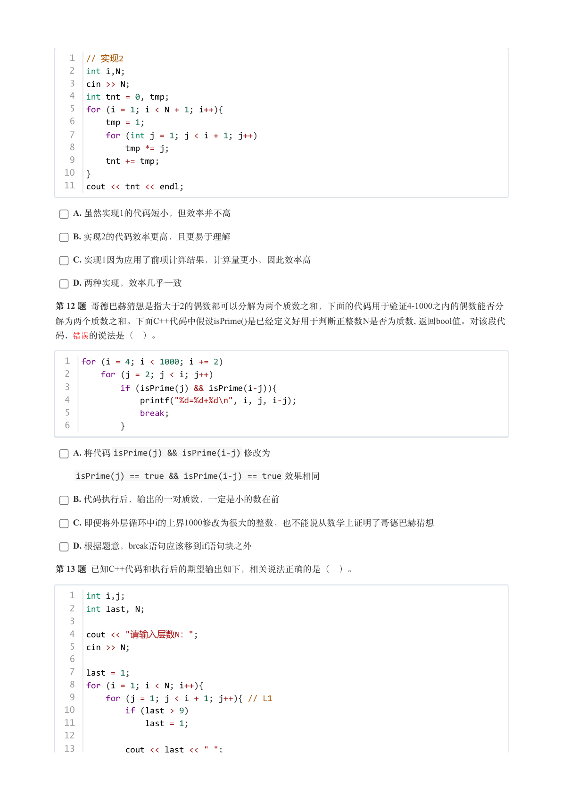
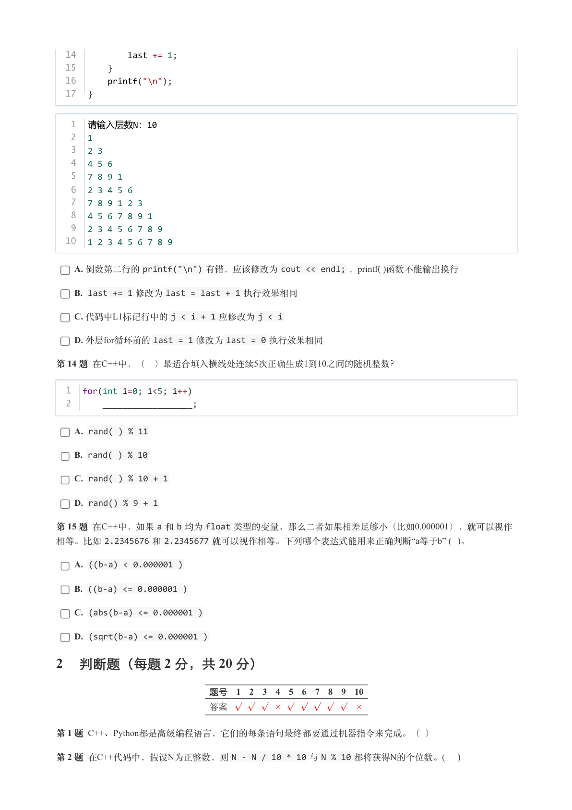
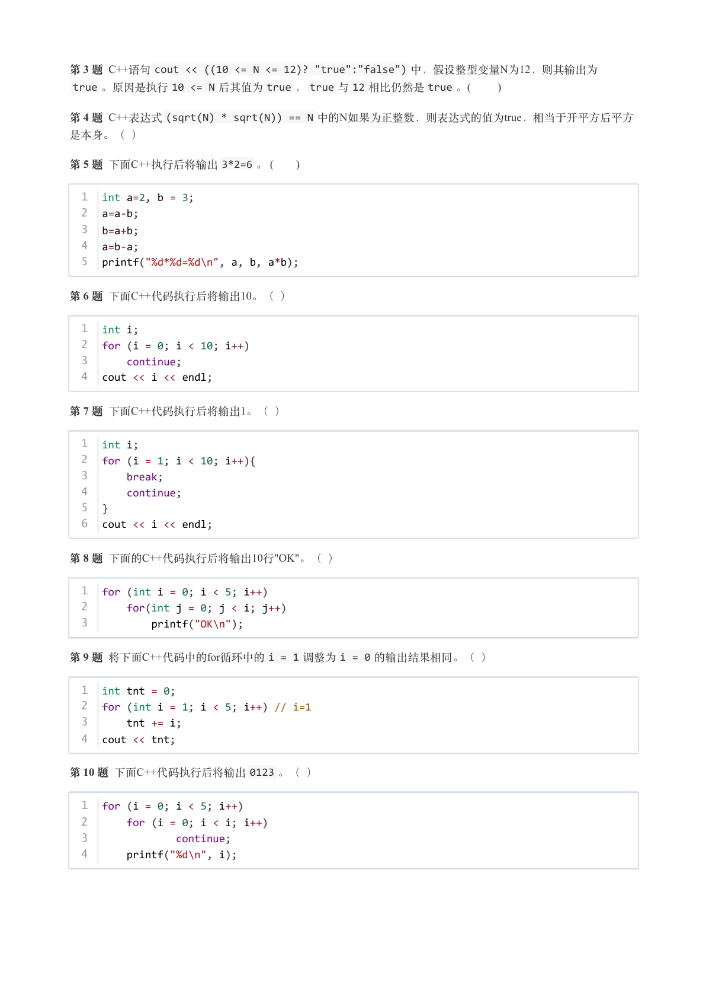
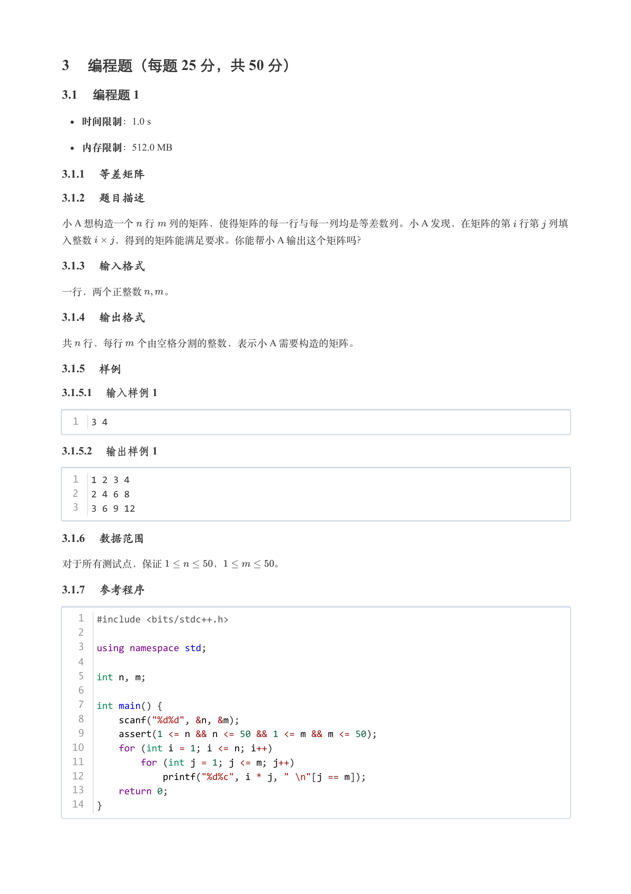
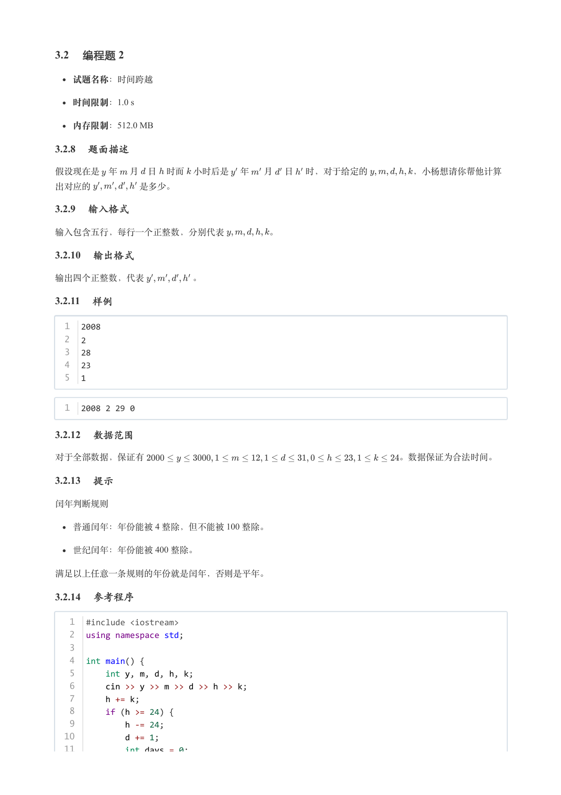
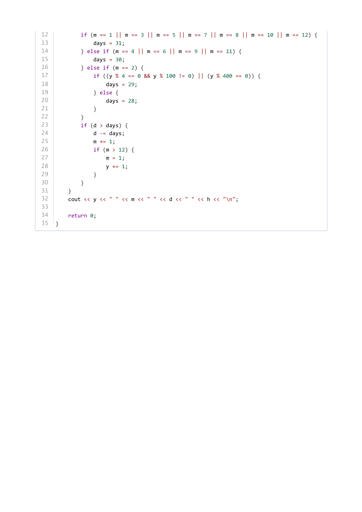

# 2025年3月-C++2级

- 原始 PDF：[`pdfs/2025年3月-C++2级.pdf`](../pdfs/2025年3月-C++2级.pdf)
- 页数：10
- 转换脚本：[`scripts/convert_pdfs_to_markdown.py`](../scripts/convert_pdfs_to_markdown.py)

> 为尽量避免信息丢失，每页均附带页面图片；文本提取结果保留原有顺序与换行特征，个别公式、图形、特殊排版请以页面图片为准。

## 第 1 页



### 提取文本

```
C++　二级

                      2025 年 03 月

1 单选题（每题 2 分，共 30 分）


            题号  1  2  3  4  5  6  7  8  9  10  11  12  13  14  15
            答案 D C A A D A D A C  B  C  D  B  C  C


第 1 题 2025年春节有两件轰动全球的事件，一个是DeepSeek横空出世，另一个是贺岁片《哪吒2》票房惊人，入了
全球票房榜。下面关于DeepSeek与《哪吒2》的描述成立的是( )。

    A. 《哪吒2》是一款新型操作系统

    B. DeepSeek是深海钻探软件

    C. 《哪吒2》可以生成新的软件

    D. DeepSeek可以根据《哪吒2》的场景生成剧情脚本

第 2 题 对整型变量N，如果它能够同时被3和5整除，则输出N是含有至少两个质因数。如果用流程图来描述处理过

程，则输出语句应该在哪种图形框中（ ）。

    A. 圆形框

    B. 椭圆形框

    C. 平行四边形框

    D. 菱形框

第 3 题 下面C++代码执行，其输出是(  )。


  1  int a=3, b = 4;
  2  a == b;
  3  b == a;
  4  cout << a << ' ' << b << endl;


    A. 3 4

    B. 3 3

    C. 4 4

    D. 4 3

第 4 题 求三色彩球的颜色。有数量无限的红(Red)绿(Green)蓝(Blue)三种彩球排成一行，每组先为5个红色球，随后3
个绿色，最后为2个蓝色。每个球都有编号，从左到右依次为1,2,3……。输入整数代表编号，求该编号球的颜色。下
面是C++代码是实现，正确说法是(  )。
```

## 第 2 页



### 提取文本

```
1  int N, remainder;
   2  cin >> N;
   3  remainder = N % 10; // remainder变量保存余数
   4
   5  if((1 <= remainder) && (remainder<= 5))
   6      cout << "Red";
   7  else if ((6 <= remainder) &&  (remainder <= 8))
   8      cout << "Green";
   9  else if ((remainder == 9) || (remainder == 0))
  10      cout << "Blue";


    A. 将else if ((remainder == 9) || (remainder == 0)) 修改为else 效果相同

    B. 将((1 <= remainder) && (remainder<= 5)) 修改为(remainder <= 5) 效果相同

    C. else if ((6 <= remainder) &&  (remainder <= 8)) 写法错误，应修改为else if (6 <=
    remainder <= 8)

    D. 根据题意remainder = N % 10 应修改为remainder = N / 10

第 5 题 下面C++代码执行后其输出是(  )。


  1  int tnt = 0;
  2  for (int i = 0; i < 10;i ++)
  3      if (i % 3)
  4          tnt += 1;
  5      else
  6          tnt += 2;
  7  cout << tnt;


    A. 18

    B. 17

    C. 16

    D. 14

第 6 题 下面C++代码执行后输出是( )。


  1  int i;
  2  for (i = 10; i > 0; i -= 2)
  3      break;
  4  cout << i;


    A. 10

    B. 8

    C. 0

    D. 因为循环执行时会执行break语句而终止循环，所以i的值不确定

第 7 题 下面C++代码执行后输出是（ ）。
```

## 第 3 页



### 提取文本

```
1  int i;
  2  for (i =0; i < 10; i++){
  3      if (i % 3 == 0)
  4          continue;
  5      cout << "0" << "#";
  6  }
  7  if (i >= 10)
  8      cout << "1" << "#";

    A. 0#0#0#0#0#0#

    B. 0#0#0#0#0#0#0#1#

    C. 0#0#0#0#1#

    D. 0#0#0#0#0#0#1#

第 8 题 下面C++代码执行后的输出是（ ）。


  1  int i,j;
  2  for (i = 0; i < 5; i++)
  3      for (j = i; j > 0; j -= 1)
  4          printf("%d-",j);


    A. 1-2-1-3-2-1-4-3-2-1-

    B. 1-2-1-3-2-1-4-3-2-1

    C. 0-0-1-0-1-2-0-1-2-3-

    D. 0-0-1-0-1-2-0-1-2-3

第 9 题 下面C++代码执行后，将输出能被2整除且除以7余数为2的数。下列选项不能实现的是（  ）。


  1  for (int i = 0; i < 100; i++)
  2      if _______________________
  3          cout << i << "  ";


    A. ((i % 2 == 0) && (i % 7 == 2))

    B. ((!(i % 2)) && (i % 7 == 2))

    C. ((!(i % 2)) && (!(i % 7)))

    D. ((i % 2 != 1) && (i % 7 == 2))

第 10 题 下面C++代码用于求1到N之间正整数中含有3的数的个数，比如123 和32 都是符合条件的数。则前后两处

横线应填入代码分别是（ ）。
```

## 第 4 页



### 提取文本

```
1  int i,j;
   2  int cnt = 0, N;
   3  cout << "请输入正整数N：";
   4  cin >> N;
   5  for (i = 1; (j=i) < N; i++)
   6      while (j != 0)
   7          if (j % 10 == 3){
   8              cnt +=1;
   9              __________;
  10          }
  11          else
  12              __________;
  13  cout << cnt << "  ";


    A.


     1  continue
     2  j /= 10


    B.


     1  break
     2  j /= 10


    C.


     1  continue
     2  j %= 10


    D.


     1  break
     2  j %= 10


第 11 题 在数学中N!表示N的阶乘，即1到N的乘积，如3!=1*2*3 ，且0! = 1 。下面的两段C++代码用于求1到N
的阶乘之和，如N为3，则结果是9（1!+2!+3! 的值）。选项中的说法正确的是（ ）。

  1  // 实现1
  2  int i,N;
  3  cin >> N;
  4  int tnt = 0, last = 1;
  5  for (i = 1; i < N + 1; i++){
  6      last *= i;
  7      tnt += last;
  8  }
  9  cout << tnt << endl;
```

## 第 5 页



### 提取文本

```
1  // 实现2
   2  int i,N;
   3  cin >> N;
   4  int tnt = 0, tmp;
   5  for (i = 1; i < N + 1; i++){
   6      tmp = 1;
   7      for (int j = 1; j < i + 1; j++)
   8          tmp *= j;
   9      tnt += tmp;
  10  }
  11  cout << tnt << endl;


    A. 虽然实现1的代码短小，但效率并不高

    B. 实现2的代码效率更高，且更易于理解

    C. 实现1因为应用了前项计算结果，计算量更小，因此效率高

    D. 两种实现，效率几乎一致

第 12 题 哥德巴赫猜想是指大于2的偶数都可以分解为两个质数之和，下面的代码用于验证4-1000之内的偶数能否分
解为两个质数之和。下面C++代码中假设isPrime()是已经定义好用于判断正整数N是否为质数, 返回bool值。对该段代

码，错误 的说法是（ ）。


  1  for (i = 4; i < 1000; i += 2)
  2      for (j = 2; j < i; j++)
  3          if (isPrime(j) && isPrime(i-j)){
  4              printf("%d=%d+%d\n", i, j, i-j);
  5              break;
  6          }


    A. 将代码isPrime(j) && isPrime(i-j) 修改为

    isPrime(j) == true && isPrime(i-j) == true 效果相同

    B. 代码执行后，输出的一对质数，一定是小的数在前

    C. 即便将外层循环中i的上界1000修改为很大的整数，也不能说从数学上证明了哥德巴赫猜想

    D. 根据题意，break语句应该移到if语句块之外

第 13 题 已知C++代码和执行后的期望输出如下，相关说法正确的是（ ）。


   1  int i,j;
   2  int last, N;
   3
   4  cout << "请输入层数N：";
   5  cin >> N;
   6
   7  last = 1;
   8  for (i = 1; i < N; i++){
   9      for (j = 1; j < i + 1; j++){ // L1
  10          if (last > 9)
  11              last = 1;
  12
  13          cout << last << " ";
```

## 第 6 页



### 提取文本

```
14          last += 1;
  15      }
  16      printf("\n");
  17  }


   1 请输入层数N：10
   2  1
   3  2 3
   4  4 5 6
   5  7 8 9 1
   6  2 3 4 5 6
   7  7 8 9 1 2 3
   8  4 5 6 7 8 9 1
   9  2 3 4 5 6 7 8 9
  10  1 2 3 4 5 6 7 8 9


    A. 倒数第二行的printf("\n") 有错，应该修改为cout << endl; ，printf( )函数不能输出换行

    B. last += 1 修改为last = last + 1 执行效果相同

    C. 代码中L1标记行中的j < i + 1 应修改为j < i

    D. 外层for循环前的last = 1 修改为last = 0 执行效果相同

第 14 题 在C++中，（ ）最适合填入横线处连续5次正确生成1到10之间的随机整数？


  1  for(int i=0; i<5; i++)
  2      __________________;


    A. rand( ) % 11

    B. rand( ) % 10

    C. rand( ) % 10 + 1

    D. rand() % 9 + 1

第 15 题 在C++中，如果a 和b 均为float 类型的变量，那么二者如果相差足够小（比如0.000001），就可以视作
相等。比如2.2345676 和2.2345677 就可以视作相等。下列哪个表达式能用来正确判断“a等于b” ( )。

    A. ((b-a) < 0.000001 )

    B. ((b-a) <= 0.000001 )

    C. (abs(b-a) <= 0.000001 )

    D. (sqrt(b-a) <= 0.000001 )

2 判断题（每题 2 分，共 20 分）


                 题号  1  2  3  4  5  6  7  8  9  10

                 答案


第 1 题 C++、Python都是高级编程语言，它们的每条语句最终都要通过机器指令来完成。（ ）

第 2 题 在C++代码中，假设N为正整数，则N - N / 10 * 10 与N % 10 都将获得N的个位数。(    )
```

## 第 7 页



### 提取文本

```
第 3 题 C++语句cout << ((10 <= N <= 12)? "true":"false") 中，假设整型变量N为12，则其输出为
 true 。原因是执行10 <= N 后其值为true ，true 与12 相比仍然是true 。(       )

第 4 题 C++表达式(sqrt(N) * sqrt(N)) == N 中的N如果为正整数，则表达式的值为true，相当于开平方后平方

是本身。（ ）

第 5 题 下面C++执行后将输出3*2=6 。 (      )


  1  int a=2, b = 3;
  2  a=a-b;
  3  b=a+b;
  4  a=b-a;
  5  printf("%d*%d=%d\n", a, b, a*b);


第 6 题 下面C++代码执行后将输出10。（ ）


  1  int i;
  2  for (i = 0; i < 10; i++)
  3      continue;
  4  cout << i << endl;


第 7 题 下面C++代码执行后将输出1。（ ）


  1  int i;
  2  for (i = 1; i < 10; i++){
  3      break;
  4      continue;
  5  }
  6  cout << i << endl;


第 8 题 下面的C++代码执行后将输出10行"OK"。（ ）


  1  for (int i = 0; i < 5; i++)
  2      for(int j = 0; j < i; j++)
  3          printf("OK\n");


第 9 题 将下面C++代码中的for循环中的i = 1 调整为i = 0 的输出结果相同。（ ）


  1  int tnt = 0;
  2  for (int i = 1; i < 5; i++) // i=1
  3      tnt += i;
  4  cout << tnt;

第 10 题 下面C++代码执行后将输出0123 。（ ）


  1  for (i = 0; i < 5; i++)
  2      for (i = 0; i < i; i++)
  3              continue;
  4      printf("%d\n", i);
```

## 第 8 页



### 提取文本

```
3 编程题（每题 25 分，共 50 分）

3.1 编程题 1

   时间限制：1.0 s

   内存限制：512.0 MB

3.1.1 等差矩阵

3.1.2 题目描述

小 A 想构造一个 行 列的矩阵，使得矩阵的每一行与每一列均是等差数列。小 A 发现，在矩阵的第 行第 列填
入整数  ，得到的矩阵能满足要求。你能帮小 A 输出这个矩阵吗？

3.1.3 输入格式

一行，两个正整数  。

3.1.4 输出格式

共 行，每行 个由空格分割的整数，表示小 A 需要构造的矩阵。

3.1.5 样例

3.1.5.1 输入样例 1

  1  3 4

3.1.5.2 输出样例 1

  1  1 2 3 4
  2  2 4 6 8
  3  3 6 9 12

3.1.6 数据范围

对于所有测试点，保证     ，     。

3.1.7 参考程序

   1  #include <bits/stdc++.h>
   2
   3  using namespace std;
   4
   5  int n, m;
   6
   7  int main() {
   8      scanf("%d%d", &n, &m);
   9      assert(1 <= n && n <= 50 && 1 <= m && m <= 50);
  10      for (int i = 1; i <= n; i++)
  11          for (int j = 1; j <= m; j++)
  12              printf("%d%c", i * j, " \n"[j == m]);
  13      return 0;
  14  }
```

## 第 9 页



### 提取文本

```
3.2 编程题 2


  试题名称：时间跨越

   时间限制：1.0 s

   内存限制：512.0 MB

3.2.8 题面描述

假设现在是 年 月 日 时而 小时后是 年  月 日 时，对于给定的     ，小杨想请你帮他计算

出对应的     是多少。

3.2.9 输入格式

输入包含五行，每行一个正整数，分别代表     。

3.2.10 输出格式

输出四个正整数，代表     。

3.2.11 样例

  1  2008
  2  2
  3  28
  4  23
  5  1


  1  2008 2 29 0

3.2.12 数据范围

对于全部数据，保证有                             。数据保证为合法时间。

3.2.13 提示

闰年判断规则

  普通闰年：年份能被 4 整除，但不能被 100 整除。

  世纪闰年：年份能被 400 整除。


满足以上任意一条规则的年份就是闰年，否则是平年。

3.2.14 参考程序

   1  #include <iostream>
   2  using namespace std;
   3
   4  int main() {
   5      int y, m, d, h, k;
   6      cin >> y >> m >> d >> h >> k;
   7      h += k;
   8      if (h >= 24) {
   9          h -= 24;
  10          d += 1;
  11          int days = 0;
```

## 第 10 页



### 提取文本

```
12          if (m == 1 || m == 3 || m == 5 || m == 7 || m == 8 || m == 10 || m == 12) {
13              days = 31;
14          } else if (m == 4 || m == 6 || m == 9 || m == 11) {
15              days = 30;
16          } else if (m == 2) {
17              if ((y % 4 == 0 && y % 100 != 0) || (y % 400 == 0)) {
18                  days = 29;
19              } else {
20                  days = 28;
21              }
22          }
23          if (d > days) {
24              d -= days;
25              m += 1;
26              if (m > 12) {
27                  m = 1;
28                  y += 1;
29              }
30          }
31      }
32      cout << y << " " << m << " " << d << " " << h << "\n";
33
34      return 0;
35  }
```
