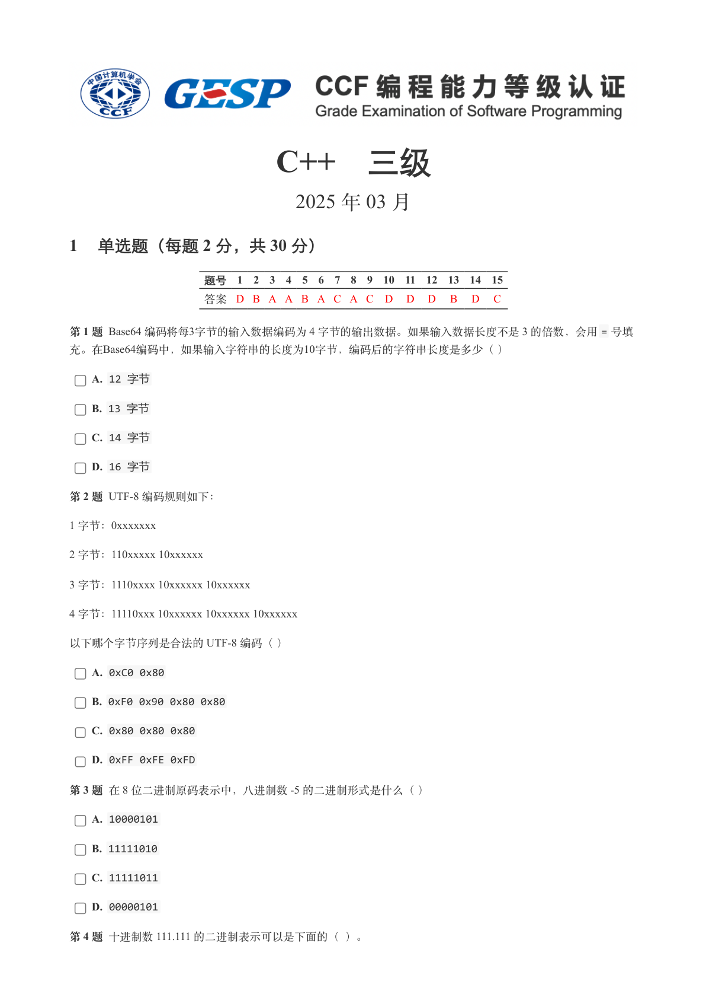
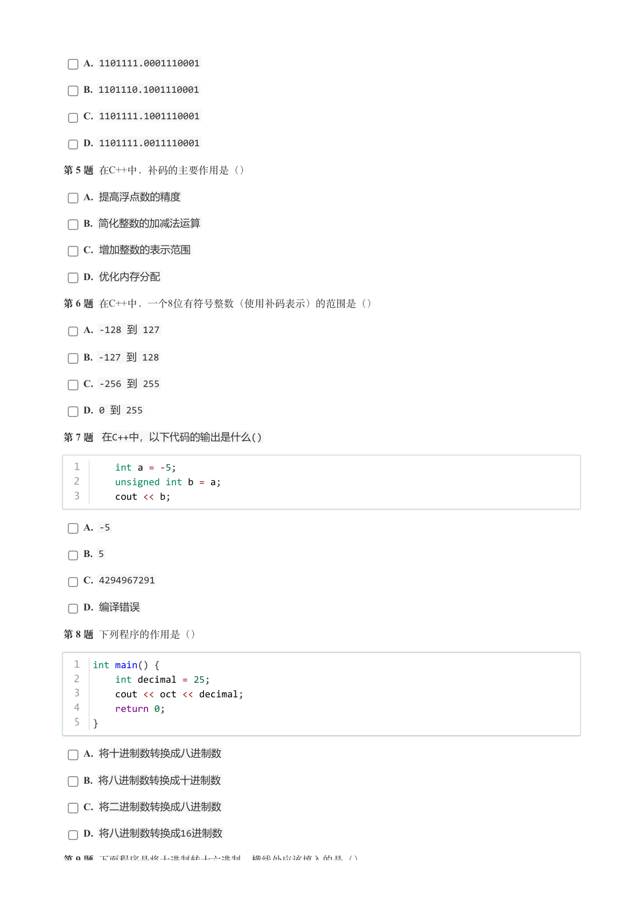
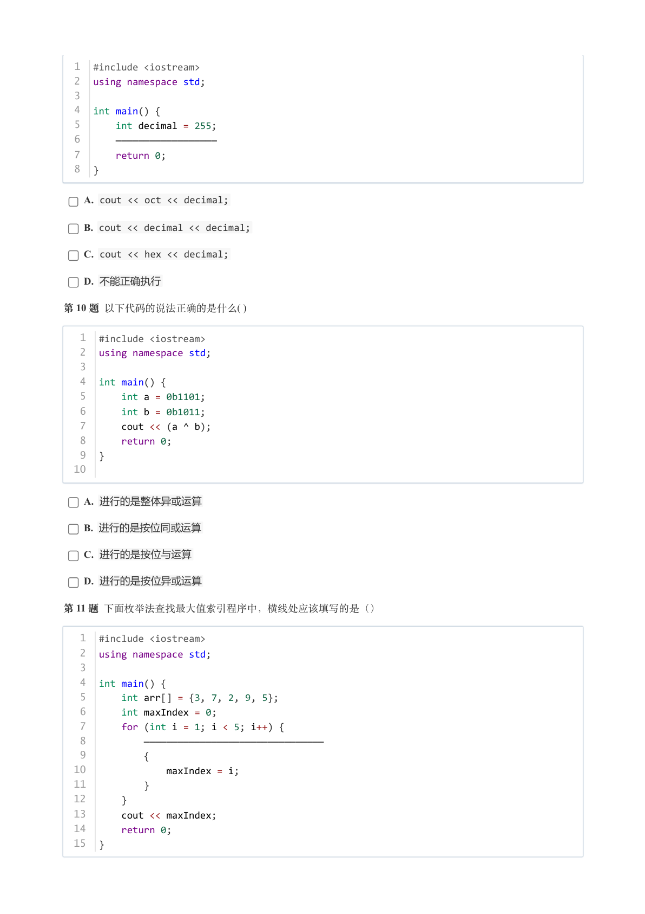
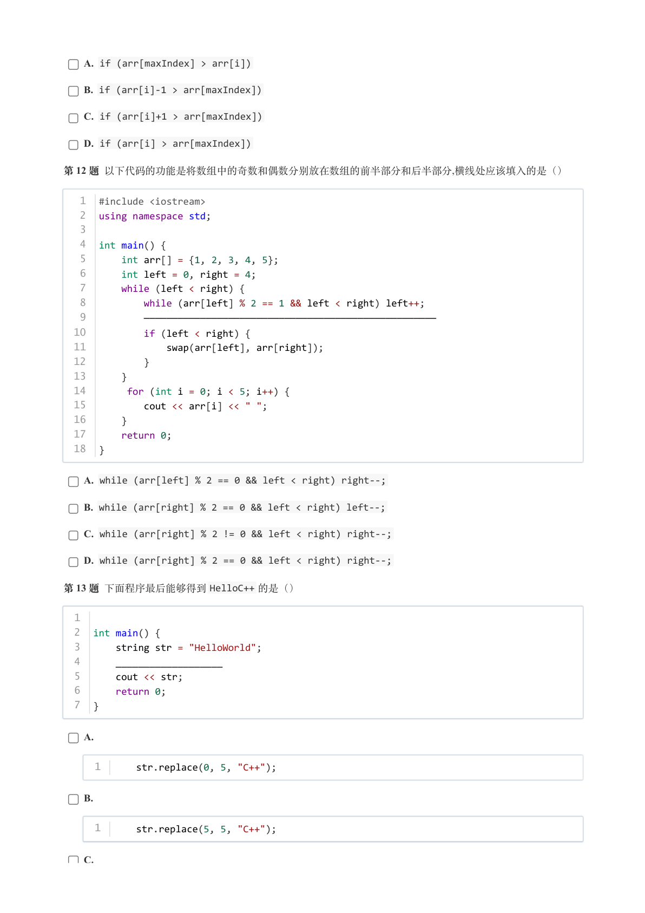
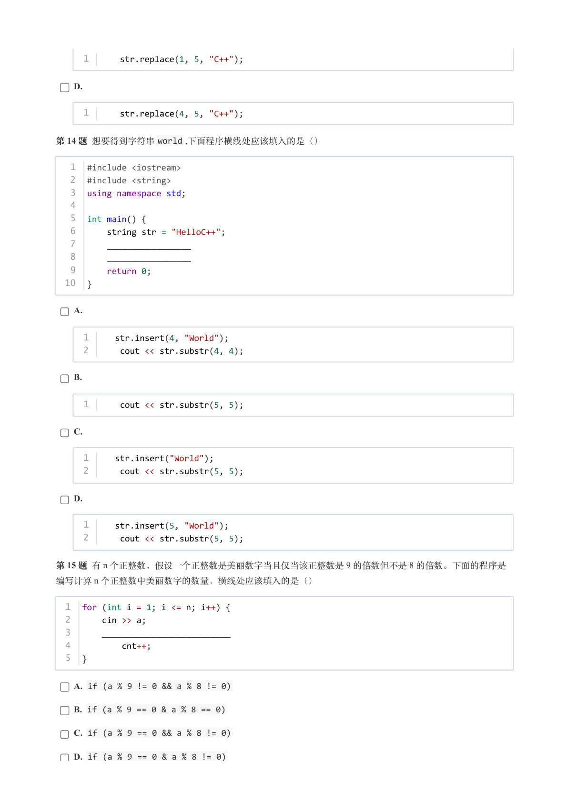
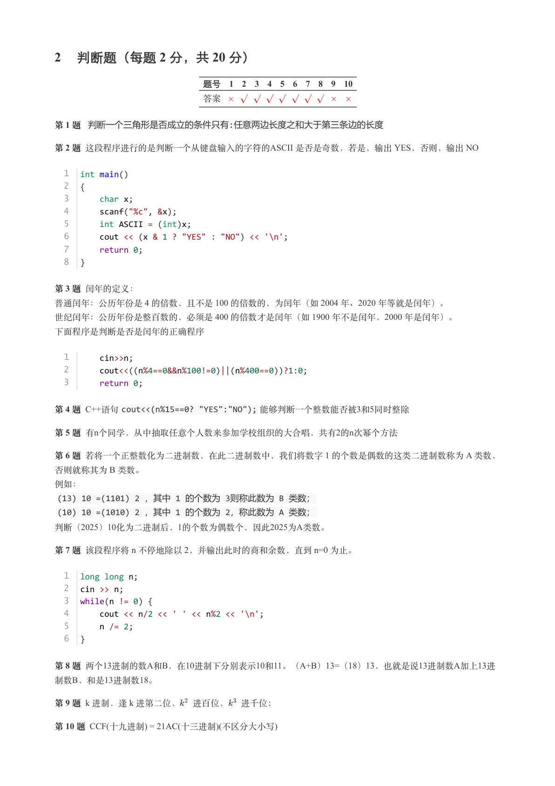
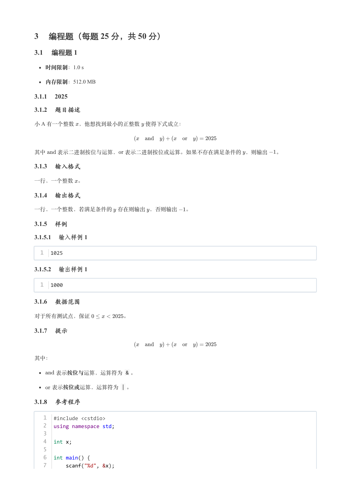
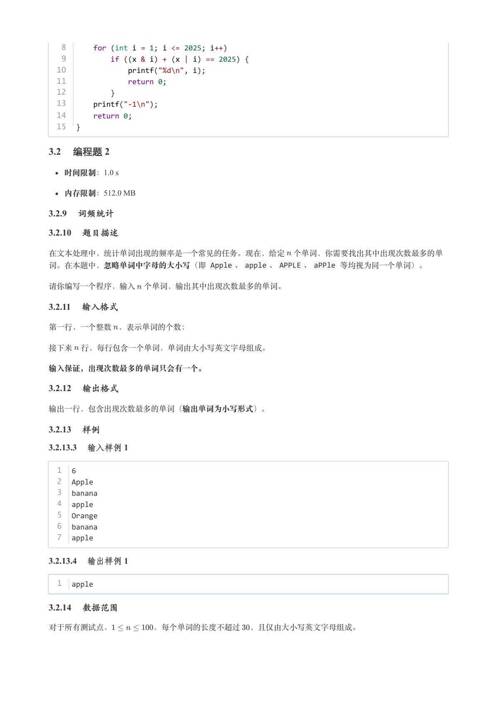
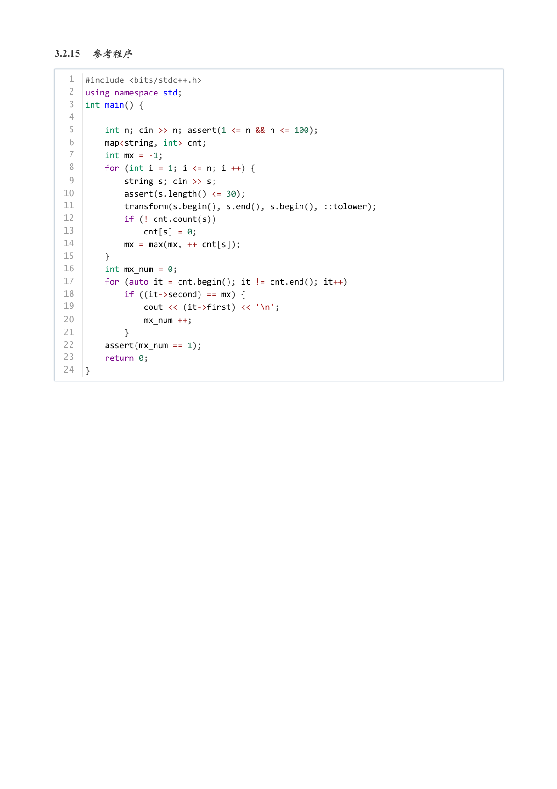

# 2025年3月-C++3级

- 原始 PDF：[`pdfs/2025年3月-C++3级.pdf`](../pdfs/2025年3月-C++3级.pdf)
- 页数：9
- 转换脚本：[`scripts/convert_pdfs_to_markdown.py`](../scripts/convert_pdfs_to_markdown.py)

> 为尽量避免信息丢失，每页均附带页面图片；文本提取结果保留原有顺序与换行特征，个别公式、图形、特殊排版请以页面图片为准。

## 第 1 页



### 提取文本

```
C++　三级

                      2025 年 03 月

1 单选题（每题 2 分，共 30 分）


            题号  1  2  3  4  5  6  7  8  9  10  11  12  13  14  15
            答案 D B A A B A C A C D  D  D  B  D  C


第 1 题 Base64 编码将每3字节的输入数据编码为 4 字节的输出数据。如果输入数据长度不是 3 的倍数，会用= 号填
充。在Base64编码中，如果输入字符串的长度为10字节，编码后的字符串长度是多少（ ）

    A. 12 字节

    B. 13 字节

    C. 14 字节

    D. 16 字节

第 2 题 UTF-8 编码规则如下：

1 字节：0xxxxxxx

2 字节：110xxxxx 10xxxxxx

3 字节：1110xxxx 10xxxxxx 10xxxxxx

4 字节：11110xxx 10xxxxxx 10xxxxxx 10xxxxxx

以下哪个字节序列是合法的 UTF-8 编码（ ）

    A. 0xC0 0x80

    B. 0xF0 0x90 0x80 0x80

    C. 0x80 0x80 0x80

    D. 0xFF 0xFE 0xFD

第 3 题 在 8 位二进制原码表示中，八进制数 -5 的二进制形式是什么（ ）

    A. 10000101

    B. 11111010

    C. 11111011

    D. 00000101

第 4 题 十进制数 111.111 的二进制表示可以是下面的（ ）。
```

## 第 2 页



### 提取文本

```
A. 1101111.0001110001

    B. 1101110.1001110001

    C. 1101111.1001110001

    D. 1101111.0011110001

第 5 题 在C++中，补码的主要作用是（）

    A. 提高浮点数的精度

    B. 简化整数的加减法运算

    C. 增加整数的表示范围

    D. 优化内存分配

第 6 题 在C++中，一个8位有符号整数（使用补码表示）的范围是（）

    A. -128 到 127

    B. -127 到 128

    C. -256 到 255

    D. 0 到 255

第 7 题 在C++中，以下代码的输出是什么()


  1      int a = -5;
  2      unsigned int b = a;
  3      cout << b;


    A. -5

    B. 5

    C. 4294967291

    D. 编译错误

第 8 题 下列程序的作用是（）


  1  int main() {
  2      int decimal = 25;
  3      cout << oct << decimal;
  4      return 0;
  5  }

    A. 将十进制数转换成八进制数

    B. 将八进制数转换成十进制数

    C. 将二进制数转换成八进制数

    D. 将八进制数转换成16进制数

第 9 题 下面程序是将十进制转十六进制，横线处应该填入的是（）
```

## 第 3 页



### 提取文本

```
1  #include <iostream>
  2  using namespace std;
  3
  4  int main() {
  5      int decimal = 255;
  6      ——————————————————
  7      return 0;
  8  }

    A. cout << oct << decimal;

    B. cout << decimal << decimal;

    C. cout << hex << decimal;

    D. 不能正确执行

第 10 题 以下代码的说法正确的是什么( )


   1  #include <iostream>
   2  using namespace std;
   3
   4  int main() {
   5      int a = 0b1101;
   6      int b = 0b1011;
   7      cout << (a ^ b);
   8      return 0;
   9  }
  10

    A. 进行的是整体异或运算

    B. 进行的是按位同或运算

    C. 进行的是按位与运算

    D. 进行的是按位异或运算

第 11 题 下面枚举法查找最大值索引程序中，横线处应该填写的是（）


   1  #include <iostream>
   2  using namespace std;
   3
   4  int main() {
   5      int arr[] = {3, 7, 2, 9, 5};
   6      int maxIndex = 0;
   7      for (int i = 1; i < 5; i++) {
   8          ————————————————————————————————
   9          {
  10              maxIndex = i;
  11          }
  12      }
  13      cout << maxIndex;
  14      return 0;
  15  }
```

## 第 4 页



### 提取文本

```
A. if (arr[maxIndex] > arr[i])

    B. if (arr[i]-1 > arr[maxIndex])

    C. if (arr[i]+1 > arr[maxIndex])

    D. if (arr[i] > arr[maxIndex])

第 12 题 以下代码的功能是将数组中的奇数和偶数分别放在数组的前半部分和后半部分,横线处应该填入的是（）


   1  #include <iostream>
   2  using namespace std;
   3
   4  int main() {
   5      int arr[] = {1, 2, 3, 4, 5};
   6      int left = 0, right = 4;
   7      while (left < right) {
   8          while (arr[left] % 2 == 1 && left < right) left++;
   9          ————————————————————————————————————————————————————
  10          if (left < right) {
  11              swap(arr[left], arr[right]);
  12          }
  13      }
  14       for (int i = 0; i < 5; i++) {
  15          cout << arr[i] << " ";
  16      }
  17      return 0;
  18  }


    A. while (arr[left] % 2 == 0 && left < right) right--;

    B. while (arr[right] % 2 == 0 && left < right) left--;

    C. while (arr[right] % 2 != 0 && left < right) right--;

    D. while (arr[right] % 2 == 0 && left < right) right--;

第 13 题 下面程序最后能够得到HelloC++ 的是（）


  1
  2  int main() {
  3      string str = "HelloWorld";
  4      ___________________
  5      cout << str;
  6      return 0;
  7  }


    A.


     1      str.replace(0, 5, "C++");


    B.


     1      str.replace(5, 5, "C++");


    C.
```

## 第 5 页



### 提取文本

```
1      str.replace(1, 5, "C++");


    D.


     1      str.replace(4, 5, "C++");


第 14 题 想要得到字符串world ,下面程序横线处应该填入的是（）


   1  #include <iostream>
   2  #include <string>
   3  using namespace std;
   4
   5  int main() {
   6      string str = "HelloC++";
   7      _________________
   8      _________________
   9      return 0;
  10  }


    A.


     1     str.insert(4, "World");
     2      cout << str.substr(4, 4);


    B.


     1      cout << str.substr(5, 5);


    C.


     1     str.insert("World");
     2      cout << str.substr(5, 5);


    D.


     1     str.insert(5, "World");
     2      cout << str.substr(5, 5);


第 15 题 有 n 个正整数，假设一个正整数是美丽数字当且仅当该正整数是 9 的倍数但不是 8 的倍数。下面的程序是
编写计算 n 个正整数中美丽数字的数量，横线处应该填入的是（）


  1  for (int i = 1; i <= n; i++) {
  2      cin >> a;
  3      __________________________
  4          cnt++;
  5  }


    A. if (a % 9 != 0 && a % 8 != 0)

    B. if (a % 9 == 0 & a % 8 == 0)

    C. if (a % 9 == 0 && a % 8 != 0)

    D. if (a % 9 == 0 & a % 8 != 0)
```

## 第 6 页



### 提取文本

```
2 判断题（每题 2 分，共 20 分）

                 题号  1  2  3  4  5  6  7  8  9  10

                 答案

第 1 题 判断一个三角形是否成立的条件只有:任意两边长度之和大于第三条边的长度

第 2 题 这段程序进行的是判断一个从键盘输入的字符的ASCII 是否是奇数，若是，输出 YES，否则，输出 NO


  1  int main()
  2  {
  3      char x;
  4      scanf("%c", &x);
  5      int ASCII = (int)x;
  6      cout << (x & 1 ? "YES" : "NO") << '\n';
  7      return 0;
  8  }


第 3 题 闰年的定义：
普通闰年：公历年份是 4 的倍数，且不是 100 的倍数的，为闰年（如 2004 年、2020 年等就是闰年）。
世纪闰年：公历年份是整百数的，必须是 400 的倍数才是闰年（如 1900 年不是闰年，2000 年是闰年）。

下面程序是判断是否是闰年的正确程序


  1      cin>>n;
  2      cout<<((n%4==0&&n%100!=0)||(n%400==0))?1:0;
  3      return 0;


第 4 题 C++语句cout<<(n%15==0? "YES":"NO"); 能够判断一个整数能否被3和5同时整除

第 5 题 有n个同学，从中抽取任意个人数来参加学校组织的大合唱，共有2的n次幂个方法

第 6 题 若将一个正整数化为二进制数，在此二进制数中，我们将数字 1 的个数是偶数的这类二进制数称为 A 类数，
否则就称其为 B 类数。

例如：
 (13) 10 =(1101) 2 ，其中 1 的个数为 3则称此数为 B 类数；
 (10) 10 =(1010) 2 ，其中 1 的个数为 2，称此数为 A 类数；
判断（2025）10化为二进制后，1的个数为偶数个，因此2025为A类数。

第 7 题 该段程序将 n 不停地除以 2，并输出此时的商和余数，直到 n=0 为止。


  1  long long n;
  2  cin >> n;
  3  while(n != 0) {
  4      cout << n/2 << ' ' << n%2 << '\n';
  5      n /= 2;
  6  }


第 8 题 两个13进制的数A和B，在10进制下分别表示10和11。（A+B）13=（18）13，也就是说13进制数A加上13进
制数B，和是13进制数18。

第 9 题 k 进制，逢 k 进第二位， 进百位， 进千位；

第 10 题 CCF(十九进制) = 21AC(十三进制)(不区分大小写)
```

## 第 7 页



### 提取文本

```
3 编程题（每题 25 分，共 50 分）

3.1 编程题 1

   时间限制：1.0 s

   内存限制：512.0 MB

3.1.1  2025

3.1.2 题目描述

小 A 有一个整数 ，他想找到最小的正整数 使得下式成立：


其中  表示二进制按位与运算， 表示二进制按位或运算。如果不存在满足条件的 ，则输出  。

3.1.3 输入格式

一行，一个整数 。

3.1.4 输出格式

一行，一个整数，若满足条件的 存在则输出 ，否则输出  。

3.1.5 样例

3.1.5.1 输入样例 1

  1  1025

3.1.5.2 输出样例 1

  1  1000

3.1.6 数据范围

对于所有测试点，保证      。

3.1.7 提示


其中：

    表示按位与运算，运算符为 & 。

   表示按位或运算，运算符为 | 。

3.1.8 参考程序

   1  #include <cstdio>
   2  using namespace std;
   3
   4  int x;
   5
   6  int main() {
   7      scanf("%d", &x);
```

## 第 8 页



### 提取文本

```
8      for (int i = 1; i <= 2025; i++)
   9          if ((x & i) + (x | i) == 2025) {
  10              printf("%d\n", i);
  11              return 0;
  12          }
  13      printf("-1\n");
  14      return 0;
  15  }

3.2 编程题 2

   时间限制：1.0 s

   内存限制：512.0 MB

3.2.9 词频统计

3.2.10 题目描述

在文本处理中，统计单词出现的频率是一个常见的任务。现在，给定 个单词，你需要找出其中出现次数最多的单
词。在本题中，忽略单词中字母的大小写（即 Apple 、apple 、APPLE 、aPPle 等均视为同一个单词）。


请你编写一个程序，输入 个单词，输出其中出现次数最多的单词。

3.2.11 输入格式

第一行，一个整数 ，表示单词的个数；


接下来 行，每行包含一个单词，单词由大小写英文字母组成。


输入保证，出现次数最多的单词只会有一个。

3.2.12 输出格式

输出一行，包含出现次数最多的单词（输出单词为小写形式）。

3.2.13 样例

3.2.13.3 输入样例 1

  1  6
  2  Apple
  3  banana
  4  apple
  5  Orange
  6  banana
  7  apple

3.2.13.4 输出样例 1

  1  apple

3.2.14 数据范围

对于所有测试点，     ，每个单词的长度不超过 ，且仅由大小写英文字母组成。
```

## 第 9 页



### 提取文本

```
3.2.15 参考程序

   1  #include <bits/stdc++.h>
   2  using namespace std;
   3  int main() {
   4
   5      int n; cin >> n; assert(1 <= n && n <= 100);
   6      map<string, int> cnt;
   7      int mx = -1;
   8      for (int i = 1; i <= n; i ++) {
   9          string s; cin >> s;
  10          assert(s.length() <= 30);
  11          transform(s.begin(), s.end(), s.begin(), ::tolower);
  12          if (! cnt.count(s))
  13              cnt[s] = 0;
  14          mx = max(mx, ++ cnt[s]);
  15      }
  16      int mx_num = 0;
  17      for (auto it = cnt.begin(); it != cnt.end(); it++)
  18          if ((it->second) == mx) {
  19              cout << (it->first) << '\n';
  20              mx_num ++;
  21          }
  22      assert(mx_num == 1);
  23      return 0;
  24  }
```
