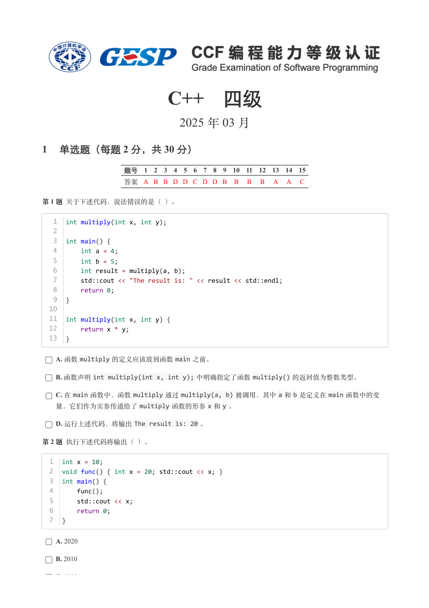
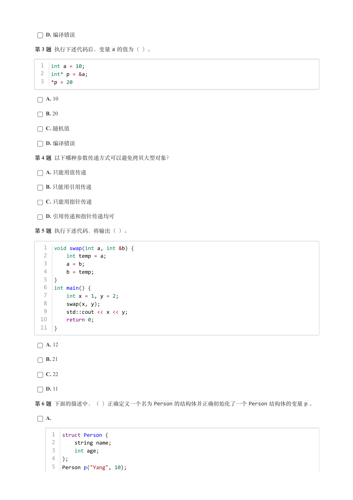
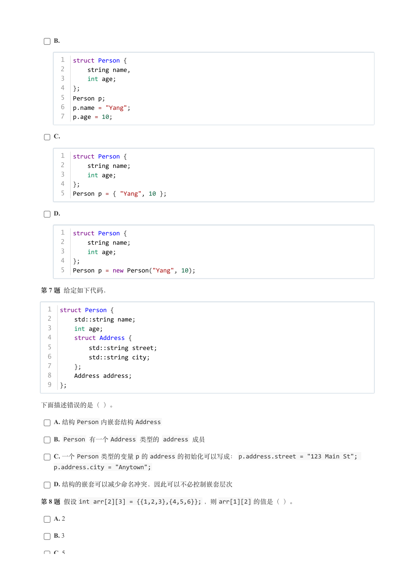
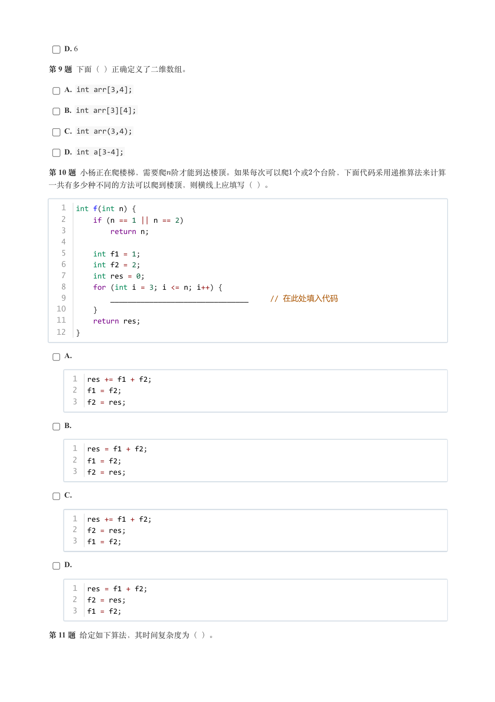
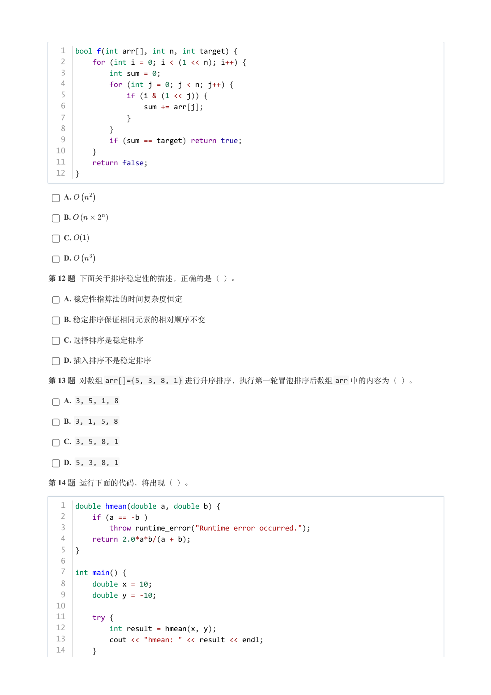
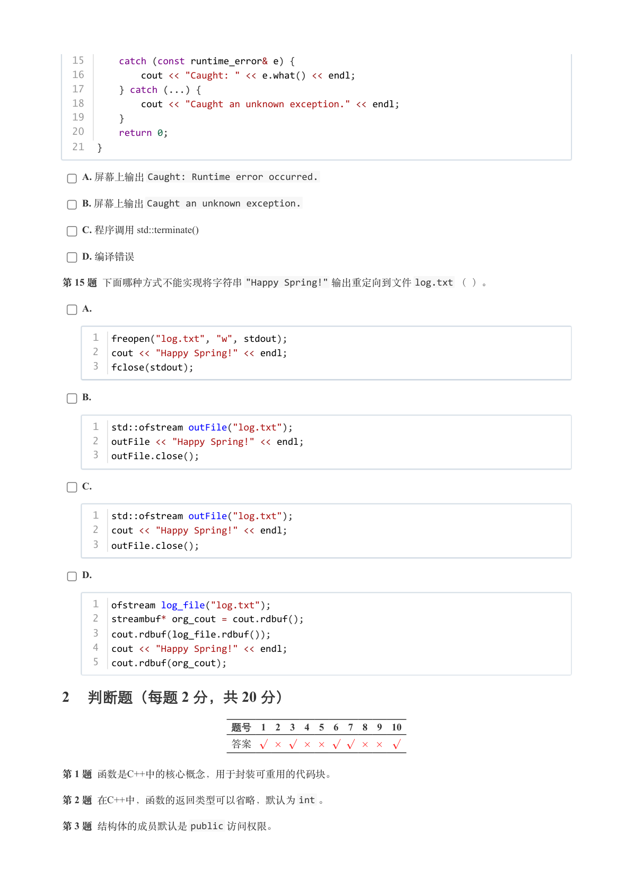
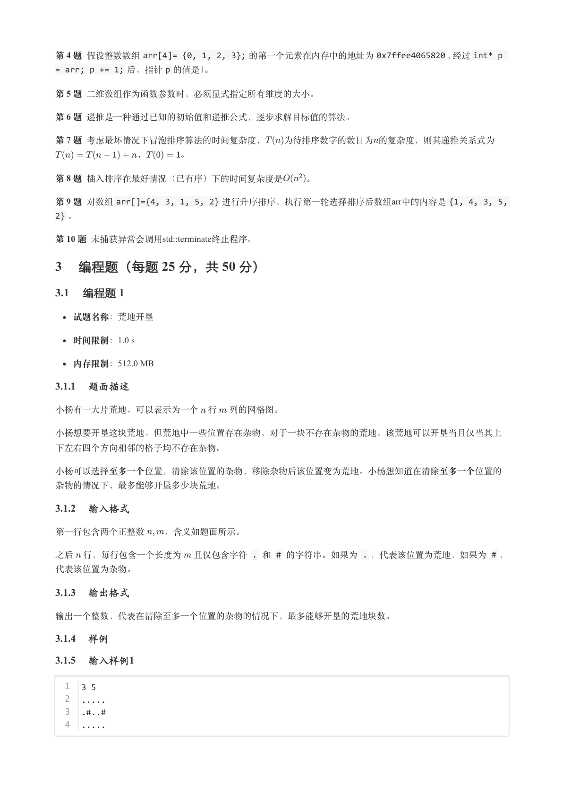
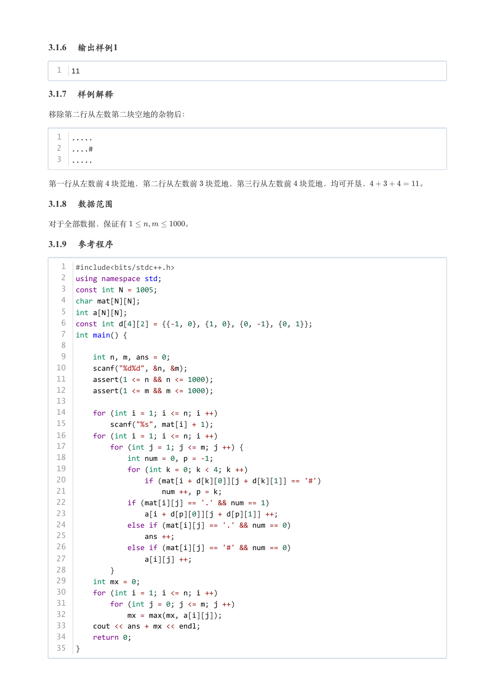
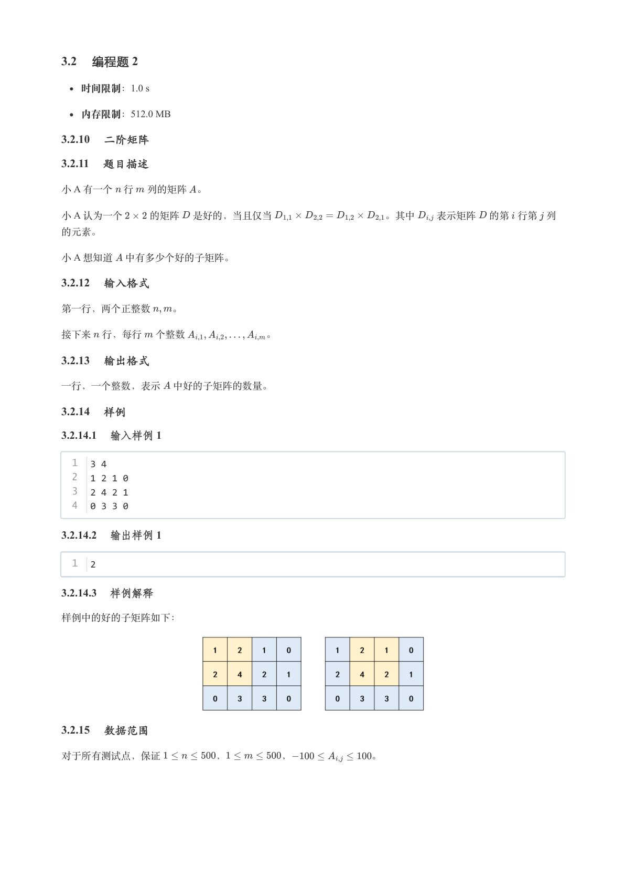
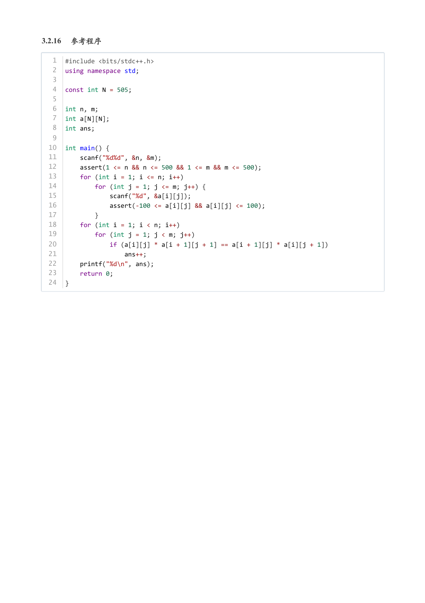

# 2025年3月-C++4级

- 原始 PDF：[`pdfs/2025年3月-C++4级.pdf`](../pdfs/2025年3月-C++4级.pdf)
- 页数：10
- 转换脚本：[`scripts/convert_pdfs_to_markdown.py`](../scripts/convert_pdfs_to_markdown.py)

> 为尽量避免信息丢失，每页均附带页面图片；文本提取结果保留原有顺序与换行特征，个别公式、图形、特殊排版请以页面图片为准。

## 第 1 页



### 提取文本

```
C++　四级

                      2025 年 03 月

1 单选题（每题 2 分，共 30 分）


            题号  1  2  3  4  5  6  7  8  9  10  11  12  13  14  15
            答案 A B B D D C D D B  B  B  B  A  A  C


第 1 题 关于下述代码，说法错误的是（ ）。


   1  int multiply(int x, int y);
   2
   3  int main() {
   4      int a = 4;
   5      int b = 5;
   6      int result = multiply(a, b);
   7      std::cout << "The result is: " << result << std::endl;
   8      return 0;
   9  }
  10
  11  int multiply(int x, int y) {
  12      return x * y;
  13  }


    A. 函数multiply 的定义应该放到函数main 之前。

    B. 函数声明int multiply(int x, int y); 中明确指定了函数multiply() 的返回值为整数类型。

    C. 在main 函数中，函数multiply 通过multiply(a, b) 被调用，其中a 和b 是定义在main 函数中的变
  量，它们作为实参传递给了multiply 函数的形参x 和y 。

    D. 运行上述代码，将输出The result is: 20 。

第 2 题 执行下述代码将输出（ ）。


  1  int x = 10;
  2  void func() { int x = 20; std::cout << x; }
  3  int main() {
  4      func();
  5      std::cout << x;
  6      return 0;
  7  }


    A. 2020

    B. 2010

    C. 1010
```

## 第 2 页



### 提取文本

```
D. 编译错误

第 3 题 执行下述代码后，变量a 的值为（ ）。


  1  int a = 10;
  2  int* p = &a;
  3  *p = 20


    A. 10

    B. 20

    C. 随机值

    D. 编译错误

第 4 题 以下哪种参数传递方式可以避免拷贝大型对象？

    A. 只能用值传递

    B. 只能用引用传递

    C. 只能用指针传递

    D. 引用传递和指针传递均可

第 5 题 执行下述代码，将输出（ ）。


   1  void swap(int a, int &b) {
   2      int temp = a;
   3      a = b;
   4      b = temp;
   5  }
   6  int main() {
   7      int x = 1, y = 2;
   8      swap(x, y);
   9      std::cout << x << y;
  10      return 0;
  11  }


    A. 12

    B. 21

    C. 22

    D. 11

第 6 题 下面的描述中，（ ）正确定义一个名为Person 的结构体并正确初始化了一个Person 结构体的变量p 。

    A.


     1  struct Person {
     2      string name;
     3      int age;
     4  };
     5  Person p("Yang", 10);
```

## 第 3 页



### 提取文本

```
B.


     1  struct Person {
     2      string name,
     3      int age;
     4  };
     5  Person p;
     6  p.name = "Yang";
     7  p.age = 10;


    C.


     1  struct Person {
     2      string name;
     3      int age;
     4  };
     5  Person p = { "Yang", 10 };


    D.


     1  struct Person {
     2      string name;
     3      int age;
     4  };
     5  Person p = new Person("Yang", 10);


第 7 题 给定如下代码，


  1  struct Person {
  2      std::string name;
  3      int age;
  4      struct Address {
  5          std::string street;
  6          std::string city;
  7      };
  8      Address address;
  9  };


下面描述错误的是（ ）。

    A. 结构Person 内嵌套结构Address

    B. Person 有一个Address 类型的 address 成员

    C. 一个Person 类型的变量p 的address 的初始化可以写成：p.address.street = "123 Main St";
    p.address.city = "Anytown";

    D. 结构的嵌套可以减少命名冲突，因此可以不必控制嵌套层次

第 8 题 假设int arr[2][3] = {{1,2,3},{4,5,6}}; ，则arr[1][2] 的值是（ ）。

    A. 2

    B. 3

    C. 5
```

## 第 4 页



### 提取文本

```
D. 6

第 9 题 下面（ ）正确定义了二维数组。

    A. int arr[3,4];

    B. int arr[3][4];

    C. int arr(3,4);

    D. int a[3-4];

第 10 题 小杨正在爬楼梯，需要爬阶才能到达楼顶。如果每次可以爬个或个台阶，下面代码采用递推算法来计算

一共有多少种不同的方法可以爬到楼顶，则横线上应填写（ ）。


   1  int f(int n) {
   2      if (n == 1 || n == 2)
   3          return n;
   4
   5      int f1 = 1;
   6      int f2 = 2;
   7      int res = 0;
   8      for (int i = 3; i <= n; i++) {
   9          ________________________________     // 在此处填入代码
  10      }
  11      return res;
  12  }


    A.


     1  res += f1 + f2;
     2  f1 = f2;
     3  f2 = res;


    B.


     1  res = f1 + f2;
     2  f1 = f2;
     3  f2 = res;


    C.


     1  res += f1 + f2;
     2  f2 = res;
     3  f1 = f2;


    D.


     1  res = f1 + f2;
     2  f2 = res;
     3  f1 = f2;


第 11 题 给定如下算法，其时间复杂度为（ ）。
```

## 第 5 页



### 提取文本

```
1  bool f(int arr[], int n, int target) {
   2      for (int i = 0; i < (1 << n); i++) {
   3          int sum = 0;
   4          for (int j = 0; j < n; j++) {
   5              if (i & (1 << j)) {
   6                  sum += arr[j];
   7              }
   8          }
   9          if (sum == target) return true;
  10      }
  11      return false;
  12  }


    A.

    B.

    C.

    D.

第 12 题 下面关于排序稳定性的描述，正确的是（ ）。

    A. 稳定性指算法的时间复杂度恒定

    B. 稳定排序保证相同元素的相对顺序不变

    C. 选择排序是稳定排序

    D. 插入排序不是稳定排序

第 13 题 对数组arr[]={5, 3, 8, 1} 进行升序排序，执行第一轮冒泡排序后数组arr 中的内容为（ ）。

    A. 3, 5, 1, 8

    B. 3, 1, 5, 8

    C. 3, 5, 8, 1

    D. 5, 3, 8, 1

第 14 题 运行下面的代码，将出现（ ）。


   1  double hmean(double a, double b) {
   2      if (a == -b )
   3          throw runtime_error("Runtime error occurred.");
   4      return 2.0*a*b/(a + b);
   5  }
   6
   7  int main() {
   8      double x = 10;
   9      double y = -10;
  10
  11      try {
  12          int result = hmean(x, y);
  13          cout << "hmean: " << result << endl;
  14      }
```

## 第 6 页



### 提取文本

```
15      catch (const runtime_error& e) {
  16          cout << "Caught: " << e.what() << endl;
  17      } catch (...) {
  18          cout << "Caught an unknown exception." << endl;
  19      }
  20      return 0;
  21  }

    A. 屏幕上输出Caught: Runtime error occurred.

    B. 屏幕上输出Caught an unknown exception.

    C. 程序调用 std::terminate()

    D. 编译错误

第 15 题 下面哪种方式不能实现将字符串"Happy Spring!" 输出重定向到文件log.txt （ ）。

    A.


     1  freopen("log.txt", "w", stdout);
     2  cout << "Happy Spring!" << endl;
     3  fclose(stdout);


    B.


     1  std::ofstream outFile("log.txt");
     2  outFile << "Happy Spring!" << endl;
     3  outFile.close();


    C.


     1  std::ofstream outFile("log.txt");
     2  cout << "Happy Spring!" << endl;
     3  outFile.close();


    D.


     1  ofstream log_file("log.txt");
     2  streambuf* org_cout = cout.rdbuf();
     3  cout.rdbuf(log_file.rdbuf());
     4  cout << "Happy Spring!" << endl;
     5  cout.rdbuf(org_cout);

2 判断题（每题 2 分，共 20 分）

                 题号  1  2  3  4  5  6  7  8  9  10

                 答案


第 1 题 函数是C++中的核心概念，用于封装可重用的代码块。

第 2 题 在C++中，函数的返回类型可以省略，默认为int 。

第 3 题 结构体的成员默认是public 访问权限。
```

## 第 7 页



### 提取文本

```
第 4 题 假设整数数组arr[4]= {0, 1, 2, 3}; 的第一个元素在内存中的地址为0x7ffee4065820 , 经过int* p
= arr; p += 1; 后，指针p 的值是1。

第 5 题 二维数组作为函数参数时，必须显式指定所有维度的大小。

第 6 题 递推是一种通过已知的初始值和递推公式，逐步求解目标值的算法。

第 7 题 考虑最坏情况下冒泡排序算法的时间复杂度，  为待排序数字的数目为的复杂度，则其递推关系式为

         ，    。

第 8 题 插入排序在最好情况（已有序）下的时间复杂度是   。

第 9 题 对数组arr[]={4, 3, 1, 5, 2} 进行升序排序，执行第一轮选择排序后数组arr中的内容是{1, 4, 3, 5,
2} 。

第 10 题 未捕获异常会调用std::terminate终止程序。

3 编程题（每题 25 分，共 50 分）

3.1 编程题 1


  试题名称：荒地开垦

   时间限制：1.0 s

   内存限制：512.0 MB

3.1.1 题面描述

小杨有一大片荒地，可以表示为一个 行 列的网格图。


小杨想要开垦这块荒地，但荒地中一些位置存在杂物，对于一块不存在杂物的荒地，该荒地可以开垦当且仅当其上

下左右四个方向相邻的格子均不存在杂物。


小杨可以选择至多一个位置，清除该位置的杂物，移除杂物后该位置变为荒地。小杨想知道在清除至多一个位置的

杂物的情况下，最多能够开垦多少块荒地。

3.1.2 输入格式

第一行包含两个正整数  ，含义如题面所示。

之后 行，每行包含一个长度为 且仅包含字符 . 和 # 的字符串。如果为 . ，代表该位置为荒地，如果为 # ，

代表该位置为杂物。

3.1.3 输出格式

输出一个整数，代表在清除至多一个位置的杂物的情况下，最多能够开垦的荒地块数。

3.1.4 样例

3.1.5 输入样例1

  1  3 5
  2  .....
  3  .#..#
  4  .....
```

## 第 8 页



### 提取文本

```
3.1.6 输出样例1

  1  11

3.1.7 样例解释

移除第二行从左数第二块空地的杂物后：


  1  .....
  2  ....#
  3  .....


第一行从左数前 块荒地，第二行从左数前 块荒地，第三行从左数前 块荒地，均可开垦，      。

3.1.8 数据范围

对于全部数据，保证有       。

3.1.9 参考程序

   1  #include<bits/stdc++.h>
   2  using namespace std;
   3  const int N = 1005;
   4  char mat[N][N];
   5  int a[N][N];
   6  const int d[4][2] = {{-1, 0}, {1, 0}, {0, -1}, {0, 1}};
   7  int main() {
   8
   9      int n, m, ans = 0;
  10      scanf("%d%d", &n, &m);
  11      assert(1 <= n && n <= 1000);
  12      assert(1 <= m && m <= 1000);
  13
  14      for (int i = 1; i <= n; i ++)
  15          scanf("%s", mat[i] + 1);
  16      for (int i = 1; i <= n; i ++)
  17          for (int j = 1; j <= m; j ++) {
  18              int num = 0, p = -1;
  19              for (int k = 0; k < 4; k ++)
  20                  if (mat[i + d[k][0]][j + d[k][1]] == '#')
  21                      num ++, p = k;
  22              if (mat[i][j] == '.' && num == 1)
  23                  a[i + d[p][0]][j + d[p][1]] ++;
  24              else if (mat[i][j] == '.' && num == 0)
  25                  ans ++;
  26              else if (mat[i][j] == '#' && num == 0)
  27                  a[i][j] ++;
  28          }
  29      int mx = 0;
  30      for (int i = 1; i <= n; i ++)
  31          for (int j = 0; j <= m; j ++)
  32              mx = max(mx, a[i][j]);
  33      cout << ans + mx << endl;
  34      return 0;
  35  }
```

## 第 9 页



### 提取文本

```
3.2 编程题 2

   时间限制：1.0 s

   内存限制：512.0 MB

3.2.10 二阶矩阵

3.2.11 题目描述

小 A 有一个 行 列的矩阵 。

小 A 认为一个   的矩阵 是好的，当且仅当           。其中  表示矩阵 的第 行第 列

的元素。

小 A 想知道 中有多少个好的子矩阵。

3.2.12 输入格式

第一行，两个正整数  。


接下来 行，每行 个整数        。

3.2.13 输出格式

一行，一个整数，表示 中好的子矩阵的数量。

3.2.14 样例

3.2.14.1 输入样例 1

  1  3 4
  2  1 2 1 0
  3  2 4 2 1
  4  0 3 3 0

3.2.14.2 输出样例 1

  1  2

3.2.14.3 样例解释

样例中的好的子矩阵如下：


3.2.15 数据范围

对于所有测试点，保证      ，      ，        。
```

## 第 10 页



### 提取文本

```
3.2.16 参考程序

   1  #include <bits/stdc++.h>
   2  using namespace std;
   3
   4  const int N = 505;
   5
   6  int n, m;
   7  int a[N][N];
   8  int ans;
   9
  10  int main() {
  11      scanf("%d%d", &n, &m);
  12      assert(1 <= n && n <= 500 && 1 <= m && m <= 500);
  13      for (int i = 1; i <= n; i++)
  14          for (int j = 1; j <= m; j++) {
  15              scanf("%d", &a[i][j]);
  16              assert(-100 <= a[i][j] && a[i][j] <= 100);
  17          }
  18      for (int i = 1; i < n; i++)
  19          for (int j = 1; j < m; j++)
  20              if (a[i][j] * a[i + 1][j + 1] == a[i + 1][j] * a[i][j + 1])
  21                  ans++;
  22      printf("%d\n", ans);
  23      return 0;
  24  }
```
