# 2025年3月-C++5级

- 原始 PDF：[`pdfs/2025年3月-C++5级.pdf`](../pdfs/2025年3月-C++5级.pdf)
- 页数：11
- 转换脚本：[`scripts/convert_pdfs_to_markdown.py`](../scripts/convert_pdfs_to_markdown.py)

> 为尽量避免信息丢失，每页均附带页面图片；文本提取结果保留原有顺序与换行特征，个别公式、图形、特殊排版请以页面图片为准。

## 第 1 页

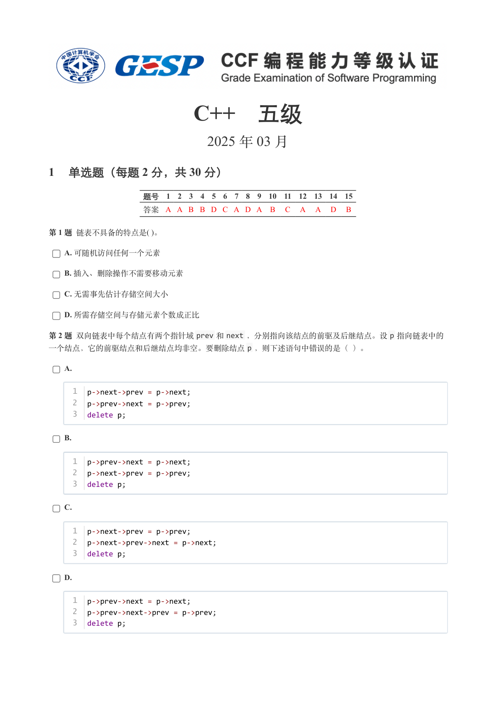

### 提取文本

```
C++　五级

                      2025 年 03 月

1 单选题（每题 2 分，共 30 分）


            题号  1  2  3  4  5  6  7  8  9  10  11  12  13  14  15
            答案 A A B B D C A D A  B  C  A  A  D  B


第 1 题 链表不具备的特点是( )。

    A. 可随机访问任何一个元素

    B. 插入、删除操作不需要移动元素

    C. 无需事先估计存储空间大小

    D. 所需存储空间与存储元素个数成正比

第 2 题 双向链表中每个结点有两个指针域prev 和next ，分别指向该结点的前驱及后继结点。设p 指向链表中的
一个结点，它的前驱结点和后继结点均非空。要删除结点p ，则下述语句中错误的是（ ）。

    A.


     1  p->next->prev = p->next;
     2  p->prev->next = p->prev;
     3  delete p;


    B.


     1  p->prev->next = p->next;
     2  p->next->prev = p->prev;
     3  delete p;


    C.


     1  p->next->prev = p->prev;
     2  p->next->prev->next = p->next;
     3  delete p;


    D.


     1  p->prev->next = p->next;
     2  p->prev->next->prev = p->prev;
     3  delete p;
```

## 第 2 页

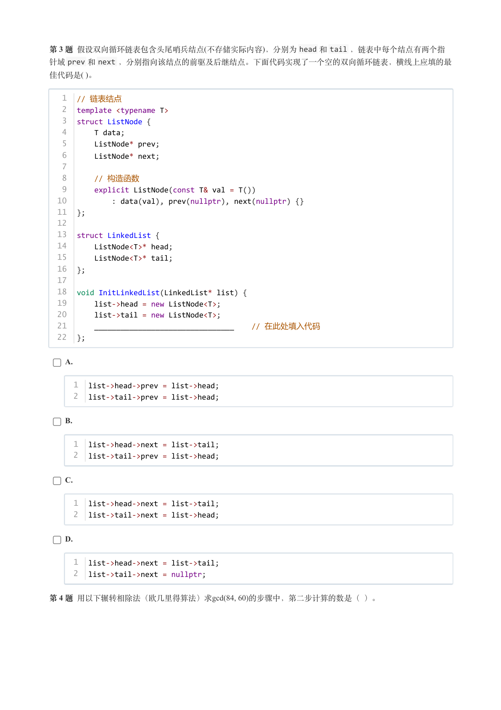

### 提取文本

```
第 3 题 假设双向循环链表包含头尾哨兵结点(不存储实际内容)，分别为head 和tail ，链表中每个结点有两个指
针域prev 和next ，分别指向该结点的前驱及后继结点。下面代码实现了一个空的双向循环链表，横线上应填的最
佳代码是( )。

   1  // 链表结点
   2  template <typename T>
   3  struct ListNode {
   4      T data;
   5      ListNode* prev;
   6      ListNode* next;
   7
   8      // 构造函数
   9      explicit ListNode(const T& val = T())
  10          : data(val), prev(nullptr), next(nullptr) {}
  11  };
  12
  13  struct LinkedList {
  14      ListNode<T>* head;
  15      ListNode<T>* tail;
  16  };
  17
  18  void InitLinkedList(LinkedList* list) {
  19      list->head = new ListNode<T>;
  20      list->tail = new ListNode<T>;
  21      ________________________________    // 在此处填入代码
  22  };


    A.


     1  list->head->prev = list->head;
     2  list->tail->prev = list->head;


    B.


     1  list->head->next = list->tail;
     2  list->tail->prev = list->head;


    C.


     1  list->head->next = list->tail;
     2  list->tail->next = list->head;


    D.


     1  list->head->next = list->tail;
     2  list->tail->next = nullptr;


第 4 题 用以下辗转相除法（欧几里得算法）求gcd(84, 60)的步骤中，第二步计算的数是（ ）。
```

## 第 3 页

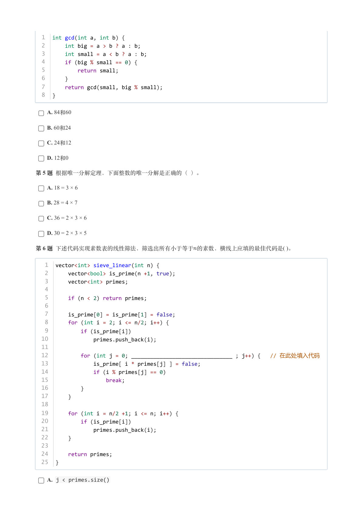

### 提取文本

```
1  int gcd(int a, int b) {
  2      int big = a > b ? a : b;
  3      int small = a < b ? a : b;
  4      if (big % small == 0) {
  5          return small;
  6      }
  7      return gcd(small, big % small);
  8  }


    A. 84和60

    B. 60和24

    C. 24和12

    D. 12和0

第 5 题 根据唯一分解定理，下面整数的唯一分解是正确的（ ）。

    A. 18 = 3 × 6

    B. 28 = 4 × 7

    C. 36 = 2 × 3 × 6

    D. 30 = 2 × 3 × 5

第 6 题 下述代码实现素数表的线性筛法，筛选出所有小于等于的素数，横线上应填的最佳代码是( )。


   1  vector<int> sieve_linear(int n) {
   2      vector<bool> is_prime(n +1, true);
   3      vector<int> primes;
   4
   5      if (n < 2) return primes;
   6
   7      is_prime[0] = is_prime[1] = false;
   8      for (int i = 2; i <= n/2; i++) {
   9          if (is_prime[i])
  10              primes.push_back(i);
  11
  12          for (int j = 0; ________________________________ ; j++) {   // 在此处填入代码
  13              is_prime[ i * primes[j] ] = false;
  14              if (i % primes[j] == 0)
  15                  break;
  16          }
  17      }
  18
  19      for (int i = n/2 +1; i <= n; i++) {
  20          if (is_prime[i])
  21              primes.push_back(i);
  22      }
  23
  24      return primes;
  25  }


    A. j < primes.size()
```

## 第 4 页

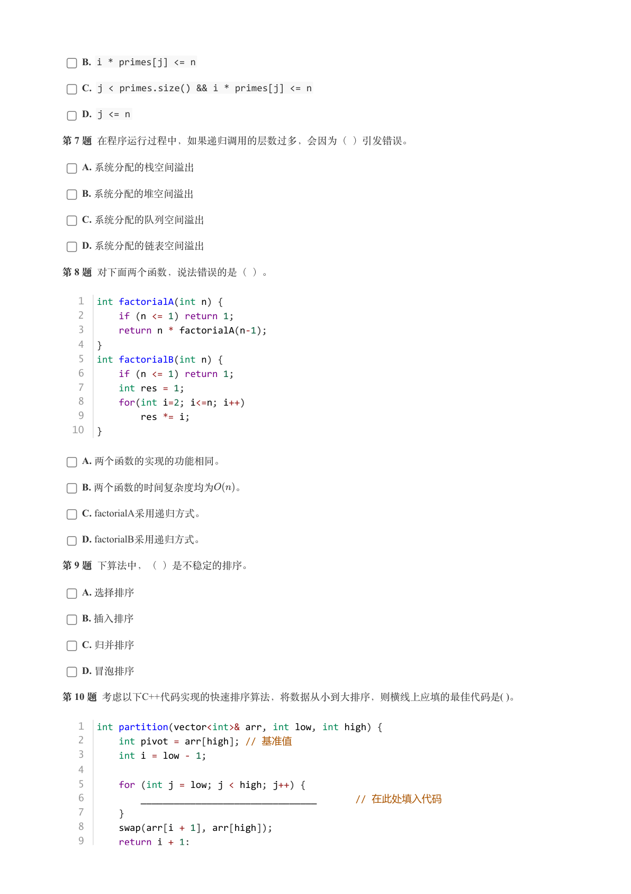

### 提取文本

```
B. i * primes[j] <= n

    C. j < primes.size() && i * primes[j] <= n

    D. j <= n

第 7 题 在程序运行过程中，如果递归调用的层数过多，会因为（ ）引发错误。

    A. 系统分配的栈空间溢出

    B. 系统分配的堆空间溢出

    C. 系统分配的队列空间溢出

    D. 系统分配的链表空间溢出

第 8 题 对下面两个函数，说法错误的是（ ）。


   1  int factorialA(int n) {
   2      if (n <= 1) return 1;
   3      return n * factorialA(n-1);
   4  }
   5  int factorialB(int n) {
   6      if (n <= 1) return 1;
   7      int res = 1;
   8      for(int i=2; i<=n; i++)
   9          res *= i;
  10  }


    A. 两个函数的实现的功能相同。

    B. 两个函数的时间复杂度均为  。

    C. factorialA采用递归方式。

    D. factorialB采用递归方式。

第 9 题 下算法中，（ ）是不稳定的排序。

    A. 选择排序

    B. 插入排序

    C. 归并排序

    D. 冒泡排序

第 10 题 考虑以下C++代码实现的快速排序算法，将数据从小到大排序，则横线上应填的最佳代码是( )。


   1  int partition(vector<int>& arr, int low, int high) {
   2      int pivot = arr[high]; // 基准值
   3      int i = low - 1;
   4
   5      for (int j = low; j < high; j++) {
   6          ________________________________       // 在此处填入代码
   7      }
   8      swap(arr[i + 1], arr[high]);
   9      return i + 1;
```

## 第 5 页

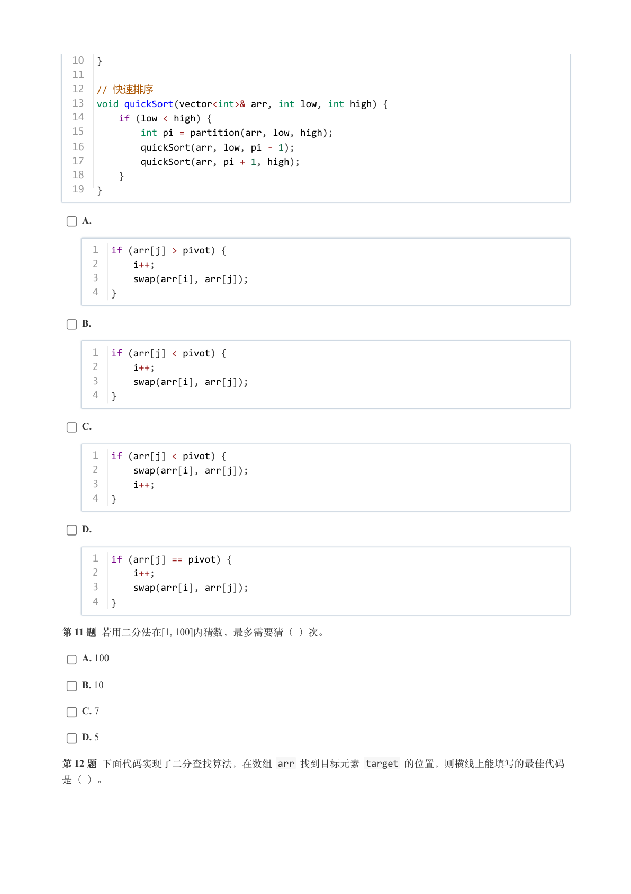

### 提取文本

```
10  }
  11
  12  // 快速排序
  13  void quickSort(vector<int>& arr, int low, int high) {
  14      if (low < high) {
  15          int pi = partition(arr, low, high);
  16          quickSort(arr, low, pi - 1);
  17          quickSort(arr, pi + 1, high);
  18      }
  19  }


    A.


     1  if (arr[j] > pivot) {
     2      i++;
     3      swap(arr[i], arr[j]);
     4  }


    B.


     1  if (arr[j] < pivot) {
     2      i++;
     3      swap(arr[i], arr[j]);
     4  }


    C.


     1  if (arr[j] < pivot) {
     2      swap(arr[i], arr[j]);
     3      i++;
     4  }


    D.


     1  if (arr[j] == pivot) {
     2      i++;
     3      swap(arr[i], arr[j]);
     4  }


第 11 题 若用二分法在[1, 100]内猜数，最多需要猜（ ）次。

    A. 100

    B. 10

    C. 7

    D. 5

第 12 题 下面代码实现了二分查找算法，在数组 arr 找到目标元素 target 的位置，则横线上能填写的最佳代码

是（ ）。
```

## 第 6 页

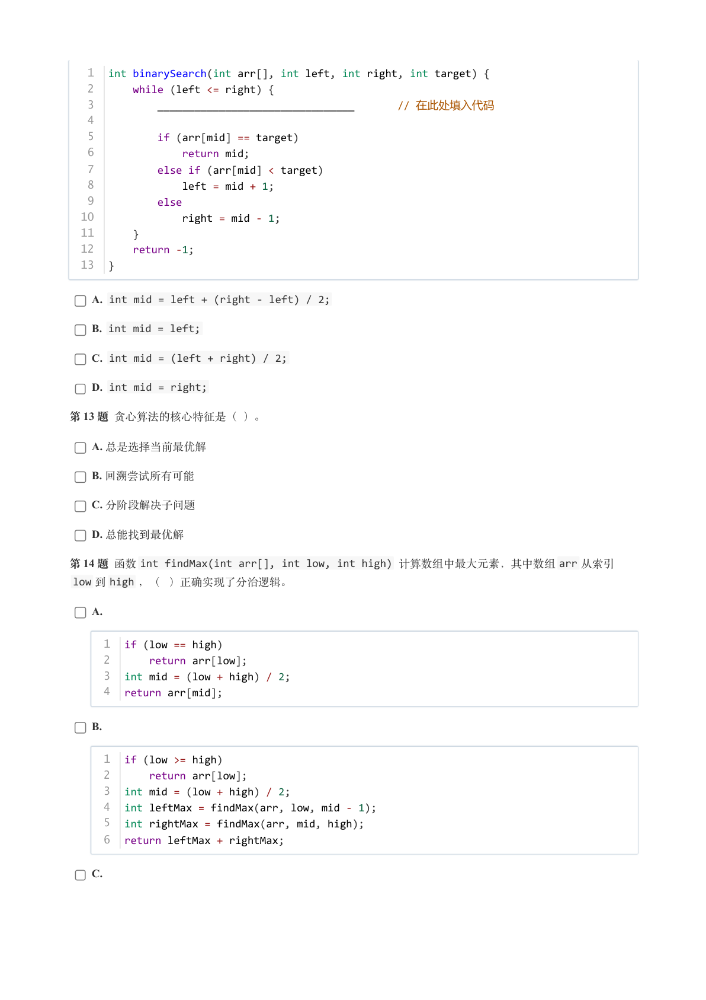

### 提取文本

```
1  int binarySearch(int arr[], int left, int right, int target) {
   2      while (left <= right) {
   3          ________________________________       // 在此处填入代码
   4
   5          if (arr[mid] == target)
   6              return mid;
   7          else if (arr[mid] < target)
   8              left = mid + 1;
   9          else
  10              right = mid - 1;
  11      }
  12      return -1;
  13  }


    A. int mid = left + (right - left) / 2;

    B. int mid = left;

    C. int mid = (left + right) / 2;

    D. int mid = right;

第 13 题 贪心算法的核心特征是（ ）。

    A. 总是选择当前最优解

    B. 回溯尝试所有可能

    C. 分阶段解决子问题

    D. 总能找到最优解

第 14 题 函数int findMax(int arr[], int low, int high) 计算数组中最大元素，其中数组arr 从索引
 low 到high ，（ ）正确实现了分治逻辑。

    A.


     1  if (low == high)
     2      return arr[low];
     3  int mid = (low + high) / 2;
     4  return arr[mid];


    B.


     1  if (low >= high)
     2      return arr[low];
     3  int mid = (low + high) / 2;
     4  int leftMax = findMax(arr, low, mid - 1);
     5  int rightMax = findMax(arr, mid, high);
     6  return leftMax + rightMax;


    C.
```

## 第 7 页

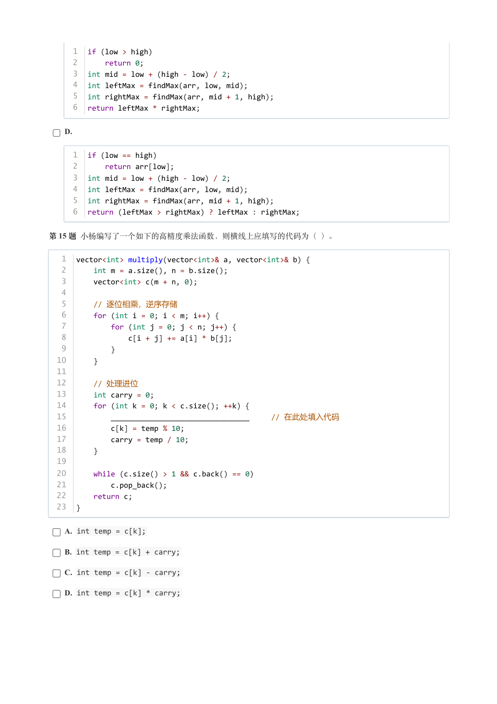

### 提取文本

```
1  if (low > high)
     2      return 0;
     3  int mid = low + (high - low) / 2;
     4  int leftMax = findMax(arr, low, mid);
     5  int rightMax = findMax(arr, mid + 1, high);
     6  return leftMax * rightMax;


    D.


     1  if (low == high)
     2      return arr[low];
     3  int mid = low + (high - low) / 2;
     4  int leftMax = findMax(arr, low, mid);
     5  int rightMax = findMax(arr, mid + 1, high);
     6  return (leftMax > rightMax) ? leftMax : rightMax;


第 15 题 小杨编写了一个如下的高精度乘法函数，则横线上应填写的代码为（ ）。


   1  vector<int> multiply(vector<int>& a, vector<int>& b) {
   2      int m = a.size(), n = b.size();
   3      vector<int> c(m + n, 0);
   4
   5      // 逐位相乘，逆序存储
   6      for (int i = 0; i < m; i++) {
   7          for (int j = 0; j < n; j++) {
   8              c[i + j] += a[i] * b[j];
   9          }
  10      }
  11
  12      // 处理进位
  13      int carry = 0;
  14      for (int k = 0; k < c.size(); ++k) {
  15          ________________________________     // 在此处填入代码
  16          c[k] = temp % 10;
  17          carry = temp / 10;
  18      }
  19
  20      while (c.size() > 1 && c.back() == 0)
  21          c.pop_back();
  22      return c;
  23  }


    A. int temp = c[k];

    B. int temp = c[k] + carry;

    C. int temp = c[k] - carry;

    D. int temp = c[k] * carry;
```

## 第 8 页

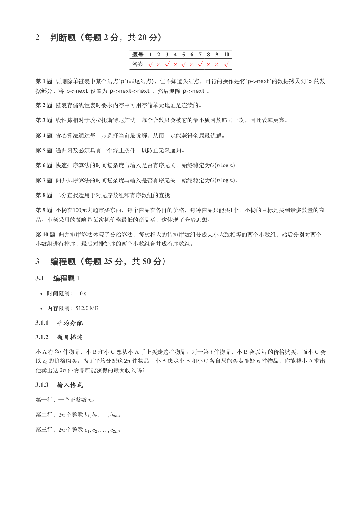

### 提取文本

```
2 判断题（每题 2 分，共 20 分）

                 题号  1  2  3  4  5  6  7  8  9  10

                 答案


第1 题要删除单链表中某个结点`p`(⾮尾结点)，但不知道头结点，可⾏的操作是将`p->next`的数据拷贝到`p`的数

据部分，将`p->next`设置为`p->next->next`，然后删除`p->next`。

第2 题链表存储线性表时要求内存中可用存储单元地址是连续的。

第3 题线性筛相对于埃拉托斯特尼筛法，每个合数只会被它的最小质因数筛去一次，因此效率更高。

第4 题贪心算法通过每一步选择当前最优解，从而一定能获得全局最优解。

第5 题递归函数必须具有一个终止条件，以防止无限递归。

第 6 题 快速排序算法的时间复杂度与输入是否有序无关，始终稳定为    。

第 7 题 归并排序算法的时间复杂度与输入是否有序无关，始终稳定为    。

第 8 题 二分查找适用于对无序数组和有序数组的查找。

第 9 题 小杨有100元去超市买东西，每个商品有各自的价格，每种商品只能买1个，小杨的目标是买到最多数量的商

品。小杨采用的策略是每次挑价格最低的商品买，这体现了分治思想。

第 10 题 归并排序算法体现了分治算法，每次将大的待排序数组分成大小大致相等的两个小数组，然后分别对两个

小数组进行排序，最后对排好序的两个小数组合并成有序数组。

3 编程题（每题 25 分，共 50 分）

3.1 编程题 1

   时间限制：1.0 s

   内存限制：512.0 MB

3.1.1 平均分配

3.1.2 题目描述

小 A 有  件物品，小 B 和小 C 想从小 A 手上买走这些物品。对于第 件物品，小 B 会以 的价格购买，而小 C 会
以 的价格购买。为了平均分配这  件物品，小 A 决定小 B 和小 C 各自只能买走恰好 件物品。你能帮小 A 求出

他卖出这  件物品所能获得的最大收入吗？

3.1.3 输入格式

第一行，一个正整数 。


第二行， 个整数      。


第三行， 个整数      。
```

## 第 9 页

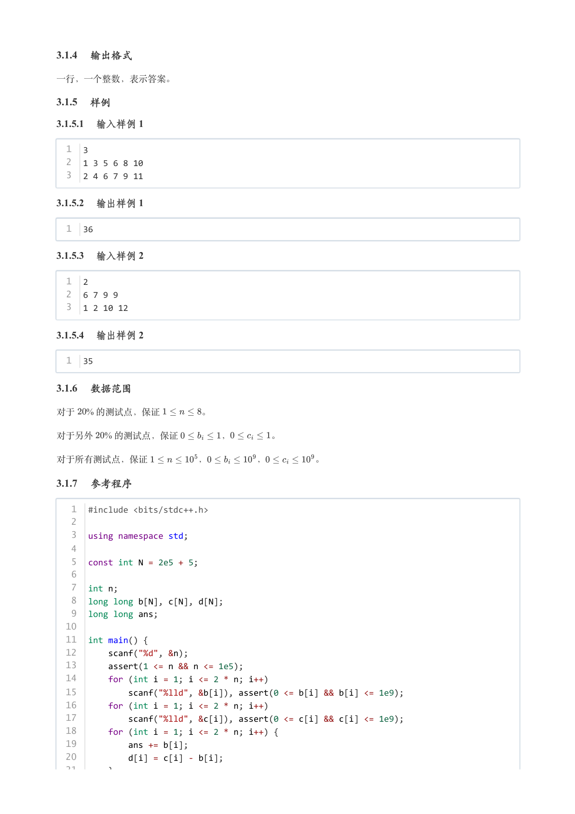

### 提取文本

```
3.1.4 输出格式

一行，一个整数，表示答案。

3.1.5 样例

3.1.5.1 输入样例 1

  1  3
  2  1 3 5 6 8 10
  3  2 4 6 7 9 11

3.1.5.2 输出样例 1

  1  36

3.1.5.3 输入样例 2

  1  2
  2  6 7 9 9
  3  1 2 10 12

3.1.5.4 输出样例 2

  1  35

3.1.6 数据范围

对于  % 的测试点，保证     。

对于另外  % 的测试点，保证     ，    。


对于所有测试点，保证      ，     ，     。

3.1.7 参考程序

   1  #include <bits/stdc++.h>
   2
   3  using namespace std;
   4
   5  const int N = 2e5 + 5;
   6
   7  int n;
   8  long long b[N], c[N], d[N];
   9  long long ans;
  10
  11  int main() {
  12      scanf("%d", &n);
  13      assert(1 <= n && n <= 1e5);
  14      for (int i = 1; i <= 2 * n; i++)
  15          scanf("%lld", &b[i]), assert(0 <= b[i] && b[i] <= 1e9);
  16      for (int i = 1; i <= 2 * n; i++)
  17          scanf("%lld", &c[i]), assert(0 <= c[i] && c[i] <= 1e9);
  18      for (int i = 1; i <= 2 * n; i++) {
  19          ans += b[i];
  20          d[i] = c[i] - b[i];
  21      }
```

## 第 10 页

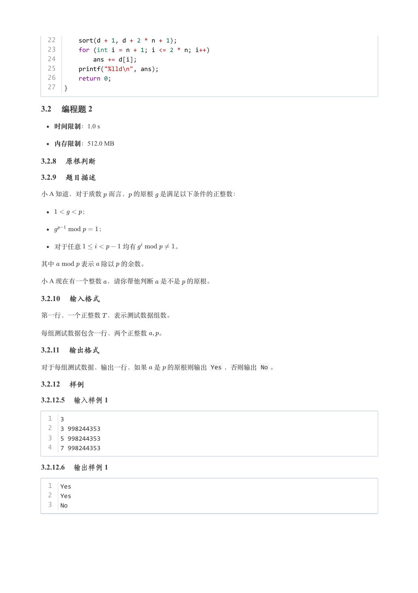

### 提取文本

```
22      sort(d + 1, d + 2 * n + 1);
  23      for (int i = n + 1; i <= 2 * n; i++)
  24          ans += d[i];
  25      printf("%lld\n", ans);
  26      return 0;
  27  }

3.2 编程题 2

   时间限制：1.0 s

   内存限制：512.0 MB

3.2.8 原根判断

3.2.9 题目描述

小 A 知道，对于质数 而言， 的原根 是满足以下条件的正整数：


      ；


         ；


  对于任意      均有      。


其中    表示 除以 的余数。

小 A 现在有一个整数 ，请你帮他判断 是不是 的原根。

3.2.10 输入格式

第一行，一个正整数 ，表示测试数据组数。


每组测试数据包含一行，两个正整数  。

3.2.11 输出格式

对于每组测试数据，输出一行，如果 是 的原根则输出 Yes ，否则输出 No 。

3.2.12 样例

3.2.12.5 输入样例 1

  1  3
  2  3 998244353
  3  5 998244353
  4  7 998244353

3.2.12.6 输出样例 1

  1  Yes
  2  Yes
  3  No
```

## 第 11 页

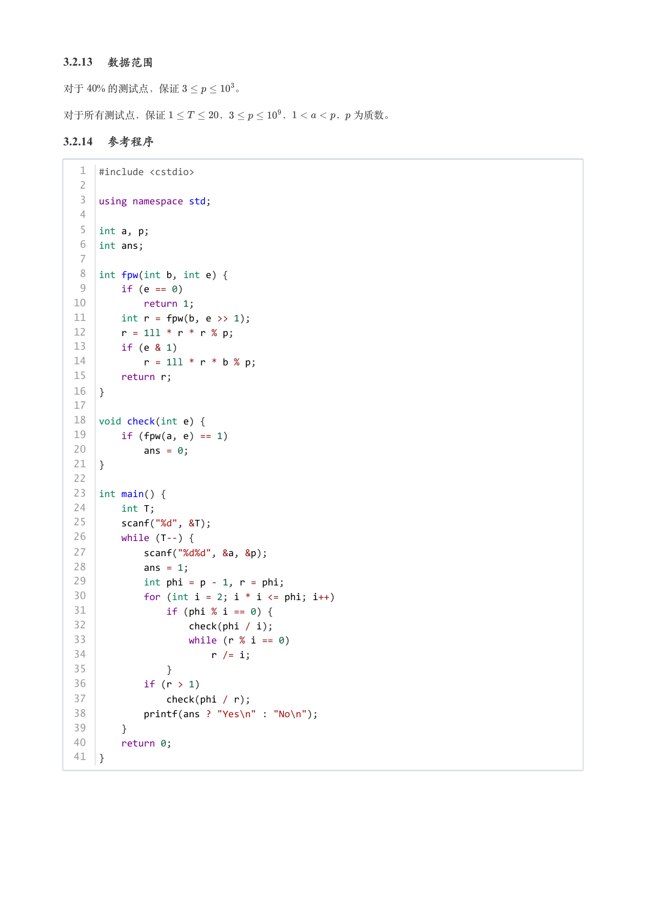

### 提取文本

```
3.2.13 数据范围

对于  % 的测试点，保证     。


对于所有测试点，保证     ，     ，    ， 为质数。

3.2.14 参考程序

   1  #include <cstdio>
   2
   3  using namespace std;
   4
   5  int a, p;
   6  int ans;
   7
   8  int fpw(int b, int e) {
   9      if (e == 0)
  10          return 1;
  11      int r = fpw(b, e >> 1);
  12      r = 1ll * r * r % p;
  13      if (e & 1)
  14          r = 1ll * r * b % p;
  15      return r;
  16  }
  17
  18  void check(int e) {
  19      if (fpw(a, e) == 1)
  20          ans = 0;
  21  }
  22
  23  int main() {
  24      int T;
  25      scanf("%d", &T);
  26      while (T--) {
  27          scanf("%d%d", &a, &p);
  28          ans = 1;
  29          int phi = p - 1, r = phi;
  30          for (int i = 2; i * i <= phi; i++)
  31              if (phi % i == 0) {
  32                  check(phi / i);
  33                  while (r % i == 0)
  34                      r /= i;
  35              }
  36          if (r > 1)
  37              check(phi / r);
  38          printf(ans ? "Yes\n" : "No\n");
  39      }
  40      return 0;
  41  }
```
