# 2025年3月-C++6级

- 原始 PDF：[`pdfs/2025年3月-C++6级.pdf`](../pdfs/2025年3月-C++6级.pdf)
- 页数：11
- 转换脚本：[`scripts/convert_pdfs_to_markdown.py`](../scripts/convert_pdfs_to_markdown.py)

> 为尽量避免信息丢失，每页均附带页面图片；文本提取结果保留原有顺序与换行特征，个别公式、图形、特殊排版请以页面图片为准。

## 第 1 页

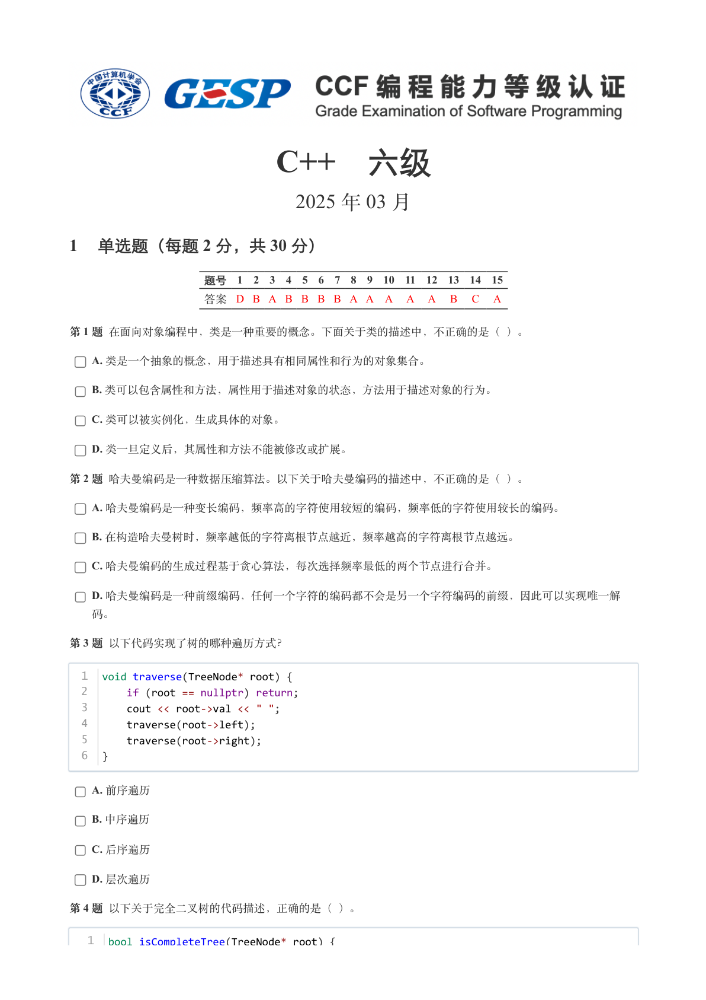

### 提取文本

```
C++　六级

                      2025 年 03 月

1 单选题（每题 2 分，共 30 分）


            题号  1  2  3  4  5  6  7  8  9  10  11  12  13  14  15
            答案 D B A B B B B A A A  A  A  B  C  A


第 1 题 在面向对象编程中，类是一种重要的概念。下面关于类的描述中，不正确的是（ ）。

    A. 类是一个抽象的概念，用于描述具有相同属性和行为的对象集合。

    B. 类可以包含属性和方法，属性用于描述对象的状态，方法用于描述对象的行为。

    C. 类可以被实例化，生成具体的对象。

    D. 类一旦定义后，其属性和方法不能被修改或扩展。

第 2 题 哈夫曼编码是一种数据压缩算法。以下关于哈夫曼编码的描述中，不正确的是（ ）。

    A. 哈夫曼编码是一种变长编码，频率高的字符使用较短的编码，频率低的字符使用较长的编码。

    B. 在构造哈夫曼树时，频率越低的字符离根节点越近，频率越高的字符离根节点越远。

    C. 哈夫曼编码的生成过程基于贪心算法，每次选择频率最低的两个节点进行合并。

    D. 哈夫曼编码是一种前缀编码，任何一个字符的编码都不会是另一个字符编码的前缀，因此可以实现唯一解

  码。

第 3 题 以下代码实现了树的哪种遍历方式？


  1  void traverse(TreeNode* root) {
  2      if (root == nullptr) return;
  3      cout << root->val << " ";
  4      traverse(root->left);
  5      traverse(root->right);
  6  }


    A. 前序遍历

    B. 中序遍历

    C. 后序遍历

    D. 层次遍历

第 4 题 以下关于完全二叉树的代码描述，正确的是（ ）。


   1  bool isCompleteTree(TreeNode* root) {
```

## 第 2 页

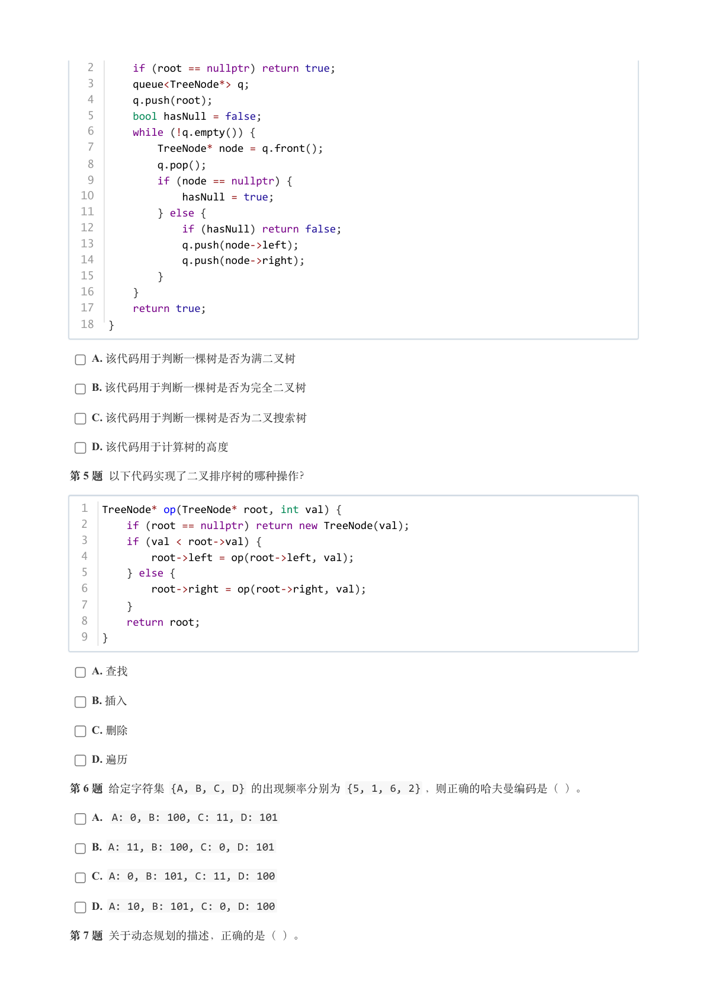

### 提取文本

```
2      if (root == nullptr) return true;
   3      queue<TreeNode*> q;
   4      q.push(root);
   5      bool hasNull = false;
   6      while (!q.empty()) {
   7          TreeNode* node = q.front();
   8          q.pop();
   9          if (node == nullptr) {
  10              hasNull = true;
  11          } else {
  12              if (hasNull) return false;
  13              q.push(node->left);
  14              q.push(node->right);
  15          }
  16      }
  17      return true;
  18  }


    A. 该代码用于判断一棵树是否为满二叉树

    B. 该代码用于判断一棵树是否为完全二叉树

    C. 该代码用于判断一棵树是否为二叉搜索树

    D. 该代码用于计算树的高度

第 5 题 以下代码实现了二叉排序树的哪种操作？


  1  TreeNode* op(TreeNode* root, int val) {
  2      if (root == nullptr) return new TreeNode(val);
  3      if (val < root->val) {
  4          root->left = op(root->left, val);
  5      } else {
  6          root->right = op(root->right, val);
  7      }
  8      return root;
  9  }


    A. 查找

    B. 插入

    C. 删除

    D. 遍历

第 6 题 给定字符集 {A, B, C, D} 的出现频率分别为 {5, 1, 6, 2} ，则正确的哈夫曼编码是（ ）。

    A. A: 0, B: 100, C: 11, D: 101

    B. A: 11, B: 100, C: 0, D: 101

    C. A: 0, B: 101, C: 11, D: 100

    D. A: 10, B: 101, C: 0, D: 100

第 7 题 关于动态规划的描述，正确的是（ ）。
```

## 第 3 页

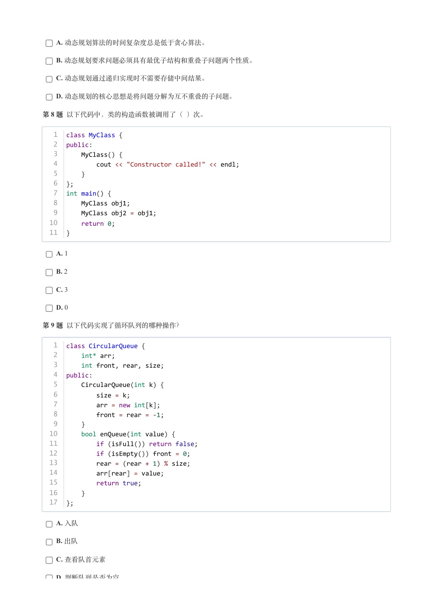

### 提取文本

```
A. 动态规划算法的时间复杂度总是低于贪心算法。

    B. 动态规划要求问题必须具有最优子结构和重叠子问题两个性质。

    C. 动态规划通过递归实现时不需要存储中间结果。

    D. 动态规划的核心思想是将问题分解为互不重叠的子问题。

第 8 题 以下代码中，类的构造函数被调用了（ ）次。


   1  class MyClass {
   2  public:
   3      MyClass() {
   4          cout << "Constructor called!" << endl;
   5      }
   6  };
   7  int main() {
   8      MyClass obj1;
   9      MyClass obj2 = obj1;
  10      return 0;
  11  }


    A. 1

    B. 2

    C. 3

    D. 0

第 9 题 以下代码实现了循环队列的哪种操作？


   1  class CircularQueue {
   2      int* arr;
   3      int front, rear, size;
   4  public:
   5      CircularQueue(int k) {
   6          size = k;
   7          arr = new int[k];
   8          front = rear = -1;
   9      }
  10      bool enQueue(int value) {
  11          if (isFull()) return false;
  12          if (isEmpty()) front = 0;
  13          rear = (rear + 1) % size;
  14          arr[rear] = value;
  15          return true;
  16      }
  17  };


    A. 入队

    B. 出队

    C. 查看队首元素

    D. 判断队列是否为空
```

## 第 4 页

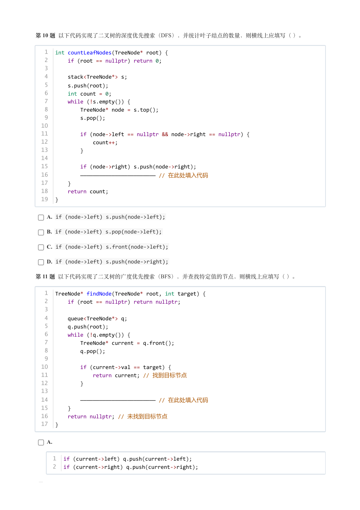

### 提取文本

```
第 10 题 以下代码实现了二叉树的深度优先搜索（DFS），并统计叶子结点的数量，则横线上应填写（ ）。


   1  int countLeafNodes(TreeNode* root) {
   2      if (root == nullptr) return 0;
   3
   4      stack<TreeNode*> s;
   5      s.push(root);
   6      int count = 0;
   7      while (!s.empty()) {
   8          TreeNode* node = s.top();
   9          s.pop();
  10
  11          if (node->left == nullptr && node->right == nullptr) {
  12              count++;
  13          }
  14
  15          if (node->right) s.push(node->right);
  16          ———————————————————————— // 在此处填入代码
  17      }
  18      return count;
  19  }


    A. if (node->left) s.push(node->left);

    B. if (node->left) s.pop(node->left);

    C. if (node->left) s.front(node->left);

    D. if (node->left) s.push(node->right);

第 11 题 以下代码实现了二叉树的广度优先搜索（BFS），并查找特定值的节点，则横线上应填写（ ）。


   1  TreeNode* findNode(TreeNode* root, int target) {
   2      if (root == nullptr) return nullptr;
   3
   4      queue<TreeNode*> q;
   5      q.push(root);
   6      while (!q.empty()) {
   7          TreeNode* current = q.front();
   8          q.pop();
   9
  10          if (current->val == target) {
  11              return current; // 找到目标节点
  12          }
  13
  14          ———————————————————————— // 在此处填入代码
  15      }
  16      return nullptr; // 未找到目标节点
  17  }


    A.


     1  if (current->left) q.push(current->left);
     2  if (current->right) q.push(current->right);


    B.
```

## 第 5 页

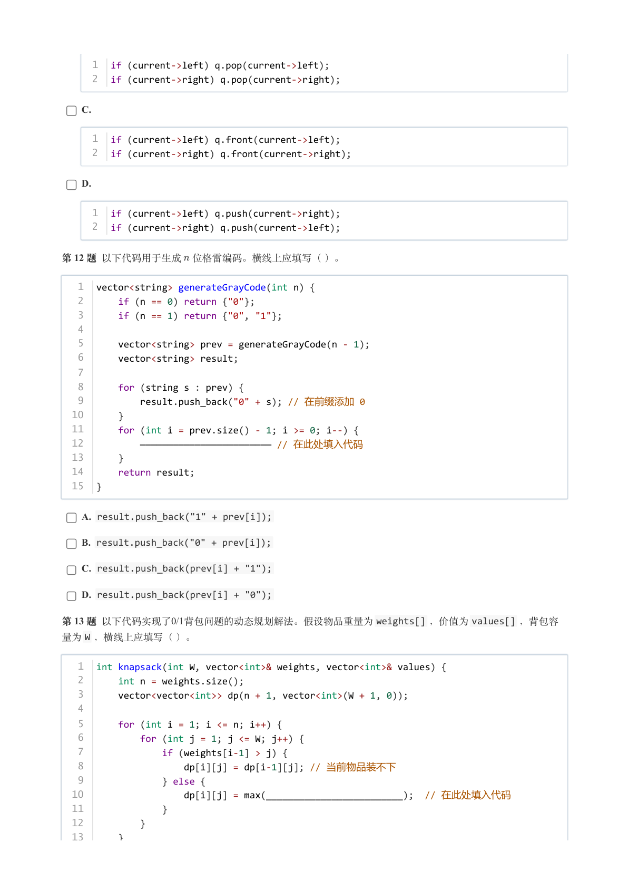

### 提取文本

```
1  if (current->left) q.pop(current->left);
     2  if (current->right) q.pop(current->right);


    C.


     1  if (current->left) q.front(current->left);
     2  if (current->right) q.front(current->right);


    D.


     1  if (current->left) q.push(current->right);
     2  if (current->right) q.push(current->left);


第 12 题 以下代码用于生成 位格雷编码。横线上应填写（ ）。


   1  vector<string> generateGrayCode(int n) {
   2      if (n == 0) return {"0"};
   3      if (n == 1) return {"0", "1"};
   4
   5      vector<string> prev = generateGrayCode(n - 1);
   6      vector<string> result;
   7
   8      for (string s : prev) {
   9          result.push_back("0" + s); // 在前缀添加 0
  10      }
  11      for (int i = prev.size() - 1; i >= 0; i--) {
  12          ———————————————————————— // 在此处填入代码
  13      }
  14      return result;
  15  }


    A. result.push_back("1" + prev[i]);

    B. result.push_back("0" + prev[i]);

    C. result.push_back(prev[i] + "1");

    D. result.push_back(prev[i] + "0");

第 13 题 以下代码实现了0/1背包问题的动态规划解法。假设物品重量为weights[] ，价值为values[] ，背包容
量为W ，横线上应填写（ ）。


   1  int knapsack(int W, vector<int>& weights, vector<int>& values) {
   2      int n = weights.size();
   3      vector<vector<int>> dp(n + 1, vector<int>(W + 1, 0));
   4
   5      for (int i = 1; i <= n; i++) {
   6          for (int j = 1; j <= W; j++) {
   7              if (weights[i-1] > j) {
   8                  dp[i][j] = dp[i-1][j]; // 当前物品装不下
   9              } else {
  10                  dp[i][j] = max(_________________________);  // 在此处填入代码
  11              }
  12          }
  13      }
```

## 第 6 页

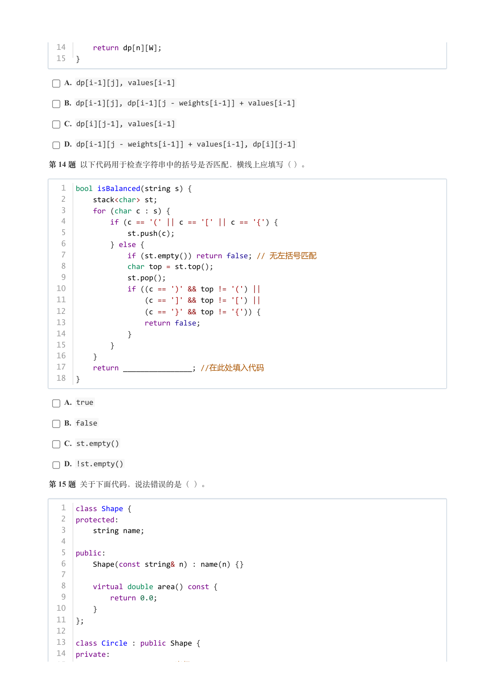

### 提取文本

```
14      return dp[n][W];
  15  }


    A. dp[i-1][j], values[i-1]

    B. dp[i-1][j], dp[i-1][j - weights[i-1]] + values[i-1]

    C. dp[i][j-1], values[i-1]

    D. dp[i-1][j - weights[i-1]] + values[i-1], dp[i][j-1]

第 14 题 以下代码用于检查字符串中的括号是否匹配，横线上应填写（ ）。


   1  bool isBalanced(string s) {
   2      stack<char> st;
   3      for (char c : s) {
   4          if (c == '(' || c == '[' || c == '{') {
   5              st.push(c);
   6          } else {
   7              if (st.empty()) return false; // 无左括号匹配
   8              char top = st.top();
   9              st.pop();
  10              if ((c == ')' && top != '(') ||
  11                  (c == ']' && top != '[') ||
  12                  (c == '}' && top != '{')) {
  13                  return false;
  14              }
  15          }
  16      }
  17      return ________________; //在此处填入代码
  18  }


    A. true

    B. false

    C. st.empty()

    D. !st.empty()

第 15 题 关于下面代码，说法错误的是（ ）。


   1  class Shape {
   2  protected:
   3      string name;
   4
   5  public:
   6      Shape(const string& n) : name(n) {}
   7
   8      virtual double area() const {
   9          return 0.0;
  10      }
  11  };
  12
  13  class Circle : public Shape {
  14  private:
  15      double radius;  // 半径
```

## 第 7 页

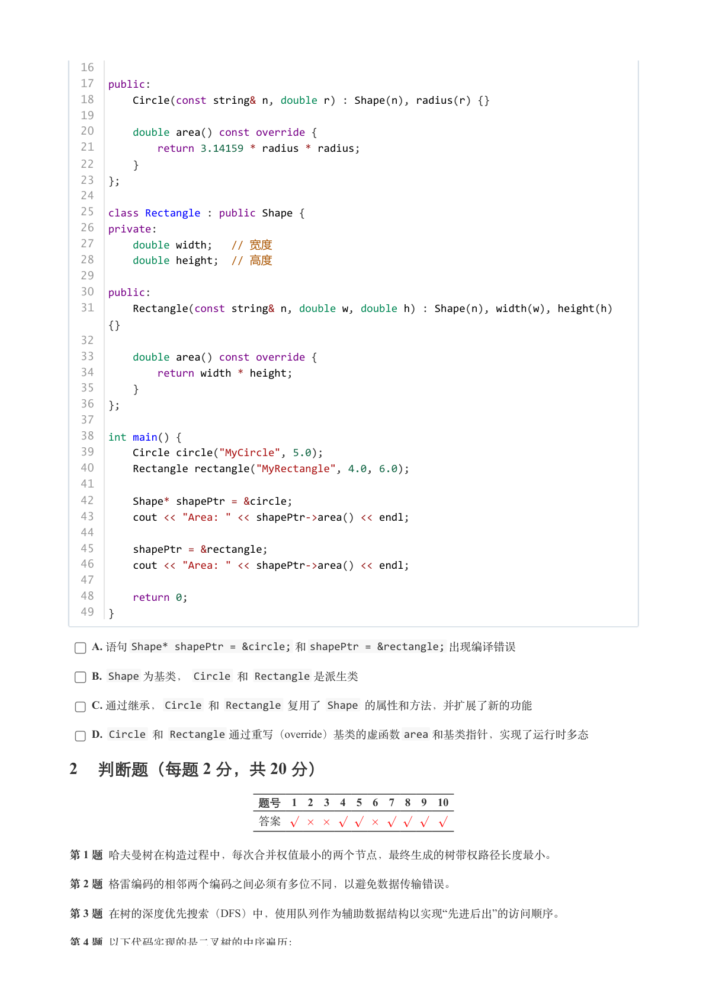

### 提取文本

```
16
  17  public:
  18      Circle(const string& n, double r) : Shape(n), radius(r) {}
  19
  20      double area() const override {
  21          return 3.14159 * radius * radius;
  22      }
  23  };
  24
  25  class Rectangle : public Shape {
  26  private:
  27      double width;   // 宽度
  28      double height;  // 高度
  29
  30  public:
  31      Rectangle(const string& n, double w, double h) : Shape(n), width(w), height(h)
      {}
  32
  33      double area() const override {
  34          return width * height;
  35      }
  36  };
  37
  38  int main() {
  39      Circle circle("MyCircle", 5.0);
  40      Rectangle rectangle("MyRectangle", 4.0, 6.0);
  41
  42      Shape* shapePtr = &circle;
  43      cout << "Area: " << shapePtr->area() << endl;
  44
  45      shapePtr = &rectangle;
  46      cout << "Area: " << shapePtr->area() << endl;
  47
  48      return 0;
  49  }


    A. 语句Shape* shapePtr = &circle; 和shapePtr = &rectangle; 出现编译错误

    B. Shape 为基类， Circle 和 Rectangle 是派生类

    C. 通过继承，Circle 和 Rectangle 复用了 Shape 的属性和方法，并扩展了新的功能

    D. Circle 和 Rectangle 通过重写（override）基类的虚函数area 和基类指针，实现了运行时多态

2 判断题（每题 2 分，共 20 分）

                 题号  1  2  3  4  5  6  7  8  9  10

                 答案


第 1 题 哈夫曼树在构造过程中，每次合并权值最小的两个节点，最终生成的树带权路径长度最小。

第 2 题 格雷编码的相邻两个编码之间必须有多位不同，以避免数据传输错误。

第 3 题 在树的深度优先搜索（DFS）中，使用队列作为辅助数据结构以实现“先进后出”的访问顺序。

第 4 题 以下代码实现的是二叉树的中序遍历：
```

## 第 8 页

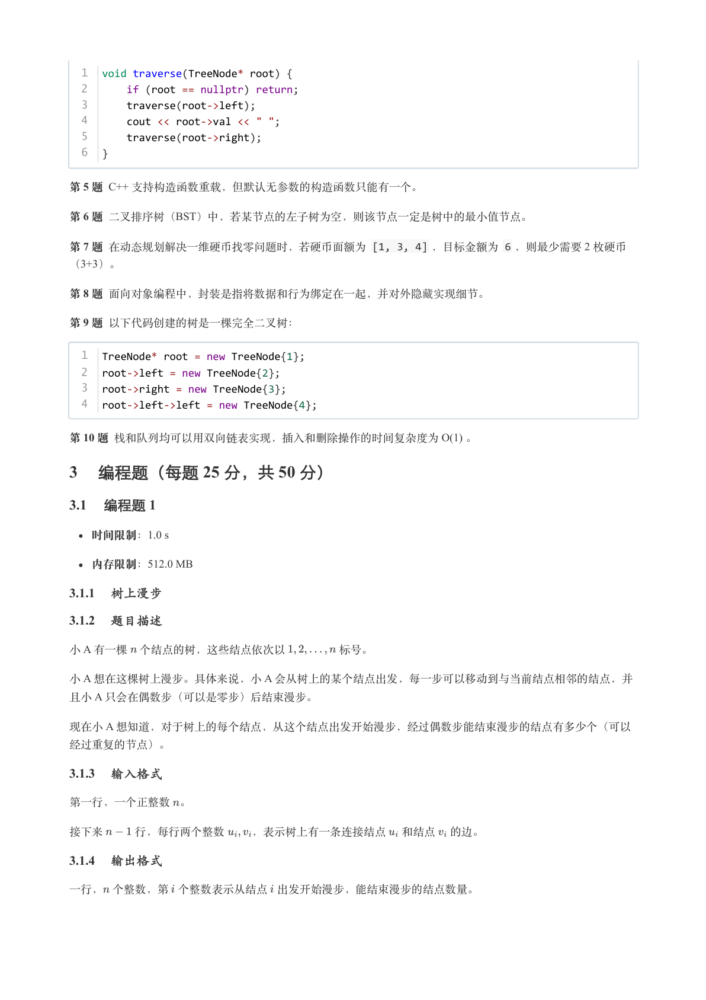

### 提取文本

```
1  void traverse(TreeNode* root) {
  2      if (root == nullptr) return;
  3      traverse(root->left);
  4      cout << root->val << " ";
  5      traverse(root->right);
  6  }


第 5 题 C++ 支持构造函数重载，但默认无参数的构造函数只能有一个。

第 6 题 二叉排序树（BST）中，若某节点的左子树为空，则该节点一定是树中的最小值节点。

第 7 题 在动态规划解决一维硬币找零问题时，若硬币面额为 [1, 3, 4] ，目标金额为 6 ，则最少需要 2 枚硬币
（3+3）。

第 8 题 面向对象编程中，封装是指将数据和行为绑定在一起，并对外隐藏实现细节。

第 9 题 以下代码创建的树是一棵完全二叉树：


  1  TreeNode* root = new TreeNode{1};
  2  root->left = new TreeNode{2};
  3  root->right = new TreeNode{3};
  4  root->left->left = new TreeNode{4};


第 10 题 栈和队列均可以用双向链表实现，插入和删除操作的时间复杂度为 O(1) 。

3 编程题（每题 25 分，共 50 分）

3.1 编程题 1

   时间限制：1.0 s

   内存限制：512.0 MB

3.1.1 树上漫步

3.1.2 题目描述

小 A 有一棵 个结点的树，这些结点依次以     标号。

小 A 想在这棵树上漫步。具体来说，小 A 会从树上的某个结点出发，每一步可以移动到与当前结点相邻的结点，并
且小 A 只会在偶数步（可以是零步）后结束漫步。

现在小 A 想知道，对于树上的每个结点，从这个结点出发开始漫步，经过偶数步能结束漫步的结点有多少个（可以

经过重复的节点）。

3.1.3 输入格式

第一行，一个正整数 。


接下来   行，每行两个整数  ，表示树上有一条连接结点 和结点 的边。

3.1.4 输出格式

一行， 个整数，第 个整数表示从结点 出发开始漫步，能结束漫步的结点数量。
```

## 第 9 页

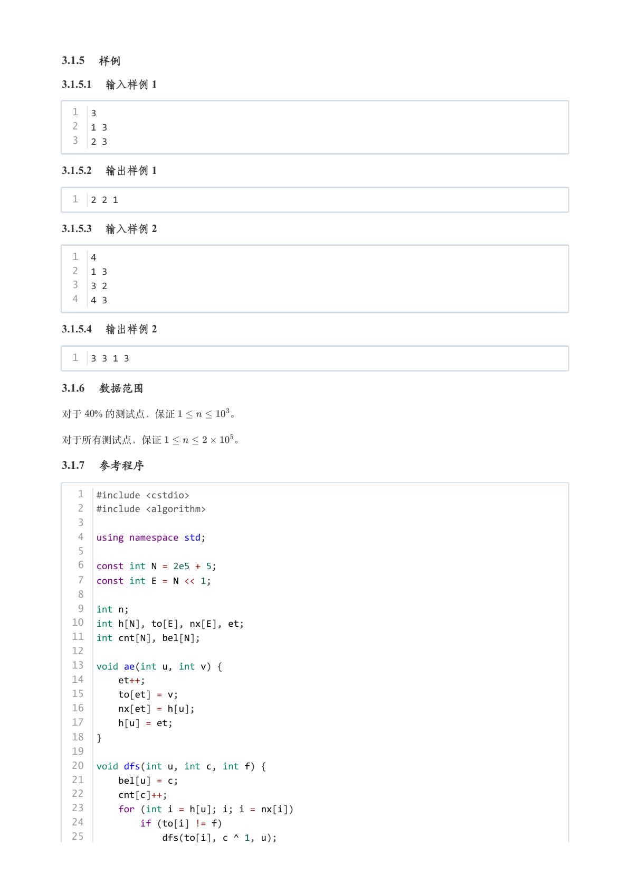

### 提取文本

```
3.1.5 样例

3.1.5.1 输入样例 1

  1  3
  2  1 3
  3  2 3

3.1.5.2 输出样例 1

  1  2 2 1

3.1.5.3 输入样例 2

  1  4
  2  1 3
  3  3 2
  4  4 3

3.1.5.4 输出样例 2

  1  3 3 1 3

3.1.6 数据范围

对于  % 的测试点，保证      。


对于所有测试点，保证       。

3.1.7 参考程序

   1  #include <cstdio>
   2  #include <algorithm>
   3
   4  using namespace std;
   5
   6  const int N = 2e5 + 5;
   7  const int E = N << 1;
   8
   9  int n;
  10  int h[N], to[E], nx[E], et;
  11  int cnt[N], bel[N];
  12
  13  void ae(int u, int v) {
  14      et++;
  15      to[et] = v;
  16      nx[et] = h[u];
  17      h[u] = et;
  18  }
  19
  20  void dfs(int u, int c, int f) {
  21      bel[u] = c;
  22      cnt[c]++;
  23      for (int i = h[u]; i; i = nx[i])
  24          if (to[i] != f)
  25              dfs(to[i], c ^ 1, u);
```

## 第 10 页

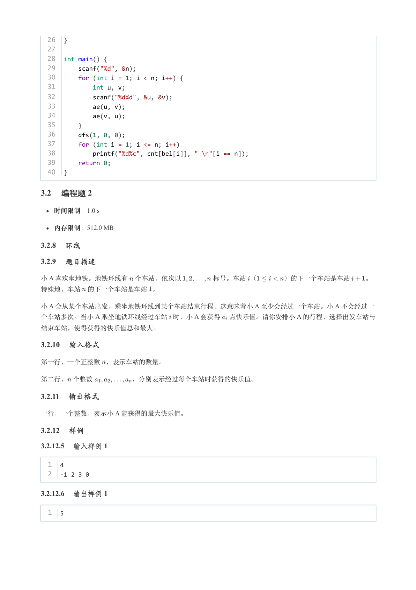

### 提取文本

```
26  }
  27
  28  int main() {
  29      scanf("%d", &n);
  30      for (int i = 1; i < n; i++) {
  31          int u, v;
  32          scanf("%d%d", &u, &v);
  33          ae(u, v);
  34          ae(v, u);
  35      }
  36      dfs(1, 0, 0);
  37      for (int i = 1; i <= n; i++)
  38          printf("%d%c", cnt[bel[i]], " \n"[i == n]);
  39      return 0;
  40  }

3.2 编程题 2

   时间限制：1.0 s

   内存限制：512.0 MB

3.2.8 环线

3.2.9 题目描述

小 A 喜欢坐地铁。地铁环线有 个车站，依次以     标号。车站 （    ）的下一个车站是车站  。

特殊地，车站 的下一个车站是车站 。

小 A 会从某个车站出发，乘坐地铁环线到某个车站结束行程，这意味着小 A 至少会经过一个车站。小 A 不会经过一
个车站多次。当小 A 乘坐地铁环线经过车站 时，小 A 会获得 点快乐值。请你安排小 A 的行程，选择出发车站与

结束车站，使得获得的快乐值总和最大。

3.2.10 输入格式

第一行，一个正整数 ，表示车站的数量。


第二行， 个整数      ，分别表示经过每个车站时获得的快乐值。

3.2.11 输出格式

一行，一个整数，表示小 A 能获得的最大快乐值。

3.2.12 样例

3.2.12.5 输入样例 1

  1  4
  2  -1 2 3 0

3.2.12.6 输出样例 1

  1  5
```

## 第 11 页

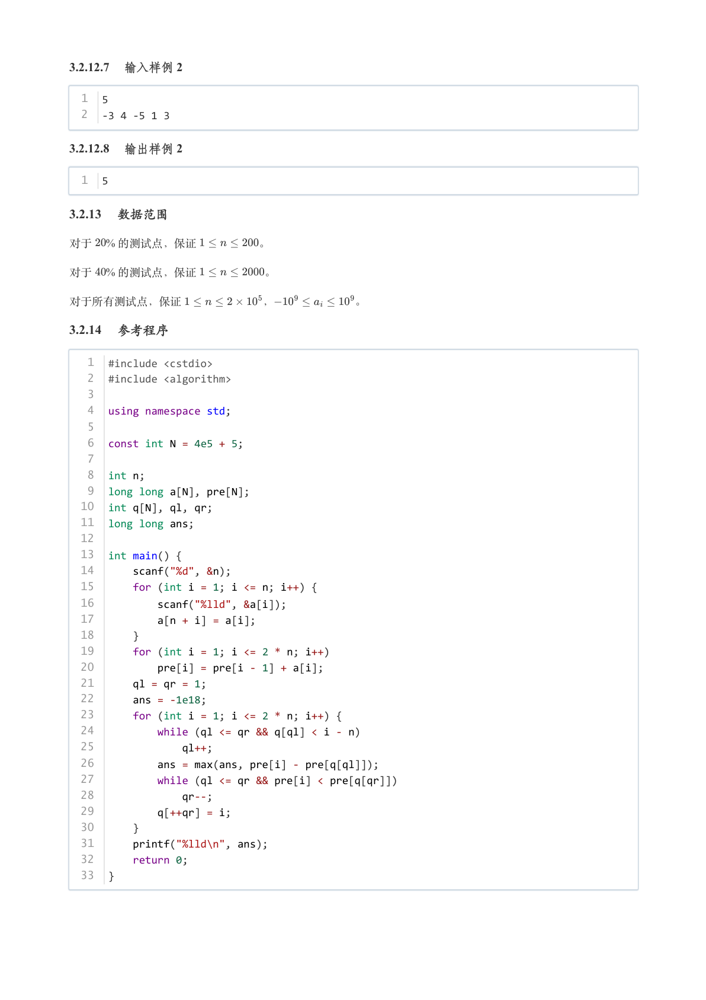

### 提取文本

```
3.2.12.7 输入样例 2

  1  5
  2  -3 4 -5 1 3

3.2.12.8 输出样例 2

  1  5

3.2.13 数据范围

对于  % 的测试点，保证      。

对于  % 的测试点，保证      。


对于所有测试点，保证       ，       。

3.2.14 参考程序

   1  #include <cstdio>
   2  #include <algorithm>
   3
   4  using namespace std;
   5
   6  const int N = 4e5 + 5;
   7
   8  int n;
   9  long long a[N], pre[N];
  10  int q[N], ql, qr;
  11  long long ans;
  12
  13  int main() {
  14      scanf("%d", &n);
  15      for (int i = 1; i <= n; i++) {
  16          scanf("%lld", &a[i]);
  17          a[n + i] = a[i];
  18      }
  19      for (int i = 1; i <= 2 * n; i++)
  20          pre[i] = pre[i - 1] + a[i];
  21      ql = qr = 1;
  22      ans = -1e18;
  23      for (int i = 1; i <= 2 * n; i++) {
  24          while (ql <= qr && q[ql] < i - n)
  25              ql++;
  26          ans = max(ans, pre[i] - pre[q[ql]]);
  27          while (ql <= qr && pre[i] < pre[q[qr]])
  28              qr--;
  29          q[++qr] = i;
  30      }
  31      printf("%lld\n", ans);
  32      return 0;
  33  }
```
