# 2025年3月-C++7级

- 原始 PDF：[`pdfs/2025年3月-C++7级.pdf`](../pdfs/2025年3月-C++7级.pdf)
- 页数：13
- 转换脚本：[`scripts/convert_pdfs_to_markdown.py`](../scripts/convert_pdfs_to_markdown.py)

> 为尽量避免信息丢失，每页均附带页面图片；文本提取结果保留原有顺序与换行特征，个别公式、图形、特殊排版请以页面图片为准。

## 第 1 页

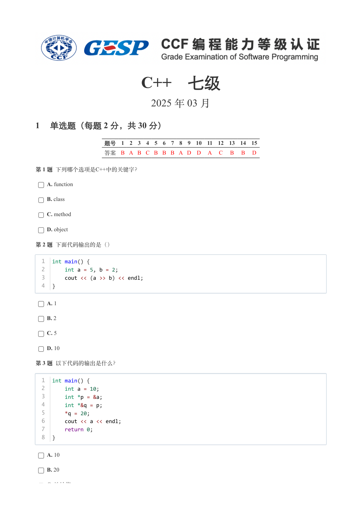

### 提取文本

```
C++　七级

                      2025 年 03 月

1 单选题（每题 2 分，共 30 分）


            题号  1  2  3  4  5  6  7  8  9  10  11  12  13  14  15
            答案 B A B C B B B A D D  A  C  B  B  D


第 1 题 下列哪个选项是C++中的关键字？

    A. function

    B. class

    C. method

    D. object

第 2 题 下面代码输出的是（）


  1  int main() {
  2      int a = 5, b = 2;
  3      cout << (a >> b) << endl;
  4  }


    A. 1

    B. 2

    C. 5

    D. 10

第 3 题 以下代码的输出是什么？


  1  int main() {
  2      int a = 10;
  3      int *p = &a;
  4      int *&q = p;
  5      *q = 20;
  6      cout << a << endl;
  7      return 0;
  8  }


    A. 10

    B. 20

    C. 地址值
```

## 第 2 页

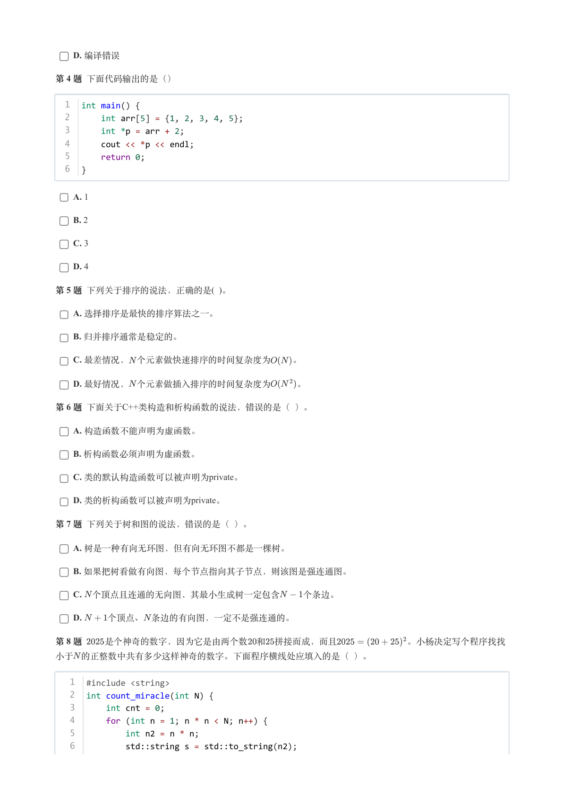

### 提取文本

```
D. 编译错误

第 4 题 下面代码输出的是（）


  1  int main() {
  2      int arr[5] = {1, 2, 3, 4, 5};
  3      int *p = arr + 2;
  4      cout << *p << endl;
  5      return 0;
  6  }


    A. 1

    B. 2

    C. 3

    D. 4

第 5 题 下列关于排序的说法，正确的是( )。

    A. 选择排序是最快的排序算法之一。

    B. 归并排序通常是稳定的。

    C. 最差情况， 个元素做快速排序的时间复杂度为  。

    D. 最好情况， 个元素做插入排序的时间复杂度为   。

第 6 题 下面关于C++类构造和析构函数的说法，错误的是（ ）。

    A. 构造函数不能声明为虚函数。

    B. 析构函数必须声明为虚函数。

    C. 类的默认构造函数可以被声明为private。

    D. 类的析构函数可以被声明为private。

第 7 题 下列关于树和图的说法，错误的是（ ）。

    A. 树是一种有向无环图，但有向无环图不都是一棵树。

    B. 如果把树看做有向图，每个节点指向其子节点，则该图是强连通图。

    C. 个顶点且连通的无向图，其最小生成树一定包含   个条边。

    D.   个顶点、 条边的有向图，一定不是强连通的。

第 8 题   是个神奇的数字，因为它是由两个数 和 拼接而成，而且        。小杨决定写个程序找找

小于 的正整数中共有多少这样神奇的数字。下面程序横线处应填入的是（ ）。


   1  #include <string>
   2  int count_miracle(int N) {
   3      int cnt = 0;
   4      for (int n = 1; n * n < N; n++) {
   5          int n2 = n * n;
   6          std::string s = std::to_string(n2);
   7          for (int i = 1; i < s.length(); i++)
```

## 第 3 页

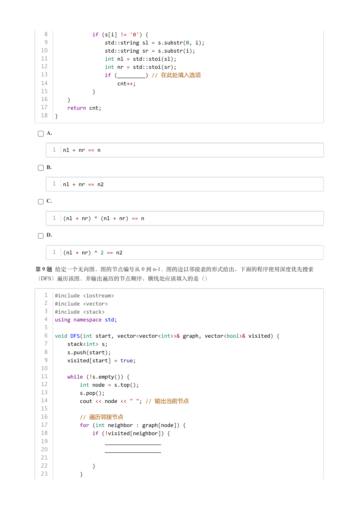

### 提取文本

```
8              if (s[i] != '0') {
   9                  std::string sl = s.substr(0, i);
  10                  std::string sr = s.substr(i);
  11                  int nl = std::stoi(sl);
  12                  int nr = std::stoi(sr);
  13                  if (_________) // 在此处填入选项
  14                      cnt++;
  15              }
  16      }
  17      return cnt;
  18  }


    A.


     1  nl + nr == n


    B.


     1  nl + nr == n2


    C.


     1  (nl + nr) * (nl + nr) == n


    D.


     1  (nl + nr) ^ 2 == n2


第 9 题 给定一个无向图，图的节点编号从 0 到 n-1，图的边以邻接表的形式给出。下面的程序使用深度优先搜索
（DFS）遍历该图，并输出遍历的节点顺序。横线处应该填入的是（）


   1  #include <iostream>
   2  #include <vector>
   3  #include <stack>
   4  using namespace std;
   5
   6  void DFS(int start, vector<vector<int>>& graph, vector<bool>& visited) {
   7      stack<int> s;
   8      s.push(start);
   9      visited[start] = true;
  10
  11      while (!s.empty()) {
  12          int node = s.top();
  13          s.pop();
  14          cout << node << " "; // 输出当前节点
  15
  16          // 遍历邻接节点
  17          for (int neighbor : graph[node]) {
  18              if (!visited[neighbor]) {
  19                  __________________
  20                  __________________
  21
  22              }
  23          }
  24      }
```

## 第 4 页

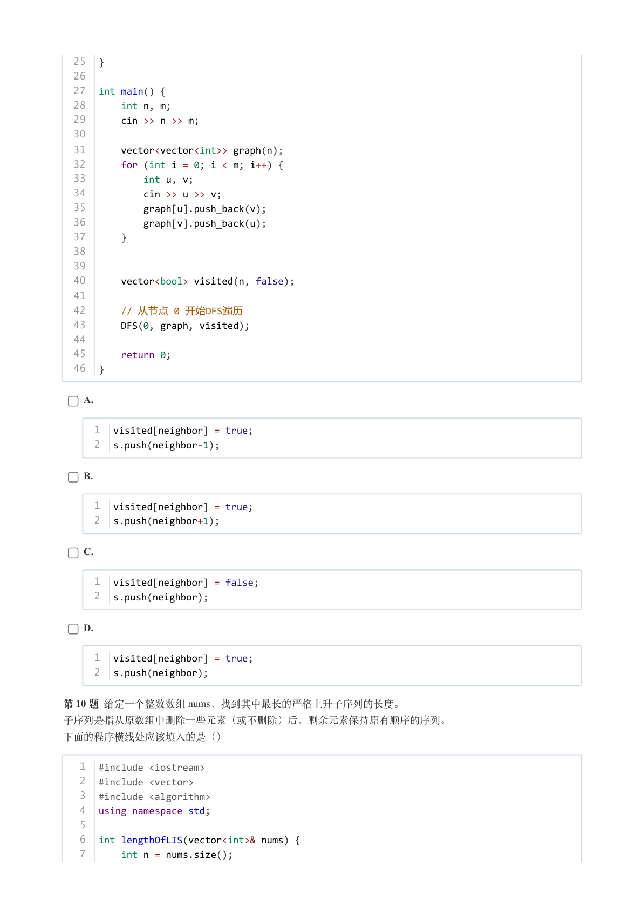

### 提取文本

```
25  }
  26
  27  int main() {
  28      int n, m;
  29      cin >> n >> m;
  30
  31      vector<vector<int>> graph(n);
  32      for (int i = 0; i < m; i++) {
  33          int u, v;
  34          cin >> u >> v;
  35          graph[u].push_back(v);
  36          graph[v].push_back(u);
  37      }
  38
  39
  40      vector<bool> visited(n, false);
  41
  42      // 从节点 0 开始DFS遍历
  43      DFS(0, graph, visited);
  44
  45      return 0;
  46  }


    A.


     1  visited[neighbor] = true;
     2  s.push(neighbor-1);


    B.


     1  visited[neighbor] = true;
     2  s.push(neighbor+1);


    C.


     1  visited[neighbor] = false;
     2  s.push(neighbor);


    D.


     1  visited[neighbor] = true;
     2  s.push(neighbor);


第 10 题 给定一个整数数组 nums，找到其中最长的严格上升子序列的长度。

子序列是指从原数组中删除一些元素（或不删除）后，剩余元素保持原有顺序的序列。

下面的程序横线处应该填入的是（）


   1  #include <iostream>
   2  #include <vector>
   3  #include <algorithm>
   4  using namespace std;
   5
   6  int lengthOfLIS(vector<int>& nums) {
   7      int n = nums.size();
```

## 第 5 页

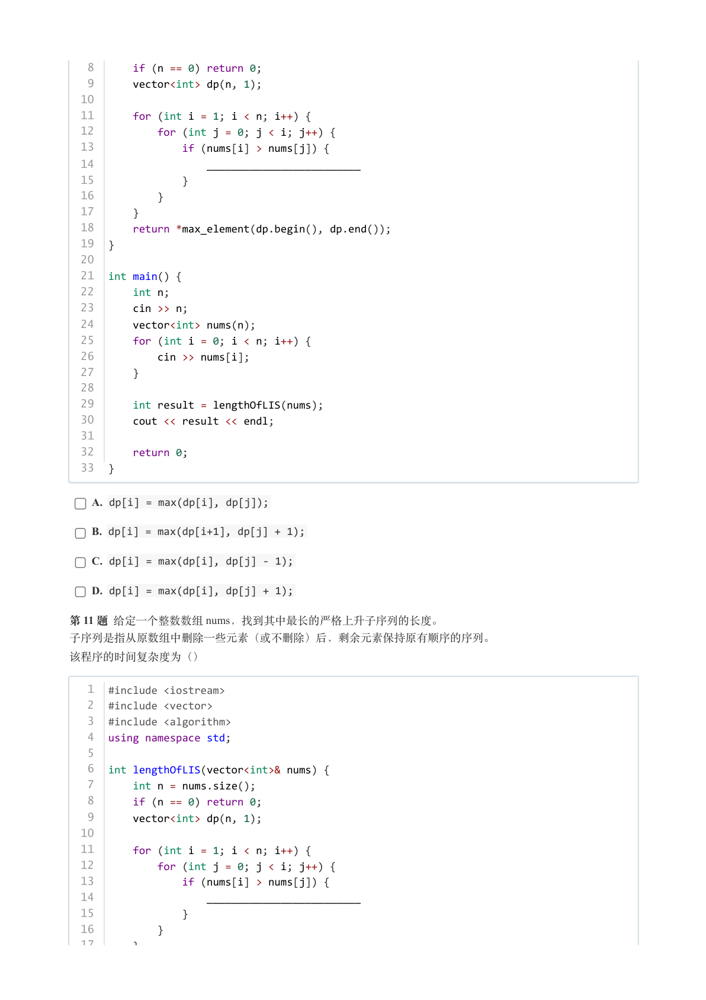

### 提取文本

```
8      if (n == 0) return 0;
   9      vector<int> dp(n, 1);
  10
  11      for (int i = 1; i < n; i++) {
  12          for (int j = 0; j < i; j++) {
  13              if (nums[i] > nums[j]) {
  14                  _________________________
  15              }
  16          }
  17      }
  18      return *max_element(dp.begin(), dp.end());
  19  }
  20
  21  int main() {
  22      int n;
  23      cin >> n;
  24      vector<int> nums(n);
  25      for (int i = 0; i < n; i++) {
  26          cin >> nums[i];
  27      }
  28
  29      int result = lengthOfLIS(nums);
  30      cout << result << endl;
  31
  32      return 0;
  33  }


    A. dp[i] = max(dp[i], dp[j]);

    B. dp[i] = max(dp[i+1], dp[j] + 1);

    C. dp[i] = max(dp[i], dp[j] - 1);

    D. dp[i] = max(dp[i], dp[j] + 1);

第 11 题 给定一个整数数组 nums，找到其中最长的严格上升子序列的长度。

子序列是指从原数组中删除一些元素（或不删除）后，剩余元素保持原有顺序的序列。

该程序的时间复杂度为（）


   1  #include <iostream>
   2  #include <vector>
   3  #include <algorithm>
   4  using namespace std;
   5
   6  int lengthOfLIS(vector<int>& nums) {
   7      int n = nums.size();
   8      if (n == 0) return 0;
   9      vector<int> dp(n, 1);
  10
  11      for (int i = 1; i < n; i++) {
  12          for (int j = 0; j < i; j++) {
  13              if (nums[i] > nums[j]) {
  14                  _________________________
  15              }
  16          }
  17      }
```

## 第 6 页

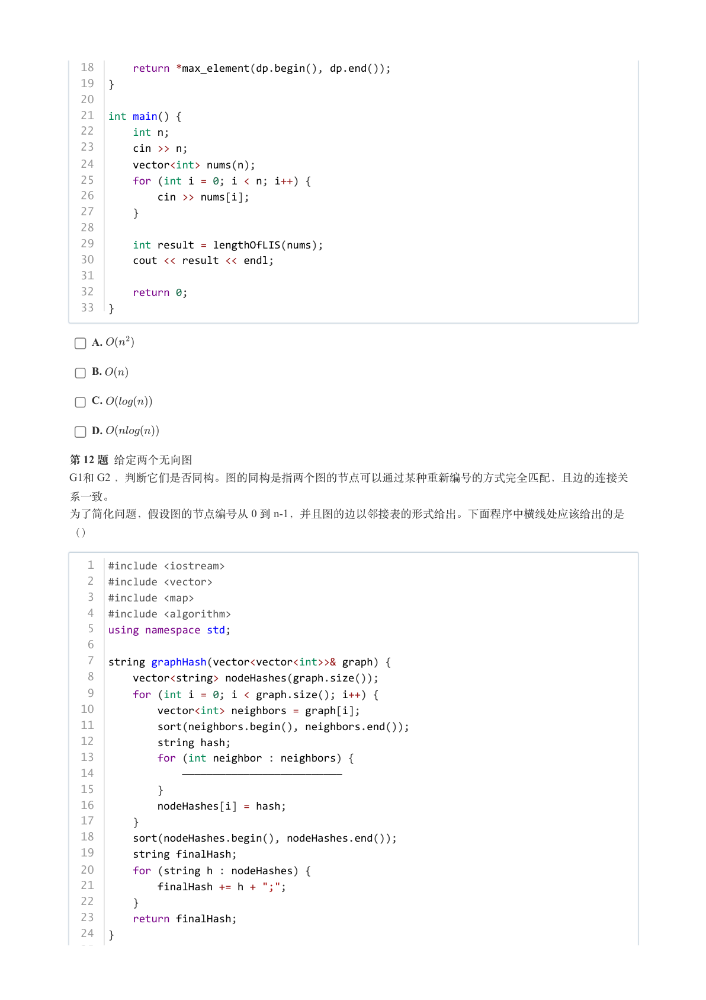

### 提取文本

```
18      return *max_element(dp.begin(), dp.end());
  19  }
  20
  21  int main() {
  22      int n;
  23      cin >> n;
  24      vector<int> nums(n);
  25      for (int i = 0; i < n; i++) {
  26          cin >> nums[i];
  27      }
  28
  29      int result = lengthOfLIS(nums);
  30      cout << result << endl;
  31
  32      return 0;
  33  }


    A.

    B.

    C.

    D.

第 12 题 给定两个无向图
G1和 G2 ，判断它们是否同构。图的同构是指两个图的节点可以通过某种重新编号的方式完全匹配，且边的连接关

系一致。
为了简化问题，假设图的节点编号从 0 到 n-1，并且图的边以邻接表的形式给出。下面程序中横线处应该给出的是

（）


   1  #include <iostream>
   2  #include <vector>
   3  #include <map>
   4  #include <algorithm>
   5  using namespace std;
   6
   7  string graphHash(vector<vector<int>>& graph) {
   8      vector<string> nodeHashes(graph.size());
   9      for (int i = 0; i < graph.size(); i++) {
  10          vector<int> neighbors = graph[i];
  11          sort(neighbors.begin(), neighbors.end());
  12          string hash;
  13          for (int neighbor : neighbors) {
  14              ——————————————————————————
  15          }
  16          nodeHashes[i] = hash;
  17      }
  18      sort(nodeHashes.begin(), nodeHashes.end());
  19      string finalHash;
  20      for (string h : nodeHashes) {
  21          finalHash += h + ";";
  22      }
  23      return finalHash;
  24  }
  25
```

## 第 7 页

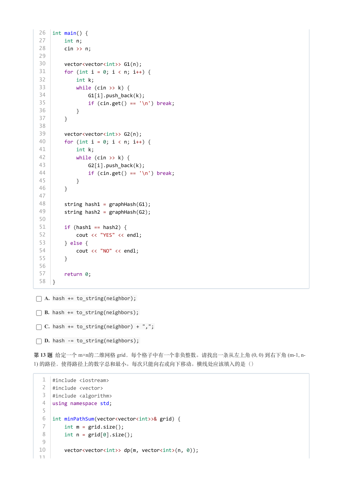

### 提取文本

```
26  int main() {
  27      int n;
  28      cin >> n;
  29
  30      vector<vector<int>> G1(n);
  31      for (int i = 0; i < n; i++) {
  32          int k;
  33          while (cin >> k) {
  34              G1[i].push_back(k);
  35              if (cin.get() == '\n') break;
  36          }
  37      }
  38
  39      vector<vector<int>> G2(n);
  40      for (int i = 0; i < n; i++) {
  41          int k;
  42          while (cin >> k) {
  43              G2[i].push_back(k);
  44              if (cin.get() == '\n') break;
  45          }
  46      }
  47
  48      string hash1 = graphHash(G1);
  49      string hash2 = graphHash(G2);
  50
  51      if (hash1 == hash2) {
  52          cout << "YES" << endl;
  53      } else {
  54          cout << "NO" << endl;
  55      }
  56
  57      return 0;
  58  }


    A. hash += to_string(neighbor);

    B. hash += to_string(neighbors);

    C. hash += to_string(neighbor) + ",";

    D. hash -= to_string(neighbors);

第 13 题 给定一个 m×n的二维网格 grid，每个格子中有一个非负整数。请找出一条从左上角 (0, 0) 到右下角 (m-1, n-
1) 的路径，使得路径上的数字总和最小。每次只能向右或向下移动。横线处应该填入的是（）


   1  #include <iostream>
   2  #include <vector>
   3  #include <algorithm>
   4  using namespace std;
   5
   6  int minPathSum(vector<vector<int>>& grid) {
   7      int m = grid.size();
   8      int n = grid[0].size();
   9
  10      vector<vector<int>> dp(m, vector<int>(n, 0));
  11
```

## 第 8 页

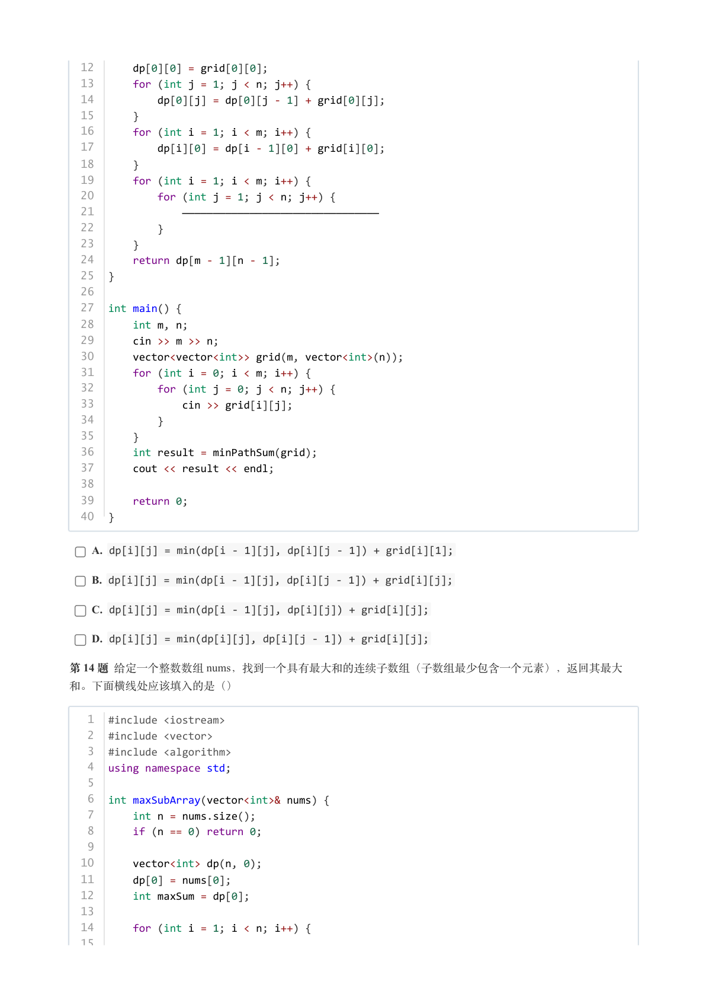

### 提取文本

```
12      dp[0][0] = grid[0][0];
  13      for (int j = 1; j < n; j++) {
  14          dp[0][j] = dp[0][j - 1] + grid[0][j];
  15      }
  16      for (int i = 1; i < m; i++) {
  17          dp[i][0] = dp[i - 1][0] + grid[i][0];
  18      }
  19      for (int i = 1; i < m; i++) {
  20          for (int j = 1; j < n; j++) {
  21              ————————————————————————————————
  22          }
  23      }
  24      return dp[m - 1][n - 1];
  25  }
  26
  27  int main() {
  28      int m, n;
  29      cin >> m >> n;
  30      vector<vector<int>> grid(m, vector<int>(n));
  31      for (int i = 0; i < m; i++) {
  32          for (int j = 0; j < n; j++) {
  33              cin >> grid[i][j];
  34          }
  35      }
  36      int result = minPathSum(grid);
  37      cout << result << endl;
  38
  39      return 0;
  40  }

    A. dp[i][j] = min(dp[i - 1][j], dp[i][j - 1]) + grid[i][1];

    B. dp[i][j] = min(dp[i - 1][j], dp[i][j - 1]) + grid[i][j];

    C. dp[i][j] = min(dp[i - 1][j], dp[i][j]) + grid[i][j];

    D. dp[i][j] = min(dp[i][j], dp[i][j - 1]) + grid[i][j];

第 14 题 给定一个整数数组 nums，找到一个具有最大和的连续子数组（子数组最少包含一个元素），返回其最大

和。下面横线处应该填入的是（）


   1  #include <iostream>
   2  #include <vector>
   3  #include <algorithm>
   4  using namespace std;
   5
   6  int maxSubArray(vector<int>& nums) {
   7      int n = nums.size();
   8      if (n == 0) return 0;
   9
  10      vector<int> dp(n, 0);
  11      dp[0] = nums[0];
  12      int maxSum = dp[0];
  13
  14      for (int i = 1; i < n; i++) {
  15          _____________________________________
```

## 第 9 页

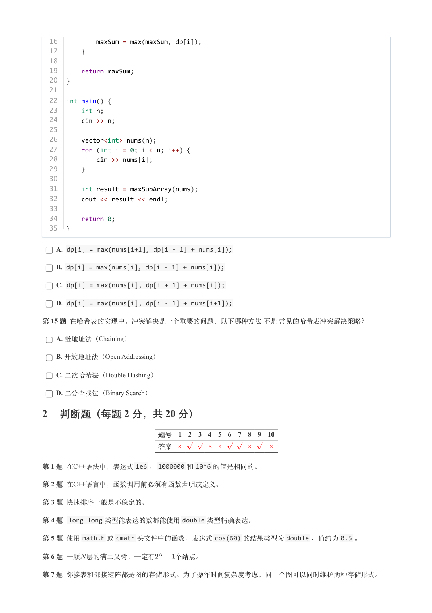

### 提取文本

```
16          maxSum = max(maxSum, dp[i]);
  17      }
  18
  19      return maxSum;
  20  }
  21
  22  int main() {
  23      int n;
  24      cin >> n;
  25
  26      vector<int> nums(n);
  27      for (int i = 0; i < n; i++) {
  28          cin >> nums[i];
  29      }
  30
  31      int result = maxSubArray(nums);
  32      cout << result << endl;
  33
  34      return 0;
  35  }


    A. dp[i] = max(nums[i+1], dp[i - 1] + nums[i]);

    B. dp[i] = max(nums[i], dp[i - 1] + nums[i]);

    C. dp[i] = max(nums[i], dp[i + 1] + nums[i]);

    D. dp[i] = max(nums[i], dp[i - 1] + nums[i+1]);

第 15 题 在哈希表的实现中，冲突解决是一个重要的问题。以下哪种方法 不是 常见的哈希表冲突解决策略？

    A. 链地址法（Chaining）

    B. 开放地址法（Open Addressing）

    C. 二次哈希法（Double Hashing）

    D. 二分查找法（Binary Search）

2 判断题（每题 2 分，共 20 分）

                 题号  1  2  3  4  5  6  7  8  9  10

                 答案


第 1 题 在C++语法中，表达式1e6 、1000000 和10^6 的值是相同的。

第 2 题 在C++语言中，函数调用前必须有函数声明或定义。

第 3 题 快速排序一般是不稳定的。

第 4 题 long long 类型能表达的数都能使用double 类型精确表达。

第 5 题 使用math.h 或cmath 头文件中的函数，表达式cos(60) 的结果类型为double 、值约为0.5 。

第 6 题 一颗 层的满二叉树，一定有   个结点。

第 7 题 邻接表和邻接矩阵都是图的存储形式。为了操作时间复杂度考虑，同一个图可以同时维护两种存储形式。
```

## 第 10 页

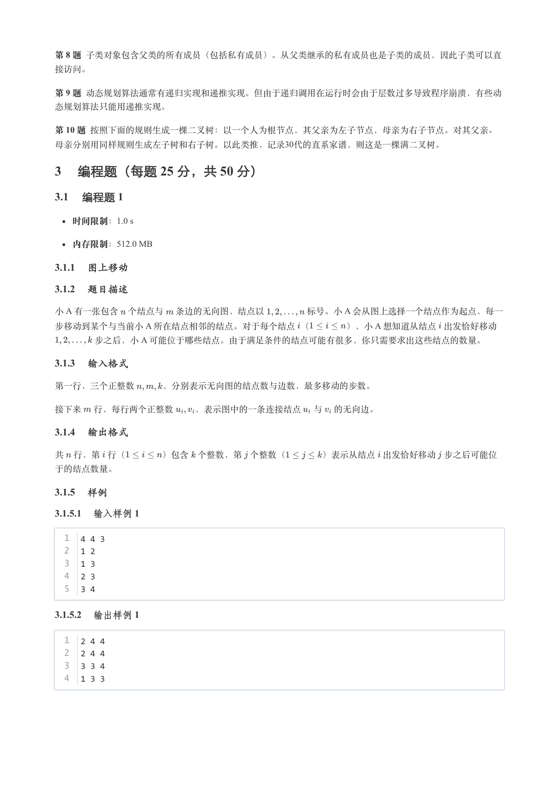

### 提取文本

```
第 8 题 子类对象包含父类的所有成员（包括私有成员）。从父类继承的私有成员也是子类的成员，因此子类可以直

接访问。

第 9 题 动态规划算法通常有递归实现和递推实现。但由于递归调用在运行时会由于层数过多导致程序崩溃，有些动

态规划算法只能用递推实现。

第 10 题 按照下面的规则生成一棵二叉树：以一个人为根节点，其父亲为左子节点，母亲为右子节点。对其父亲、
母亲分别用同样规则生成左子树和右子树。以此类推，记录30代的直系家谱，则这是一棵满二叉树。

3 编程题（每题 25 分，共 50 分）

3.1 编程题 1

   时间限制：1.0 s

   内存限制：512.0 MB

3.1.1 图上移动

3.1.2 题目描述

小 A 有一张包含 个结点与 条边的无向图，结点以     标号。小 A 会从图上选择一个结点作为起点，每一
步移动到某个与当前小 A 所在结点相邻的结点。对于每个结点 （    ），小 A 想知道从结点 出发恰好移动
    步之后，小 A 可能位于哪些结点。由于满足条件的结点可能有很多，你只需要求出这些结点的数量。

3.1.3 输入格式

第一行，三个正整数   ，分别表示无向图的结点数与边数，最多移动的步数。


接下来 行，每行两个正整数  ，表示图中的一条连接结点 与 的无向边。

3.1.4 输出格式

共 行，第 行（    ）包含 个整数，第 个整数（    ）表示从结点 出发恰好移动 步之后可能位

于的结点数量。

3.1.5 样例

3.1.5.1 输入样例 1

  1  4 4 3
  2  1 2
  3  1 3
  4  2 3
  5  3 4

3.1.5.2 输出样例 1

  1  2 4 4
  2  2 4 4
  3  3 3 4
  4  1 3 3
```

## 第 11 页

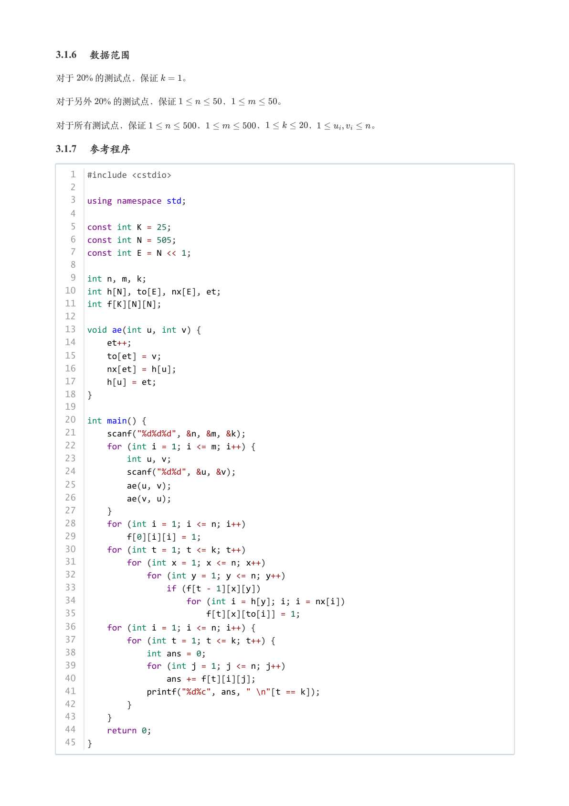

### 提取文本

```
3.1.6 数据范围

对于  % 的测试点，保证   。

对于另外  % 的测试点，保证     ，     。


对于所有测试点，保证      ，      ，     ，      。

3.1.7 参考程序

   1  #include <cstdio>
   2
   3  using namespace std;
   4
   5  const int K = 25;
   6  const int N = 505;
   7  const int E = N << 1;
   8
   9  int n, m, k;
  10  int h[N], to[E], nx[E], et;
  11  int f[K][N][N];
  12
  13  void ae(int u, int v) {
  14      et++;
  15      to[et] = v;
  16      nx[et] = h[u];
  17      h[u] = et;
  18  }
  19
  20  int main() {
  21      scanf("%d%d%d", &n, &m, &k);
  22      for (int i = 1; i <= m; i++) {
  23          int u, v;
  24          scanf("%d%d", &u, &v);
  25          ae(u, v);
  26          ae(v, u);
  27      }
  28      for (int i = 1; i <= n; i++)
  29          f[0][i][i] = 1;
  30      for (int t = 1; t <= k; t++)
  31          for (int x = 1; x <= n; x++)
  32              for (int y = 1; y <= n; y++)
  33                  if (f[t - 1][x][y])
  34                      for (int i = h[y]; i; i = nx[i])
  35                          f[t][x][to[i]] = 1;
  36      for (int i = 1; i <= n; i++) {
  37          for (int t = 1; t <= k; t++) {
  38              int ans = 0;
  39              for (int j = 1; j <= n; j++)
  40                  ans += f[t][i][j];
  41              printf("%d%c", ans, " \n"[t == k]);
  42          }
  43      }
  44      return 0;
  45  }
```

## 第 12 页

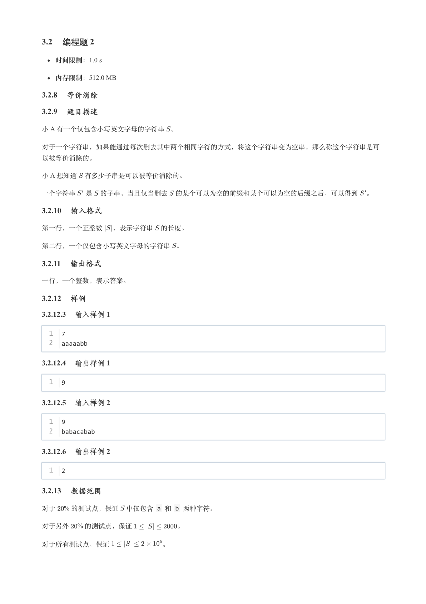

### 提取文本

```
3.2 编程题 2

   时间限制：1.0 s

   内存限制：512.0 MB

3.2.8 等价消除

3.2.9 题目描述

小 A 有一个仅包含小写英文字母的字符串 。


对于一个字符串，如果能通过每次删去其中两个相同字符的方式，将这个字符串变为空串，那么称这个字符串是可

以被等价消除的。

小 A 想知道 有多少子串是可以被等价消除的。


一个字符串 是 的子串，当且仅当删去 的某个可以为空的前缀和某个可以为空的后缀之后，可以得到 。

3.2.10 输入格式

第一行，一个正整数 ，表示字符串 的长度。


第二行，一个仅包含小写英文字母的字符串 。

3.2.11 输出格式

一行，一个整数，表示答案。

3.2.12 样例

3.2.12.3 输入样例 1

  1  7
  2  aaaaabb

3.2.12.4 输出样例 1

  1  9

3.2.12.5 输入样例 2

  1  9
  2  babacabab

3.2.12.6 输出样例 2

  1  2

3.2.13 数据范围

对于  % 的测试点，保证 中仅包含 a 和 b 两种字符。

对于另外  % 的测试点，保证       。


对于所有测试点，保证        。
```

## 第 13 页

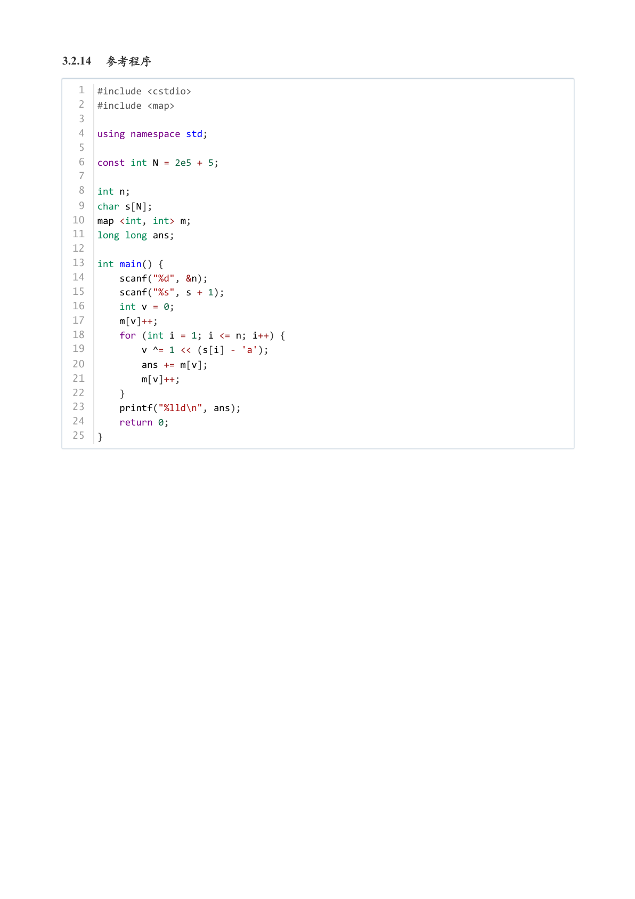

### 提取文本

```
3.2.14 参考程序

   1  #include <cstdio>
   2  #include <map>
   3
   4  using namespace std;
   5
   6  const int N = 2e5 + 5;
   7
   8  int n;
   9  char s[N];
  10  map <int, int> m;
  11  long long ans;
  12
  13  int main() {
  14      scanf("%d", &n);
  15      scanf("%s", s + 1);
  16      int v = 0;
  17      m[v]++;
  18      for (int i = 1; i <= n; i++) {
  19          v ^= 1 << (s[i] - 'a');
  20          ans += m[v];
  21          m[v]++;
  22      }
  23      printf("%lld\n", ans);
  24      return 0;
  25  }
```
