# 2025年3月-C++8级

- 原始 PDF：[`pdfs/2025年3月-C++8级.pdf`](../pdfs/2025年3月-C++8级.pdf)
- 页数：12
- 转换脚本：[`scripts/convert_pdfs_to_markdown.py`](../scripts/convert_pdfs_to_markdown.py)

> 为尽量避免信息丢失，每页均附带页面图片；文本提取结果保留原有顺序与换行特征，个别公式、图形、特殊排版请以页面图片为准。

## 第 1 页

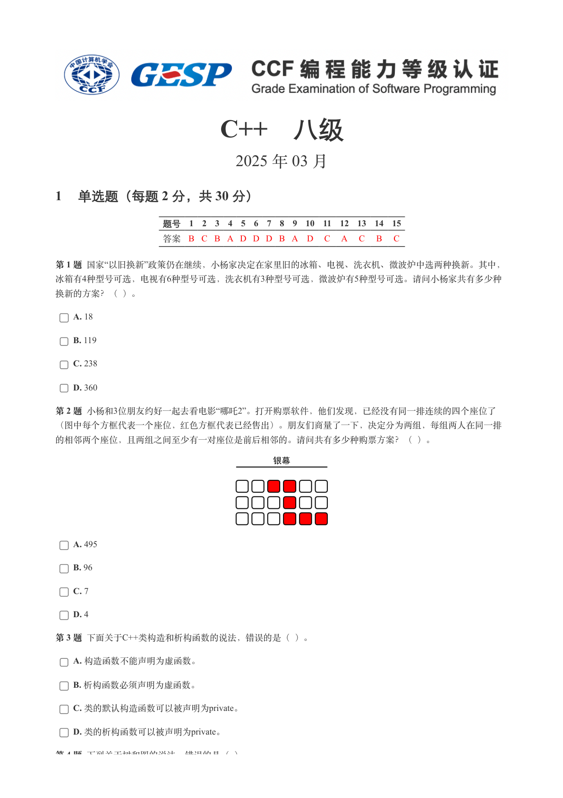

### 提取文本

```
C++　八级

                      2025 年 03 月

1 单选题（每题 2 分，共 30 分）


            题号  1  2  3  4  5  6  7  8  9  10  11  12  13  14  15
            答案 B C B A D D D B A D  C  A  C  B  C


第 1 题 国家“以旧换新”政策仍在继续，小杨家决定在家里旧的冰箱、电视、洗衣机、微波炉中选两种换新。其中，
冰箱有4种型号可选，电视有6种型号可选，洗衣机有3种型号可选，微波炉有5种型号可选。请问小杨家共有多少种

换新的方案？（ ）。

    A. 18

    B. 119

    C. 238

    D. 360

第 2 题 小杨和3位朋友约好一起去看电影“哪吒2”。打开购票软件，他们发现，已经没有同一排连续的四个座位了

（图中每个方框代表一个座位，红色方框代表已经售出）。朋友们商量了一下，决定分为两组，每组两人在同一排

的相邻两个座位，且两组之间至少有一对座位是前后相邻的。请问共有多少种购票方案？（ ）。


    A. 495

    B. 96

    C. 7

    D. 4

第 3 题 下面关于C++类构造和析构函数的说法，错误的是（ ）。

    A. 构造函数不能声明为虚函数。

    B. 析构函数必须声明为虚函数。

    C. 类的默认构造函数可以被声明为private。

    D. 类的析构函数可以被声明为private。

第 4 题 下列关于树和图的说法，错误的是（ ）。
```

## 第 2 页

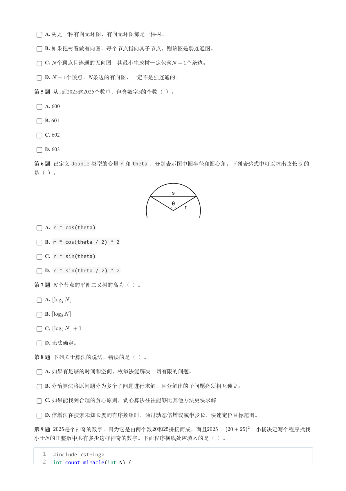

### 提取文本

```
A. 树是一种有向无环图，有向无环图都是一棵树。

    B. 如果把树看做有向图，每个节点指向其子节点，则该图是弱连通图。

    C. 个顶点且连通的无向图，其最小生成树一定包含   个条边。

    D.   个顶点、 条边的有向图，一定不是强连通的。

第 5 题 从1到2025这2025个数中，包含数字5的个数（ ）。

    A. 600

    B. 601

    C. 602

    D. 603

第 6 题 已定义double 类型的变量r 和theta ，分别表示图中圆半径和圆心角。下列表达式中可以求出弦长s 的

是（ ）。


    A. r * cos(theta)

    B. r * cos(theta / 2) * 2

    C. r * sin(theta)

    D. r * sin(theta / 2) * 2

第 7 题 个节点的平衡二叉树的高为（ ）。

    A.

    B.

    C.

    D. 无法确定。

第 8 题 下列关于算法的说法，错误的是（ ）。

    A. 如果有足够的时间和空间，枚举法能解决一切有限的问题。

    B. 分治算法将原问题分为多个子问题进行求解，且分解出的子问题必须相互独立。

    C. 如果能找到合理的贪心原则，贪心算法往往能够比其他方法更快求解。

    D. 倍增法在搜索未知长度的有序数组时，通过动态倍增或减半步长，快速定位目标范围。

第 9 题   是个神奇的数字，因为它是由两个数 和 拼接而成，而且        。小杨决定写个程序找找

小于 的正整数中共有多少这样神奇的数字。下面程序横线处应填入的是（ ）。


   1  #include <string>
   2  int count_miracle(int N) {
```

## 第 3 页

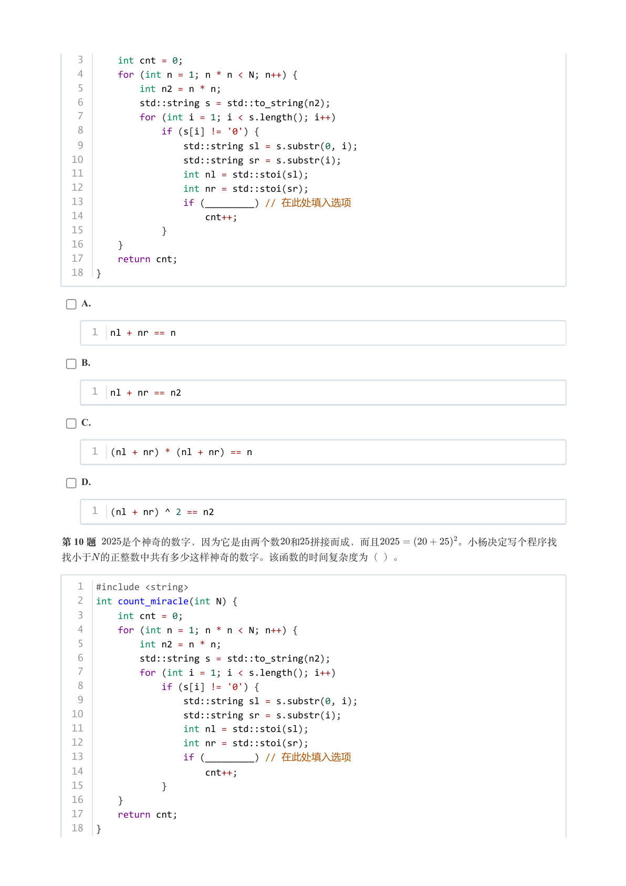

### 提取文本

```
3      int cnt = 0;
   4      for (int n = 1; n * n < N; n++) {
   5          int n2 = n * n;
   6          std::string s = std::to_string(n2);
   7          for (int i = 1; i < s.length(); i++)
   8              if (s[i] != '0') {
   9                  std::string sl = s.substr(0, i);
  10                  std::string sr = s.substr(i);
  11                  int nl = std::stoi(sl);
  12                  int nr = std::stoi(sr);
  13                  if (_________) // 在此处填入选项
  14                      cnt++;
  15              }
  16      }
  17      return cnt;
  18  }


    A.


     1  nl + nr == n


    B.


     1  nl + nr == n2


    C.


     1  (nl + nr) * (nl + nr) == n


    D.


     1  (nl + nr) ^ 2 == n2


第 10 题   是个神奇的数字，因为它是由两个数 和 拼接而成，而且        。小杨决定写个程序找

找小于 的正整数中共有多少这样神奇的数字。该函数的时间复杂度为（ ）。


   1  #include <string>
   2  int count_miracle(int N) {
   3      int cnt = 0;
   4      for (int n = 1; n * n < N; n++) {
   5          int n2 = n * n;
   6          std::string s = std::to_string(n2);
   7          for (int i = 1; i < s.length(); i++)
   8              if (s[i] != '0') {
   9                  std::string sl = s.substr(0, i);
  10                  std::string sr = s.substr(i);
  11                  int nl = std::stoi(sl);
  12                  int nr = std::stoi(sr);
  13                  if (_________) // 在此处填入选项
  14                      cnt++;
  15              }
  16      }
  17      return cnt;
  18  }
```

## 第 4 页

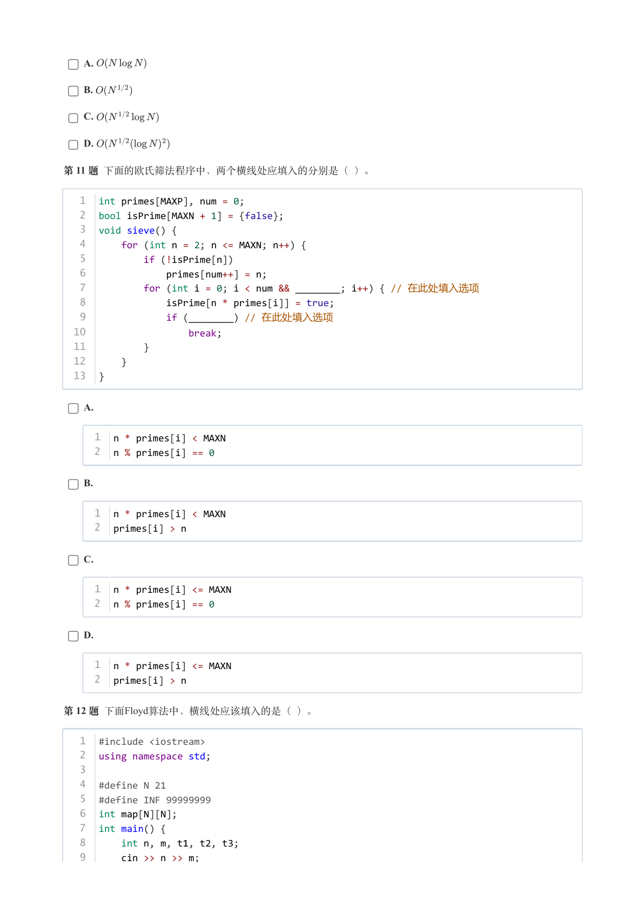

### 提取文本

```
A.

    B.

    C.

    D.

第 11 题 下面的欧氏筛法程序中，两个横线处应填入的分别是（ ）。


   1  int primes[MAXP], num = 0;
   2  bool isPrime[MAXN + 1] = {false};
   3  void sieve() {
   4      for (int n = 2; n <= MAXN; n++) {
   5          if (!isPrime[n])
   6              primes[num++] = n;
   7          for (int i = 0; i < num && ________; i++) { // 在此处填入选项
   8              isPrime[n * primes[i]] = true;
   9              if (________) // 在此处填入选项
  10                  break;
  11          }
  12      }
  13  }


    A.


     1  n * primes[i] < MAXN
     2  n % primes[i] == 0


    B.


     1  n * primes[i] < MAXN
     2  primes[i] > n


    C.


     1  n * primes[i] <= MAXN
     2  n % primes[i] == 0


    D.


     1  n * primes[i] <= MAXN
     2  primes[i] > n


第 12 题 下面Floyd算法中，横线处应该填入的是（ ）。


   1  #include <iostream>
   2  using namespace std;
   3
   4  #define N 21
   5  #define INF 99999999
   6  int map[N][N];
   7  int main() {
   8      int n, m, t1, t2, t3;
   9      cin >> n >> m;
```

## 第 5 页

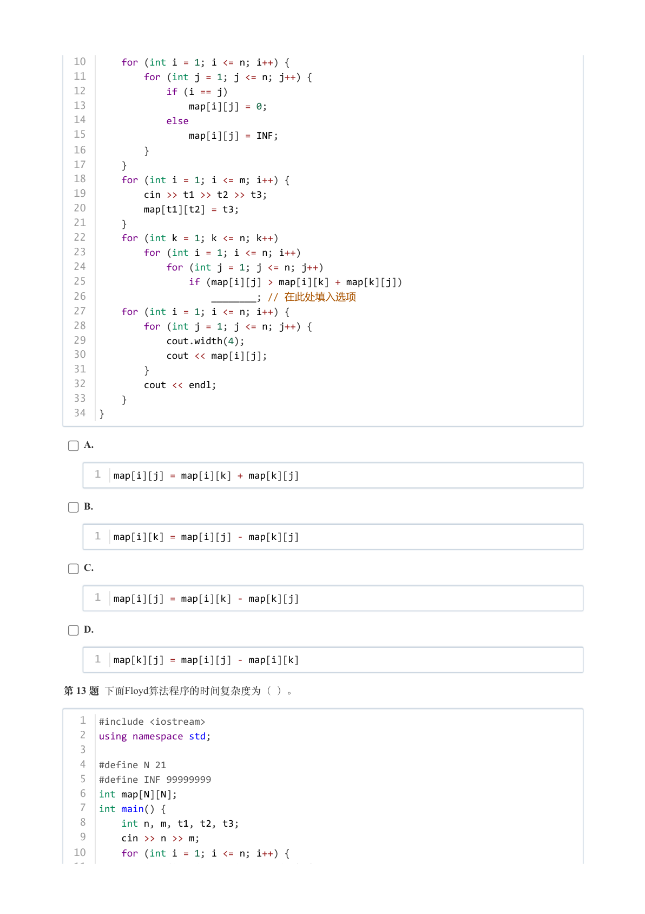

### 提取文本

```
10      for (int i = 1; i <= n; i++) {
  11          for (int j = 1; j <= n; j++) {
  12              if (i == j)
  13                  map[i][j] = 0;
  14              else
  15                  map[i][j] = INF;
  16          }
  17      }
  18      for (int i = 1; i <= m; i++) {
  19          cin >> t1 >> t2 >> t3;
  20          map[t1][t2] = t3;
  21      }
  22      for (int k = 1; k <= n; k++)
  23          for (int i = 1; i <= n; i++)
  24              for (int j = 1; j <= n; j++)
  25                  if (map[i][j] > map[i][k] + map[k][j])
  26                      ________; // 在此处填入选项
  27      for (int i = 1; i <= n; i++) {
  28          for (int j = 1; j <= n; j++) {
  29              cout.width(4);
  30              cout << map[i][j];
  31          }
  32          cout << endl;
  33      }
  34  }


    A.


     1  map[i][j] = map[i][k] + map[k][j]


    B.


     1  map[i][k] = map[i][j] - map[k][j]


    C.


     1  map[i][j] = map[i][k] - map[k][j]


    D.


     1  map[k][j] = map[i][j] - map[i][k]


第 13 题 下面Floyd算法程序的时间复杂度为（ ）。


   1  #include <iostream>
   2  using namespace std;
   3
   4  #define N 21
   5  #define INF 99999999
   6  int map[N][N];
   7  int main() {
   8      int n, m, t1, t2, t3;
   9      cin >> n >> m;
  10      for (int i = 1; i <= n; i++) {
  11          for (int j = 1; j <= n; j++) {
```

## 第 6 页

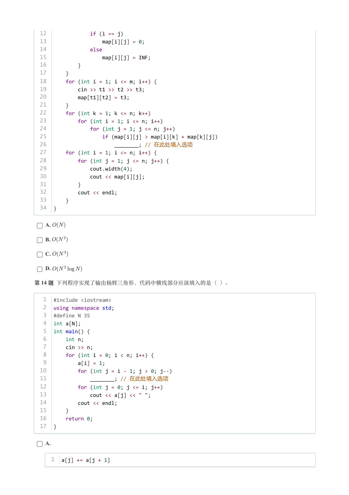

### 提取文本

```
12              if (i == j)
  13                  map[i][j] = 0;
  14              else
  15                  map[i][j] = INF;
  16          }
  17      }
  18      for (int i = 1; i <= m; i++) {
  19          cin >> t1 >> t2 >> t3;
  20          map[t1][t2] = t3;
  21      }
  22      for (int k = 1; k <= n; k++)
  23          for (int i = 1; i <= n; i++)
  24              for (int j = 1; j <= n; j++)
  25                  if (map[i][j] > map[i][k] + map[k][j])
  26                      ________; // 在此处填入选项
  27      for (int i = 1; i <= n; i++) {
  28          for (int j = 1; j <= n; j++) {
  29              cout.width(4);
  30              cout << map[i][j];
  31          }
  32          cout << endl;
  33      }
  34  }


    A.

    B.

    C.

    D.

第 14 题 下列程序实现了输出杨辉三角形，代码中横线部分应该填入的是（ ）。


   1  #include <iostream>
   2  using namespace std;
   3  #define N 35
   4  int a[N];
   5  int main() {
   6      int n;
   7      cin >> n;
   8      for (int i = 0; i < n; i++) {
   9          a[i] = 1;
  10          for (int j = i - 1; j > 0; j--)
  11              ________; // 在此处填入选项
  12          for (int j = 0; j <= i; j++)
  13              cout << a[j] << " ";
  14          cout << endl;
  15      }
  16      return 0;
  17  }


    A.


     1  a[j] += a[j + 1]
```

## 第 7 页

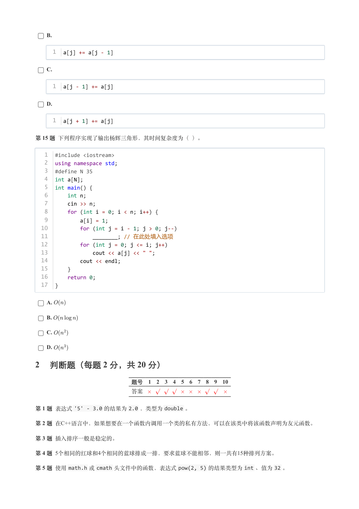

### 提取文本

```
B.


     1  a[j] += a[j - 1]


    C.


     1  a[j - 1] += a[j]


    D.


     1  a[j + 1] += a[j]


第 15 题 下列程序实现了输出杨辉三角形，其时间复杂度为（ ）。


   1  #include <iostream>
   2  using namespace std;
   3  #define N 35
   4  int a[N];
   5  int main() {
   6      int n;
   7      cin >> n;
   8      for (int i = 0; i < n; i++) {
   9          a[i] = 1;
  10          for (int j = i - 1; j > 0; j--)
  11              ________; // 在此处填入选项
  12          for (int j = 0; j <= i; j++)
  13              cout << a[j] << " ";
  14          cout << endl;
  15      }
  16      return 0;
  17  }


    A.

    B.

    C.

    D.

2 判断题（每题 2 分，共 20 分）

                 题号  1  2  3  4  5  6  7  8  9  10

                 答案


第 1 题 表达式'5' - 3.0 的结果为2.0 ，类型为double 。

第 2 题 在C++语言中，如果想要在一个函数内调用一个类的私有方法，可以在该类中将该函数声明为友元函数。

第 3 题 插入排序一般是稳定的。

第 4 题 5个相同的红球和4个相同的蓝球排成一排，要求蓝球不能相邻，则一共有15种排列方案。

第 5 题 使用math.h 或cmath 头文件中的函数，表达式pow(2, 5) 的结果类型为int 、值为32 。
```

## 第 8 页

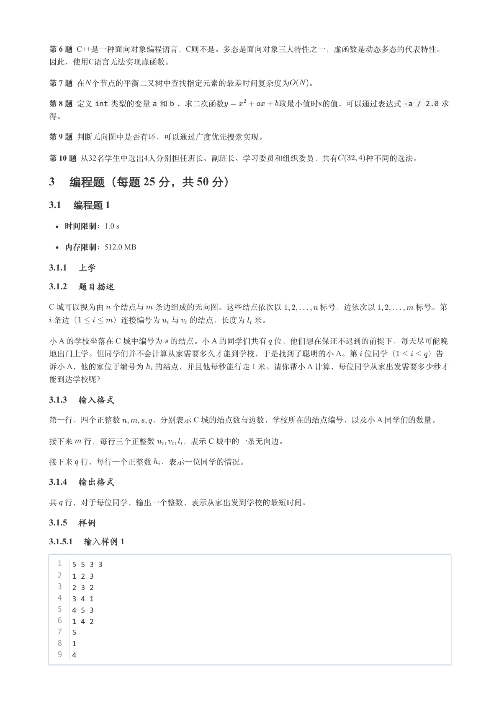

### 提取文本

```
第 6 题 C++是一种面向对象编程语言，C则不是。多态是面向对象三大特性之一，虚函数是动态多态的代表特性。
因此，使用C语言无法实现虚函数。

第 7 题 在 个节点的平衡二叉树中查找指定元素的最差时间复杂度为  。

第 8 题 定义int 类型的变量a 和b ，求二次函数       取最小值时x的值，可以通过表达式-a / 2.0 求

得。

第 9 题 判断无向图中是否有环，可以通过广度优先搜索实现。

第 10 题 从32名学生中选出4人分别担任班长、副班长、学习委员和组织委员，共有    种不同的选法。

3 编程题（每题 25 分，共 50 分）

3.1 编程题 1

   时间限制：1.0 s

   内存限制：512.0 MB

3.1.1 上学

3.1.2 题目描述

C 城可以视为由 个结点与 条边组成的无向图。这些结点依次以     标号，边依次以     标号。第

 条边（    ）连接编号为 与 的结点，长度为 米。

小 A 的学校坐落在 C 城中编号为 的结点。小 A 的同学们共有 位，他们想在保证不迟到的前提下，每天尽可能晚
地出门上学。但同学们并不会计算从家需要多久才能到学校，于是找到了聪明的小 A。第 位同学（    ）告
诉小 A，他的家位于编号为 的结点，并且他每秒能行走 1 米。请你帮小 A 计算，每位同学从家出发需要多少秒才

能到达学校呢？

3.1.3 输入格式

第一行，四个正整数    ，分别表示 C 城的结点数与边数，学校所在的结点编号，以及小 A 同学们的数量。

接下来 行，每行三个正整数    ，表示 C 城中的一条无向边。


接下来 行，每行一个正整数 ，表示一位同学的情况。

3.1.4 输出格式

共 行，对于每位同学，输出一个整数，表示从家出发到学校的最短时间。

3.1.5 样例

3.1.5.1 输入样例 1

  1  5 5 3 3
  2  1 2 3
  3  2 3 2
  4  3 4 1
  5  4 5 3
  6  1 4 2
  7  5
  8  1
  9  4
```

## 第 9 页

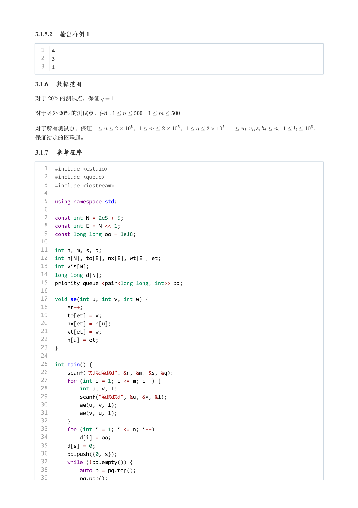

### 提取文本

```
3.1.5.2 输出样例 1

  1  4
  2  3
  3  1

3.1.6 数据范围

对于  % 的测试点，保证   。

对于另外  % 的测试点，保证      ，      。


对于所有测试点，保证       ，       ，       ，        ，     。

保证给定的图联通。

3.1.7 参考程序

   1  #include <cstdio>
   2  #include <queue>
   3  #include <iostream>
   4
   5  using namespace std;
   6
   7  const int N = 2e5 + 5;
   8  const int E = N << 1;
   9  const long long oo = 1e18;
  10
  11  int n, m, s, q;
  12  int h[N], to[E], nx[E], wt[E], et;
  13  int vis[N];
  14  long long d[N];
  15  priority_queue <pair<long long, int>> pq;
  16
  17  void ae(int u, int v, int w) {
  18      et++;
  19      to[et] = v;
  20      nx[et] = h[u];
  21      wt[et] = w;
  22      h[u] = et;
  23  }
  24
  25  int main() {
  26      scanf("%d%d%d%d", &n, &m, &s, &q);
  27      for (int i = 1; i <= m; i++) {
  28          int u, v, l;
  29          scanf("%d%d%d", &u, &v, &l);
  30          ae(u, v, l);
  31          ae(v, u, l);
  32      }
  33      for (int i = 1; i <= n; i++)
  34          d[i] = oo;
  35      d[s] = 0;
  36      pq.push({0, s});
  37      while (!pq.empty()) {
  38          auto p = pq.top();
  39          pq.pop();
```

## 第 10 页

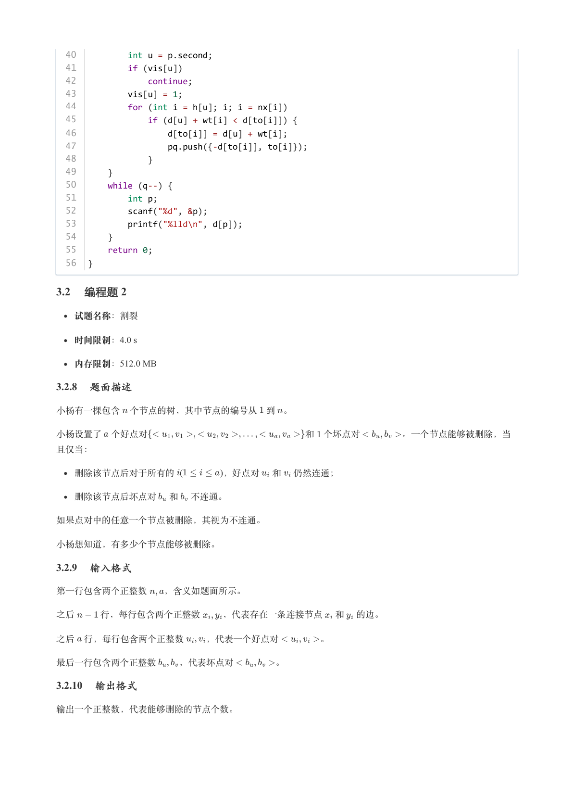

### 提取文本

```
40          int u = p.second;
  41          if (vis[u])
  42              continue;
  43          vis[u] = 1;
  44          for (int i = h[u]; i; i = nx[i])
  45              if (d[u] + wt[i] < d[to[i]]) {
  46                  d[to[i]] = d[u] + wt[i];
  47                  pq.push({-d[to[i]], to[i]});
  48              }
  49      }
  50      while (q--) {
  51          int p;
  52          scanf("%d", &p);
  53          printf("%lld\n", d[p]);
  54      }
  55      return 0;
  56  }

3.2 编程题 2

  试题名称：割裂

   时间限制：4.0 s

   内存限制：512.0 MB

3.2.8 题面描述

小杨有一棵包含 个节点的树，其中节点的编号从 到 。


小杨设置了 个好点对                 和 个坏点对     。一个节点能够被删除，当

且仅当：

  删除该节点后对于所有的  (     )，好点对 和 仍然连通；


  删除该节点后坏点对 和 不连通。


如果点对中的任意一个节点被删除，其视为不连通。


小杨想知道，有多少个节点能够被删除。

3.2.9 输入格式

第一行包含两个正整数  ，含义如题面所示。


之后   行，每行包含两个正整数  ，代表存在一条连接节点 和 的边。


之后 行，每行包含两个正整数  ，代表一个好点对     。


最后一行包含两个正整数  ，代表坏点对     。

3.2.10 输出格式

输出一个正整数，代表能够删除的节点个数。
```

## 第 11 页

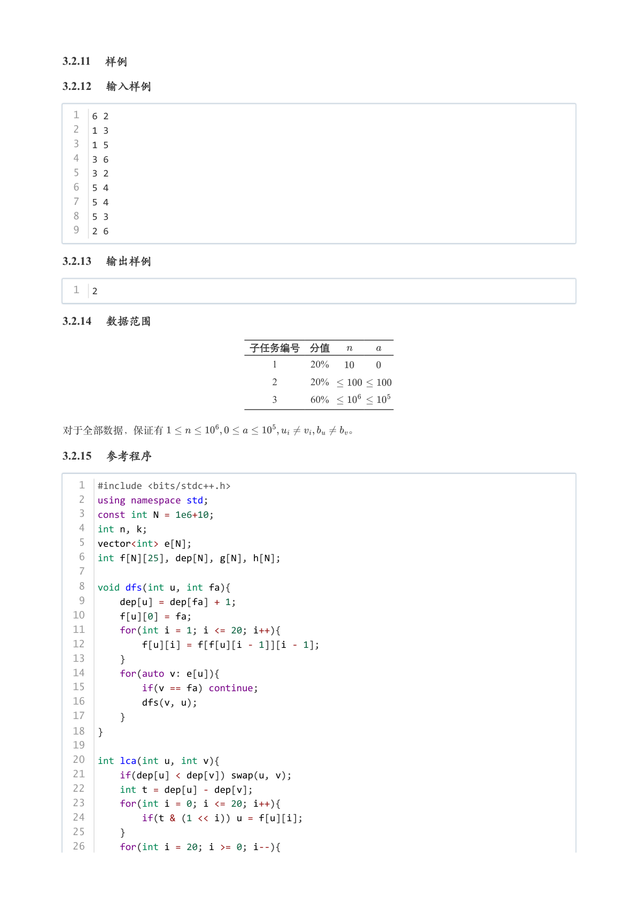

### 提取文本

```
3.2.11 样例

3.2.12 输入样例

  1  6 2
  2  1 3
  3  1 5
  4  3 6
  5  3 2
  6  5 4
  7  5 4
  8  5 3
  9  2 6

3.2.13 输出样例

  1  2

3.2.14 数据范围

                   子任务编号 分值

                                          1     20%

                                          2     20%

                                          3     60%


对于全部数据，保证有                  。

3.2.15 参考程序

   1  #include <bits/stdc++.h>
   2  using namespace std;
   3  const int N = 1e6+10;
   4  int n, k;
   5  vector<int> e[N];
   6  int f[N][25], dep[N], g[N], h[N];
   7
   8  void dfs(int u, int fa){
   9      dep[u] = dep[fa] + 1;
  10      f[u][0] = fa;
  11      for(int i = 1; i <= 20; i++){
  12          f[u][i] = f[f[u][i - 1]][i - 1];
  13      }
  14      for(auto v: e[u]){
  15          if(v == fa) continue;
  16          dfs(v, u);
  17      }
  18  }
  19
  20  int lca(int u, int v){
  21      if(dep[u] < dep[v]) swap(u, v);
  22      int t = dep[u] - dep[v];
  23      for(int i = 0; i <= 20; i++){
  24          if(t & (1 << i)) u = f[u][i];
  25      }
  26      for(int i = 20; i >= 0; i--){
```

## 第 12 页

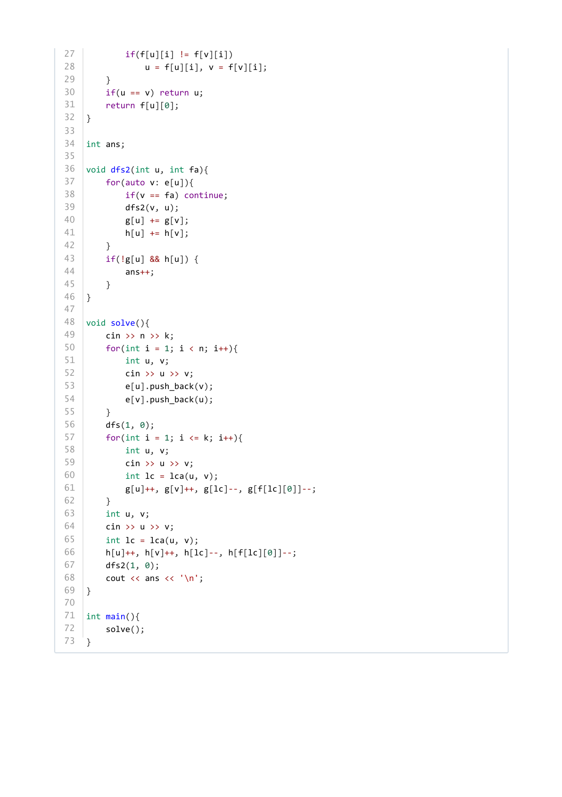

### 提取文本

```
27          if(f[u][i] != f[v][i])
28              u = f[u][i], v = f[v][i];
29      }
30      if(u == v) return u;
31      return f[u][0];
32  }
33
34  int ans;
35
36  void dfs2(int u, int fa){
37      for(auto v: e[u]){
38          if(v == fa) continue;
39          dfs2(v, u);
40          g[u] += g[v];
41          h[u] += h[v];
42      }
43      if(!g[u] && h[u]) {
44          ans++;
45      }
46  }
47
48  void solve(){
49      cin >> n >> k;
50      for(int i = 1; i < n; i++){
51          int u, v;
52          cin >> u >> v;
53          e[u].push_back(v);
54          e[v].push_back(u);
55      }
56      dfs(1, 0);
57      for(int i = 1; i <= k; i++){
58          int u, v;
59          cin >> u >> v;
60          int lc = lca(u, v);
61          g[u]++, g[v]++, g[lc]--, g[f[lc][0]]--;
62      }
63      int u, v;
64      cin >> u >> v;
65      int lc = lca(u, v);
66      h[u]++, h[v]++, h[lc]--, h[f[lc][0]]--;
67      dfs2(1, 0);
68      cout << ans << '\n';
69  }
70
71  int main(){
72      solve();
73  }
```
