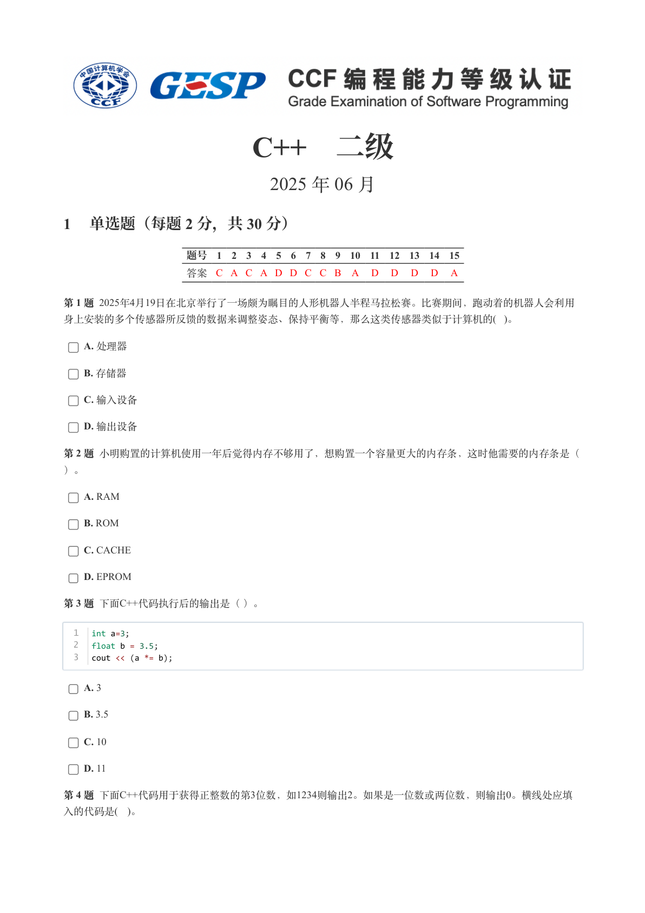
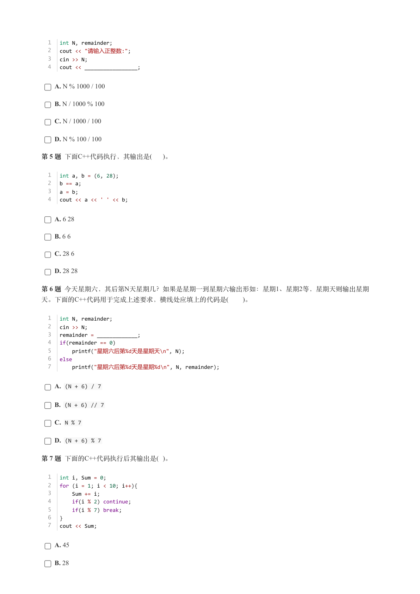
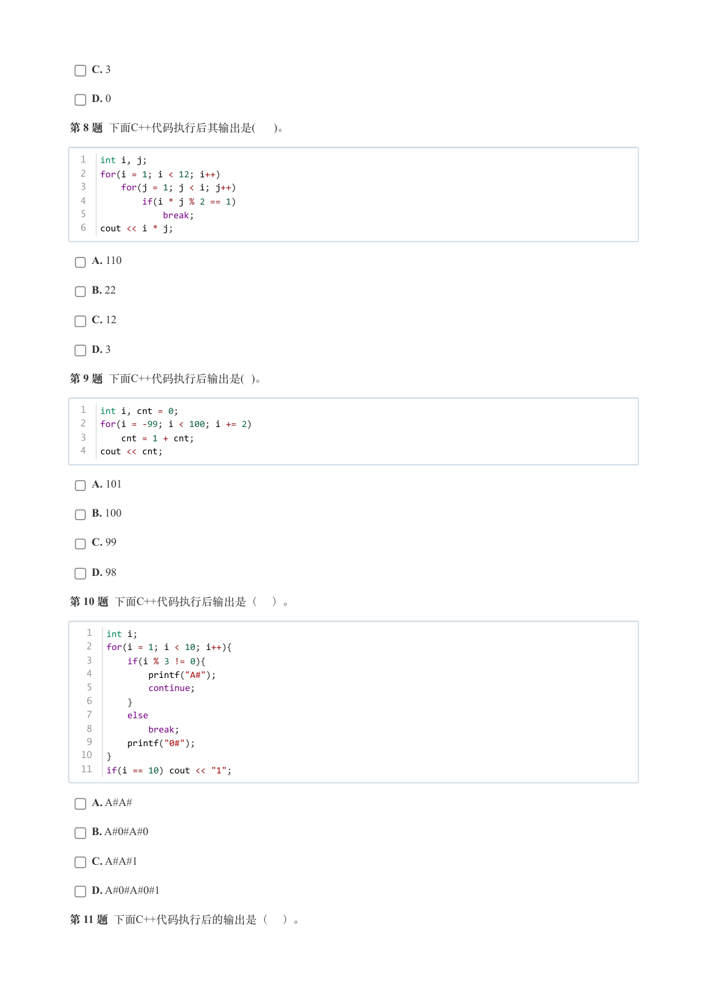
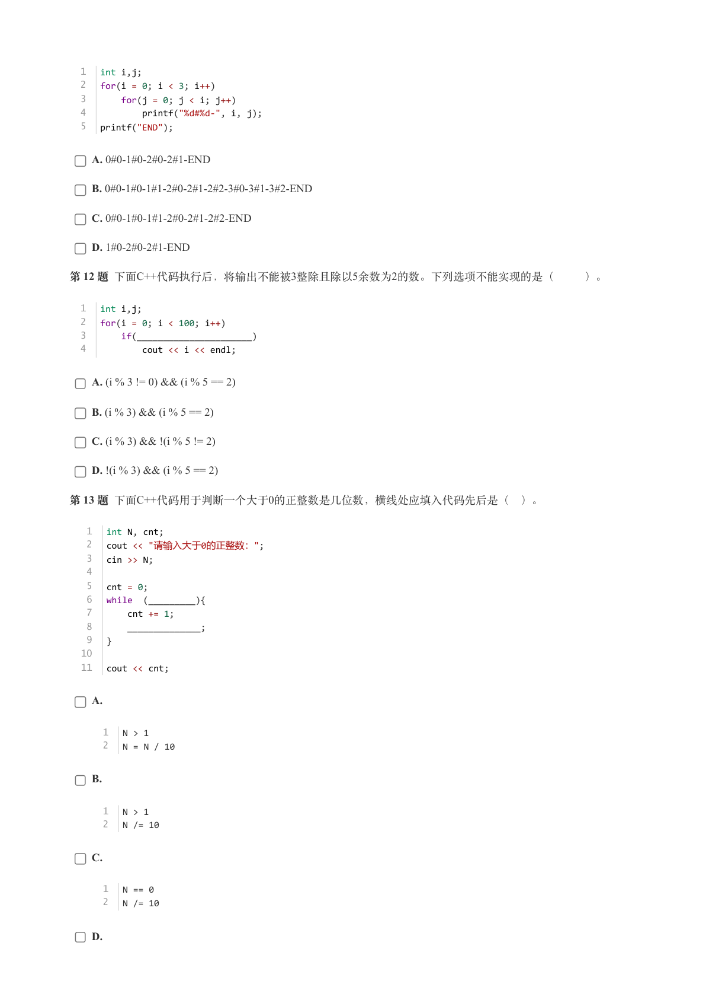
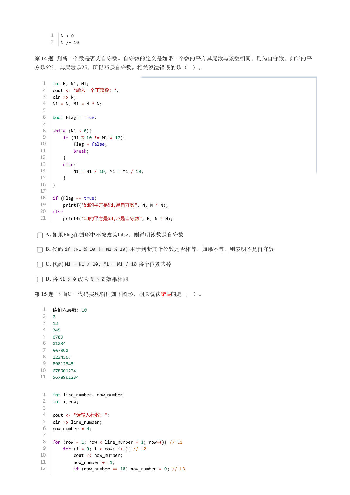
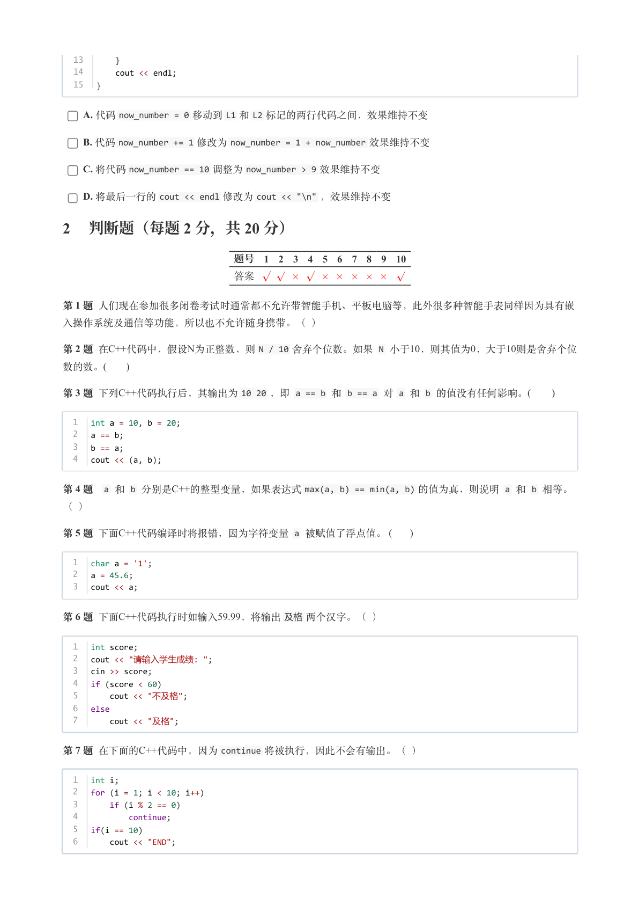
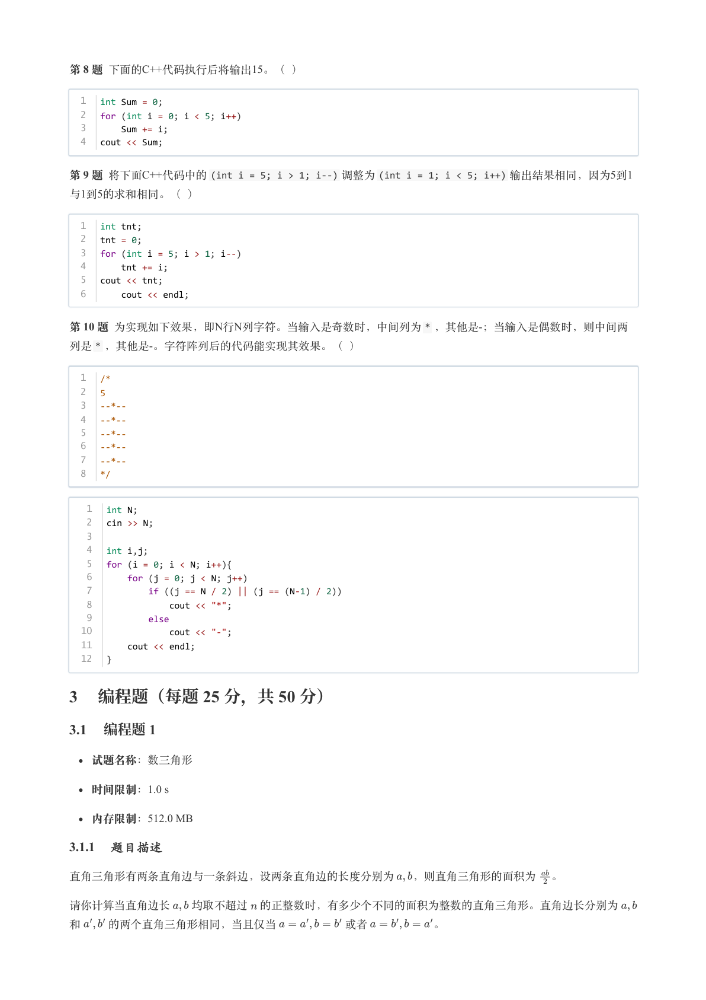
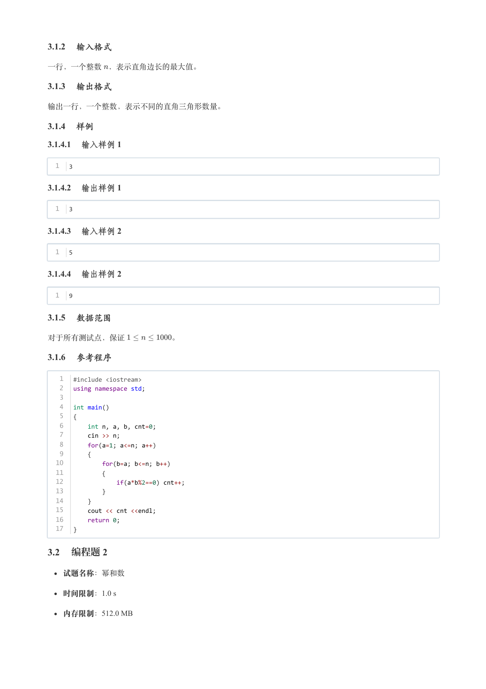
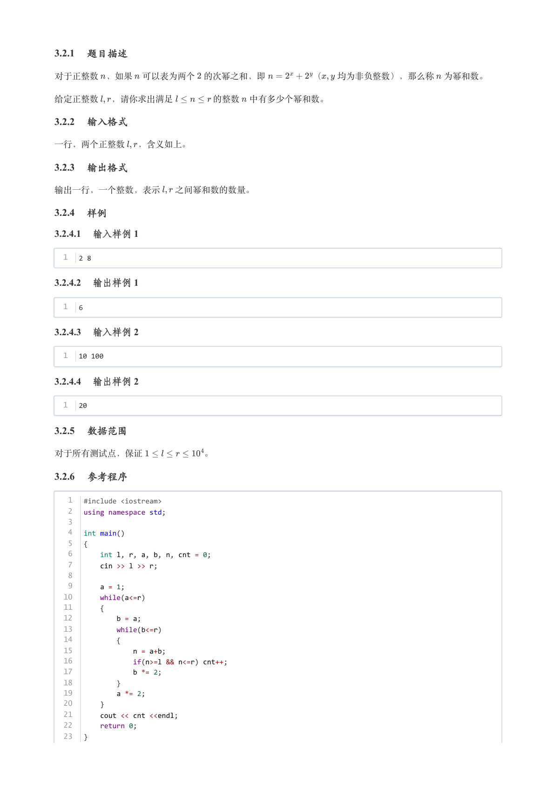

# 2025年6月-C++2级

- 原始 PDF：[`pdfs/2025年6月-C++2级.pdf`](../pdfs/2025年6月-C++2级.pdf)
- 页数：9
- 转换脚本：[`scripts/convert_pdfs_to_markdown.py`](../scripts/convert_pdfs_to_markdown.py)

> 为尽量避免信息丢失，每页均附带页面图片；文本提取结果保留原有顺序与换行特征，个别公式、图形、特殊排版请以页面图片为准。

## 第 1 页



### 提取文本

```
C++　二级

                      2025 年 06 月

1 单选题（每题 2 分，共 30 分）


            题号  1  2  3  4  5  6  7  8  9  10  11  12  13  14  15
            答案 C A C A D D C C B A  D  D  D  D  A


第 1 题 2025年4月19日在北京举行了一场颇为瞩目的人形机器人半程马拉松赛。比赛期间，跑动着的机器人会利用
身上安装的多个传感器所反馈的数据来调整姿态、保持平衡等，那么这类传感器类似于计算机的( )。

    A. 处理器

    B. 存储器

    C. 输入设备

    D. 输出设备

第 2 题 小明购置的计算机使用一年后觉得内存不够用了，想购置一个容量更大的内存条，这时他需要的内存条是（

）。

    A. RAM

    B. ROM

    C. CACHE

    D. EPROM

第 3 题 下面C++代码执行后的输出是（ ）。


  1   int a=3;
  2   float b = 3.5;
  3   cout << (a *= b);


    A. 3

    B. 3.5

    C. 10

    D. 11

第 4 题 下面C++代码用于获得正整数的第3位数，如1234则输出2。如果是一位数或两位数，则输出0。横线处应填
入的代码是( )。
```

## 第 2 页



### 提取文本

```
1   int N, remainder;
  2   cout << "请输入正整数:";
  3   cin >> N;
  4   cout << _________________;


    A. N % 1000 / 100

    B. N / 1000 % 100

    C. N / 1000 / 100

    D. N % 100 / 100

第 5 题 下面C++代码执行，其输出是(  )。


  1   int a, b = (6, 28);
  2   b == a;
  3   a = b;
  4   cout << a << ' ' << b;


    A. 6 28

    B. 6 6

    C. 28 6

    D. 28 28

第 6 题 今天星期六，其后第N天星期几？如果是星期一到星期六输出形如：星期1、星期2等，星期天则输出星期
天。下面的C++代码用于完成上述要求，横线处应填上的代码是(   )。


  1   int N, remainder;
  2   cin >> N;
  3   remainder = _____________;
  4   if(remainder == 0)
  5     printf("星期六后第%d天是星期天\n", N);
  6   else
  7     printf("星期六后第%d天是星期%d\n", N, remainder);


    A. (N + 6) / 7

    B. (N + 6) // 7

    C. N % 7

    D. (N + 6) % 7

第 7 题 下面的C++代码执行后其输出是( )。


  1   int i, Sum = 0;
  2   for (i = 1; i < 10; i++){
  3       Sum += i;
  4       if(i % 2) continue;
  5       if(i % 7) break;
  6   }
  7   cout << Sum;


    A. 45

    B. 28
```

## 第 3 页



### 提取文本

```
C. 3

    D. 0

第 8 题 下面C++代码执行后其输出是(  )。


  1   int i, j;
  2   for(i = 1; i < 12; i++)
  3       for(j = 1; j < i; j++)
  4           if(i * j % 2 == 1)
  5               break;
  6   cout << i * j;


    A. 110

    B. 22

    C. 12

    D. 3

第 9 题 下面C++代码执行后输出是( )。


  1   int i, cnt = 0;
  2   for(i = -99; i < 100; i += 2)
  3       cnt = 1 + cnt;
  4   cout << cnt;


    A. 101

    B. 100

    C. 99

    D. 98

第 10 题 下面C++代码执行后输出是（ ）。


   1   int i;
   2   for(i = 1; i < 10; i++){
   3       if(i % 3 != 0){
   4           printf("A#");
   5           continue;
   6       }
   7       else
   8           break;
   9       printf("0#");
  10   }
  11   if(i == 10) cout << "1";


    A. A#A#

    B. A#0#A#0

    C. A#A#1

    D. A#0#A#0#1

第 11 题 下面C++代码执行后的输出是（ ）。
```

## 第 4 页



### 提取文本

```
1   int i,j;
  2   for(i = 0; i < 3; i++)
  3       for(j = 0; j < i; j++)
  4           printf("%d#%d-", i, j);
  5   printf("END");


    A. 0#0-1#0-2#0-2#1-END

    B. 0#0-1#0-1#1-2#0-2#1-2#2-3#0-3#1-3#2-END

    C. 0#0-1#0-1#1-2#0-2#1-2#2-END

    D. 1#0-2#0-2#1-END

第 12 题 下面C++代码执行后，将输出不能被3整除且除以5余数为2的数。下列选项不能实现的是（   ）。


  1   int i,j;
  2   for(i = 0; i < 100; i++)
  3       if(______________________)
  4           cout << i << endl;


    A. (i % 3 != 0) && (i % 5 == 2)

    B. (i % 3) && (i % 5 == 2)

    C. (i % 3) && !(i % 5 != 2)

    D. !(i % 3) && (i % 5 == 2)

第 13 题 下面C++代码用于判断一个大于0的正整数是几位数，横线处应填入代码先后是（ ）。


   1   int N, cnt;
   2   cout << "请输入大于0的正整数：";
   3   cin >> N;
   4
   5   cnt = 0;
   6   while  (_________){
   7       cnt += 1;
   8       ______________;
   9   }
  10
  11   cout << cnt;


    A.


      1   N > 1
      2   N = N / 10


    B.


      1   N > 1
      2   N /= 10


    C.


      1   N == 0
      2   N /= 10


    D.
```

## 第 5 页



### 提取文本

```
1   N > 0
      2   N /= 10


第 14 题 判断一个数是否为自守数。自守数的定义是如果一个数的平方其尾数与该数相同，则为自守数，如25的平
方是625，其尾数是25，所以25是自守数。相关说法错误的是（ ）。


   1   int N, N1, M1;
   2   cout << "输入一个正整数：";
   3   cin >> N;
   4   N1 = N, M1 = N * N;
   5
   6   bool Flag = true;
   7
   8   while (N1 > 0){
   9       if (N1 % 10 != M1 % 10){
  10           Flag = false;
  11           break;
  12       }
  13       else{
  14           N1 = N1 / 10, M1 = M1 / 10;
  15       }
  16   }
  17
  18   if (Flag == true)
  19     printf("%d的平方是%d,是自守数", N, N * N);
  20   else
  21     printf("%d的平方是%d,不是自守数", N, N * N);


    A. 如果Flag在循环中不被改为false，则说明该数是自守数

    B. 代码if (N1 % 10 != M1 % 10) 用于判断其个位数是否相等，如果不等，则表明不是自守数

    C. 代码N1 = N1 / 10, M1 = M1 / 10 将个位数去掉

    D. 将N1 > 0 改为N > 0 效果相同

第 15 题 下面C++代码实现输出如下图形，相关说法 错误的是（ ）。


   1  请输入层数: 10
   2   0
   3   12
   4   345
   5   6789
   6   01234
   7   567890
   8   1234567
   9   89012345
  10   678901234
  11   5678901234


   1   int line_number, now_number;
   2   int i,row;
   3
   4   cout << "请输入行数: ";
   5   cin >> line_number;
   6   now_number = 0;
   7
   8   for (row = 1; row < line_number + 1; row++){ // L1
   9       for (i = 0; i < row; i++){ // L2
  10           cout << now_number;
  11           now_number += 1;
  12           if (now_number == 10) now_number = 0; // L3
```

## 第 6 页



### 提取文本

```
13       }
  14       cout << endl;
  15   }


    A. 代码now_number = 0 移动到L1 和L2 标记的两行代码之间，效果维持不变

    B. 代码now_number += 1 修改为now_number = 1 + now_number 效果维持不变

    C. 将代码now_number == 10 调整为now_number > 9 效果维持不变

    D. 将最后一行的cout << endl 修改为cout << "\n" ，效果维持不变

2 判断题（每题 2 分，共 20 分）

                 题号  1  2  3  4  5  6  7  8  9  10

                 答案


第 1 题 人们现在参加很多闭卷考试时通常都不允许带智能手机、平板电脑等，此外很多种智能手表同样因为具有嵌

入操作系统及通信等功能，所以也不允许随身携带。（ ）

第 2 题 在C++代码中，假设N为正整数，则N / 10 舍弃个位数。如果 N 小于10，则其值为0，大于10则是舍弃个位

数的数。(      )

第 3 题 下列C++代码执行后，其输出为10 20 ，即 a == b 和 b == a 对 a 和 b 的值没有任何影响。(      )


  1   int a = 10, b = 20;
  2   a == b;
  3   b == a;
  4   cout << (a, b);


第 4 题  a 和 b 分别是C++的整型变量，如果表达式max(a, b) == min(a, b) 的值为真，则说明 a 和 b 相等。

（ ）

第 5 题 下面C++代码编译时将报错，因为字符变量 a 被赋值了浮点值。 (     )


  1   char a = '1';
  2   a = 45.6;
  3   cout << a;

第 6 题 下面C++代码执行时如输入59.99，将输出及格两个汉字。（ ）


  1   int score;
  2   cout << "请输入学生成绩: ";
  3   cin >> score;
  4   if (score < 60)
  5       cout << "不及格";
  6   else
  7       cout << "及格";


第 7 题 在下面的C++代码中，因为continue 将被执行，因此不会有输出。（ ）


  1   int i;
  2   for (i = 1; i < 10; i++)
  3       if (i % 2 == 0)
  4           continue;
  5   if(i == 10)
  6       cout << "END";
```

## 第 7 页



### 提取文本

```
第 8 题 下面的C++代码执行后将输出15。（ ）


  1   int Sum = 0;
  2   for (int i = 0; i < 5; i++)
  3       Sum += i;
  4   cout << Sum;


第 9 题 将下面C++代码中的(int i = 5; i > 1; i--) 调整为(int i = 1; i < 5; i++) 输出结果相同，因为5到1

与1到5的求和相同。（ ）


  1   int tnt;
  2   tnt = 0;
  3   for (int i = 5; i > 1; i--)
  4       tnt += i;
  5   cout << tnt;
  6       cout << endl;


第 10 题 为实现如下效果，即N行N列字符。当输入是奇数时，中间列为* ，其他是-；当输入是偶数时，则中间两
列是* ，其他是-。字符阵列后的代码能实现其效果。（ ）


  1   /*
  2   5
  3   --*--
  4   --*--
  5   --*--
  6   --*--
  7   --*--
  8   */


   1   int N;
   2   cin >> N;
   3
   4   int i,j;
   5   for (i = 0; i < N; i++){
   6       for (j = 0; j < N; j++)
   7           if ((j == N / 2) || (j == (N-1) / 2))
   8               cout << "*";
   9           else
  10               cout << "-";
  11       cout << endl;
  12   }

3 编程题（每题 25 分，共 50 分）

3.1 编程题 1


  试题名称：数三角形

   时间限制：1.0 s

   内存限制：512.0 MB

3.1.1 题目描述

直角三角形有两条直角边与一条斜边，设两条直角边的长度分别为  ，则直角三角形的面积为 。


请你计算当直角边长  均取不超过 的正整数时，有多少个不同的面积为整数的直角三角形。直角边长分别为

和  的两个直角三角形相同，当且仅当      或者      。
```

## 第 8 页



### 提取文本

```
3.1.2 输入格式

一行，一个整数 ，表示直角边长的最大值。

3.1.3 输出格式

输出一行，一个整数，表示不同的直角三角形数量。

3.1.4 样例

3.1.4.1 输入样例 1


  1   3

3.1.4.2 输出样例 1


  1   3

3.1.4.3 输入样例 2


  1   5

3.1.4.4 输出样例 2


  1   9

3.1.5 数据范围

对于所有测试点，保证      。

3.1.6 参考程序


   1   #include <iostream>
   2   using namespace std;
   3
   4   int main()
   5   {
   6       int n, a, b, cnt=0;
   7       cin >> n;
   8       for(a=1; a<=n; a++)
   9       {
  10           for(b=a; b<=n; b++)
  11           {
  12               if(a*b%2==0) cnt++;
  13           }
  14       }
  15       cout << cnt <<endl;
  16       return 0;
  17   }

3.2 编程题 2


  试题名称：幂和数

   时间限制：1.0 s

   内存限制：512.0 MB
```

## 第 9 页



### 提取文本

```
3.2.1 题目描述

对于正整数 ，如果 可以表为两个 的次幂之和，即     （  均为非负整数），那么称 为幂和数。


给定正整数 ，请你求出满足     的整数 中有多少个幂和数。

3.2.2 输入格式

一行，两个正整数 ，含义如上。

3.2.3 输出格式

输出一行，一个整数，表示  之间幂和数的数量。

3.2.4 样例

3.2.4.1 输入样例 1


  1   2 8

3.2.4.2 输出样例 1


  1   6

3.2.4.3 输入样例 2


  1   10 100

3.2.4.4 输出样例 2


  1   20

3.2.5 数据范围

对于所有测试点，保证       。

3.2.6 参考程序


   1   #include <iostream>
   2   using namespace std;
   3
   4   int main()
   5   {
   6       int l, r, a, b, n, cnt = 0;
   7       cin >> l >> r;
   8
   9       a = 1;
  10       while(a<=r)
  11       {
  12           b = a;
  13           while(b<=r)
  14           {
  15               n = a+b;
  16               if(n>=l && n<=r) cnt++;
  17               b *= 2;
  18           }
  19           a *= 2;
  20       }
  21       cout << cnt <<endl;
  22       return 0;
  23   }
```
