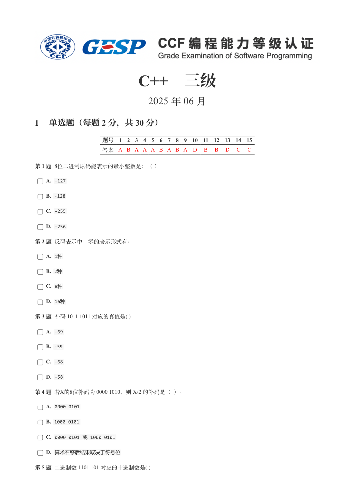
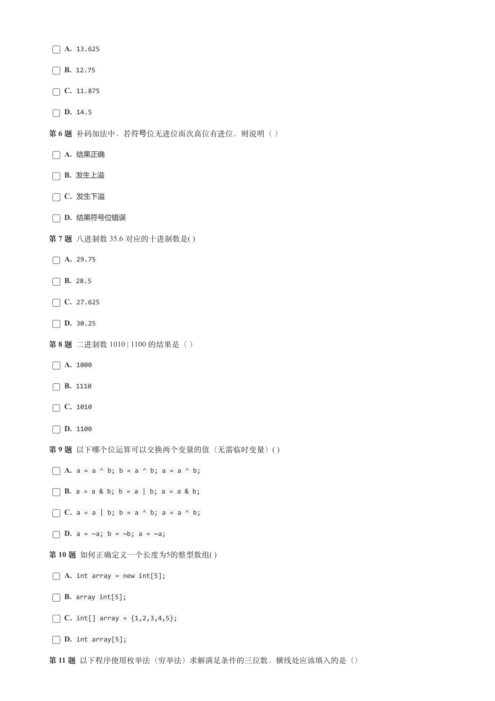
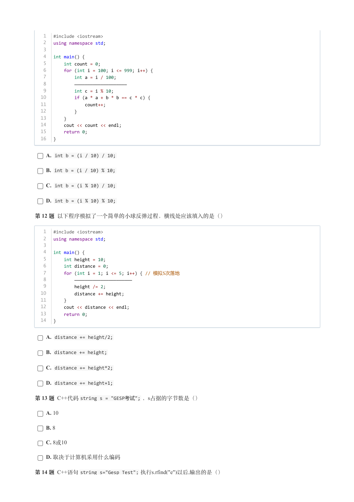
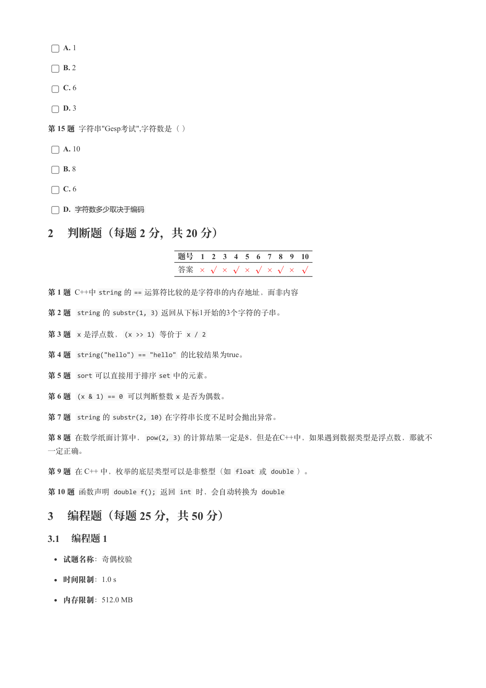
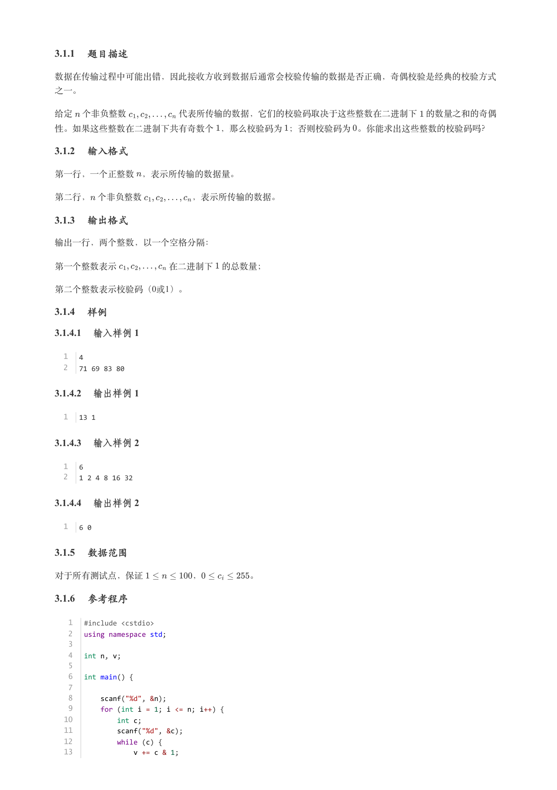
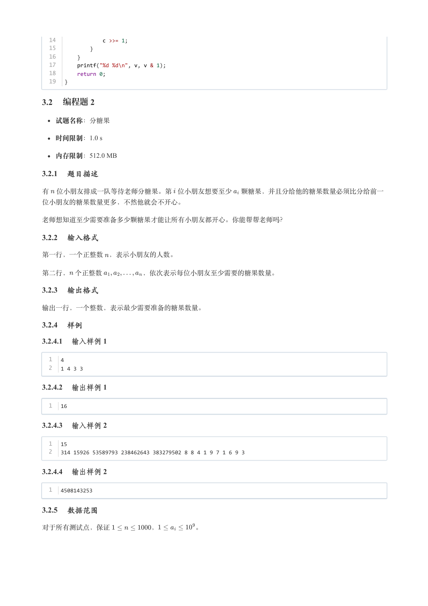
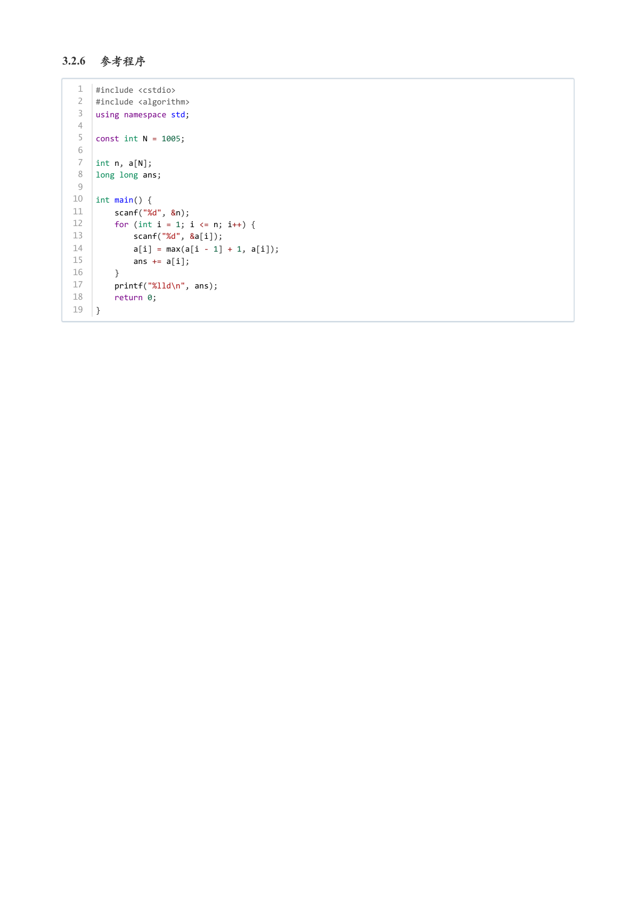

# 2025年6月-C++3级

- 原始 PDF：[`pdfs/2025年6月-C++3级.pdf`](../pdfs/2025年6月-C++3级.pdf)
- 页数：7
- 转换脚本：[`scripts/convert_pdfs_to_markdown.py`](../scripts/convert_pdfs_to_markdown.py)

> 为尽量避免信息丢失，每页均附带页面图片；文本提取结果保留原有顺序与换行特征，个别公式、图形、特殊排版请以页面图片为准。

## 第 1 页



### 提取文本

```
C++　三级

                      2025 年 06 月

1 单选题（每题 2 分，共 30 分）


            题号  1  2  3  4  5  6  7  8  9  10  11  12  13  14  15
            答案 A B A A A B A B A D  B  B  D  C  C


第 1 题 8位二进制原码能表示的最小整数是：（ ）

    A. -127

    B. -128

    C. -255

    D. -256

第 2 题 反码表示中，零的表示形式有：

    A. 1种

    B. 2种

    C. 8种

    D. 16种

第 3 题 补码 1011 1011 对应的真值是( )

    A. -69

    B. -59

    C. -68

    D. -58

第 4 题 若X的8位补码为 0000 1010，则 X/2 的补码是（ ）。

    A. 0000 0101

    B. 1000 0101

    C. 0000 0101 或 1000 0101

    D. 算术右移后结果取决于符号位

第 5 题 二进制数 1101.101 对应的十进制数是( )
```

## 第 2 页



### 提取文本

```
A. 13.625

    B. 12.75

    C. 11.875

    D. 14.5

第6 题补码加法中，若符号位⽆进位⽽次⾼位有进位，则说明（）

    A. 结果正确

    B. 发生上溢

    C. 发生下溢

    D. 结果符号位错误

第 7 题 八进制数 35.6 对应的十进制数是( )

    A. 29.75

    B. 28.5

    C. 27.625

    D. 30.25

第 8 题 二进制数 1010 | 1100 的结果是（ ）

    A. 1000

    B. 1110

    C. 1010

    D. 1100

第 9 题 以下哪个位运算可以交换两个变量的值（无需临时变量）( )

    A. a = a ^ b; b = a ^ b; a = a ^ b;

    B. a = a & b; b = a | b; a = a & b;

    C. a = a | b; b = a ^ b; a = a ^ b;

    D. a = ~a; b = ~b; a = ~a;

第 10 题 如何正确定义一个长度为5的整型数组( )

    A. int array = new int[5];

    B. array int[5];

    C. int[] array = {1,2,3,4,5};

    D. int array[5];

第 11 题 以下程序使用枚举法（穷举法）求解满足条件的三位数，横线处应该填入的是（）
```

## 第 3 页



### 提取文本

```
1   #include <iostream>
   2   using namespace std;
   3
   4   int main() {
   5       int count = 0;
   6       for (int i = 100; i <= 999; i++) {
   7           int a = i / 100;
   8           ————————————————————
   9           int c = i % 10;
  10           if (a * a + b * b == c * c) {
  11               count++;
  12           }
  13       }
  14       cout << count << endl;
  15       return 0;
  16   }


    A. int b = (i / 10) / 10;

    B. int b = (i / 10) % 10;

    C. int b = (i % 10) / 10;

    D. int b = (i % 10) % 10;

第 12 题 以下程序模拟了一个简单的小球反弹过程，横线处应该填入的是（）


   1   #include <iostream>
   2   using namespace std;
   3
   4   int main() {
   5       int height = 10;
   6       int distance = 0;
   7       for (int i = 1; i <= 5; i++) { // 模拟5次落地
   8           ——————————————————————
   9           height /= 2;
  10           distance += height;
  11       }
  12       cout << distance << endl;
  13       return 0;
  14   }


    A. distance += height/2;

    B. distance += height;

    C. distance += height*2;

    D. distance += height+1;

第 13 题 C++代码string s = "GESP考试"; ，s占据的字节数是（）

    A. 10

    B. 8

    C. 8或10

    D. 取决于计算机采用什么编码

第 14 题 C++语句string s="Gesp Test"; 执行s.rfind("e")以后,输出的是（）
```

## 第 4 页



### 提取文本

```
A. 1

    B. 2

    C. 6

    D. 3

第 15 题 字符串"Gesp考试",字符数是（ ）

    A. 10

    B. 8

    C. 6

    D. 字符数多少取决于编码

2 判断题（每题 2 分，共 20 分）

                 题号  1  2  3  4  5  6  7  8  9  10

                 答案


第 1 题 C++中string 的== 运算符比较的是字符串的内存地址，而非内容

第 2 题  string 的substr(1, 3) 返回从下标1开始的3个字符的子串。

第 3 题  x 是浮点数，(x >> 1) 等价于 x / 2

第 4 题  string("hello") == "hello" 的比较结果为true。

第 5 题  sort 可以直接用于排序set 中的元素。

第 6 题  (x & 1) == 0 可以判断整数x 是否为偶数。

第 7 题  string 的substr(2, 10) 在字符串长度不足时会抛出异常。

第 8 题 在数学纸面计算中，pow(2, 3) 的计算结果一定是8，但是在C++中，如果遇到数据类型是浮点数，那就不

一定正确。

第 9 题 在 C++ 中，枚举的底层类型可以是非整型（如 float 或 double ）。

第 10 题 函数声明 double f(); 返回 int 时，会自动转换为 double

3 编程题（每题 25 分，共 50 分）

3.1 编程题 1

  试题名称：奇偶校验

   时间限制：1.0 s

   内存限制：512.0 MB
```

## 第 5 页



### 提取文本

```
3.1.1 题目描述

数据在传输过程中可能出错，因此接收方收到数据后通常会校验传输的数据是否正确，奇偶校验是经典的校验方式

之一。


给定 个非负整数      代表所传输的数据，它们的校验码取决于这些整数在二进制下 的数量之和的奇偶

性。如果这些整数在二进制下共有奇数个 ，那么校验码为 ；否则校验码为 。你能求出这些整数的校验码吗？

3.1.2 输入格式

第一行，一个正整数 ，表示所传输的数据量。


第二行， 个非负整数      ，表示所传输的数据。

3.1.3 输出格式

输出一行，两个整数，以一个空格分隔：


第一个整数表示      在二进制下 的总数量；

第二个整数表示校验码（0或1）。

3.1.4 样例

3.1.4.1 输入样例 1


  1   4
  2   71 69 83 80

3.1.4.2 输出样例 1


  1   13 1

3.1.4.3 输入样例 2


  1   6
  2   1 2 4 8 16 32

3.1.4.4 输出样例 2


  1   6 0

3.1.5 数据范围

对于所有测试点，保证      ，     。

3.1.6 参考程序


   1   #include <cstdio>
   2   using namespace std;
   3
   4   int n, v;
   5
   6   int main() {
   7
   8       scanf("%d", &n);
   9       for (int i = 1; i <= n; i++) {
  10           int c;
  11           scanf("%d", &c);
  12           while (c) {
  13               v += c & 1;
```

## 第 6 页



### 提取文本

```
14               c >>= 1;
  15           }
  16       }
  17       printf("%d %d\n", v, v & 1);
  18       return 0;
  19   }

3.2 编程题 2


  试题名称：分糖果

   时间限制：1.0 s

   内存限制：512.0 MB

3.2.1 题目描述

有 位小朋友排成一队等待老师分糖果。第 位小朋友想要至少 颗糖果，并且分给他的糖果数量必须比分给前一

位小朋友的糖果数量更多，不然他就会不开心。


老师想知道至少需要准备多少颗糖果才能让所有小朋友都开心。你能帮帮老师吗？

3.2.2 输入格式

第一行，一个正整数 ，表示小朋友的人数。


第二行， 个正整数      ，依次表示每位小朋友至少需要的糖果数量。

3.2.3 输出格式

输出一行，一个整数，表示最少需要准备的糖果数量。

3.2.4 样例

3.2.4.1 输入样例 1


  1   4
  2   1 4 3 3

3.2.4.2 输出样例 1


  1   16

3.2.4.3 输入样例 2


  1   15
  2   314 15926 53589793 238462643 383279502 8 8 4 1 9 7 1 6 9 3

3.2.4.4 输出样例 2


  1   4508143253

3.2.5 数据范围

对于所有测试点，保证      ，      。
```

## 第 7 页



### 提取文本

```
3.2.6 参考程序


   1   #include <cstdio>
   2   #include <algorithm>
   3   using namespace std;
   4
   5   const int N = 1005;
   6
   7   int n, a[N];
   8   long long ans;
   9
  10   int main() {
  11       scanf("%d", &n);
  12       for (int i = 1; i <= n; i++) {
  13           scanf("%d", &a[i]);
  14           a[i] = max(a[i - 1] + 1, a[i]);
  15           ans += a[i];
  16       }
  17       printf("%lld\n", ans);
  18       return 0;
  19   }
```
