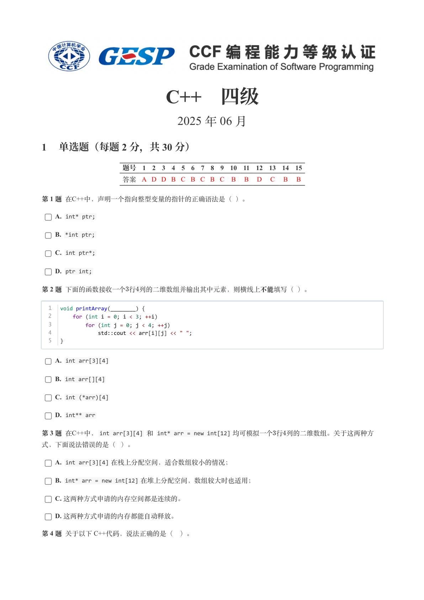
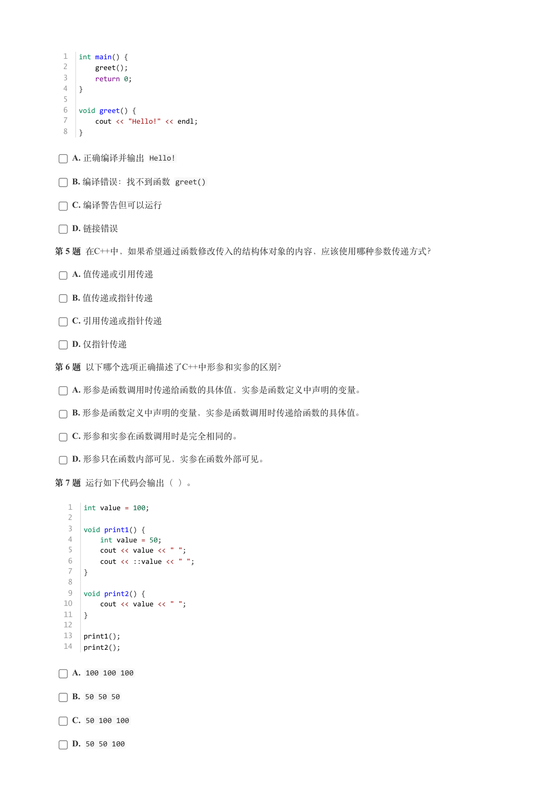
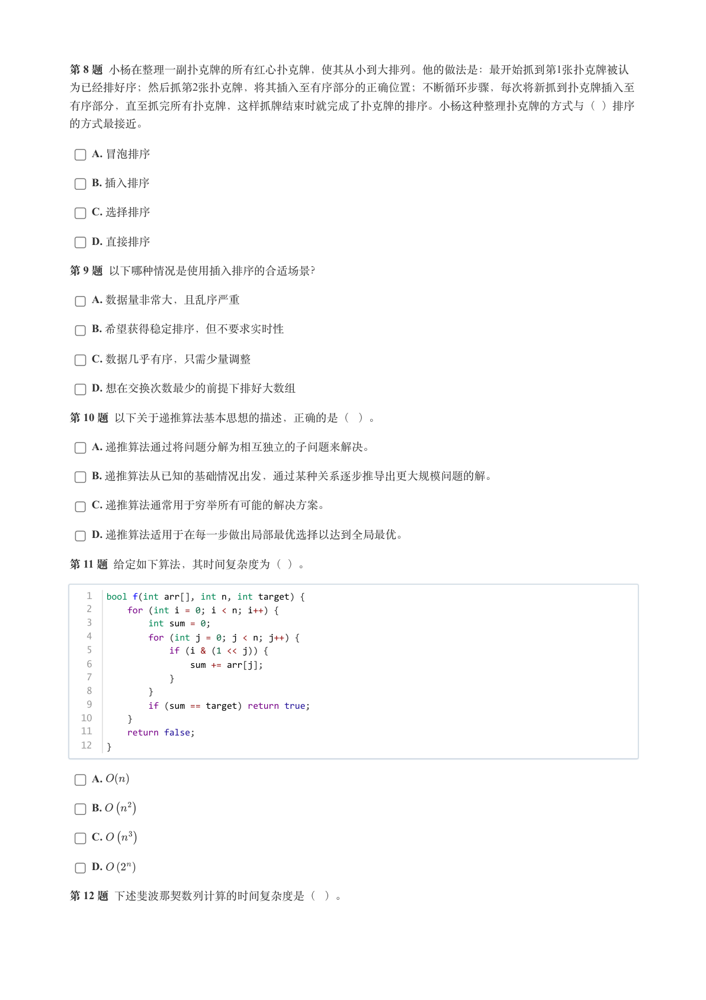
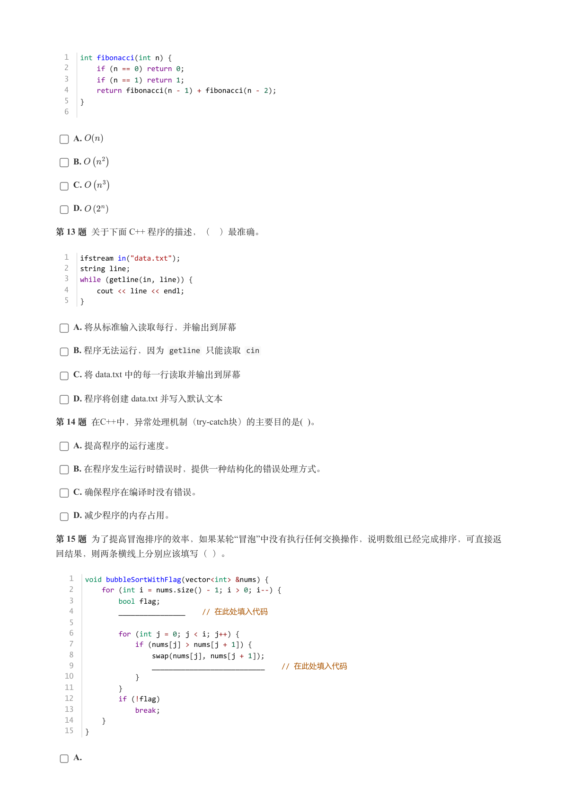
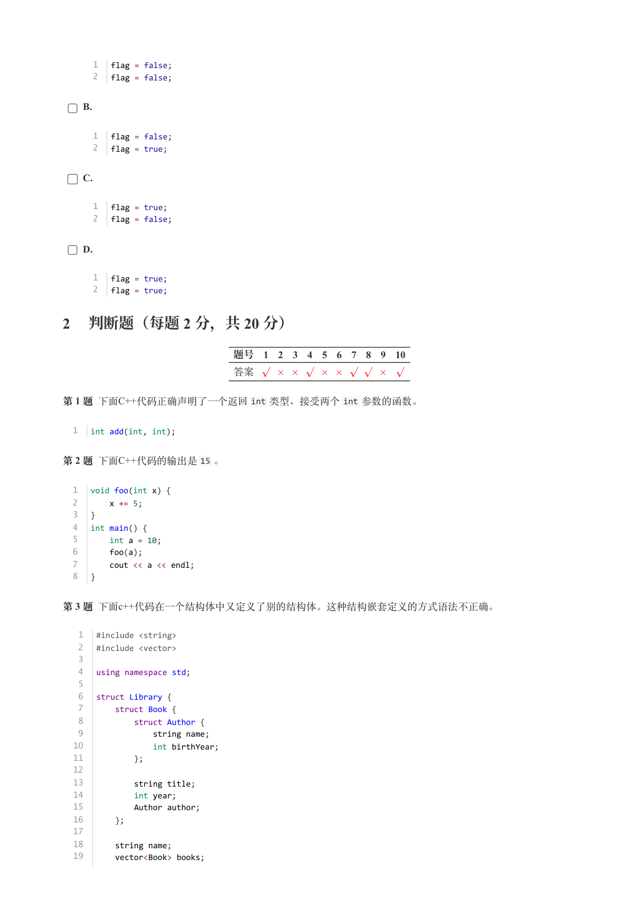
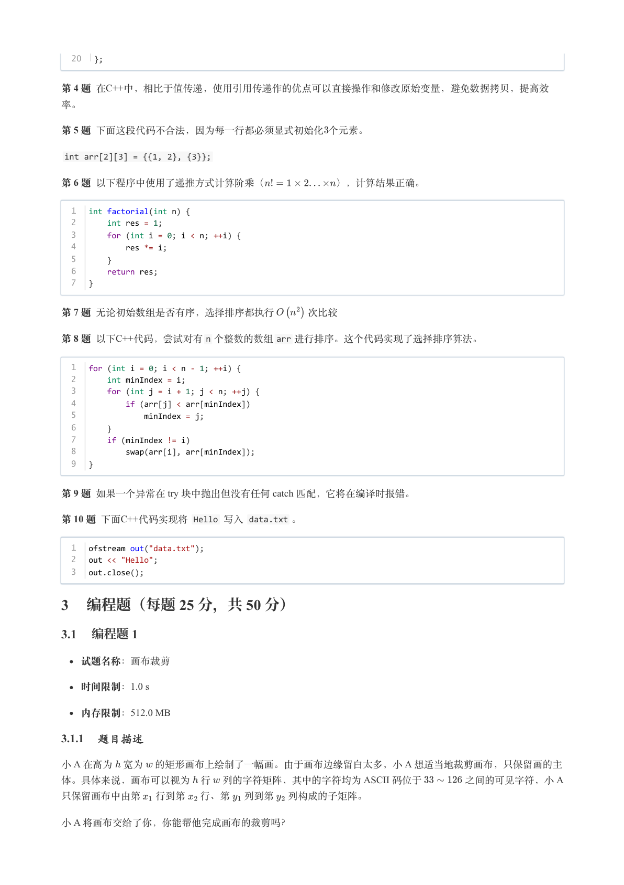
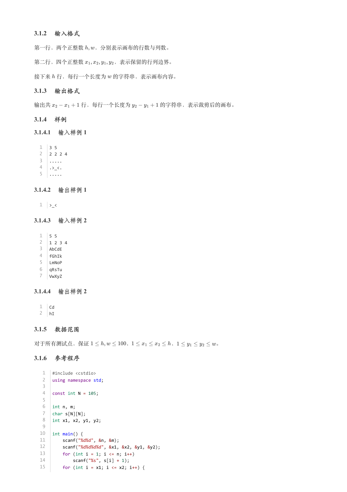
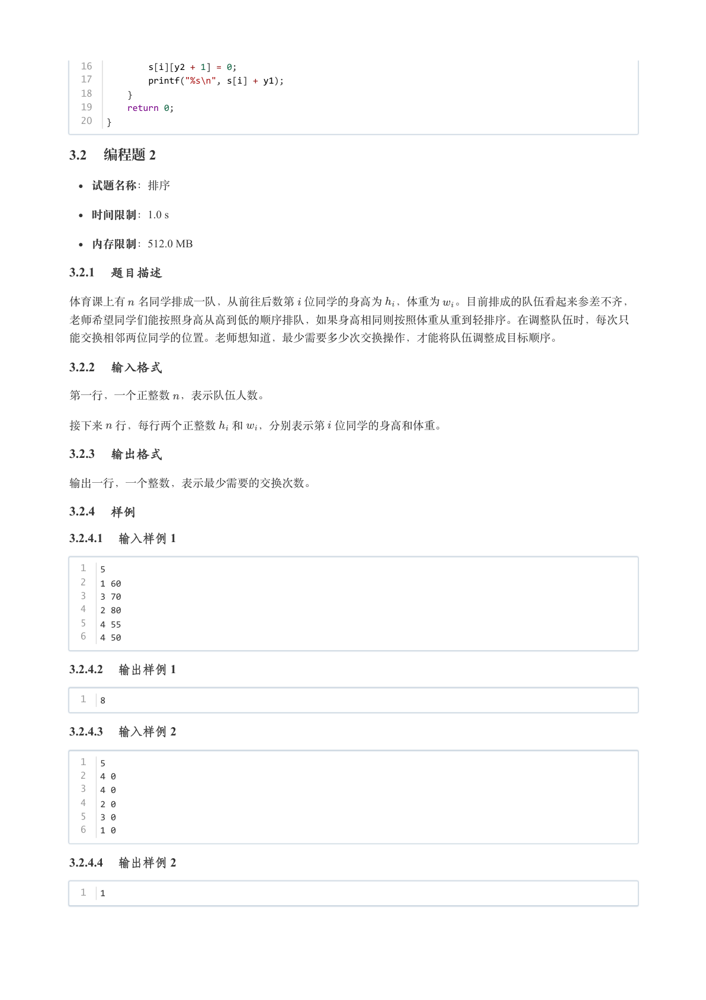
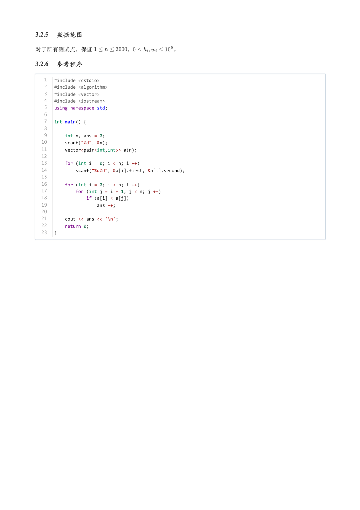

# 2025年6月-C++4级

- 原始 PDF：[`pdfs/2025年6月-C++4级.pdf`](../pdfs/2025年6月-C++4级.pdf)
- 页数：9
- 转换脚本：[`scripts/convert_pdfs_to_markdown.py`](../scripts/convert_pdfs_to_markdown.py)

> 为尽量避免信息丢失，每页均附带页面图片；文本提取结果保留原有顺序与换行特征，个别公式、图形、特殊排版请以页面图片为准。

## 第 1 页



### 提取文本

```
C++　四级

                      2025 年 06 月

1 单选题（每题 2 分，共 30 分）


            题号  1  2  3  4  5  6  7  8  9  10  11  12  13  14  15
            答案 A D D B C B C B C  B  B  D  C  B  B


第 1 题 在C++中，声明一个指向整型变量的指针的正确语法是（ ）。

    A. int* ptr;

    B. *int ptr;

    C. int ptr*;

    D. ptr int;

第 2 题 下面的函数接收一个行列的二维数组并输出其中元素，则横线上不能填写（ ）。


  1   void printArray(________) {
  2       for (int i = 0; i < 3; ++i)
  3           for (int j = 0; j < 4; ++j)
  4               std::cout << arr[i][j] << " ";
  5   }


    A. int arr[3][4]

    B. int arr[][4]

    C. int (*arr)[4]

    D. int** arr

第 3 题 在C++中，int arr[3][4] 和 int* arr = new int[12] 均可模拟一个行列的二维数组。关于这两种方

式，下面说法错误的是（ ）。

    A. int arr[3][4] 在栈上分配空间，适合数组较小的情况；

    B. int* arr = new int[12] 在堆上分配空间，数组较大时也适用；

    C. 这两种方式申请的内存空间都是连续的。

    D. 这两种方式申请的内存都能自动释放。

第 4 题 关于以下 C++代码，说法正确的是（ ）。
```

## 第 2 页



### 提取文本

```
1   int main() {
  2       greet();
  3       return 0;
  4   }
  5
  6   void greet() {
  7       cout << "Hello!" << endl;
  8   }


    A. 正确编译并输出 Hello!

    B. 编译错误：找不到函数 greet()

    C. 编译警告但可以运行

    D. 链接错误

第 5 题 在C++中，如果希望通过函数修改传入的结构体对象的内容，应该使用哪种参数传递方式？

    A. 值传递或引用传递

    B. 值传递或指针传递

    C. 引用传递或指针传递

    D. 仅指针传递

第 6 题 以下哪个选项正确描述了C++中形参和实参的区别？

    A. 形参是函数调用时传递给函数的具体值，实参是函数定义中声明的变量。

    B. 形参是函数定义中声明的变量，实参是函数调用时传递给函数的具体值。

    C. 形参和实参在函数调用时是完全相同的。

    D. 形参只在函数内部可见，实参在函数外部可见。

第 7 题 运行如下代码会输出（ ）。


   1   int value = 100;
   2
   3   void print1() {
   4       int value = 50;
   5       cout << value << " ";
   6       cout << ::value << " ";
   7   }
   8
   9   void print2() {
  10       cout << value << " ";
  11   }
  12
  13   print1();
  14   print2();


    A. 100 100 100

    B. 50 50 50

    C. 50 100 100

    D. 50 50 100
```

## 第 3 页



### 提取文本

```
第 8 题 小杨在整理一副扑克牌的所有红心扑克牌，使其从小到大排列。他的做法是：最开始抓到第1张扑克牌被认
为已经排好序；然后抓第2张扑克牌，将其插入至有序部分的正确位置；不断循环步骤，每次将新抓到扑克牌插入至

有序部分，直至抓完所有扑克牌，这样抓牌结束时就完成了扑克牌的排序。小杨这种整理扑克牌的方式与（ ）排序

的方式最接近。

    A. 冒泡排序

    B. 插入排序

    C. 选择排序

    D. 直接排序

第 9 题 以下哪种情况是使用插入排序的合适场景？

    A. 数据量非常大，且乱序严重

    B. 希望获得稳定排序，但不要求实时性

    C. 数据几乎有序，只需少量调整

    D. 想在交换次数最少的前提下排好大数组

第 10 题 以下关于递推算法基本思想的描述，正确的是（ ）。

    A. 递推算法通过将问题分解为相互独立的子问题来解决。

    B. 递推算法从已知的基础情况出发，通过某种关系逐步推导出更大规模问题的解。

    C. 递推算法通常用于穷举所有可能的解决方案。

    D. 递推算法适用于在每一步做出局部最优选择以达到全局最优。

第 11 题 给定如下算法，其时间复杂度为（ ）。


   1   bool f(int arr[], int n, int target) {
   2       for (int i = 0; i < n; i++) {
   3           int sum = 0;
   4           for (int j = 0; j < n; j++) {
   5               if (i & (1 << j)) {
   6                   sum += arr[j];
   7               }
   8           }
   9           if (sum == target) return true;
  10       }
  11       return false;
  12   }


    A.

    B.

    C.

    D.

第 12 题 下述斐波那契数列计算的时间复杂度是（ ）。
```

## 第 4 页



### 提取文本

```
1   int fibonacci(int n) {
  2       if (n == 0) return 0;
  3       if (n == 1) return 1;
  4       return fibonacci(n - 1) + fibonacci(n - 2);
  5   }
  6


    A.

    B.

    C.

    D.

第 13 题 关于下面 C++ 程序的描述，（ ）最准确。


  1   ifstream in("data.txt");
  2   string line;
  3   while (getline(in, line)) {
  4       cout << line << endl;
  5   }


    A. 将从标准输入读取每行，并输出到屏幕

    B. 程序无法运行，因为 getline 只能读取 cin

    C. 将 data.txt 中的每一行读取并输出到屏幕

    D. 程序将创建 data.txt 并写入默认文本

第 14 题 在C++中，异常处理机制（try-catch块）的主要目的是( )。

    A. 提高程序的运行速度。

    B. 在程序发生运行时错误时，提供一种结构化的错误处理方式。

    C. 确保程序在编译时没有错误。

    D. 减少程序的内存占用。

第 15 题 为了提高冒泡排序的效率，如果某轮“冒泡”中没有执行任何交换操作，说明数组已经完成排序，可直接返

回结果，则两条横线上分别应该填写（ ）。


   1   void bubbleSortWithFlag(vector<int> &nums) {
   2       for (int i = nums.size() - 1; i > 0; i--) {
   3           bool flag;
   4           ________________    // 在此处填入代码
   5
   6           for (int j = 0; j < i; j++) {
   7               if (nums[j] > nums[j + 1]) {
   8                   swap(nums[j], nums[j + 1]);
   9                   ___________________________    // 在此处填入代码
  10               }
  11           }
  12           if (!flag)
  13               break;
  14       }
  15   }


    A.
```

## 第 5 页



### 提取文本

```
1   flag = false;
      2   flag = false;


    B.


      1   flag = false;
      2   flag = true;


    C.


      1   flag = true;
      2   flag = false;


    D.


      1   flag = true;
      2   flag = true;

2 判断题（每题 2 分，共 20 分）


                 题号  1  2  3  4  5  6  7  8  9  10

                 答案


第 1 题 下面C++代码正确声明了一个返回int 类型、接受两个int 参数的函数。


  1   int add(int, int);


第 2 题 下面C++代码的输出是15 。


  1   void foo(int x) {
  2       x += 5;
  3   }
  4   int main() {
  5       int a = 10;
  6       foo(a);
  7       cout << a << endl;
  8   }


第 3 题 下面c++代码在一个结构体中又定义了别的结构体。这种结构嵌套定义的方式语法不正确。


   1   #include <string>
   2   #include <vector>
   3
   4   using namespace std;
   5
   6   struct Library {
   7       struct Book {
   8           struct Author {
   9               string name;
  10               int birthYear;
  11           };
  12
  13           string title;
  14           int year;
  15           Author author;
  16       };
  17
  18       string name;
  19       vector<Book> books;
```

## 第 6 页



### 提取文本

```
20   };


第 4 题 在C++中，相比于值传递，使用引用传递作的优点可以直接操作和修改原始变量，避免数据拷贝，提高效

率。

第 5 题 下面这段代码不合法，因为每一行都必须显式初始化个元素。

 int arr[2][3] = {{1, 2}, {3}};

第 6 题 以下程序中使用了递推方式计算阶乘（       ），计算结果正确。


  1   int factorial(int n) {
  2       int res = 1;
  3       for (int i = 0; i < n; ++i) {
  4           res *= i;
  5       }
  6       return res;
  7   }


第 7 题 无论初始数组是否有序，选择排序都执行   次比较

第 8 题 以下C++代码，尝试对有n 个整数的数组arr 进行排序。这个代码实现了选择排序算法。


  1   for (int i = 0; i < n - 1; ++i) {
  2       int minIndex = i;
  3       for (int j = i + 1; j < n; ++j) {
  4           if (arr[j] < arr[minIndex])
  5               minIndex = j;
  6       }
  7       if (minIndex != i)
  8           swap(arr[i], arr[minIndex]);
  9   }


第 9 题 如果一个异常在 try 块中抛出但没有任何 catch 匹配，它将在编译时报错。

第 10 题 下面C++代码实现将 Hello 写入 data.txt 。


  1   ofstream out("data.txt");
  2   out << "Hello";
  3   out.close();

3 编程题（每题 25 分，共 50 分）

3.1 编程题 1


  试题名称：画布裁剪

   时间限制：1.0 s

   内存限制：512.0 MB

3.1.1 题目描述

小 A 在高为 宽为 的矩形画布上绘制了一幅画。由于画布边缘留白太多，小 A 想适当地裁剪画布，只保留画的主
体。具体来说，画布可以视为 行 列的字符矩阵，其中的字符均为 ASCII 码位于    之间的可见字符，小 A

只保留画布中由第  行到第  行、第 列到第 列构成的子矩阵。

小 A 将画布交给了你，你能帮他完成画布的裁剪吗？
```

## 第 7 页



### 提取文本

```
3.1.2 输入格式

第一行，两个正整数  ，分别表示画布的行数与列数。


第二行，四个正整数      ，表示保留的行列边界。


接下来 行，每行一个长度为 的字符串，表示画布内容。

3.1.3 输出格式

输出共      行，每行一个长度为     的字符串，表示裁剪后的画布。

3.1.4 样例

3.1.4.1 输入样例 1


  1   3 5
  2   2 2 2 4
  3   .....
  4   .>_<.
  5   .....

3.1.4.2 输出样例 1


  1   >_<

3.1.4.3 输入样例 2


  1   5 5
  2   1 2 3 4
  3   AbCdE
  4   fGhIk
  5   LmNoP
  6   qRsTu
  7   VwXyZ

3.1.4.4 输出样例 2


  1   Cd
  2   hI

3.1.5 数据范围

对于所有测试点，保证       ，       ，       。

3.1.6 参考程序


   1   #include <cstdio>
   2   using namespace std;
   3
   4   const int N = 105;
   5
   6   int n, m;
   7   char s[N][N];
   8   int x1, x2, y1, y2;
   9
  10   int main() {
  11       scanf("%d%d", &n, &m);
  12       scanf("%d%d%d%d", &x1, &x2, &y1, &y2);
  13       for (int i = 1; i <= n; i++)
  14           scanf("%s", s[i] + 1);
  15       for (int i = x1; i <= x2; i++) {
```

## 第 8 页



### 提取文本

```
16           s[i][y2 + 1] = 0;
  17           printf("%s\n", s[i] + y1);
  18       }
  19       return 0;
  20   }

3.2 编程题 2


  试题名称：排序

   时间限制：1.0 s

   内存限制：512.0 MB

3.2.1 题目描述

体育课上有 名同学排成一队，从前往后数第 位同学的身高为 ，体重为 。目前排成的队伍看起来参差不齐，

老师希望同学们能按照身高从高到低的顺序排队，如果身高相同则按照体重从重到轻排序。在调整队伍时，每次只

能交换相邻两位同学的位置。老师想知道，最少需要多少次交换操作，才能将队伍调整成目标顺序。

3.2.2 输入格式

第一行，一个正整数 ，表示队伍人数。


接下来 行，每行两个正整数 和 ，分别表示第 位同学的身高和体重。

3.2.3 输出格式

输出一行，一个整数，表示最少需要的交换次数。

3.2.4 样例

3.2.4.1 输入样例 1


  1   5
  2   1 60
  3   3 70
  4   2 80
  5   4 55
  6   4 50

3.2.4.2 输出样例 1


  1   8

3.2.4.3 输入样例 2


  1   5
  2   4 0
  3   4 0
  4   2 0
  5   3 0
  6   1 0

3.2.4.4 输出样例 2


  1   1
```

## 第 9 页



### 提取文本

```
3.2.5 数据范围

对于所有测试点，保证      ，       。

3.2.6 参考程序


   1   #include <cstdio>
   2   #include <algorithm>
   3   #include <vector>
   4   #include <iostream>
   5   using namespace std;
   6
   7   int main() {
   8
   9       int n, ans = 0;
  10       scanf("%d", &n);
  11       vector<pair<int,int>> a(n);
  12
  13       for (int i = 0; i < n; i ++)
  14           scanf("%d%d", &a[i].first, &a[i].second);
  15
  16       for (int i = 0; i < n; i ++)
  17           for (int j = i + 1; j < n; j ++)
  18               if (a[i] < a[j])
  19                   ans ++;
  20
  21       cout << ans << '\n';
  22       return 0;
  23   }
```
