# 2025年6月-C++5级

- 原始 PDF：[`pdfs/2025年6月-C++5级.pdf`](../pdfs/2025年6月-C++5级.pdf)
- 页数：16
- 转换脚本：[`scripts/convert_pdfs_to_markdown.py`](../scripts/convert_pdfs_to_markdown.py)

> 为尽量避免信息丢失，每页均附带页面图片；文本提取结果保留原有顺序与换行特征，个别公式、图形、特殊排版请以页面图片为准。

## 第 1 页

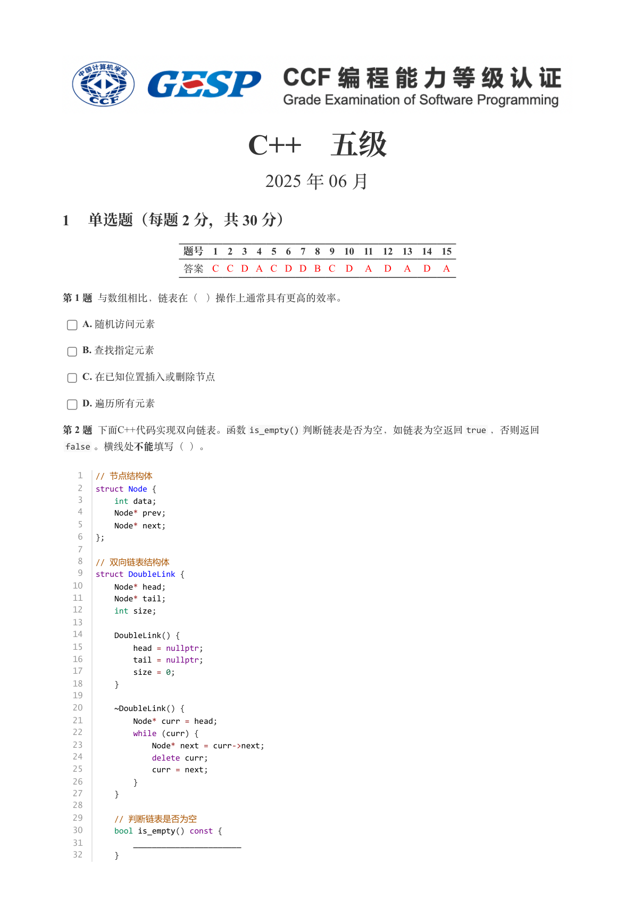

### 提取文本

```
C++　五级

                      2025 年 06 月

1 单选题（每题 2 分，共 30 分）


            题号  1  2  3  4  5  6  7  8  9  10  11  12  13  14  15
            答案 C C D A C D D B C D  A  D  A  D  A


第 1 题 与数组相比，链表在（ ）操作上通常具有更高的效率。

    A. 随机访问元素

    B. 查找指定元素

    C. 在已知位置插入或删除节点

    D. 遍历所有元素

第 2 题 下面C++代码实现双向链表。函数is_empty() 判断链表是否为空，如链表为空返回true ，否则返回

 false 。横线处不能填写（ ）。


   1   // 节点结构体
   2   struct Node {
   3       int data;
   4       Node* prev;
   5       Node* next;
   6   };
   7
   8   // 双向链表结构体
   9   struct DoubleLink {
  10       Node* head;
  11       Node* tail;
  12       int size;
  13
  14       DoubleLink() {
  15           head = nullptr;
  16           tail = nullptr;
  17           size = 0;
  18       }
  19
  20       ~DoubleLink() {
  21           Node* curr = head;
  22           while (curr) {
  23               Node* next = curr->next;
  24               delete curr;
  25               curr = next;
  26           }
  27       }
  28
  29       // 判断链表是否为空
  30       bool is_empty() const {
  31           _______________________
  32       }
```

## 第 2 页

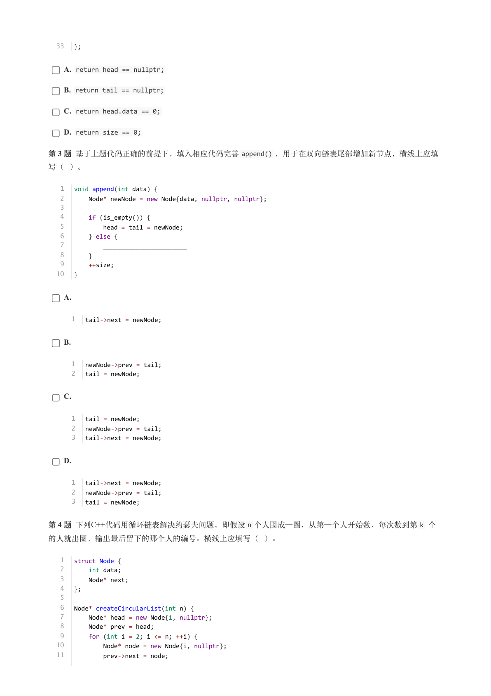

### 提取文本

```
33   };


    A. return head == nullptr;

    B. return tail == nullptr;

    C. return head.data == 0;

    D. return size == 0;

第 3 题 基于上题代码正确的前提下，填入相应代码完善append() ，用于在双向链表尾部增加新节点，横线上应填

写（ ）。


   1   void append(int data) {
   2       Node* newNode = new Node{data, nullptr, nullptr};
   3
   4       if (is_empty()) {
   5           head = tail = newNode;
   6       } else {
   7           _______________________
   8       }
   9       ++size;
  10   }


    A.


      1   tail->next = newNode;


    B.


      1   newNode->prev = tail;
      2   tail = newNode;


    C.


      1   tail = newNode;
      2   newNode->prev = tail;
      3   tail->next = newNode;


    D.


      1   tail->next = newNode;
      2   newNode->prev = tail;
      3   tail = newNode;


第 4 题 下列C++代码用循环链表解决约瑟夫问题，即假设n 个人围成一圈，从第一个人开始数，每次数到第k 个

的人就出圈，输出最后留下的那个人的编号。横线上应填写（ ）。


   1   struct Node {
   2       int data;
   3       Node* next;
   4   };
   5
   6   Node* createCircularList(int n) {
   7       Node* head = new Node{1, nullptr};
   8       Node* prev = head;
   9       for (int i = 2; i <= n; ++i) {
  10           Node* node = new Node{i, nullptr};
  11           prev->next = node;
```

## 第 3 页

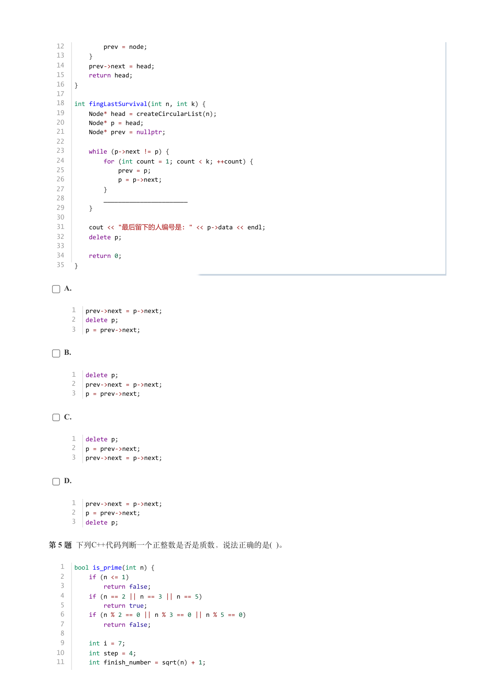

### 提取文本

```
12           prev = node;
  13       }
  14       prev->next = head;
  15       return head;
  16   }
  17
  18   int fingLastSurvival(int n, int k) {
  19       Node* head = createCircularList(n);
  20       Node* p = head;
  21       Node* prev = nullptr;
  22
  23       while (p->next != p) {
  24           for (int count = 1; count < k; ++count) {
  25               prev = p;
  26               p = p->next;
  27           }
  28           _______________________
  29       }
  30
  31       cout << "最后留下的人编号是: " << p->data << endl;
  32       delete p;
  33
  34       return 0;
  35   }


    A.


      1   prev->next = p->next;
      2   delete p;
      3   p = prev->next;


    B.


      1   delete p;
      2   prev->next = p->next;
      3   p = prev->next;


    C.


      1   delete p;
      2   p = prev->next;
      3   prev->next = p->next;


    D.


      1   prev->next = p->next;
      2   p = prev->next;
      3   delete p;


第 5 题 下列C++代码判断一个正整数是否是质数，说法正确的是( )。


   1   bool is_prime(int n) {
   2       if (n <= 1)
   3           return false;
   4       if (n == 2 || n == 3 || n == 5)
   5           return true;
   6       if (n % 2 == 0 || n % 3 == 0 || n % 5 == 0)
   7           return false;
   8
   9       int i = 7;
  10       int step = 4;
  11       int finish_number = sqrt(n) + 1;
```

## 第 4 页

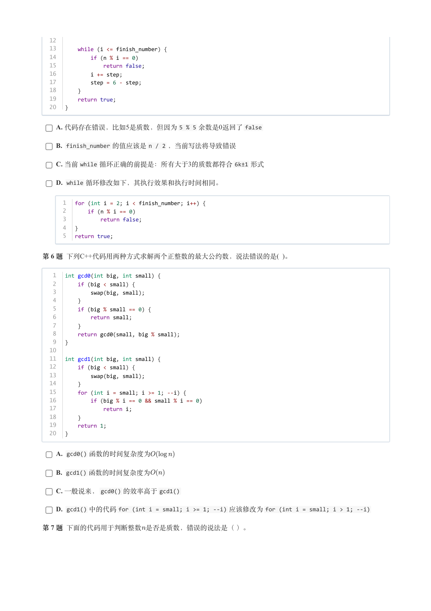

### 提取文本

```
12
  13       while (i <= finish_number) {
  14           if (n % i == 0)
  15               return false;
  16           i += step;
  17           step = 6 - step;
  18       }
  19       return true;
  20   }


    A. 代码存在错误，比如5是质数，但因为5 % 5 余数是0返回了false

    B. finish_number 的值应该是n / 2 ，当前写法将导致错误

    C. 当前while 循环正确的前提是：所有大于3的质数都符合6k±1 形式

    D. while 循环修改如下，其执行效果和执行时间相同。


      1   for (int i = 2; i < finish_number; i++) {
      2       if (n % i == 0)
      3           return false;
      4   }
      5   return true;


第 6 题 下列C++代码用两种方式求解两个正整数的最大公约数，说法错误的是( )。


   1   int gcd0(int big, int small) {
   2       if (big < small) {
   3           swap(big, small);
   4       }
   5       if (big % small == 0) {
   6           return small;
   7       }
   8       return gcd0(small, big % small);
   9   }
  10
  11   int gcd1(int big, int small) {
  12       if (big < small) {
  13           swap(big, small);
  14       }
  15       for (int i = small; i >= 1; --i) {
  16           if (big % i == 0 && small % i == 0)
  17               return i;
  18       }
  19       return 1;
  20   }


    A. gcd0() 函数的时间复杂度为

    B. gcd1() 函数的时间复杂度为

    C. 一般说来，gcd0() 的效率高于gcd1()

    D. gcd1() 中的代码for (int i = small; i >= 1; --i) 应该修改为for (int i = small; i > 1; --i)

第 7 题 下面的代码用于判断整数是否是质数，错误的说法是（ ）。
```

## 第 5 页

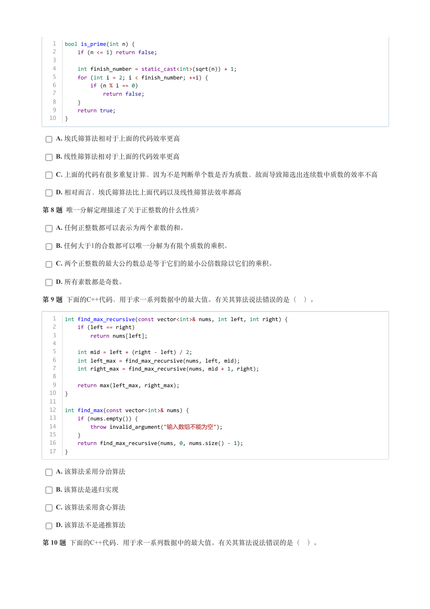

### 提取文本

```
1   bool is_prime(int n) {
   2       if (n <= 1) return false;
   3
   4       int finish_number = static_cast<int>(sqrt(n)) + 1;
   5       for (int i = 2; i < finish_number; ++i) {
   6           if (n % i == 0)
   7               return false;
   8       }
   9       return true;
  10   }


    A. 埃氏筛算法相对于上面的代码效率更高

    B. 线性筛算法相对于上面的代码效率更高

    C. 上面的代码有很多重复计算，因为不是判断单个数是否为质数，故而导致筛选出连续数中质数的效率不高

    D. 相对而言，埃氏筛算法比上面代码以及线性筛算法效率都高

第 8 题 唯一分解定理描述了关于正整数的什么性质？

    A. 任何正整数都可以表示为两个素数的和。

    B. 任何大于1的合数都可以唯一分解为有限个质数的乘积。

    C. 两个正整数的最大公约数总是等于它们的最小公倍数除以它们的乘积。

    D. 所有素数都是奇数。

第 9 题 下面的C++代码，用于求一系列数据中的最大值。有关其算法说法错误的是（ ）。


   1   int find_max_recursive(const vector<int>& nums, int left, int right) {
   2       if (left == right)
   3           return nums[left];
   4
   5       int mid = left + (right - left) / 2;
   6       int left_max = find_max_recursive(nums, left, mid);
   7       int right_max = find_max_recursive(nums, mid + 1, right);
   8
   9       return max(left_max, right_max);
  10   }
  11
  12   int find_max(const vector<int>& nums) {
  13       if (nums.empty()) {
  14           throw invalid_argument("输入数组不能为空");
  15       }
  16       return find_max_recursive(nums, 0, nums.size() - 1);
  17   }


    A. 该算法采用分治算法

    B. 该算法是递归实现

    C. 该算法采用贪心算法

    D. 该算法不是递推算法

第 10 题 下面的C++代码，用于求一系列数据中的最大值。有关其算法说法错误的是（ ）。
```

## 第 6 页

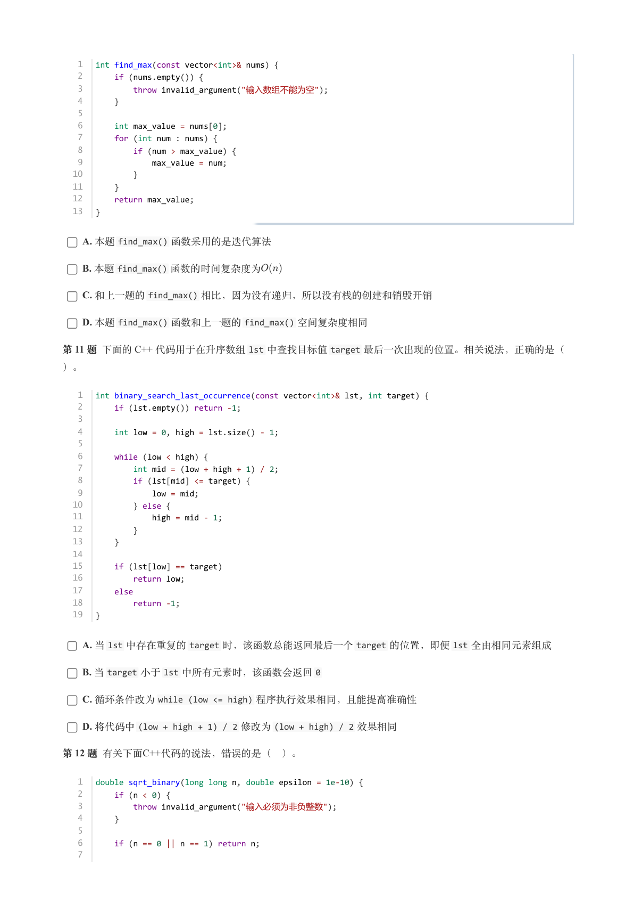

### 提取文本

```
1   int find_max(const vector<int>& nums) {
   2       if (nums.empty()) {
   3           throw invalid_argument("输入数组不能为空");
   4       }
   5
   6       int max_value = nums[0];
   7       for (int num : nums) {
   8           if (num > max_value) {
   9               max_value = num;
  10           }
  11       }
  12       return max_value;
  13   }


    A. 本题find_max() 函数采用的是迭代算法

    B. 本题find_max() 函数的时间复杂度为

    C. 和上一题的find_max() 相比，因为没有递归，所以没有栈的创建和销毁开销

    D. 本题find_max() 函数和上⼀题的find_max() 空间复杂度相同

第 11 题 下面的 C++ 代码用于在升序数组 lst 中查找目标值target 最后一次出现的位置。相关说法，正确的是（

）。


   1   int binary_search_last_occurrence(const vector<int>& lst, int target) {
   2       if (lst.empty()) return -1;
   3
   4       int low = 0, high = lst.size() - 1;
   5
   6       while (low < high) {
   7           int mid = (low + high + 1) / 2;
   8           if (lst[mid] <= target) {
   9               low = mid;
  10           } else {
  11               high = mid - 1;
  12           }
  13       }
  14
  15       if (lst[low] == target)
  16           return low;
  17       else
  18           return -1;
  19   }


    A. 当lst 中存在重复的target 时，该函数总能返回最后一个target 的位置，即便lst 全由相同元素组成

    B. 当target 小于lst 中所有元素时，该函数会返回0

    C. 循环条件改为while (low <= high) 程序执行效果相同，且能提高准确性

    D. 将代码中(low + high + 1) / 2 修改为(low + high) / 2 效果相同

第 12 题 有关下面C++代码的说法，错误的是（ ）。


   1   double sqrt_binary(long long n, double epsilon = 1e-10) {
   2       if (n < 0) {
   3           throw invalid_argument("输入必须为非负整数");
   4       }
   5
   6       if (n == 0 || n == 1) return n;
   7
```

## 第 7 页

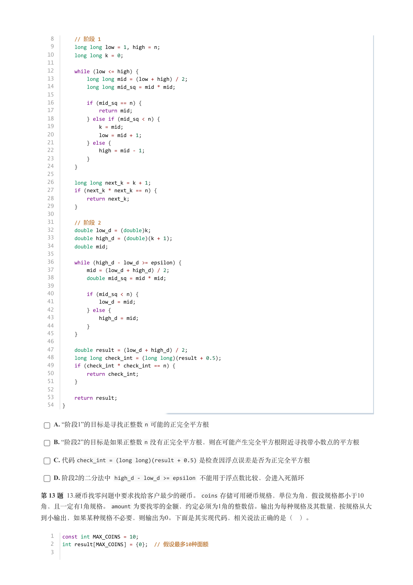

### 提取文本

```
8       // 阶段 1
   9       long long low = 1, high = n;
  10       long long k = 0;
  11
  12       while (low <= high) {
  13           long long mid = (low + high) / 2;
  14           long long mid_sq = mid * mid;
  15
  16           if (mid_sq == n) {
  17               return mid;
  18           } else if (mid_sq < n) {
  19               k = mid;
  20               low = mid + 1;
  21           } else {
  22               high = mid - 1;
  23           }
  24       }
  25
  26       long long next_k = k + 1;
  27       if (next_k * next_k == n) {
  28           return next_k;
  29       }
  30
  31       // 阶段 2
  32       double low_d = (double)k;
  33       double high_d = (double)(k + 1);
  34       double mid;
  35
  36       while (high_d - low_d >= epsilon) {
  37           mid = (low_d + high_d) / 2;
  38           double mid_sq = mid * mid;
  39
  40           if (mid_sq < n) {
  41               low_d = mid;
  42           } else {
  43               high_d = mid;
  44           }
  45       }
  46
  47       double result = (low_d + high_d) / 2;
  48       long long check_int = (long long)(result + 0.5);
  49       if (check_int * check_int == n) {
  50           return check_int;
  51       }
  52
  53       return result;
  54   }


    A. “阶段1”的目标是寻找正整数n 可能的正完全平方根

    B. “阶段2”的目标是如果正整数n 没有正完全平方根，则在可能产生完全平方根附近寻找带小数点的平方根

    C. 代码check_int = (long long)(result + 0.5) 是检查因浮点误差是否为正完全平方根

    D. 阶段2的二分法中 high_d - low_d >= epsilon 不能用于浮点数比较，会进入死循环

第 13 题 13.硬币找零问题中要求找给客户最少的硬币。coins 存储可用硬币规格，单位为角，假设规格都小于10
角，且一定有1角规格。amount 为要找零的金额，约定必须为1角的整数倍。输出为每种规格及其数量，按规格从大

到小输出，如果某种规格不必要，则输出为0。下面是其实现代码，相关说法正确的是（ ）。


   1   const int MAX_COINS = 10;
   2   int result[MAX_COINS] = {0};  // 假设最多10种面额
   3
```

## 第 8 页

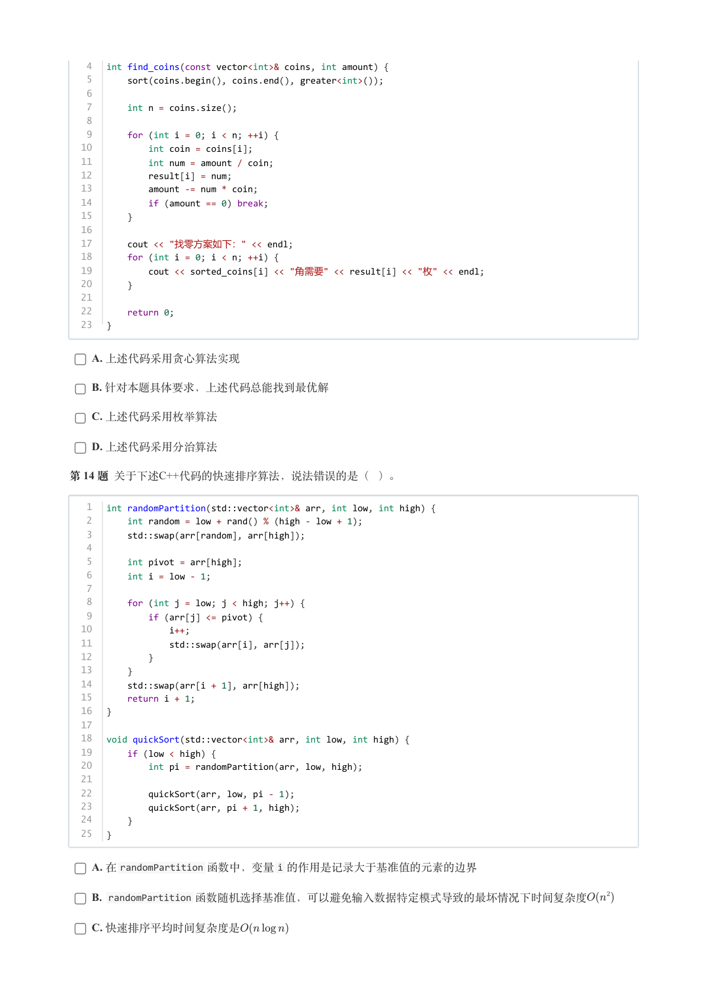

### 提取文本

```
4   int find_coins(const vector<int>& coins, int amount) {
   5       sort(coins.begin(), coins.end(), greater<int>());
   6
   7       int n = coins.size();
   8
   9       for (int i = 0; i < n; ++i) {
  10           int coin = coins[i];
  11           int num = amount / coin;
  12           result[i] = num;
  13           amount -= num * coin;
  14           if (amount == 0) break;
  15       }
  16
  17       cout << "找零方案如下：" << endl;
  18       for (int i = 0; i < n; ++i) {
  19           cout << sorted_coins[i] << "角需要" << result[i] << "枚" << endl;
  20       }
  21
  22       return 0;
  23   }


    A. 上述代码采用贪心算法实现

    B. 针对本题具体要求，上述代码总能找到最优解

    C. 上述代码采用枚举算法

    D. 上述代码采用分治算法

第 14 题 关于下述C++代码的快速排序算法，说法错误的是（ ）。


   1   int randomPartition(std::vector<int>& arr, int low, int high) {
   2       int random = low + rand() % (high - low + 1);
   3       std::swap(arr[random], arr[high]);
   4
   5       int pivot = arr[high];
   6       int i = low - 1;
   7
   8       for (int j = low; j < high; j++) {
   9           if (arr[j] <= pivot) {
  10               i++;
  11               std::swap(arr[i], arr[j]);
  12           }
  13       }
  14       std::swap(arr[i + 1], arr[high]);
  15       return i + 1;
  16   }
  17
  18   void quickSort(std::vector<int>& arr, int low, int high) {
  19       if (low < high) {
  20           int pi = randomPartition(arr, low, high);
  21
  22           quickSort(arr, low, pi - 1);
  23           quickSort(arr, pi + 1, high);
  24       }
  25   }


    A. 在randomPartition 函数中，变量i 的作用是记录大于基准值的元素的边界

    B. randomPartition 函数随机选择基准值，可以避免输入数据特定模式导致的最坏情况下时间复杂度     ²

    C. 快速排序平均时间复杂度是
```

## 第 9 页

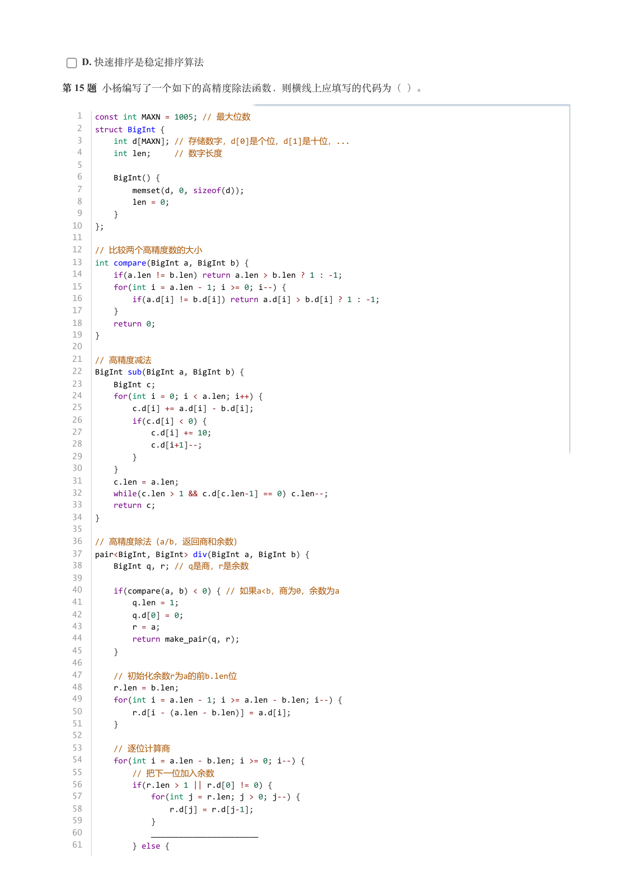

### 提取文本

```
D. 快速排序是稳定排序算法

第 15 题 小杨编写了一个如下的高精度除法函数，则横线上应填写的代码为（ ）。


   1   const int MAXN = 1005; // 最大位数
   2   struct BigInt {
   3       int d[MAXN]; // 存储数字，d[0]是个位，d[1]是十位，...
   4       int len;     // 数字长度
   5
   6       BigInt() {
   7           memset(d, 0, sizeof(d));
   8           len = 0;
   9       }
  10   };
  11
  12   // 比较两个高精度数的大小
  13   int compare(BigInt a, BigInt b) {
  14       if(a.len != b.len) return a.len > b.len ? 1 : -1;
  15       for(int i = a.len - 1; i >= 0; i--) {
  16           if(a.d[i] != b.d[i]) return a.d[i] > b.d[i] ? 1 : -1;
  17       }
  18       return 0;
  19   }
  20
  21   // 高精度减法
  22   BigInt sub(BigInt a, BigInt b) {
  23       BigInt c;
  24       for(int i = 0; i < a.len; i++) {
  25           c.d[i] += a.d[i] - b.d[i];
  26           if(c.d[i] < 0) {
  27               c.d[i] += 10;
  28               c.d[i+1]--;
  29           }
  30       }
  31       c.len = a.len;
  32       while(c.len > 1 && c.d[c.len-1] == 0) c.len--;
  33       return c;
  34   }
  35
  36   // 高精度除法（a/b，返回商和余数）
  37   pair<BigInt, BigInt> div(BigInt a, BigInt b) {
  38       BigInt q, r; // q是商，r是余数
  39
  40       if(compare(a, b) < 0) { // 如果a<b，商为0，余数为a
  41           q.len = 1;
  42           q.d[0] = 0;
  43           r = a;
  44           return make_pair(q, r);
  45       }
  46
  47       // 初始化余数r为a的前b.len位
  48       r.len = b.len;
  49       for(int i = a.len - 1; i >= a.len - b.len; i--) {
  50           r.d[i - (a.len - b.len)] = a.d[i];
  51       }
  52
  53       // 逐位计算商
  54       for(int i = a.len - b.len; i >= 0; i--) {
  55           // 把下一位加入余数
  56           if(r.len > 1 || r.d[0] != 0) {
  57               for(int j = r.len; j > 0; j--) {
  58                   r.d[j] = r.d[j-1];
  59               }
  60               _______________________
  61           } else {
```

## 第 10 页

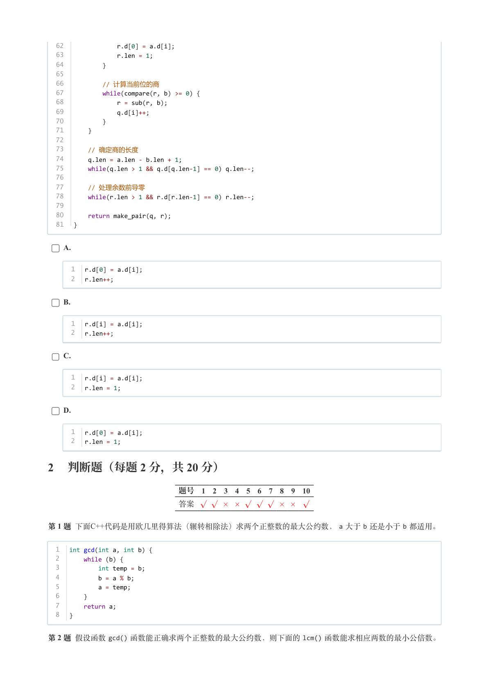

### 提取文本

```
62               r.d[0] = a.d[i];
  63               r.len = 1;
  64           }
  65
  66           // 计算当前位的商
  67           while(compare(r, b) >= 0) {
  68               r = sub(r, b);
  69               q.d[i]++;
  70           }
  71       }
  72
  73       // 确定商的长度
  74       q.len = a.len - b.len + 1;
  75       while(q.len > 1 && q.d[q.len-1] == 0) q.len--;
  76
  77       // 处理余数前导零
  78       while(r.len > 1 && r.d[r.len-1] == 0) r.len--;
  79
  80       return make_pair(q, r);
  81   }


    A.


      1   r.d[0] = a.d[i];
      2   r.len++;


    B.


      1   r.d[i] = a.d[i];
      2   r.len++;


    C.


      1   r.d[i] = a.d[i];
      2   r.len = 1;


    D.


      1   r.d[0] = a.d[i];
      2   r.len = 1;

2 判断题（每题 2 分，共 20 分）

                 题号  1  2  3  4  5  6  7  8  9  10

                 答案


第 1 题 下面C++代码是用欧几里得算法（辗转相除法）求两个正整数的最大公约数，a 大于b 还是小于b 都适用。


  1   int gcd(int a, int b) {
  2       while (b) {
  3           int temp = b;
  4           b = a % b;
  5           a = temp;
  6       }
  7       return a;
  8   }


第 2 题 假设函数gcd() 函数能正确求两个正整数的最大公约数，则下面的lcm() 函数能求相应两数的最小公倍数。
```

## 第 11 页

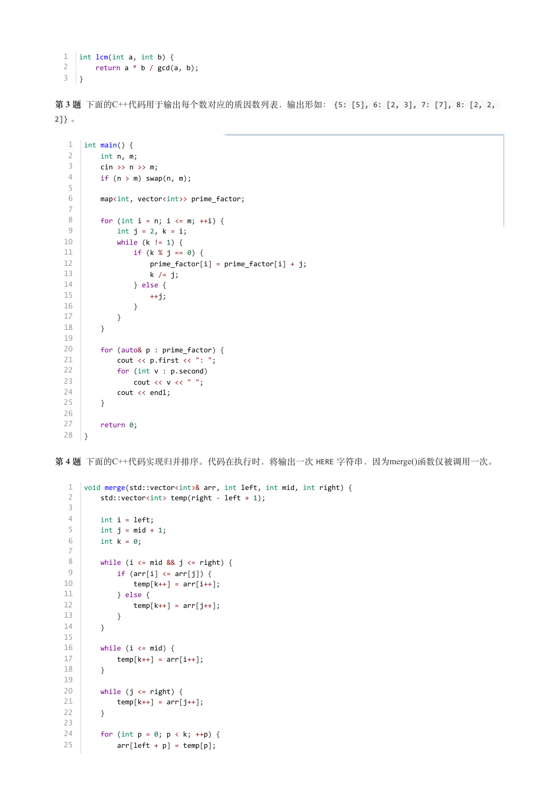

### 提取文本

```
1   int lcm(int a, int b) {
  2       return a * b / gcd(a, b);
  3   }


第 3 题 下面的C++代码用于输出每个数对应的质因数列表，输出形如：{5: [5], 6: [2, 3], 7: [7], 8: [2, 2,

2]} 。


   1   int main() {
   2       int n, m;
   3       cin >> n >> m;
   4       if (n > m) swap(n, m);
   5
   6       map<int, vector<int>> prime_factor;
   7
   8       for (int i = n; i <= m; ++i) {
   9           int j = 2, k = i;
  10           while (k != 1) {
  11               if (k % j == 0) {
  12                   prime_factor[i] = prime_factor[i] + j;
  13                   k /= j;
  14               } else {
  15                   ++j;
  16               }
  17           }
  18       }
  19
  20       for (auto& p : prime_factor) {
  21           cout << p.first << ": ";
  22           for (int v : p.second)
  23               cout << v << " ";
  24           cout << endl;
  25       }
  26
  27       return 0;
  28   }


第 4 题 下面的C++代码实现归并排序。代码在执行时，将输出一次HERE 字符串，因为merge()函数仅被调用一次。


   1   void merge(std::vector<int>& arr, int left, int mid, int right) {
   2       std::vector<int> temp(right - left + 1);
   3
   4       int i = left;
   5       int j = mid + 1;
   6       int k = 0;
   7
   8       while (i <= mid && j <= right) {
   9           if (arr[i] <= arr[j]) {
  10               temp[k++] = arr[i++];
  11           } else {
  12               temp[k++] = arr[j++];
  13           }
  14       }
  15
  16       while (i <= mid) {
  17           temp[k++] = arr[i++];
  18       }
  19
  20       while (j <= right) {
  21           temp[k++] = arr[j++];
  22       }
  23
  24       for (int p = 0; p < k; ++p) {
  25           arr[left + p] = temp[p];
```

## 第 12 页

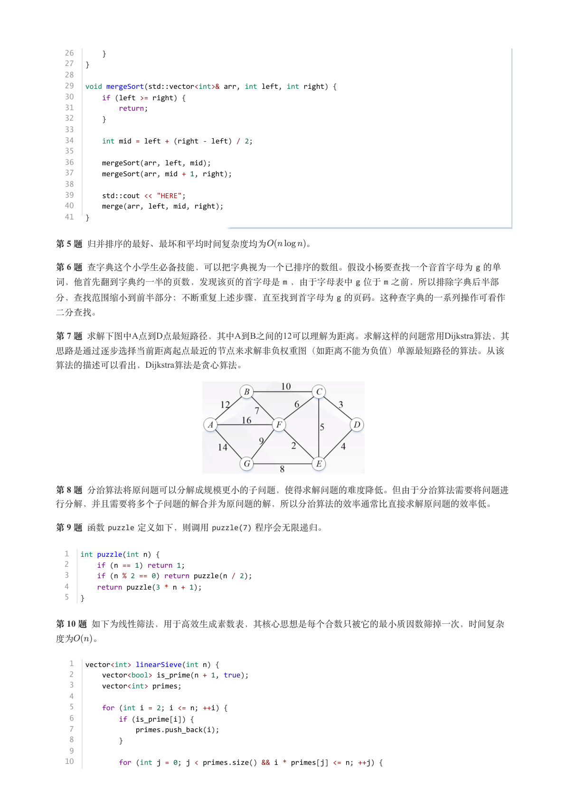

### 提取文本

```
26       }
  27   }
  28
  29   void mergeSort(std::vector<int>& arr, int left, int right) {
  30       if (left >= right) {
  31           return;
  32       }
  33
  34       int mid = left + (right - left) / 2;
  35
  36       mergeSort(arr, left, mid);
  37       mergeSort(arr, mid + 1, right);
  38
  39       std::cout << "HERE";
  40       merge(arr, left, mid, right);
  41   }


第 5 题 归并排序的最好、最坏和平均时间复杂度均为    。

第 6 题 查字典这个小学生必备技能，可以把字典视为一个已排序的数组。假设小杨要查找一个音首字母为g 的单

词，他首先翻到字典约一半的页数，发现该页的首字母是m ，由于字母表中g 位于m 之前，所以排除字典后半部

分，查找范围缩小到前半部分；不断重复上述步骤，直至找到首字母为g 的页码。这种查字典的一系列操作可看作

二分查找。

第 7 题 求解下图中A点到D点最短路径，其中A到B之间的12可以理解为距离。求解这样的问题常用Dijkstra算法，其

思路是通过逐步选择当前距离起点最近的节点来求解非负权重图（如距离不能为负值）单源最短路径的算法。从该
算法的描述可以看出，Dijkstra算法是贪心算法。


第 8 题 分治算法将原问题可以分解成规模更小的子问题，使得求解问题的难度降低。但由于分治算法需要将问题进

行分解，并且需要将多个子问题的解合并为原问题的解，所以分治算法的效率通常比直接求解原问题的效率低。

第 9 题 函数puzzle 定义如下，则调用puzzle(7) 程序会无限递归。


  1   int puzzle(int n) {
  2       if (n == 1) return 1;
  3       if (n % 2 == 0) return puzzle(n / 2);
  4       return puzzle(3 * n + 1);
  5   }


第 10 题 如下为线性筛法，用于高效生成素数表，其核心思想是每个合数只被它的最小质因数筛掉一次，时间复杂

度为  。


   1   vector<int> linearSieve(int n) {
   2       vector<bool> is_prime(n + 1, true);
   3       vector<int> primes;
   4
   5       for (int i = 2; i <= n; ++i) {
   6           if (is_prime[i]) {
   7               primes.push_back(i);
   8           }
   9
  10           for (int j = 0; j < primes.size() && i * primes[j] <= n; ++j) {
```

## 第 13 页

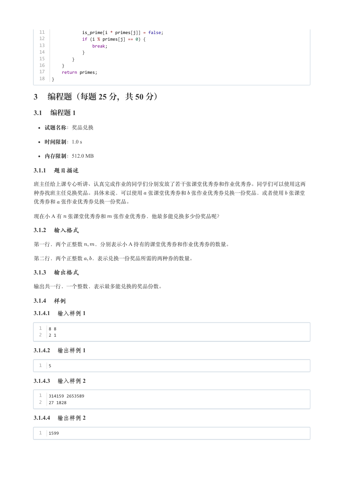

### 提取文本

```
11               is_prime[i * primes[j]] = false;
  12               if (i % primes[j] == 0) {
  13                   break;
  14               }
  15           }
  16       }
  17       return primes;
  18   }

3 编程题（每题 25 分，共 50 分）

3.1 编程题 1


  试题名称：奖品兑换

   时间限制：1.0 s

   内存限制：512.0 MB

3.1.1 题目描述

班主任给上课专心听讲、认真完成作业的同学们分别发放了若干张课堂优秀券和作业优秀券。同学们可以使用这两

种券找班主任兑换奖品。具体来说，可以使用 张课堂优秀券和 张作业优秀券兑换一份奖品，或者使用 张课堂

优秀券和 张作业优秀券兑换一份奖品。

现在小 A 有 张课堂优秀券和 张作业优秀券，他最多能兑换多少份奖品呢？

3.1.2 输入格式

第一行，两个正整数  ，分别表示小 A 持有的课堂优秀券和作业优秀券的数量。


第二行，两个正整数  ，表示兑换一份奖品所需的两种券的数量。

3.1.3 输出格式

输出共一行，一个整数，表示最多能兑换的奖品份数。

3.1.4 样例

3.1.4.1 输入样例 1


  1   8 8
  2   2 1

3.1.4.2 输出样例 1


  1   5

3.1.4.3 输入样例 2


  1   314159 2653589
  2   27 1828

3.1.4.4 输出样例 2


  1   1599
```

## 第 14 页

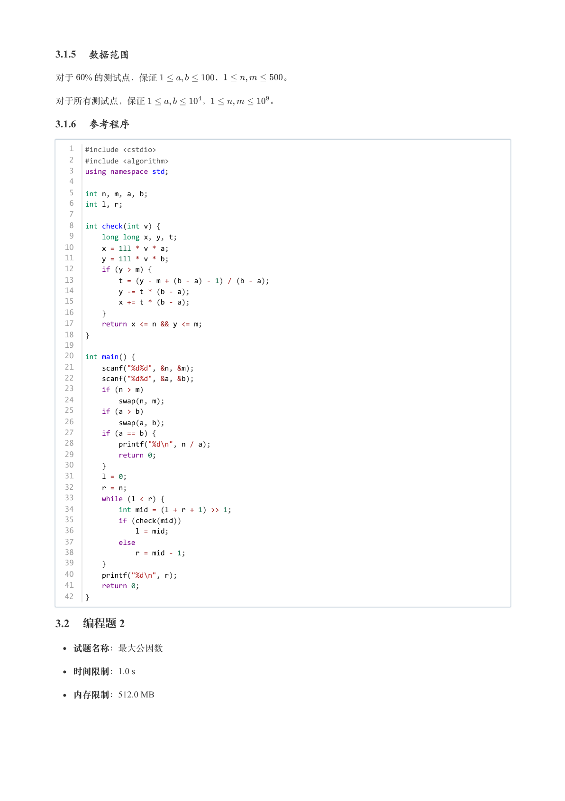

### 提取文本

```
3.1.5 数据范围

对于  % 的测试点，保证      ，       。


对于所有测试点，保证      ，       。

3.1.6 参考程序


   1   #include <cstdio>
   2   #include <algorithm>
   3   using namespace std;
   4
   5   int n, m, a, b;
   6   int l, r;
   7
   8   int check(int v) {
   9       long long x, y, t;
  10       x = 1ll * v * a;
  11       y = 1ll * v * b;
  12       if (y > m) {
  13           t = (y - m + (b - a) - 1) / (b - a);
  14           y -= t * (b - a);
  15           x += t * (b - a);
  16       }
  17       return x <= n && y <= m;
  18   }
  19
  20   int main() {
  21       scanf("%d%d", &n, &m);
  22       scanf("%d%d", &a, &b);
  23       if (n > m)
  24           swap(n, m);
  25       if (a > b)
  26           swap(a, b);
  27       if (a == b) {
  28           printf("%d\n", n / a);
  29           return 0;
  30       }
  31       l = 0;
  32       r = n;
  33       while (l < r) {
  34           int mid = (l + r + 1) >> 1;
  35           if (check(mid))
  36               l = mid;
  37           else
  38               r = mid - 1;
  39       }
  40       printf("%d\n", r);
  41       return 0;
  42   }

3.2 编程题 2


  试题名称：最大公因数

   时间限制：1.0 s

   内存限制：512.0 MB
```

## 第 15 页

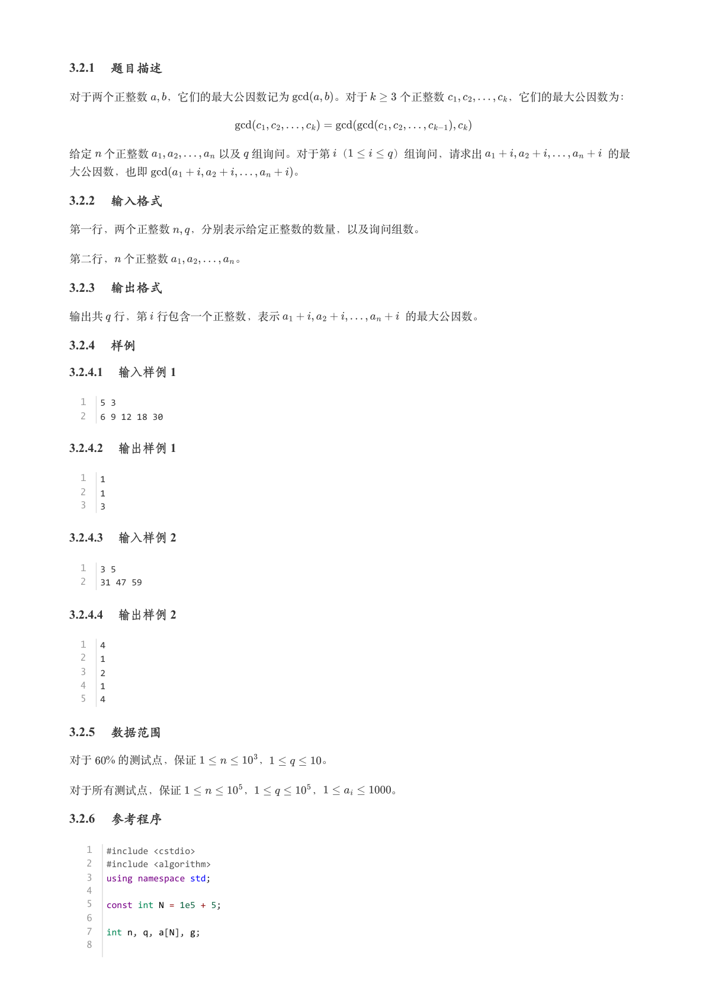

### 提取文本

```
3.2.1 题目描述

对于两个正整数  ，它们的最大公因数记为    。对于   个正整数      ，它们的最大公因数为：


给定 个正整数      以及 组询问。对于第 （    ）组询问，请求出           的最

大公因数，也即             。

3.2.2 输入格式

第一行，两个正整数  ，分别表示给定正整数的数量，以及询问组数。


第二行， 个正整数      。

3.2.3 输出格式

输出共 行，第 行包含一个正整数，表示           的最大公因数。

3.2.4 样例

3.2.4.1 输入样例 1


  1   5 3
  2   6 9 12 18 30

3.2.4.2 输出样例 1


  1   1
  2   1
  3   3

3.2.4.3 输入样例 2


  1   3 5
  2   31 47 59

3.2.4.4 输出样例 2


  1   4
  2   1
  3   2
  4   1
  5   4

3.2.5 数据范围

对于  % 的测试点，保证      ，     。


对于所有测试点，保证      ，     ，      。

3.2.6 参考程序


   1   #include <cstdio>
   2   #include <algorithm>
   3   using namespace std;
   4
   5   const int N = 1e5 + 5;
   6
   7   int n, q, a[N], g;
   8
```

## 第 16 页

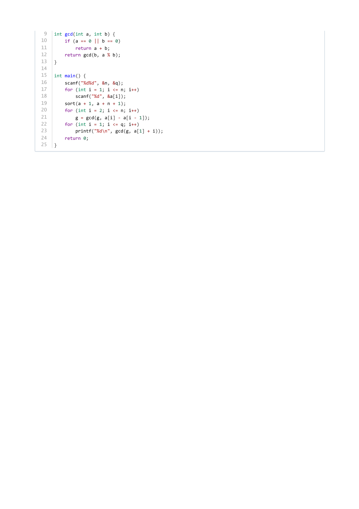

### 提取文本

```
9   int gcd(int a, int b) {
10       if (a == 0 || b == 0)
11           return a + b;
12       return gcd(b, a % b);
13   }
14
15   int main() {
16       scanf("%d%d", &n, &q);
17       for (int i = 1; i <= n; i++)
18           scanf("%d", &a[i]);
19       sort(a + 1, a + n + 1);
20       for (int i = 2; i <= n; i++)
21           g = gcd(g, a[i] - a[i - 1]);
22       for (int i = 1; i <= q; i++)
23           printf("%d\n", gcd(g, a[1] + i));
24       return 0;
25   }
```
