# 2025年6月-C++6级

- 原始 PDF：[`pdfs/2025年6月-C++6级.pdf`](../pdfs/2025年6月-C++6级.pdf)
- 页数：11
- 转换脚本：[`scripts/convert_pdfs_to_markdown.py`](../scripts/convert_pdfs_to_markdown.py)

> 为尽量避免信息丢失，每页均附带页面图片；文本提取结果保留原有顺序与换行特征，个别公式、图形、特殊排版请以页面图片为准。

## 第 1 页

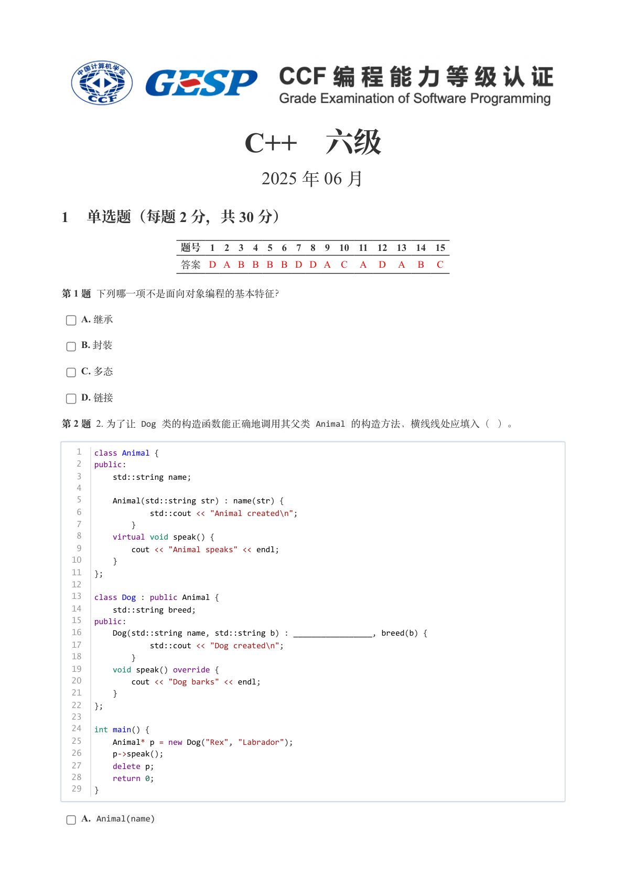

### 提取文本

```
C++　六级

                      2025 年 06 月

1 单选题（每题 2 分，共 30 分）


            题号  1  2  3  4  5  6  7  8  9  10  11  12  13  14  15
            答案 D A B B B B D D A  C  A  D  A  B  C


第 1 题 下列哪一项不是面向对象编程的基本特征？

    A. 继承

    B. 封装

    C. 多态

    D. 链接

第 2 题 2. 为了让 Dog 类的构造函数能正确地调用其父类 Animal 的构造方法，横线线处应填入（ ）。


   1   class Animal {
   2   public:
   3       std::string name;
   4
   5       Animal(std::string str) : name(str) {
   6               std::cout << "Animal created\n";
   7           }
   8       virtual void speak() {
   9           cout << "Animal speaks" << endl;
  10       }
  11   };
  12
  13   class Dog : public Animal {
  14       std::string breed;
  15   public:
  16       Dog(std::string name, std::string b) : _________________, breed(b) {
  17               std::cout << "Dog created\n";
  18           }
  19       void speak() override {
  20           cout << "Dog barks" << endl;
  21       }
  22   };
  23
  24   int main() {
  25       Animal* p = new Dog("Rex", "Labrador");
  26       p->speak();
  27       delete p;
  28       return 0;
  29   }


    A. Animal(name)
```

## 第 2 页

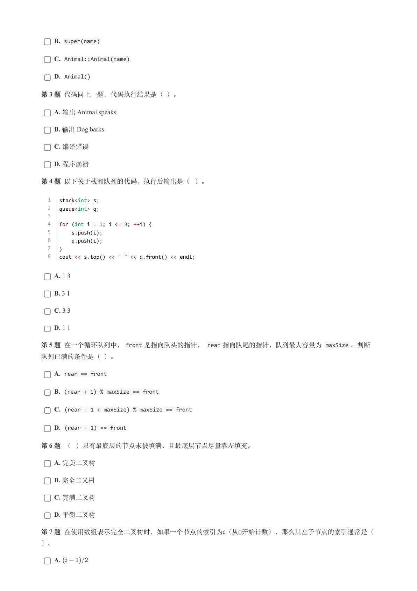

### 提取文本

```
B. super(name)

    C. Animal::Animal(name)

    D. Animal()

第 3 题 代码同上一题，代码执行结果是（ ）。

    A. 输出 Animal speaks

    B. 输出 Dog barks

    C. 编译错误

    D. 程序崩溃

第 4 题 以下关于栈和队列的代码，执行后输出是（ ）。


  1   stack<int> s;
  2   queue<int> q;
  3
  4   for (int i = 1; i <= 3; ++i) {
  5       s.push(i);
  6       q.push(i);
  7   }
  8   cout << s.top() << " " << q.front() << endl;


    A. 1 3

    B. 3 1

    C. 3 3

    D. 1 1

第 5 题 在一个循环队列中，front 是指向队头的指针， rear 指向队尾的指针，队列最大容量为 maxSize 。判断

队列已满的条件是（ ）。

    A. rear == front

    B. (rear + 1) % maxSize == front

    C. (rear - 1 + maxSize) % maxSize == front

    D. (rear - 1) == front

第 6 题 （ ）只有最底层的节点未被填满，且最底层节点尽量靠左填充。

    A. 完美二叉树

    B. 完全二叉树

    C. 完满二叉树

    D. 平衡二叉树

第 7 题 在使用数组表示完全二叉树时，如果一个节点的索引为（从开始计数），那么其左子节点的索引通常是（

）。

    A.
```

## 第 3 页

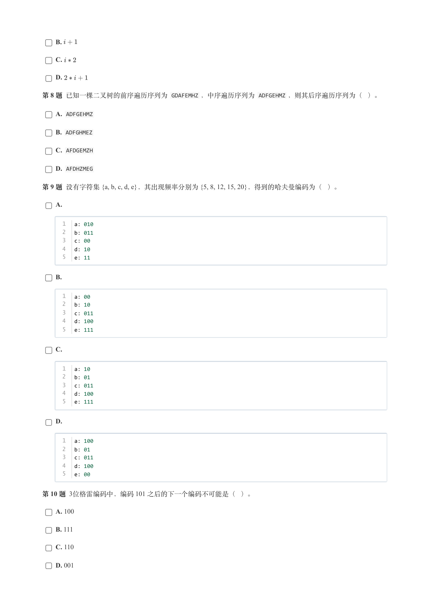

### 提取文本

```
B.

    C.

    D.

第 8 题 已知一棵二叉树的前序遍历序列为 GDAFEMHZ ，中序遍历序列为 ADFGEHMZ ，则其后序遍历序列为（ ）。

    A. ADFGEHMZ

    B. ADFGHMEZ

    C. AFDGEMZH

    D. AFDHZMEG

第 9 题 设有字符集 {a, b, c, d, e}，其出现频率分别为 {5, 8, 12, 15, 20}，得到的哈夫曼编码为（ ）。

    A.


      1   a: 010
      2   b: 011
      3   c: 00
      4   d: 10
      5   e: 11


    B.


      1   a: 00
      2   b: 10
      3   c: 011
      4   d: 100
      5   e: 111


    C.


      1   a: 10
      2   b: 01
      3   c: 011
      4   d: 100
      5   e: 111


    D.


      1   a: 100
      2   b: 01
      3   c: 011
      4   d: 100
      5   e: 00


第 10 题 3位格雷编码中，编码 101 之后的下一个编码不可能是（ ）。

    A. 100

    B. 111

    C. 110

    D. 001
```

## 第 4 页

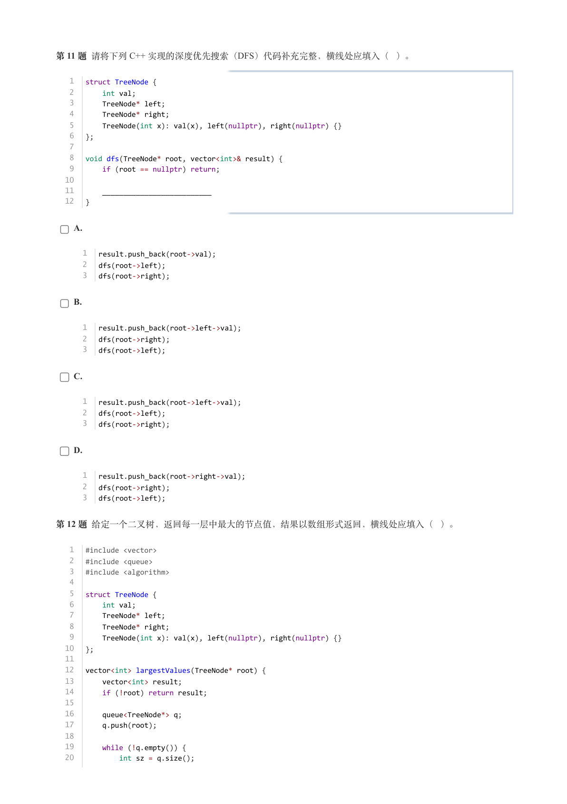

### 提取文本

```
第 11 题 请将下列 C++ 实现的深度优先搜索（DFS）代码补充完整，横线处应填入（ ）。


   1   struct TreeNode {
   2       int val;
   3       TreeNode* left;
   4       TreeNode* right;
   5       TreeNode(int x): val(x), left(nullptr), right(nullptr) {}
   6   };
   7
   8   void dfs(TreeNode* root, vector<int>& result) {
   9       if (root == nullptr) return;
  10
  11       __________________________
  12   }


    A.


      1   result.push_back(root->val);
      2   dfs(root->left);
      3   dfs(root->right);


    B.


      1   result.push_back(root->left->val);
      2   dfs(root->right);
      3   dfs(root->left);


    C.


      1   result.push_back(root->left->val);
      2   dfs(root->left);
      3   dfs(root->right);


    D.


      1   result.push_back(root->right->val);
      2   dfs(root->right);
      3   dfs(root->left);


第 12 题 给定一个二叉树，返回每一层中最大的节点值，结果以数组形式返回，横线处应填入（ ）。


   1   #include <vector>
   2   #include <queue>
   3   #include <algorithm>
   4
   5   struct TreeNode {
   6       int val;
   7       TreeNode* left;
   8       TreeNode* right;
   9       TreeNode(int x): val(x), left(nullptr), right(nullptr) {}
  10   };
  11
  12   vector<int> largestValues(TreeNode* root) {
  13       vector<int> result;
  14       if (!root) return result;
  15
  16       queue<TreeNode*> q;
  17       q.push(root);
  18
  19       while (!q.empty()) {
  20           int sz = q.size();
```

## 第 5 页

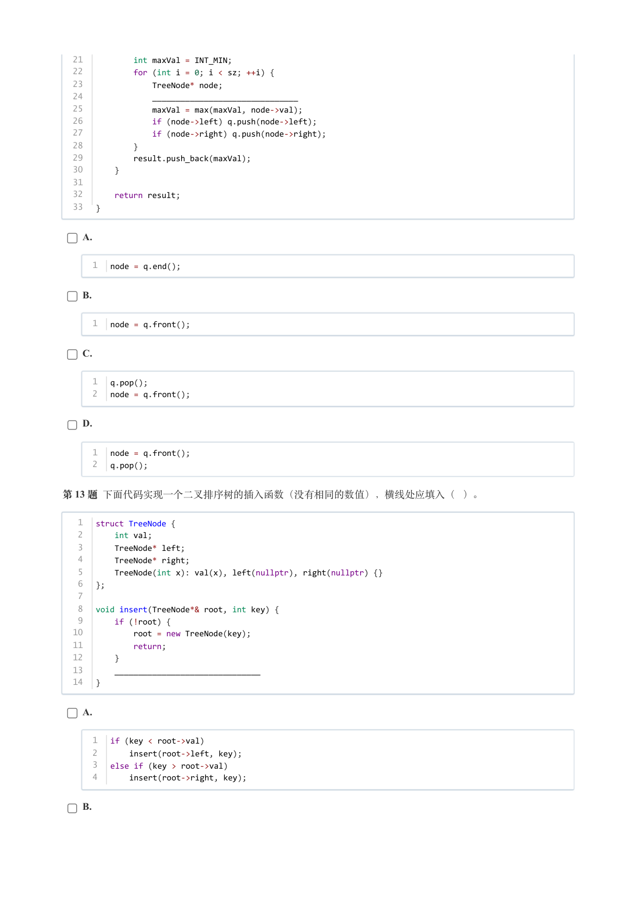

### 提取文本

```
21           int maxVal = INT_MIN;
  22           for (int i = 0; i < sz; ++i) {
  23               TreeNode* node;
  24               _______________________________
  25               maxVal = max(maxVal, node->val);
  26               if (node->left) q.push(node->left);
  27               if (node->right) q.push(node->right);
  28           }
  29           result.push_back(maxVal);
  30       }
  31
  32       return result;
  33   }


    A.


      1   node = q.end();


    B.


      1   node = q.front();


    C.


      1   q.pop();
      2   node = q.front();


    D.


      1   node = q.front();
      2   q.pop();


第 13 题 下面代码实现一个二叉排序树的插入函数（没有相同的数值），横线处应填入（ ）。


   1   struct TreeNode {
   2       int val;
   3       TreeNode* left;
   4       TreeNode* right;
   5       TreeNode(int x): val(x), left(nullptr), right(nullptr) {}
   6   };
   7
   8   void insert(TreeNode*& root, int key) {
   9       if (!root) {
  10           root = new TreeNode(key);
  11           return;
  12       }
  13       _______________________________
  14   }


    A.


      1   if (key < root->val)
      2       insert(root->left, key);
      3   else if (key > root->val)
      4       insert(root->right, key);


    B.
```

## 第 6 页

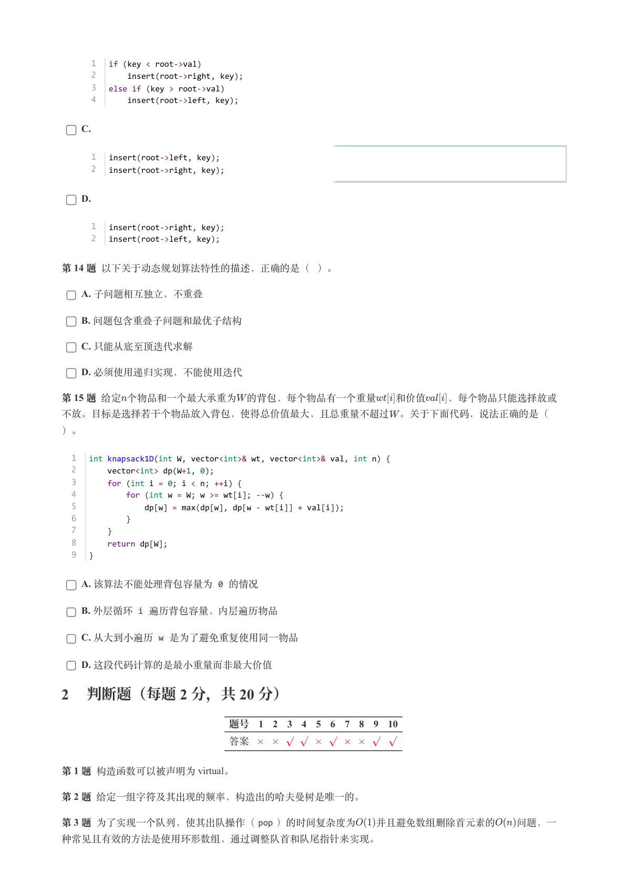

### 提取文本

```
1   if (key < root->val)
      2       insert(root->right, key);
      3   else if (key > root->val)
      4       insert(root->left, key);


    C.


      1   insert(root->left, key);
      2   insert(root->right, key);


    D.


      1   insert(root->right, key);
      2   insert(root->left, key);


第 14 题 以下关于动态规划算法特性的描述，正确的是（ ）。

    A. 子问题相互独立，不重叠

    B. 问题包含重叠子问题和最优子结构

    C. 只能从底至顶迭代求解

    D. 必须使用递归实现，不能使用迭代

第 15 题 给定个物品和一个最大承重为 的背包，每个物品有一个重量  和价值  ，每个物品只能选择放或

不放。目标是选择若干个物品放入背包，使得总价值最大，且总重量不超过 。关于下面代码，说法正确的是（

）。


  1   int knapsack1D(int W, vector<int>& wt, vector<int>& val, int n) {
  2       vector<int> dp(W+1, 0);
  3       for (int i = 0; i < n; ++i) {
  4           for (int w = W; w >= wt[i]; --w) {
  5               dp[w] = max(dp[w], dp[w - wt[i]] + val[i]);
  6           }
  7       }
  8       return dp[W];
  9   }


    A. 该算法不能处理背包容量为 0 的情况

    B. 外层循环 i 遍历背包容量，内层遍历物品

    C. 从大到小遍历 w 是为了避免重复使用同一物品

    D. 这段代码计算的是最小重量而非最大价值

2 判断题（每题 2 分，共 20 分）

                 题号  1  2  3  4  5  6  7  8  9  10

                 答案


第 1 题 构造函数可以被声明为 virtual。

第 2 题 给定一组字符及其出现的频率，构造出的哈夫曼树是唯一的。

第 3 题 为了实现一个队列，使其出队操作（pop ）的时间复杂度为  并且避免数组删除首元素的  问题，一

种常见且有效的方法是使用环形数组，通过调整队首和队尾指针来实现。
```

## 第 7 页

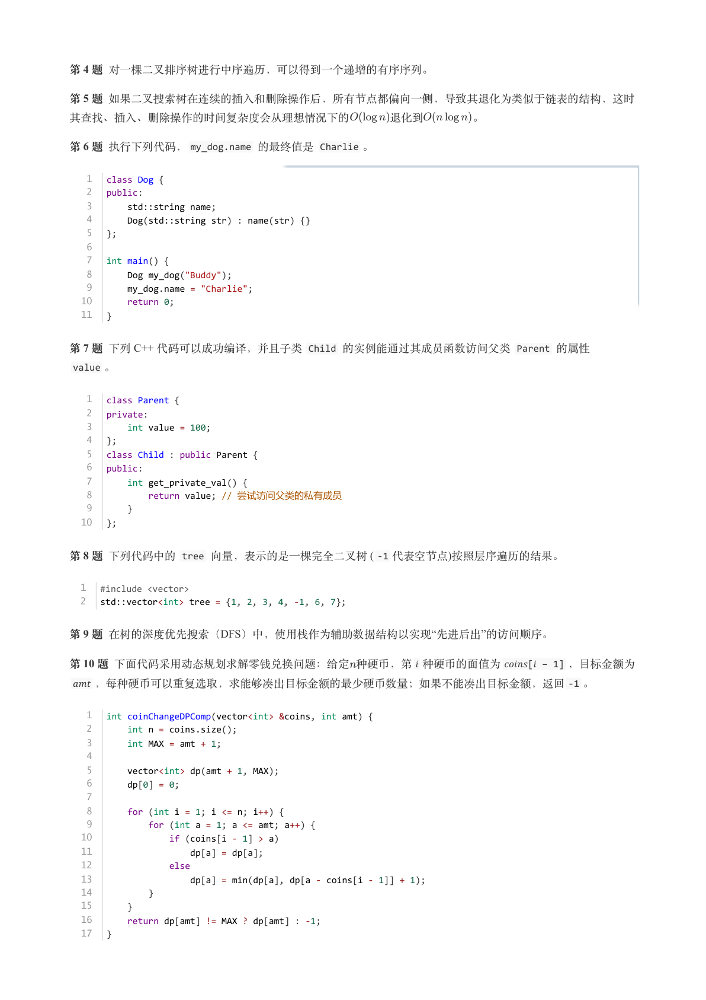

### 提取文本

```
第 4 题 对一棵二叉排序树进行中序遍历，可以得到一个递增的有序序列。

第 5 题 如果二叉搜索树在连续的插入和删除操作后，所有节点都偏向一侧，导致其退化为类似于链表的结构，这时

其查找、插入、删除操作的时间复杂度会从理想情况下的    退化到    。

第 6 题 执行下列代码，my_dog.name 的最终值是 Charlie 。


   1   class Dog {
   2   public:
   3       std::string name;
   4       Dog(std::string str) : name(str) {}
   5   };
   6
   7   int main() {
   8       Dog my_dog("Buddy");
   9       my_dog.name = "Charlie";
  10       return 0;
  11   }


第 7 题 下列 C++ 代码可以成功编译，并且子类 Child 的实例能通过其成员函数访问父类 Parent 的属性

 value 。


   1   class Parent {
   2   private:
   3       int value = 100;
   4   };
   5   class Child : public Parent {
   6   public:
   7       int get_private_val() {
   8           return value; // 尝试访问父类的私有成员
   9       }
  10   };


第 8 题 下列代码中的 tree 向量，表示的是一棵完全二叉树 ( -1 代表空节点)按照层序遍历的结果。


  1   #include <vector>
  2   std::vector<int> tree = {1, 2, 3, 4, -1, 6, 7};


第 9 题 在树的深度优先搜索（DFS）中，使用栈作为辅助数据结构以实现“先进后出”的访问顺序。

第 10 题 下面代码采用动态规划求解零钱兑换问题：给定种硬币，第𝑖种硬币的面值为𝑐𝑜𝑖𝑛𝑠[𝑖 − 1] ，目标金额为

𝑎𝑚𝑡，每种硬币可以重复选取，求能够凑出目标金额的最少硬币数量；如果不能凑出目标金额，返回-1 。


   1   int coinChangeDPComp(vector<int> &coins, int amt) {
   2       int n = coins.size();
   3       int MAX = amt + 1;
   4
   5       vector<int> dp(amt + 1, MAX);
   6       dp[0] = 0;
   7
   8       for (int i = 1; i <= n; i++) {
   9           for (int a = 1; a <= amt; a++) {
  10               if (coins[i - 1] > a)
  11                   dp[a] = dp[a];
  12               else
  13                   dp[a] = min(dp[a], dp[a - coins[i - 1]] + 1);
  14           }
  15       }
  16       return dp[amt] != MAX ? dp[amt] : -1;
  17   }
```

## 第 8 页

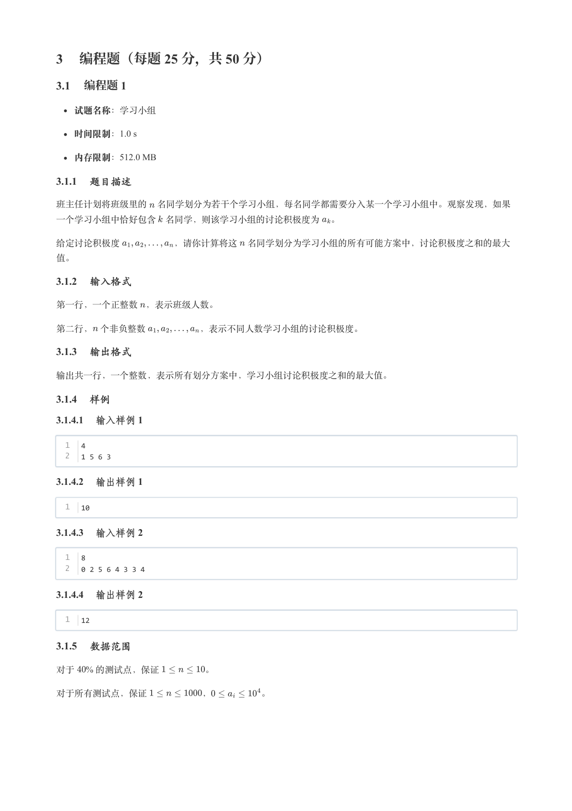

### 提取文本

```
3 编程题（每题 25 分，共 50 分）

3.1 编程题 1


  试题名称：学习小组

   时间限制：1.0 s

   内存限制：512.0 MB

3.1.1 题目描述

班主任计划将班级里的 名同学划分为若干个学习小组，每名同学都需要分入某一个学习小组中。观察发现，如果

一个学习小组中恰好包含 名同学，则该学习小组的讨论积极度为 。


给定讨论积极度      ，请你计算将这 名同学划分为学习小组的所有可能方案中，讨论积极度之和的最大

值。

3.1.2 输入格式

第一行，一个正整数 ，表示班级人数。


第二行， 个非负整数      ，表示不同人数学习小组的讨论积极度。

3.1.3 输出格式

输出共一行，一个整数，表示所有划分方案中，学习小组讨论积极度之和的最大值。

3.1.4 样例

3.1.4.1 输入样例 1


  1   4
  2   1 5 6 3

3.1.4.2 输出样例 1


  1   10

3.1.4.3 输入样例 2


  1   8
  2   0 2 5 6 4 3 3 4

3.1.4.4 输出样例 2


  1   12

3.1.5 数据范围

对于  % 的测试点，保证     。


对于所有测试点，保证      ，      。
```

## 第 9 页

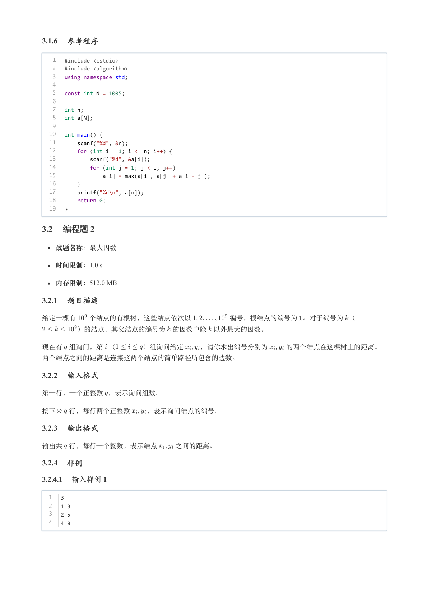

### 提取文本

```
3.1.6 参考程序


   1   #include <cstdio>
   2   #include <algorithm>
   3   using namespace std;
   4
   5   const int N = 1005;
   6
   7   int n;
   8   int a[N];
   9
  10   int main() {
  11       scanf("%d", &n);
  12       for (int i = 1; i <= n; i++) {
  13           scanf("%d", &a[i]);
  14           for (int j = 1; j < i; j++)
  15               a[i] = max(a[i], a[j] + a[i - j]);
  16       }
  17       printf("%d\n", a[n]);
  18       return 0;
  19   }

3.2 编程题 2


  试题名称：最大因数

   时间限制：1.0 s

   内存限制：512.0 MB

3.2.1 题目描述

给定一棵有  个结点的有根树，这些结点依次以      编号，根结点的编号为 。对于编号为 （

     ）的结点，其父结点的编号为 的因数中除 以外最大的因数。


现在有 组询问，第 （    ）组询问给定  ，请你求出编号分别为   的两个结点在这棵树上的距离。

两个结点之间的距离是连接这两个结点的简单路径所包含的边数。

3.2.2 输入格式

第一行，一个正整数 ，表示询问组数。


接下来 行，每行两个正整数  ，表示询问结点的编号。

3.2.3 输出格式

输出共 行，每行一个整数，表示结点   之间的距离。

3.2.4 样例

3.2.4.1 输入样例 1


  1   3
  2   1 3
  3   2 5
  4   4 8
```

## 第 10 页

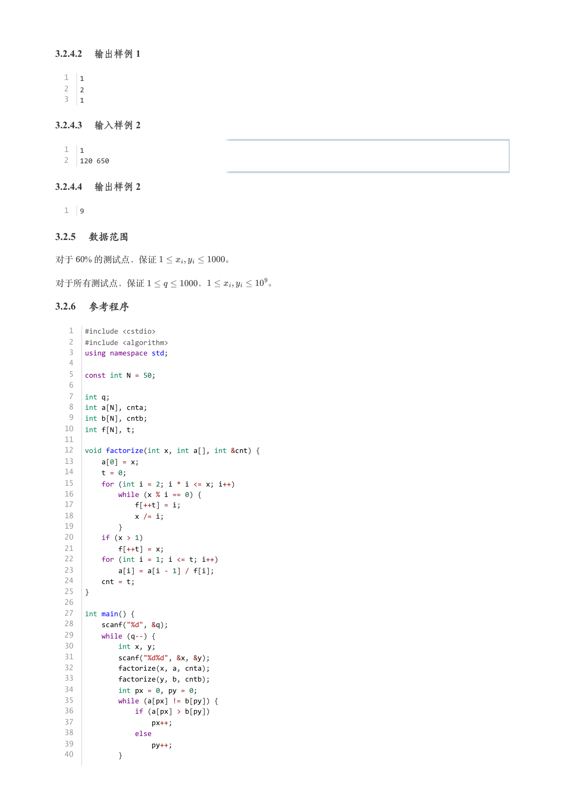

### 提取文本

```
3.2.4.2 输出样例 1


  1   1
  2   2
  3   1

3.2.4.3 输入样例 2


  1   1
  2   120 650

3.2.4.4 输出样例 2


  1   9

3.2.5 数据范围

对于  % 的测试点，保证        。


对于所有测试点，保证      ，       。

3.2.6 参考程序


   1   #include <cstdio>
   2   #include <algorithm>
   3   using namespace std;
   4
   5   const int N = 50;
   6
   7   int q;
   8   int a[N], cnta;
   9   int b[N], cntb;
  10   int f[N], t;
  11
  12   void factorize(int x, int a[], int &cnt) {
  13       a[0] = x;
  14       t = 0;
  15       for (int i = 2; i * i <= x; i++)
  16           while (x % i == 0) {
  17               f[++t] = i;
  18               x /= i;
  19           }
  20       if (x > 1)
  21           f[++t] = x;
  22       for (int i = 1; i <= t; i++)
  23           a[i] = a[i - 1] / f[i];
  24       cnt = t;
  25   }
  26
  27   int main() {
  28       scanf("%d", &q);
  29       while (q--) {
  30           int x, y;
  31           scanf("%d%d", &x, &y);
  32           factorize(x, a, cnta);
  33           factorize(y, b, cntb);
  34           int px = 0, py = 0;
  35           while (a[px] != b[py]) {
  36               if (a[px] > b[py])
  37                   px++;
  38               else
  39                   py++;
  40           }
```

## 第 11 页

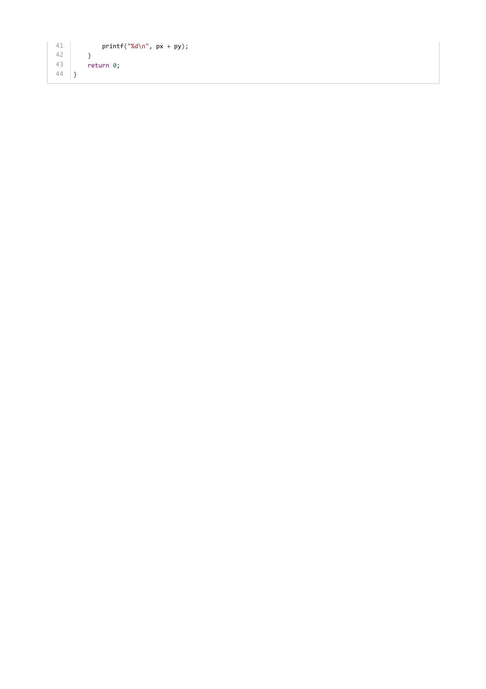

### 提取文本

```
41           printf("%d\n", px + py);
42       }
43       return 0;
44   }
```
