# 2025年6月-C++8级

- 原始 PDF：[`pdfs/2025年6月-C++8级.pdf`](../pdfs/2025年6月-C++8级.pdf)
- 页数：11
- 转换脚本：[`scripts/convert_pdfs_to_markdown.py`](../scripts/convert_pdfs_to_markdown.py)

> 为尽量避免信息丢失，每页均附带页面图片；文本提取结果保留原有顺序与换行特征，个别公式、图形、特殊排版请以页面图片为准。

## 第 1 页

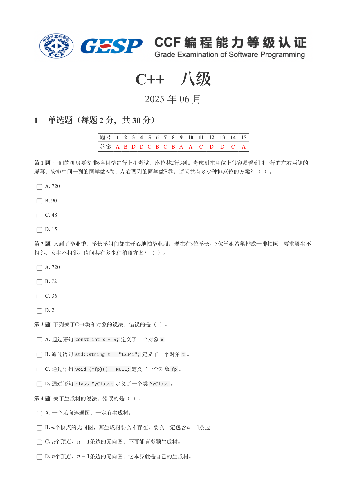

### 提取文本

```
C++　八级

                      2025 年 06 月

1 单选题（每题 2 分，共 30 分）


            题号  1  2  3  4  5  6  7  8  9  10  11  12  13  14  15
            答案 A B D D C B C B A A  C  D  D  C  A


第 1 题 一间的机房要安排6名同学进行上机考试，座位共2行3列。考虑到在座位上很容易看到同一行的左右两侧的
屏幕，安排中间一列的同学做A卷，左右两列的同学做B卷。请问共有多少种排座位的方案？（ ）。

    A. 720

    B. 90

    C. 48

    D. 15

第 2 题 又到了毕业季，学长学姐们都在开心地拍毕业照。现在有3位学长、3位学姐希望排成一排拍照，要求男生不

相邻、女生不相邻。请问共有多少种拍照方案？（ ）。

    A. 720

    B. 72

    C. 36

    D. 2

第 3 题 下列关于C++类和对象的说法，错误的是（ ）。

    A. 通过语句const int x = 5; 定义了一个对象x 。

    B. 通过语句std::string t = "12345"; 定义了一个对象t 。

    C. 通过语句void (*fp)() = NULL; 定义了一个对象fp 。

    D. 通过语句class MyClass; 定义了一个类MyClass 。

第 4 题 关于生成树的说法，错误的是（ ）。

    A. 一个无向连通图，一定有生成树。

    B. 个顶点的无向图，其生成树要么不存在，要么一定包含  条边。

    C. 个顶点、  条边的无向图，不可能有多颗生成树。

    D. 个顶点、  条边的无向图，它本身就是自己的生成树。
```

## 第 2 页

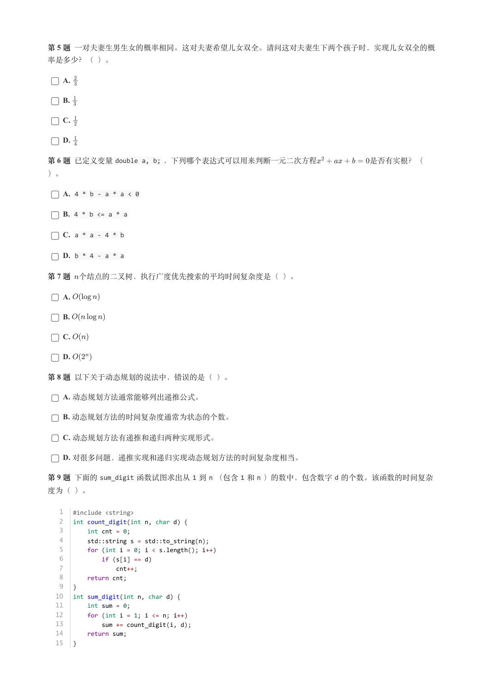

### 提取文本

```
第 5 题 一对夫妻生男生女的概率相同。这对夫妻希望儿女双全。请问这对夫妻生下两个孩子时，实现儿女双全的概

率是多少？（ ）。

    A.

    B.

    C.

    D.

第 6 题 已定义变量double a, b; ，下列哪个表达式可以用来判断一元二次方程       是否有实根？（

）。

    A. 4 * b - a * a < 0

    B. 4 * b <= a * a

    C. a * a - 4 * b

    D. b * 4 - a * a

第 7 题 个结点的二叉树，执行广度优先搜索的平均时间复杂度是（ ）。

    A.

    B.

    C.

    D.

第 8 题 以下关于动态规划的说法中，错误的是（ ）。

    A. 动态规划方法通常能够列出递推公式。

    B. 动态规划方法的时间复杂度通常为状态的个数。

    C. 动态规划方法有递推和递归两种实现形式。

    D. 对很多问题，递推实现和递归实现动态规划方法的时间复杂度相当。

第 9 题 下面的sum_digit 函数试图求出从1 到n （包含1 和n ）的数中，包含数字d 的个数。该函数的时间复杂

度为（ ）。


   1   #include <string>
   2   int count_digit(int n, char d) {
   3       int cnt = 0;
   4       std::string s = std::to_string(n);
   5       for (int i = 0; i < s.length(); i++)
   6           if (s[i] == d)
   7               cnt++;
   8       return cnt;
   9   }
  10   int sum_digit(int n, char d) {
  11       int sum = 0;
  12       for (int i = 1; i <= n; i++)
  13           sum += count_digit(i, d);
  14       return sum;
  15   }
```

## 第 3 页

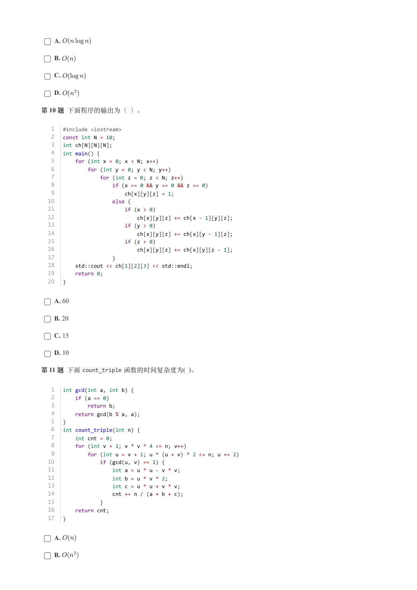

### 提取文本

```
A.

    B.

    C.

    D.

第 10 题 下面程序的输出为（ ）。


   1   #include <iostream>
   2   const int N = 10;
   3   int ch[N][N][N];
   4   int main() {
   5       for (int x = 0; x < N; x++)
   6           for (int y = 0; y < N; y++)
   7               for (int z = 0; z < N; z++)
   8                   if (x == 0 && y == 0 && z == 0)
   9                       ch[x][y][z] = 1;
  10                   else {
  11                       if (x > 0)
  12                           ch[x][y][z] += ch[x - 1][y][z];
  13                       if (y > 0)
  14                           ch[x][y][z] += ch[x][y - 1][z];
  15                       if (z > 0)
  16                           ch[x][y][z] += ch[x][y][z - 1];
  17                   }
  18       std::cout << ch[1][2][3] << std::endl;
  19       return 0;
  20   }


    A. 60

    B. 20

    C. 15

    D. 10

第 11 题 下面count_triple 函数的时间复杂度为( )。


   1   int gcd(int a, int b) {
   2       if (a == 0)
   3           return b;
   4       return gcd(b % a, a);
   5   }
   6   int count_triple(int n) {
   7       int cnt = 0;
   8       for (int v = 1; v * v * 4 <= n; v++)
   9           for (int u = v + 1; u * (u + v) * 2 <= n; u += 2)
  10               if (gcd(u, v) == 1) {
  11                   int a = u * u - v * v;
  12                   int b = u * v * 2;
  13                   int c = u * u + v * v;
  14                   cnt += n / (a + b + c);
  15               }
  16       return cnt;
  17   }


    A.

    B.
```

## 第 4 页

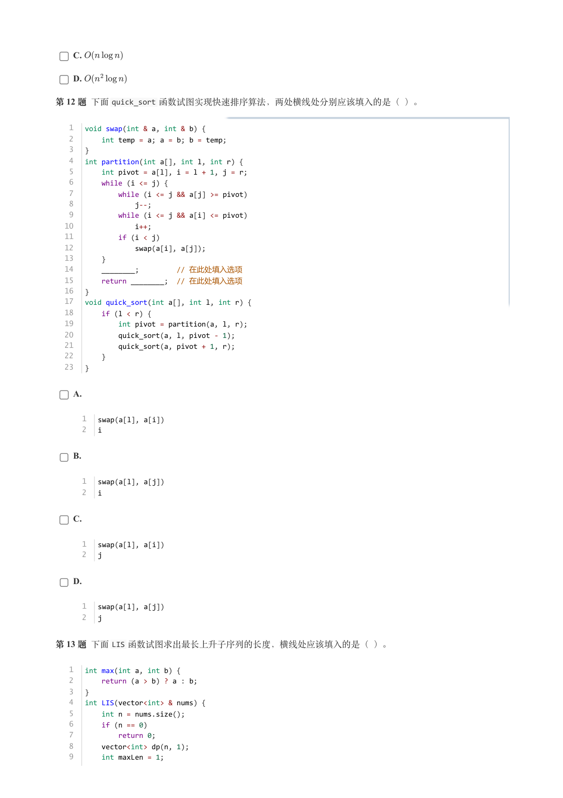

### 提取文本

```
C.

    D.

第 12 题 下面quick_sort 函数试图实现快速排序算法，两处横线处分别应该填入的是（ ）。


   1   void swap(int & a, int & b) {
   2       int temp = a; a = b; b = temp;
   3   }
   4   int partition(int a[], int l, int r) {
   5       int pivot = a[l], i = l + 1, j = r;
   6       while (i <= j) {
   7           while (i <= j && a[j] >= pivot)
   8               j--;
   9           while (i <= j && a[i] <= pivot)
  10               i++;
  11           if (i < j)
  12               swap(a[i], a[j]);
  13       }
  14       ________;         // 在此处填入选项
  15       return ________;  // 在此处填入选项
  16   }
  17   void quick_sort(int a[], int l, int r) {
  18       if (l < r) {
  19           int pivot = partition(a, l, r);
  20           quick_sort(a, l, pivot - 1);
  21           quick_sort(a, pivot + 1, r);
  22       }
  23   }


    A.


      1   swap(a[l], a[i])
      2   i


    B.


      1   swap(a[l], a[j])
      2   i


    C.


      1   swap(a[l], a[i])
      2   j


    D.


      1   swap(a[l], a[j])
      2   j


第 13 题 下面LIS 函数试图求出最长上升子序列的长度，横线处应该填入的是（ ）。


   1   int max(int a, int b) {
   2       return (a > b) ? a : b;
   3   }
   4   int LIS(vector<int> & nums) {
   5       int n = nums.size();
   6       if (n == 0)
   7           return 0;
   8       vector<int> dp(n, 1);
   9       int maxLen = 1;
```

## 第 5 页

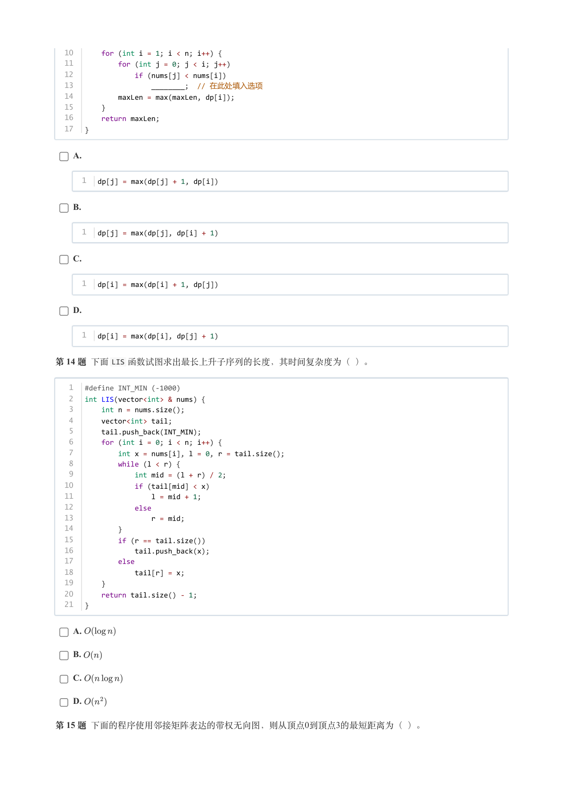

### 提取文本

```
10       for (int i = 1; i < n; i++) {
  11           for (int j = 0; j < i; j++)
  12               if (nums[j] < nums[i])
  13                   ________;  // 在此处填入选项
  14           maxLen = max(maxLen, dp[i]);
  15       }
  16       return maxLen;
  17   }


    A.


      1   dp[j] = max(dp[j] + 1, dp[i])


    B.


      1   dp[j] = max(dp[j], dp[i] + 1)


    C.


      1   dp[i] = max(dp[i] + 1, dp[j])


    D.


      1   dp[i] = max(dp[i], dp[j] + 1)


第 14 题 下面LIS 函数试图求出最长上升子序列的长度，其时间复杂度为（ ）。


   1   #define INT_MIN (-1000)
   2   int LIS(vector<int> & nums) {
   3       int n = nums.size();
   4       vector<int> tail;
   5       tail.push_back(INT_MIN);
   6       for (int i = 0; i < n; i++) {
   7           int x = nums[i], l = 0, r = tail.size();
   8           while (l < r) {
   9               int mid = (l + r) / 2;
  10               if (tail[mid] < x)
  11                   l = mid + 1;
  12               else
  13                   r = mid;
  14           }
  15           if (r == tail.size())
  16               tail.push_back(x);
  17           else
  18               tail[r] = x;
  19       }
  20       return tail.size() - 1;
  21   }


    A.

    B.

    C.

    D.

第 15 题 下面的程序使用邻接矩阵表达的带权无向图，则从顶点0到顶点3的最短距离为（ ）。
```

## 第 6 页

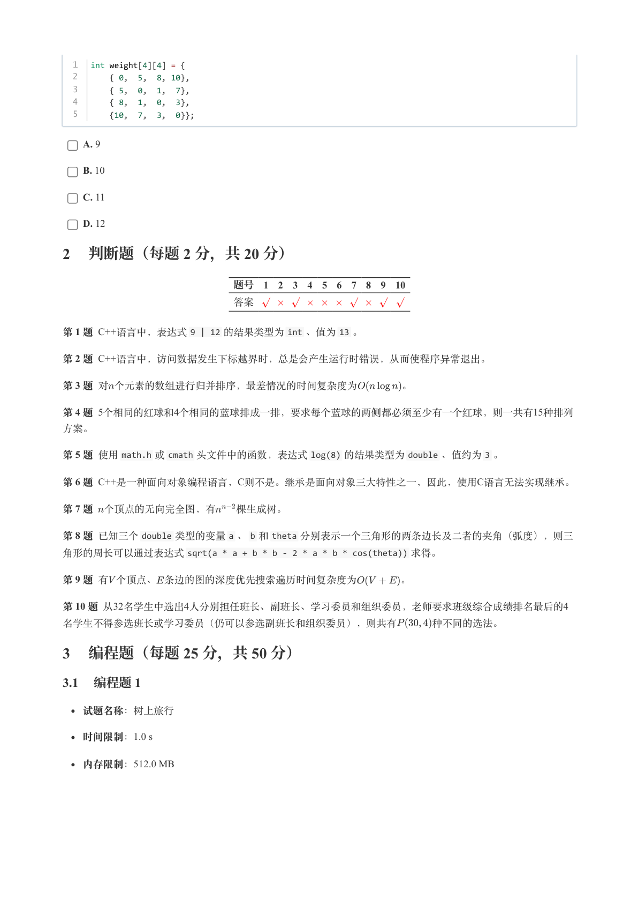

### 提取文本

```
1   int weight[4][4] = {
  2       { 0,  5,  8, 10},
  3       { 5,  0,  1,  7},
  4       { 8,  1,  0,  3},
  5       {10,  7,  3,  0}};


    A. 9

    B. 10

    C. 11

    D. 12

2 判断题（每题 2 分，共 20 分）


                 题号  1  2  3  4  5  6  7  8  9  10

                 答案


第 1 题 C++语言中，表达式9 | 12 的结果类型为int 、值为13 。

第 2 题 C++语言中，访问数据发生下标越界时，总是会产生运行时错误，从而使程序异常退出。

第 3 题 对个元素的数组进行归并排序，最差情况的时间复杂度为    。

第 4 题 5个相同的红球和4个相同的蓝球排成一排，要求每个蓝球的两侧都必须至少有一个红球，则一共有15种排列

方案。

第 5 题 使用math.h 或cmath 头文件中的函数，表达式log(8) 的结果类型为double 、值约为3 。

第 6 题 C++是一种面向对象编程语言，C则不是。继承是面向对象三大特性之一，因此，使用C语言无法实现继承。

第 7 题 个顶点的无向完全图，有  棵生成树。

第 8 题 已知三个double 类型的变量a 、b 和theta 分别表示一个三角形的两条边长及二者的夹角（弧度），则三

角形的周长可以通过表达式sqrt(a * a + b * b - 2 * a * b * cos(theta)) 求得。

第 9 题 有个顶点、条边的图的深度优先搜索遍历时间复杂度为    。

第 10 题 从32名学生中选出4人分别担任班长、副班长、学习委员和组织委员，老师要求班级综合成绩排名最后的4

名学生不得参选班长或学习委员（仍可以参选副班长和组织委员），则共有    种不同的选法。

3 编程题（每题 25 分，共 50 分）

3.1 编程题 1


  试题名称：树上旅行

   时间限制：1.0 s

   内存限制：512.0 MB
```

## 第 7 页

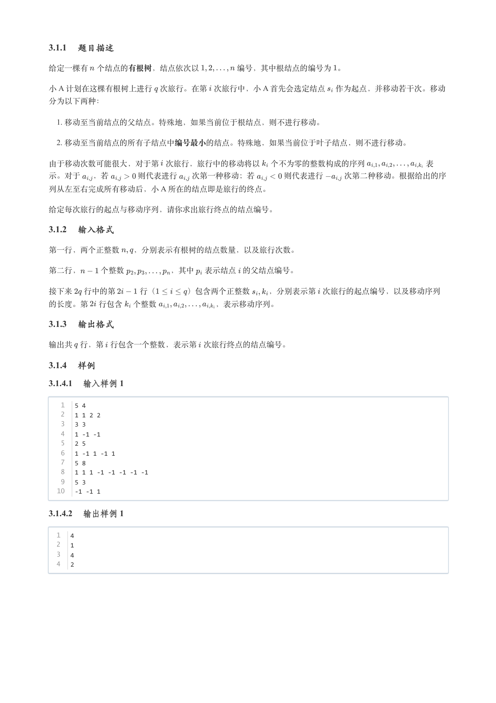

### 提取文本

```
3.1.1 题目描述

给定一棵有 个结点的有根树，结点依次以     编号，其中根结点的编号为 。

小 A 计划在这棵有根树上进行 次旅行。在第 次旅行中，小 A 首先会选定结点 作为起点，并移动若干次。移动

分为以下两种：

   1. 移动至当前结点的父结点。特殊地，如果当前位于根结点，则不进行移动。

   2. 移动至当前结点的所有子结点中编号最小的结点。特殊地，如果当前位于叶子结点，则不进行移动。


由于移动次数可能很大，对于第 次旅行，旅行中的移动将以 个不为零的整数构成的序列        表

示。对于  ，若    则代表进行  次第一种移动；若    则代表进行   次第二种移动。根据给出的序

列从左至右完成所有移动后，小 A 所在的结点即是旅行的终点。


给定每次旅行的起点与移动序列，请你求出旅行终点的结点编号。

3.1.2 输入格式

第一行，两个正整数  ，分别表示有根树的结点数量，以及旅行次数。


第二行，   个整数      ，其中 表示结点 的父结点编号。


接下来 行中的第   行（    ）包含两个正整数  ，分别表示第 次旅行的起点编号，以及移动序列

的长度。第 行包含 个整数       ，表示移动序列。

3.1.3 输出格式

输出共 行，第 行包含一个整数，表示第 次旅行终点的结点编号。

3.1.4 样例

3.1.4.1 输入样例 1


   1   5 4
   2   1 1 2 2
   3   3 3
   4   1 -1 -1
   5   2 5
   6   1 -1 1 -1 1
   7   5 8
   8   1 1 1 -1 -1 -1 -1 -1
   9   5 3
  10   -1 -1 1

3.1.4.2 输出样例 1


  1   4
  2   1
  3   4
  4   2
```

## 第 8 页

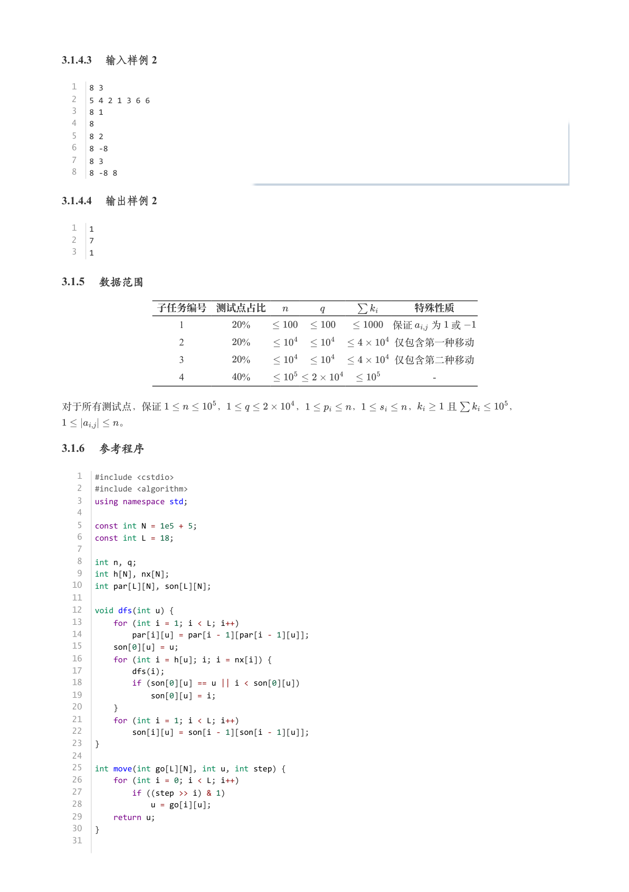

### 提取文本

```
3.1.4.3 输入样例 2


  1   8 3
  2   5 4 2 1 3 6 6
  3   8 1
  4   8
  5   8 2
  6   8 -8
  7   8 3
  8   8 -8 8

3.1.4.4 输出样例 2


  1   1
  2   7
  3   1

3.1.5 数据范围

          子任务编号 测试点占比               特殊性质

                        1       %              保证  为 或

                        2       %              仅包含第一种移动

                        3       %              仅包含第二种移动

                        4       %                                                       -


对于所有测试点，保证      ，       ，     ，     ，   且     ，

      。

3.1.6 参考程序


   1   #include <cstdio>
   2   #include <algorithm>
   3   using namespace std;
   4
   5   const int N = 1e5 + 5;
   6   const int L = 18;
   7
   8   int n, q;
   9   int h[N], nx[N];
  10   int par[L][N], son[L][N];
  11
  12   void dfs(int u) {
  13       for (int i = 1; i < L; i++)
  14           par[i][u] = par[i - 1][par[i - 1][u]];
  15       son[0][u] = u;
  16       for (int i = h[u]; i; i = nx[i]) {
  17           dfs(i);
  18           if (son[0][u] == u || i < son[0][u])
  19               son[0][u] = i;
  20       }
  21       for (int i = 1; i < L; i++)
  22           son[i][u] = son[i - 1][son[i - 1][u]];
  23   }
  24
  25   int move(int go[L][N], int u, int step) {
  26       for (int i = 0; i < L; i++)
  27           if ((step >> i) & 1)
  28               u = go[i][u];
  29       return u;
  30   }
  31
```

## 第 9 页

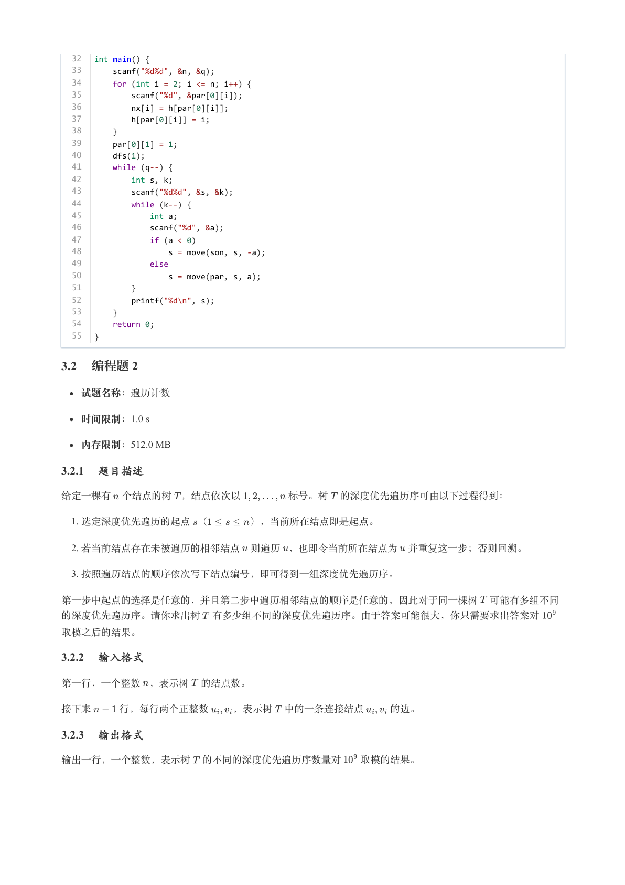

### 提取文本

```
32   int main() {
  33       scanf("%d%d", &n, &q);
  34       for (int i = 2; i <= n; i++) {
  35           scanf("%d", &par[0][i]);
  36           nx[i] = h[par[0][i]];
  37           h[par[0][i]] = i;
  38       }
  39       par[0][1] = 1;
  40       dfs(1);
  41       while (q--) {
  42           int s, k;
  43           scanf("%d%d", &s, &k);
  44           while (k--) {
  45               int a;
  46               scanf("%d", &a);
  47               if (a < 0)
  48                   s = move(son, s, -a);
  49               else
  50                   s = move(par, s, a);
  51           }
  52           printf("%d\n", s);
  53       }
  54       return 0;
  55   }

3.2 编程题 2


  试题名称：遍历计数

   时间限制：1.0 s

   内存限制：512.0 MB

3.2.1 题目描述

给定一棵有 个结点的树 ，结点依次以     标号。树 的深度优先遍历序可由以下过程得到：

   1. 选定深度优先遍历的起点 （    ），当前所在结点即是起点。

   2. 若当前结点存在未被遍历的相邻结点 则遍历 ，也即令当前所在结点为 并重复这一步；否则回溯。

   3. 按照遍历结点的顺序依次写下结点编号，即可得到一组深度优先遍历序。


第一步中起点的选择是任意的，并且第二步中遍历相邻结点的顺序是任意的，因此对于同一棵树 可能有多组不同

的深度优先遍历序。请你求出树 有多少组不同的深度优先遍历序。由于答案可能很大，你只需要求出答案对

取模之后的结果。

3.2.2 输入格式

第一行，一个整数 ，表示树 的结点数。


接下来   行，每行两个正整数  ，表示树 中的一条连接结点   的边。

3.2.3 输出格式

输出一行，一个整数，表示树 的不同的深度优先遍历序数量对  取模的结果。
```

## 第 10 页

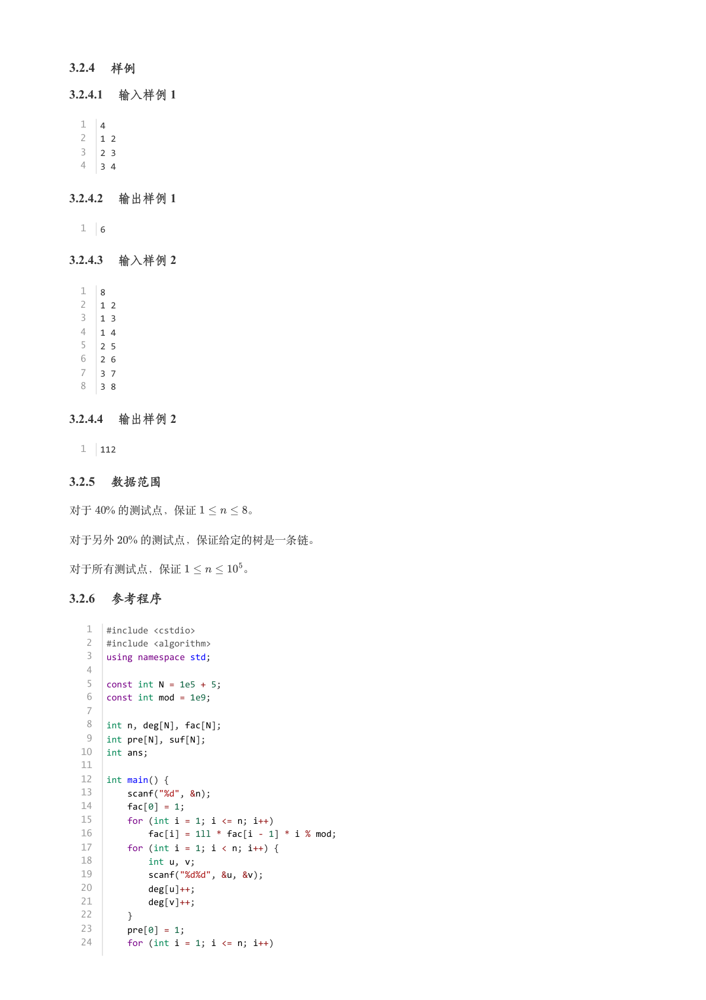

### 提取文本

```
3.2.4 样例

3.2.4.1 输入样例 1


  1   4
  2   1 2
  3   2 3
  4   3 4

3.2.4.2 输出样例 1


  1   6

3.2.4.3 输入样例 2


  1   8
  2   1 2
  3   1 3
  4   1 4
  5   2 5
  6   2 6
  7   3 7
  8   3 8

3.2.4.4 输出样例 2


  1   112

3.2.5 数据范围

对于  % 的测试点，保证     。

对于另外  % 的测试点，保证给定的树是一条链。


对于所有测试点，保证      。

3.2.6 参考程序


   1   #include <cstdio>
   2   #include <algorithm>
   3   using namespace std;
   4
   5   const int N = 1e5 + 5;
   6   const int mod = 1e9;
   7
   8   int n, deg[N], fac[N];
   9   int pre[N], suf[N];
  10   int ans;
  11
  12   int main() {
  13       scanf("%d", &n);
  14       fac[0] = 1;
  15       for (int i = 1; i <= n; i++)
  16           fac[i] = 1ll * fac[i - 1] * i % mod;
  17       for (int i = 1; i < n; i++) {
  18           int u, v;
  19           scanf("%d%d", &u, &v);
  20           deg[u]++;
  21           deg[v]++;
  22       }
  23       pre[0] = 1;
  24       for (int i = 1; i <= n; i++)
```

## 第 11 页

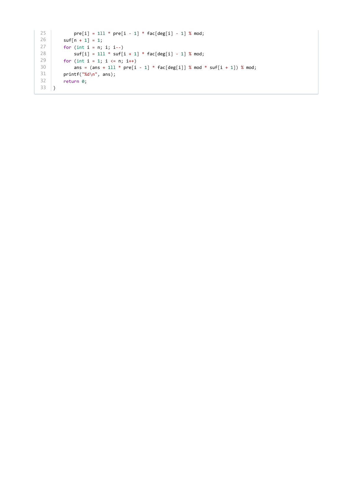

### 提取文本

```
25           pre[i] = 1ll * pre[i - 1] * fac[deg[i] - 1] % mod;
26       suf[n + 1] = 1;
27       for (int i = n; i; i--)
28           suf[i] = 1ll * suf[i + 1] * fac[deg[i] - 1] % mod;
29       for (int i = 1; i <= n; i++)
30           ans = (ans + 1ll * pre[i - 1] * fac[deg[i]] % mod * suf[i + 1]) % mod;
31       printf("%d\n", ans);
32       return 0;
33   }
```
