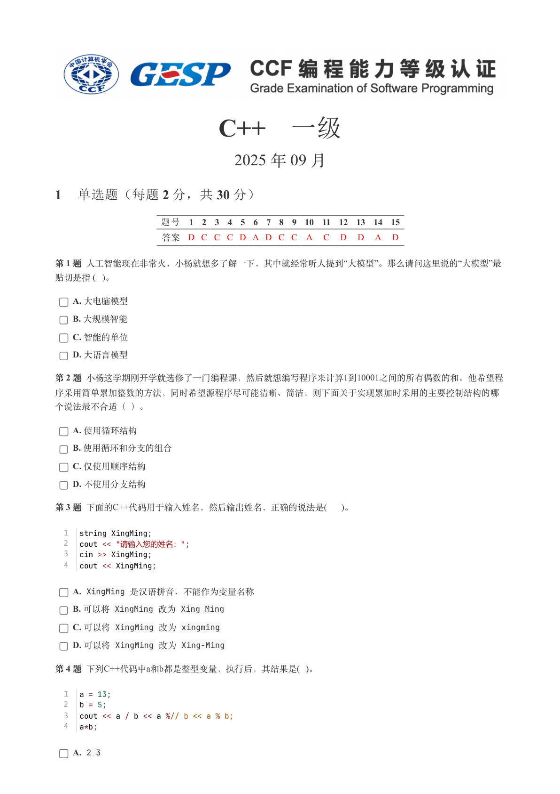
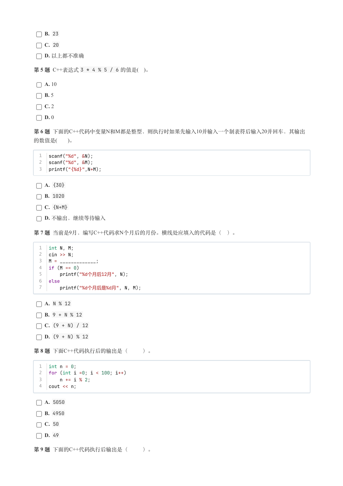
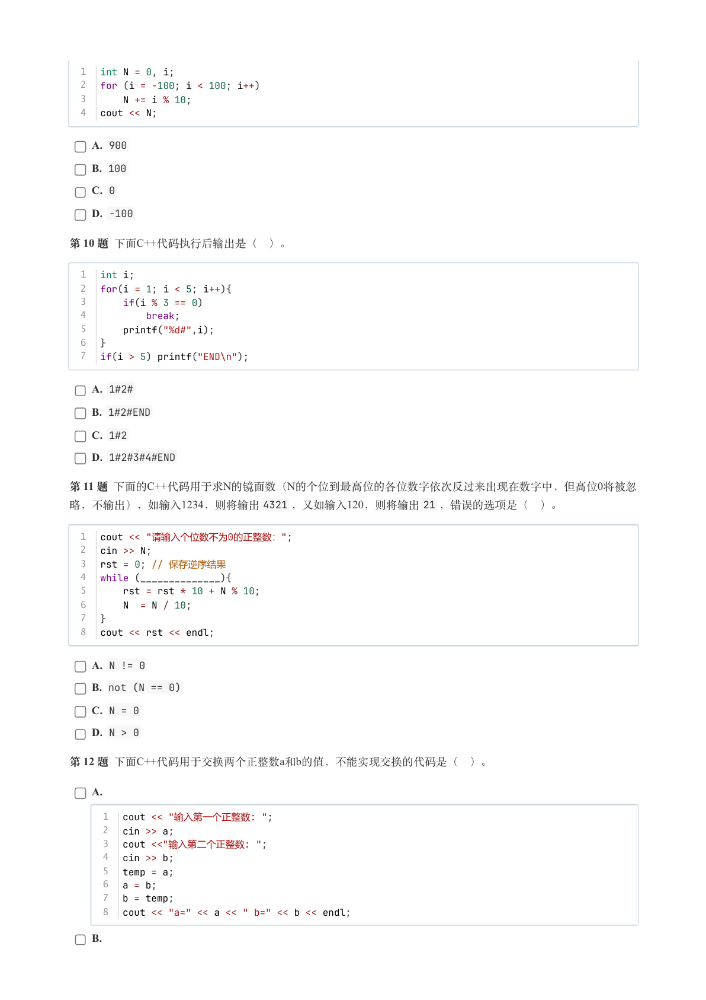
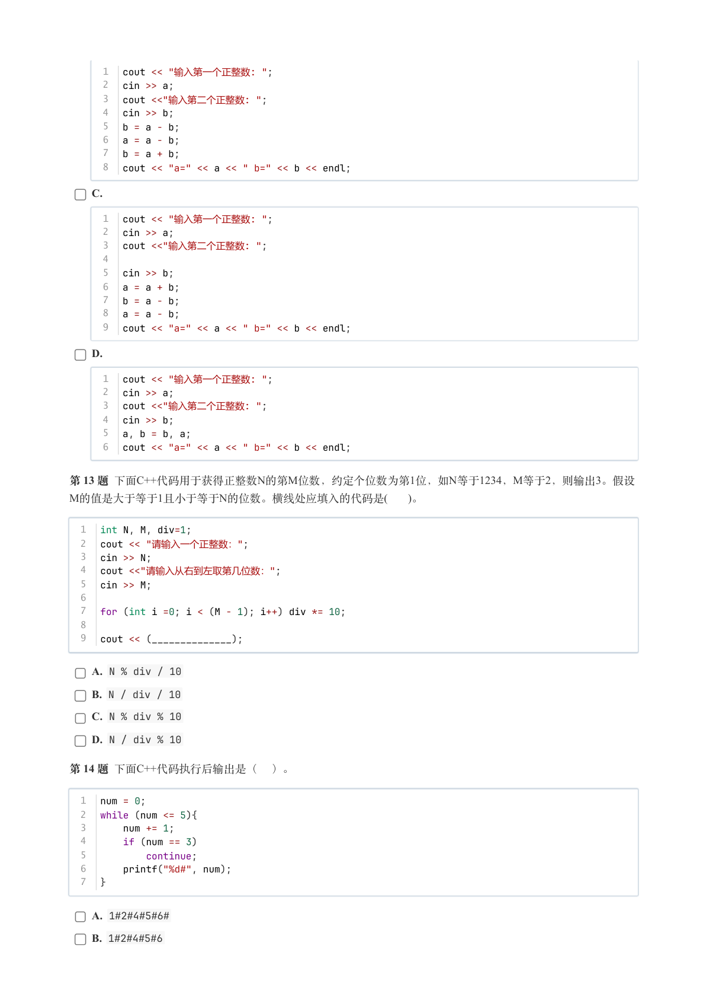
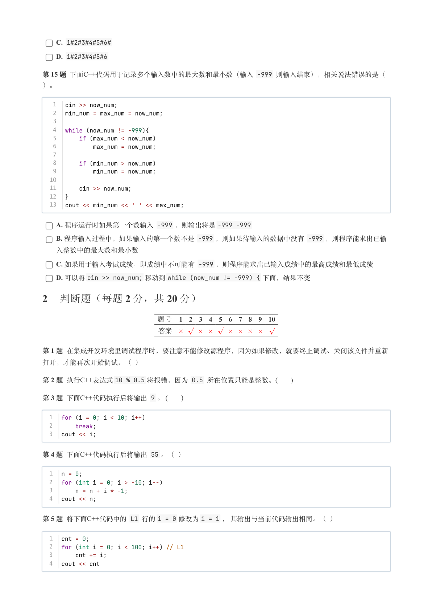
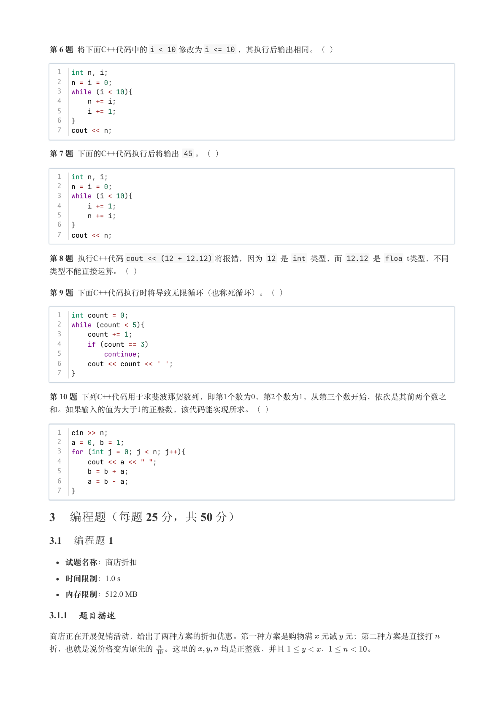
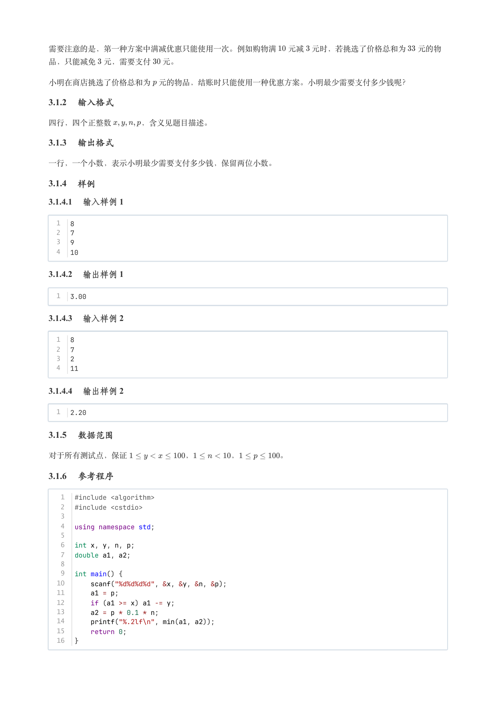
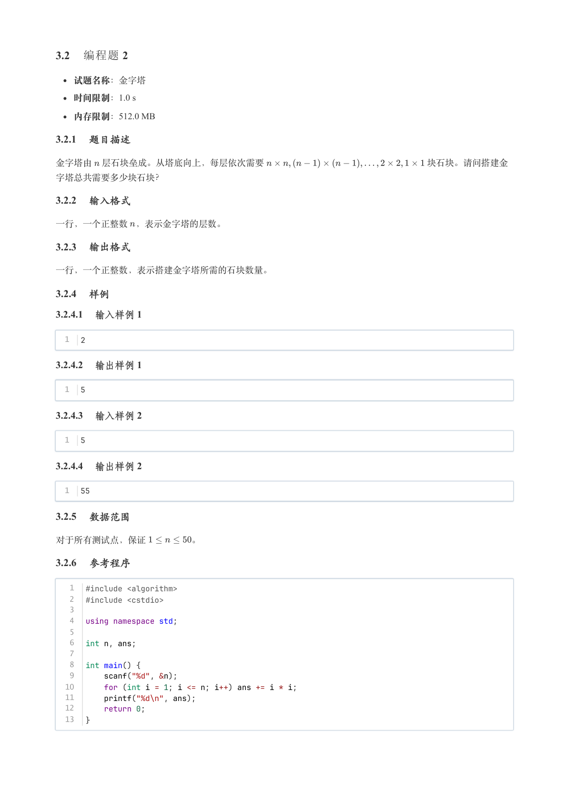

# 2025年9月-C++1级

- 原始 PDF：[`pdfs/2025年9月-C++1级.pdf`](../pdfs/2025年9月-C++1级.pdf)
- 页数：8
- 转换脚本：[`scripts/convert_pdfs_to_markdown.py`](../scripts/convert_pdfs_to_markdown.py)

> 为尽量避免信息丢失，每页均附带页面图片；文本提取结果保留原有顺序与换行特征，个别公式、图形、特殊排版请以页面图片为准。

## 第 1 页



### 提取文本

```
C++　一级

                      2025 年 09 月

1 单选题（每题 2 分，共 30 分）


           题号  1  2  3  4  5  6  7  8  9  10  11  12  13  14  15
            答案 D C C C D A D C C A  C  D  D  A  D


第 1 题 人工智能现在非常火，小杨就想多了解一下，其中就经常听人提到“大模型”。那么请问这里说的“大模型”最
贴切是指 ( )。

    A. 大电脑模型

    B. 大规模智能

    C. 智能的单位

    D. 大语言模型

第 2 题 小杨这学期刚开学就选修了一门编程课，然后就想编写程序来计算1到10001之间的所有偶数的和。他希望程

序采用简单累加整数的方法，同时希望源程序尽可能清晰、简洁，则下面关于实现累加时采用的主要控制结构的哪

个说法最不合适（ ）。

    A. 使用循环结构

    B. 使用循环和分支的组合

    C. 仅使用顺序结构

    D. 不使用分支结构

第 3 题 下面的C++代码用于输入姓名，然后输出姓名，正确的说法是(  )。


  1  string XingMing;
  2  cout << "请输入您的姓名：";
  3  cin >> XingMing;
  4  cout << XingMing;

    A. XingMing 是汉语拼音，不能作为变量名称

    B. 可以将 XingMing 改为 Xing Ming

    C. 可以将 XingMing 改为 xingming

    D. 可以将 XingMing 改为 Xing-Ming

第 4 题 下列C++代码中a和b都是整型变量，执行后，其结果是( )。


  1  a = 13;
  2  b = 5;
  3  cout << a / b << a %// b << a % b;
  4  a*b;

    A. 2 3
```

## 第 2 页



### 提取文本

```
B. 23

    C. 20

    D. 以上都不准确

第 5 题 C++表达式3 * 4 % 5 / 6 的值是( )。

    A. 10

    B. 5

    C. 2

    D. 0

第 6 题 下面的C++代码中变量N和M都是整型，则执行时如果先输入10并输入一个制表符后输入20并回车，其输出
的数值是(   )。


  1  scanf("%d", &N);
  2  scanf("%d", &M);
  3  printf("{%d}",N+M);

    A. {30}

    B. 1020

    C. {N+M}

    D. 不输出，继续等待输入

第 7 题 当前是9月，编写C++代码求N个月后的月份。横线处应填入的代码是（ ）。


  1  int N, M;
  2  cin >> N;
  3  M = _____________;
  4  if (M == 0)
  5      printf("%d个月后12月", N);
  6  else
  7      printf("%d个月后是%d月", N, M);

    A. N % 12

    B. 9 + N % 12

    C. (9 + N) / 12

    D. (9 + N) % 12

第 8 题 下面C++代码执行后的输出是（   ）。


  1  int n = 0;
  2  for (int i =0; i < 100; i++)
  3      n += i % 2;
  4  cout << n;

    A. 5050

    B. 4950

    C. 50

    D. 49

第 9 题 下面的C++代码执行后输出是（   ）。
```

## 第 3 页



### 提取文本

```
1  int N = 0, i;
  2  for (i = -100; i < 100; i++)
  3      N += i % 10;
  4  cout << N;

    A. 900

    B. 100

    C. 0

    D. -100

第 10 题 下面C++代码执行后输出是（ ）。


  1  int i;
  2  for(i = 1; i < 5; i++){
  3      if(i % 3 == 0)
  4          break;
  5      printf("%d#",i);
  6  }
  7  if(i > 5) printf("END\n");

    A. 1#2#

    B. 1#2#END

    C. 1#2

    D. 1#2#3#4#END

第 11 题 下面的C++代码用于求N的镜面数（N的个位到最高位的各位数字依次反过来出现在数字中，但高位0将被忽
略，不输出），如输入1234，则将输出4321 ，又如输入120，则将输出21 ，错误的选项是（ ）。

  1  cout << "请输入个位数不为0的正整数：";
  2  cin >> N;
  3  rst = 0; // 保存逆序结果
  4  while (______________){
  5      rst = rst * 10 + N % 10;
  6      N  = N / 10;
  7  }
  8  cout << rst << endl;

    A. N != 0

    B. not (N == 0)

    C. N = 0

    D. N > 0

第 12 题 下面C++代码用于交换两个正整数a和b的值，不能实现交换的代码是（ ）。

    A.

      1  cout << "输入第一个正整数: ";
      2  cin >> a;
      3  cout <<"输入第二个正整数: ";
      4  cin >> b;
      5  temp = a;
      6  a = b;
      7  b = temp;
      8  cout << "a=" << a << " b=" << b << endl;

    B.
```

## 第 4 页



### 提取文本

```
1  cout << "输入第一个正整数: ";
      2  cin >> a;
      3  cout <<"输入第二个正整数: ";
      4  cin >> b;
      5  b = a - b;
      6  a = a - b;
      7  b = a + b;
      8  cout << "a=" << a << " b=" << b << endl;

    C.

      1  cout << "输入第一个正整数: ";
      2  cin >> a;
      3  cout <<"输入第二个正整数: ";
      4
      5  cin >> b;
      6  a = a + b;
      7  b = a - b;
      8  a = a - b;
      9  cout << "a=" << a << " b=" << b << endl;

    D.

      1  cout << "输入第一个正整数: ";
      2  cin >> a;
      3  cout <<"输入第二个正整数: ";
      4  cin >> b;
      5  a, b = b, a;
      6  cout << "a=" << a << " b=" << b << endl;


第 13 题 下面C++代码用于获得正整数N的第M位数，约定个位数为第1位，如N等于1234，M等于2，则输出3。假设
M的值是大于等于1且小于等于N的位数。横线处应填入的代码是(   )。


  1  int N, M, div=1;
  2  cout << "请输入一个正整数：";
  3  cin >> N;
  4  cout <<"请输入从右到左取第几位数：";
  5  cin >> M;
  6
  7  for (int i =0; i < (M - 1); i++) div *= 10;
  8
  9  cout << (______________);

    A. N % div / 10

    B. N / div / 10

    C. N % div % 10

    D. N / div % 10

第 14 题 下面C++代码执行后输出是（ ）。


  1  num = 0;
  2  while (num <= 5){
  3      num += 1;
  4      if (num == 3)
  5          continue;
  6      printf("%d#", num);
  7  }


    A. 1#2#4#5#6#

    B. 1#2#4#5#6
```

## 第 5 页



### 提取文本

```
C. 1#2#3#4#5#6#

    D. 1#2#3#4#5#6

第 15 题 下面C++代码用于记录多个输入数中的最大数和最小数（输入 -999 则输入结束），相关说法错误的是（

）。


   1  cin >> now_num;
   2  min_num = max_num = now_num;
   3
   4  while (now_num != -999){
   5      if (max_num < now_num)
   6          max_num = now_num;
   7
   8      if (min_num > now_num)
   9          min_num = now_num;
  10
  11      cin >> now_num;
  12  }
  13  cout << min_num << ' ' << max_num;

    A. 程序运行时如果第一个数输入 -999 ，则输出将是-999 -999

    B. 程序输入过程中，如果输入的第一个数不是 -999 ，则如果待输入的数据中没有 -999 ，则程序能求出已输

  入整数中的最大数和最小数

    C. 如果用于输入考试成绩，即成绩中不可能有 -999 ，则程序能求出已输入成绩中的最高成绩和最低成绩

    D. 可以将cin >> now_num; 移动到while (now_num != -999) { 下面，结果不变

2 判断题（每题 2 分，共 20 分）

                题号  1  2  3  4  5  6  7  8  9  10

                 答案


第 1 题 在集成开发环境里调试程序时，要注意不能修改源程序，因为如果修改，就要终止调试、关闭该文件并重新

打开，才能再次开始调试。（ ）

第 2 题 执行C++表达式10 % 0.5 将报错，因为 0.5 所在位置只能是整数。(      )

第 3 题 下面C++代码执行后将输出 9 。 (      )


  1  for (i = 0; i < 10; i++)
  2      break;
  3  cout << i;

第 4 题 下面C++代码执行后将输出 55 。（ ）


  1  n = 0;
  2  for (int i = 0; i > -10; i--)
  3      n = n + i * -1;
  4  cout << n;

第 5 题 将下面C++代码中的 L1 行的i = 0 修改为i = 1 ， 其输出与当前代码输出相同。（ ）


  1  cnt = 0;
  2  for (int i = 0; i < 100; i++) // L1
  3      cnt += i;
  4  cout << cnt
```

## 第 6 页



### 提取文本

```
第 6 题 将下面C++代码中的i < 10 修改为i <= 10 ，其执行后输出相同。（ ）


  1  int n, i;
  2  n = i = 0;
  3  while (i < 10){
  4      n += i;
  5      i += 1;
  6  }
  7  cout << n;

第 7 题 下面的C++代码执行后将输出 45 。（ ）


  1  int n, i;
  2  n = i = 0;
  3  while (i < 10){
  4      i += 1;
  5      n += i;
  6  }
  7  cout << n;

第 8 题 执行C++代码cout << (12 + 12.12) 将报错，因为 12 是 int 类型，而 12.12 是 floa t类型，不同

类型不能直接运算。（ ）

第 9 题 下面C++代码执行时将导致无限循环（也称死循环）。（ ）


  1  int count = 0;
  2  while (count < 5){
  3      count += 1;
  4      if (count == 3)
  5          continue;
  6      cout << count << ' ';
  7  }


第 10 题 下列C++代码用于求斐波那契数列，即第1个数为0，第2个数为1，从第三个数开始，依次是其前两个数之
和。如果输入的值为大于1的正整数，该代码能实现所求。（ ）


  1  cin >> n;
  2  a = 0, b = 1;
  3  for (int j = 0; j < n; j++){
  4      cout << a << " ";
  5      b = b + a;
  6      a = b - a;
  7  }

3 编程题（每题 25 分，共 50 分）

3.1 编程题 1


  试题名称：商店折扣

   时间限制：1.0 s

   内存限制：512.0 MB

3.1.1 题目描述

商店正在开展促销活动，给出了两种方案的折扣优惠。第一种方案是购物满 元减 元；第二种方案是直接打

折，也就是说价格变为原先的 。这里的   均是正整数，并且     ，     。
```

## 第 7 页



### 提取文本

```
需要注意的是，第一种方案中满减优惠只能使用一次。例如购物满  元减 元时，若挑选了价格总和为  元的物

品，只能减免 元，需要支付  元。


小明在商店挑选了价格总和为 元的物品，结账时只能使用一种优惠方案。小明最少需要支付多少钱呢？

3.1.2 输入格式

四行，四个正整数    ，含义见题目描述。

3.1.3 输出格式

一行，一个小数，表示小明最少需要支付多少钱，保留两位小数。

3.1.4 样例

3.1.4.1 输入样例 1

  1  8
  2  7
  3  9
  4  10

3.1.4.2 输出样例 1

  1  3.00

3.1.4.3 输入样例 2

  1  8
  2  7
  3  2
  4  11

3.1.4.4 输出样例 2

  1  2.20

3.1.5 数据范围

对于所有测试点，保证       ，     ，     。

3.1.6 参考程序

   1  #include <algorithm>
   2  #include <cstdio>
   3
   4  using namespace std;
   5
   6  int x, y, n, p;
   7  double a1, a2;
   8
   9  int main() {
  10      scanf("%d%d%d%d", &x, &y, &n, &p);
  11      a1 = p;
  12      if (a1 >= x) a1 -= y;
  13      a2 = p * 0.1 * n;
  14      printf("%.2lf\n", min(a1, a2));
  15      return 0;
  16  }
```

## 第 8 页



### 提取文本

```
3.2 编程题 2


  试题名称：金字塔

   时间限制：1.0 s

   内存限制：512.0 MB

3.2.1 题目描述

金字塔由 层石块垒成。从塔底向上，每层依次需要                  块石块。请问搭建金

字塔总共需要多少块石块？

3.2.2 输入格式

一行，一个正整数 ，表示金字塔的层数。

3.2.3 输出格式

一行，一个正整数，表示搭建金字塔所需的石块数量。

3.2.4 样例

3.2.4.1 输入样例 1

  1  2

3.2.4.2 输出样例 1

  1  5

3.2.4.3 输入样例 2

  1  5

3.2.4.4 输出样例 2

  1  55

3.2.5 数据范围

对于所有测试点，保证     。

3.2.6 参考程序

   1  #include <algorithm>
   2  #include <cstdio>
   3
   4  using namespace std;
   5
   6  int n, ans;
   7
   8  int main() {
   9      scanf("%d", &n);
  10      for (int i = 1; i <= n; i++) ans += i * i;
  11      printf("%d\n", ans);
  12      return 0;
  13  }
```
