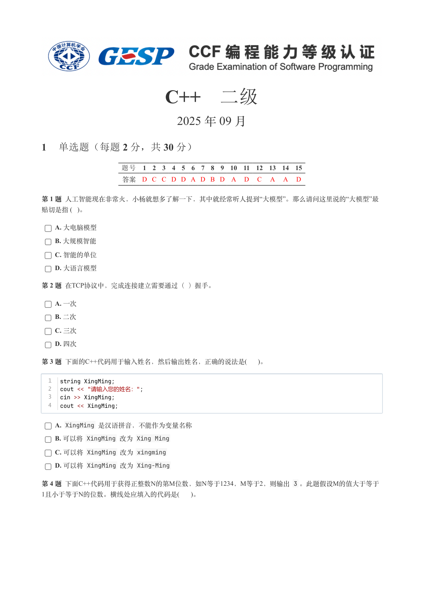
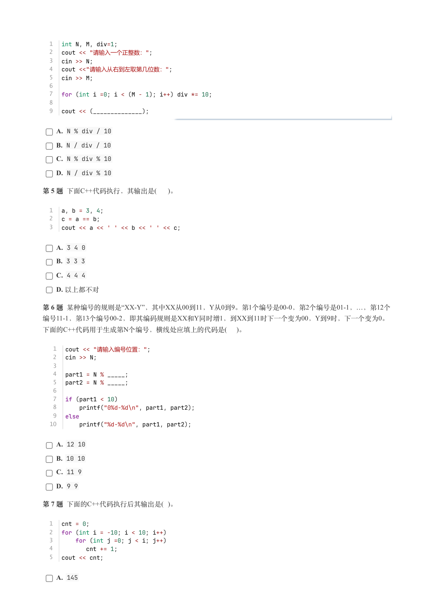
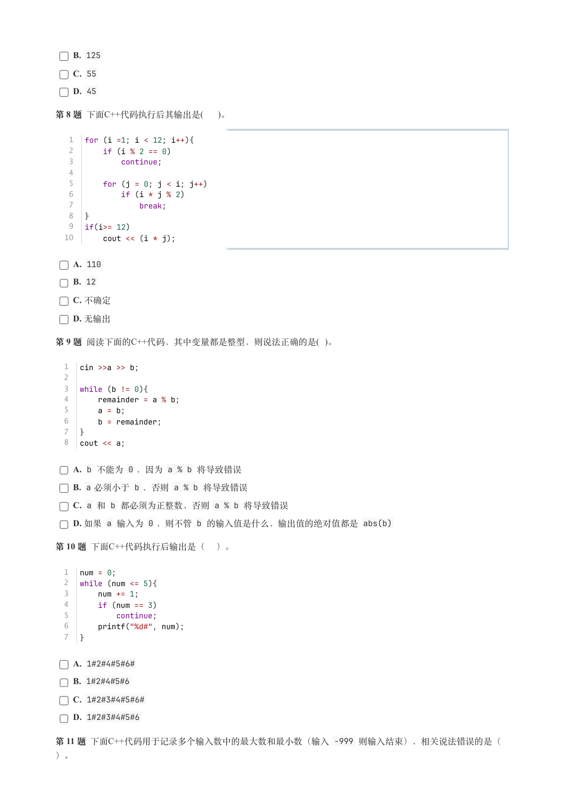
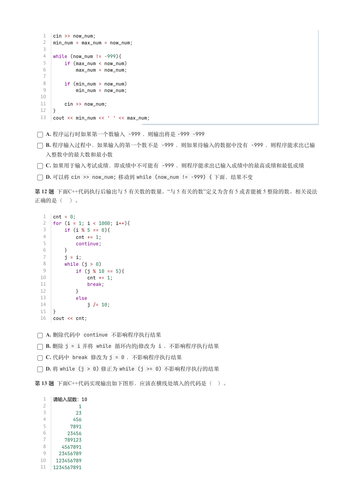
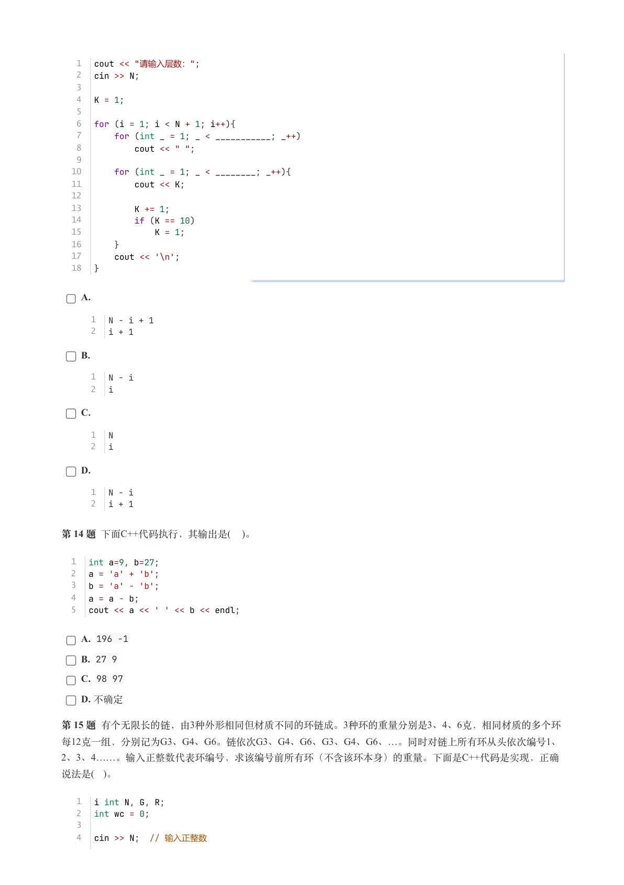
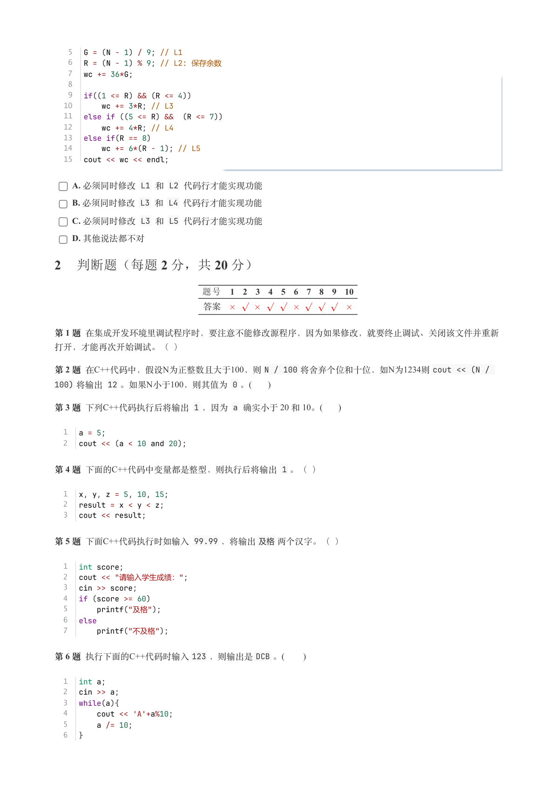
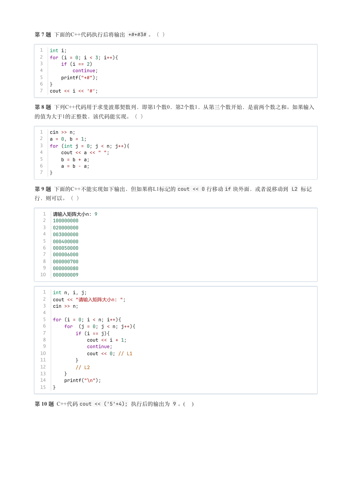
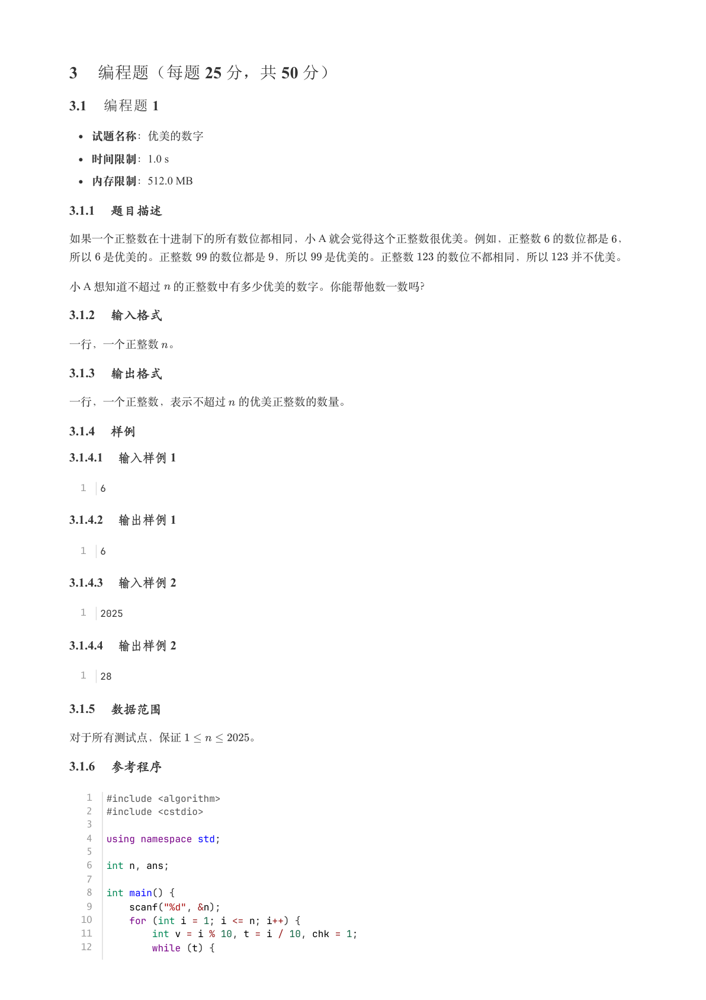
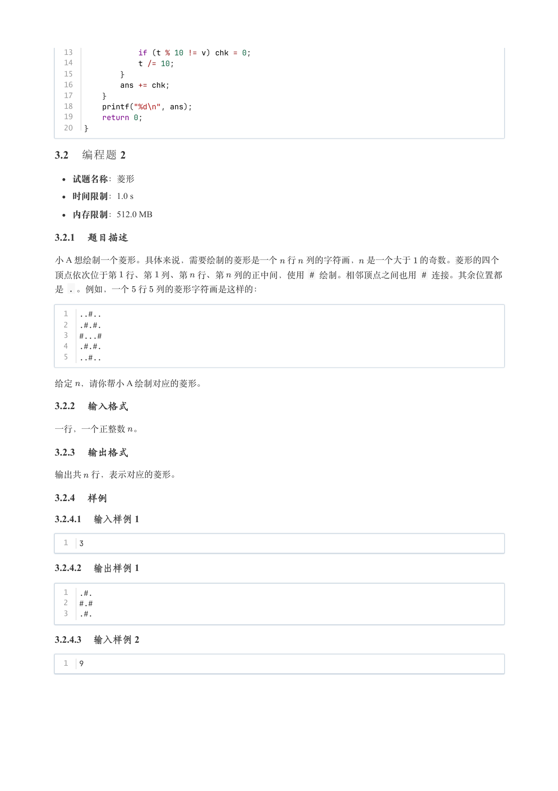
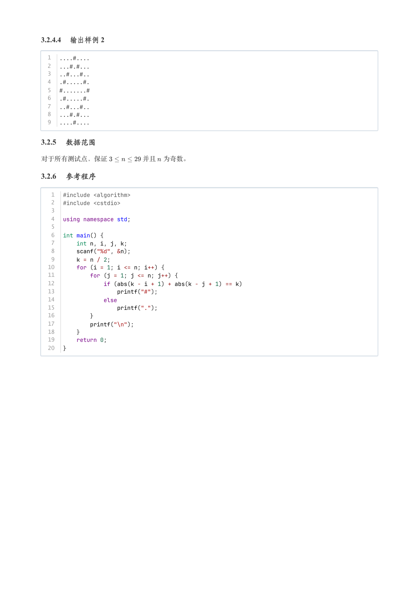

# 2025年9月-C++2级

- 原始 PDF：[`pdfs/2025年9月-C++2级.pdf`](../pdfs/2025年9月-C++2级.pdf)
- 页数：10
- 转换脚本：[`scripts/convert_pdfs_to_markdown.py`](../scripts/convert_pdfs_to_markdown.py)

> 为尽量避免信息丢失，每页均附带页面图片；文本提取结果保留原有顺序与换行特征，个别公式、图形、特殊排版请以页面图片为准。

## 第 1 页



### 提取文本

```
C++　二级

                      2025 年 09 月

1 单选题（每题 2 分，共 30 分）


           题号  1  2  3  4  5  6  7  8  9  10  11  12  13  14  15
            答案 D C C D D A D B D A  D  C  A  A  D


第 1 题 人工智能现在非常火，小杨就想多了解一下，其中就经常听人提到“大模型”。那么请问这里说的“大模型”最
贴切是指 ( )。

    A. 大电脑模型

    B. 大规模智能

    C. 智能的单位

    D. 大语言模型

第 2 题 在TCP协议中，完成连接建立需要通过（ ）握手。

    A. 一次

    B. 二次

    C. 三次

    D. 四次

第 3 题 下面的C++代码用于输入姓名，然后输出姓名，正确的说法是(  )。


  1  string XingMing;
  2  cout << "请输入您的姓名：";
  3  cin >> XingMing;
  4  cout << XingMing;

    A. XingMing 是汉语拼音，不能作为变量名称

    B. 可以将 XingMing 改为 Xing Ming

    C. 可以将 XingMing 改为 xingming

    D. 可以将 XingMing 改为 Xing-Ming

第 4 题 下面C++代码用于获得正整数N的第M位数，如N等于1234，M等于2，则输出 3 。此题假设M的值大于等于
1且小于等于N的位数。横线处应填入的代码是(   )。
```

## 第 2 页



### 提取文本

```
1  int N, M, div=1;
  2  cout << "请输入一个正整数：";
  3  cin >> N;
  4  cout <<"请输入从右到左取第几位数：";
  5  cin >> M;
  6
  7  for (int i =0; i < (M - 1); i++) div *= 10;
  8
  9  cout << (______________);

    A. N % div / 10

    B. N / div / 10

    C. N % div % 10

    D. N / div % 10

第 5 题 下面C++代码执行，其输出是(  )。


  1  a, b = 3, 4;
  2  c = a == b;
  3  cout << a << ' ' << b << ' ' << c;

    A. 3 4 0

    B. 3 3 3

    C. 4 4 4

    D. 以上都不对

第 6 题 某种编号的规则是“XX-Y”，其中XX从00到11，Y从0到9。第1个编号是00-0，第2个编号是01-1，…，第12个
编号11-1，第13个编号00-2，即其编码规则是XX和Y同时增1，到XX到11时下一个变为00，Y到9时，下一个变为0。
下面的C++代码用于生成第N个编号，横线处应填上的代码是(  )。

   1  cout << "请输入编号位置：";
   2  cin >> N;
   3
   4  part1 = N % _____;
   5  part2 = N % _____;
   6
   7  if (part1 < 10)
   8      printf("0%d-%d\n", part1, part2);
   9  else
  10      printf("%d-%d\n", part1, part2);

    A. 12 10

    B. 10 10

    C. 11 9

    D. 9 9

第 7 题 下面的C++代码执行后其输出是( )。


  1  cnt = 0;
  2  for (int i = -10; i < 10; i++)
  3      for (int j =0; j < i; j++)
  4         cnt += 1;
  5  cout << cnt;

    A. 145
```

## 第 3 页



### 提取文本

```
B. 125

    C. 55

    D. 45

第 8 题 下面C++代码执行后其输出是(  )。


   1  for (i =1; i < 12; i++){
   2      if (i % 2 == 0)
   3          continue;
   4
   5      for (j = 0; j < i; j++)
   6          if (i * j % 2)
   7              break;
   8  }
   9  if(i>= 12)
  10      cout << (i * j);

    A. 110

    B. 12

    C. 不确定

    D. 无输出

第 9 题 阅读下面的C++代码，其中变量都是整型，则说法正确的是( )。


  1  cin >>a >> b;
  2
  3  while (b != 0){
  4      remainder = a % b;
  5      a = b;
  6      b = remainder;
  7  }
  8  cout << a;


    A. b 不能为 0 ，因为 a % b 将导致错误

    B. a 必须小于 b ，否则 a % b 将导致错误

    C. a 和 b 都必须为正整数，否则 a % b 将导致错误

    D. 如果 a 输入为 0 ，则不管 b 的输入值是什么，输出值的绝对值都是 abs(b)

第 10 题 下面C++代码执行后输出是（ ）。


  1  num = 0;
  2  while (num <= 5){
  3      num += 1;
  4      if (num == 3)
  5          continue;
  6      printf("%d#", num);
  7  }

    A. 1#2#4#5#6#

    B. 1#2#4#5#6

    C. 1#2#3#4#5#6#

    D. 1#2#3#4#5#6

第11 题下面C++代码用于记录多个输入数中的最大数和最小数（输入 -999 则输入结束），相关说法错误的是（

）。
```

## 第 4 页



### 提取文本

```
1  cin >> now_num;
   2  min_num = max_num = now_num;
   3
   4  while (now_num != -999){
   5      if (max_num < now_num)
   6          max_num = now_num;
   7
   8      if (min_num > now_num)
   9          min_num = now_num;
  10
  11      cin >> now_num;
  12  }
  13  cout << min_num << ' ' << max_num;

    A. 程序运行时如果第一个数输入 -999 ，则输出将是-999 -999

    B. 程序输入过程中，如果输入的第一个数不是 -999 ，则如果待输入的数据中没有 -999 ，则程序能求出已输

  入整数中的最大数和最小数

    C. 如果用于输入考试成绩，即成绩中不可能有 -999 ，则程序能求出已输入成绩中的最高成绩和最低成绩

    D. 可以将cin >> now_num; 移动到while (now_num != -999) { 下面，结果不变

第 12 题 下面C++代码执行后输出与 5 有关数的数量。“与 5 有关的数”定义为含有 5 或者能被 5 整除的数。相关说法

正确的是（ ）。


   1  cnt = 0;
   2  for (i = 1; i < 1000; i++){
   3      if (i % 5 == 0){
   4          cnt += 1;
   5          continue;
   6      }
   7      j = i;
   8      while (j > 0)
   9          if (j % 10 == 5){
  10              cnt += 1;
  11              break;
  12          }
  13          else
  14              j /= 10;
  15  }
  16  cout << cnt;

    A. 删除代码中 continue 不影响程序执行结果

    B. 删除j = i 并将 while 循环内的j修改为 i ，不影响程序执行结果

    C. 代码中 break 修改为j = 0 ，不影响程序执行结果

    D. 将while (j > 0) 修正为while (j >= 0) 不影响程序执行的结果

第 13 题 下面C++代码实现输出如下图形，应该在横线处填入的代码是（ ）。

   1  请输入层数：10
   2           1
   3          23
   4         456
   5        7891
   6       23456
   7      789123
   8     4567891
   9    23456789
  10   123456789
  11  1234567891
```

## 第 5 页



### 提取文本

```
1  cout << "请输入层数：";
   2  cin >> N;
   3
   4  K = 1;
   5
   6  for (i = 1; i < N + 1; i++){
   7      for (int _ = 1; _ < ___________; _++)
   8          cout << " ";
   9
  10      for (int _ = 1; _ < ________; _++){
  11          cout << K;
  12
  13          K += 1;
  14          if (K == 10)
  15              K = 1;
  16      }
  17      cout << '\n';
  18  }


    A.

      1  N - i + 1
      2  i + 1

    B.

      1  N - i
      2  i

    C.

      1  N
      2  i

    D.

      1  N - i
      2  i + 1


第 14 题 下面C++代码执行，其输出是(  )。


  1  int a=9, b=27;
  2  a = 'a' + 'b';
  3  b = 'a' - 'b';
  4  a = a - b;
  5  cout << a << ' ' << b << endl;

    A. 196 -1

    B. 27 9

    C. 98 97

    D. 不确定

第 15 题 有个无限长的链，由3种外形相同但材质不同的环链成。3种环的重量分别是3、4、6克，相同材质的多个环
每12克一组，分别记为G3、G4、G6。链依次G3、G4、G6、G3、G4、G6、…。同时对链上所有环从头依次编号1、
2、3、4……。输入正整数代表环编号，求该编号前所有环（不含该环本身）的重量。下面是C++代码是实现，正确
说法是( )。


   1  i int N, G, R;
   2  int wc = 0;
   3
   4  cin >> N;  // 输入正整数
```

## 第 6 页



### 提取文本

```
5  G = (N - 1) / 9; // L1
   6  R = (N - 1) % 9; // L2: 保存余数
   7  wc += 36*G;
   8
   9  if((1 <= R) && (R <= 4))
  10      wc += 3*R; // L3
  11  else if ((5 <= R) &&  (R <= 7))
  12      wc += 4*R; // L4
  13  else if(R == 8)
  14      wc += 6*(R - 1); // L5
  15  cout << wc << endl;

    A. 必须同时修改 L1 和 L2 代码行才能实现功能

    B. 必须同时修改 L3 和 L4 代码行才能实现功能

    C. 必须同时修改 L3 和 L5 代码行才能实现功能

    D. 其他说法都不对

2 判断题（每题 2 分，共 20 分）

                题号  1  2  3  4  5  6  7  8  9  10

                 答案


第 1 题 在集成开发环境里调试程序时，要注意不能修改源程序，因为如果修改，就要终止调试、关闭该文件并重新

打开，才能再次开始调试。（ ）

第 2 题 在C++代码中，假设N为正整数且大于100，则N / 100 将舍弃个位和十位，如N为1234则cout << (N /
100) 将输出 12 。如果N小于100，则其值为 0 。(     )

第 3 题 下列C++代码执行后将输出 1 ，因为 a 确实小于 20 和 10。(     )


  1  a = 5;
  2  cout << (a < 10 and 20);

第 4 题 下面的C++代码中变量都是整型，则执行后将输出 1 。（ ）


  1  x, y, z = 5, 10, 15;
  2  result = x < y < z;
  3  cout << result;

第 5 题 下面C++代码执行时如输入 99.99 ，将输出及格两个汉字。（ ）


  1  int score;
  2  cout << "请输入学生成绩：";
  3  cin >> score;
  4  if (score >= 60)
  5      printf("及格");
  6  else
  7      printf("不及格");

第 6 题 执行下面的C++代码时输入123 ，则输出是DCB 。(      )


  1  int a;
  2  cin >> a;
  3  while(a){
  4      cout << 'A'+a%10;
  5      a /= 10;
  6  }
```

## 第 7 页



### 提取文本

```
第 7 题 下面的C++代码执行后将输出 +#+#3# 。（ ）


  1  int i;
  2  for (i = 0; i < 3; i++){
  3      if (i == 2)
  4          continue;
  5      printf("+#");
  6  }
  7  cout << i << '#';


第 8 题 下列C++代码用于求斐波那契数列，即第1个数0，第2个数1，从第三个数开始，是前两个数之和。如果输入
的值为大于1的正整数，该代码能实现。（ ）


  1  cin >> n;
  2  a = 0, b = 1;
  3  for (int j = 0; j < n; j++){
  4      cout << a << " ";
  5      b = b + a;
  6      a = b - a;
  7  }

第 9 题 下面的C++不能实现如下输出，但如果将L1标记的cout << 0 行移动if 块外面，或者说移动到 L2 标记

行，则可以。（ ）


   1  请输入矩阵大小n: 9
   2  100000000
   3  020000000
   4  003000000
   5  000400000
   6  000050000
   7  000006000
   8  000000700
   9  000000080
  10  000000009


   1  int n, i, j;
   2  cout << "请输入矩阵大小n: ";
   3  cin >> n;
   4
   5  for (i = 0; i < n; i++){
   6      for  (j = 0; j < n; j++){
   7          if (i == j){
   8              cout << i + 1;
   9              continue;
  10              cout << 0; // L1
  11          }
  12          // L2
  13      }
  14      printf("\n");
  15  }

第 10 题 C++代码cout << ('5'+4); 执行后的输出为 9 。(    )
```

## 第 8 页



### 提取文本

```
3 编程题（每题 25 分，共 50 分）

3.1 编程题 1


  试题名称：优美的数字

   时间限制：1.0 s

   内存限制：512.0 MB

3.1.1 题目描述

如果一个正整数在十进制下的所有数位都相同，小 A 就会觉得这个正整数很优美。例如，正整数 的数位都是 ，

所以 是优美的。正整数  的数位都是 ，所以  是优美的。正整数  的数位不都相同，所以  并不优美。

小 A 想知道不超过 的正整数中有多少优美的数字。你能帮他数一数吗？

3.1.2 输入格式

一行，一个正整数 。

3.1.3 输出格式

一行，一个正整数，表示不超过 的优美正整数的数量。

3.1.4 样例

3.1.4.1 输入样例 1

  1  6

3.1.4.2 输出样例 1

  1  6

3.1.4.3 输入样例 2

  1  2025

3.1.4.4 输出样例 2

  1  28

3.1.5 数据范围

对于所有测试点，保证      。

3.1.6 参考程序

   1  #include <algorithm>
   2  #include <cstdio>
   3
   4  using namespace std;
   5
   6  int n, ans;
   7
   8  int main() {
   9      scanf("%d", &n);
  10      for (int i = 1; i <= n; i++) {
  11          int v = i % 10, t = i / 10, chk = 1;
  12          while (t) {
```

## 第 9 页



### 提取文本

```
13              if (t % 10 != v) chk = 0;
  14              t /= 10;
  15          }
  16          ans += chk;
  17      }
  18      printf("%d\n", ans);
  19      return 0;
  20  }

3.2 编程题 2


  试题名称：菱形

   时间限制：1.0 s

   内存限制：512.0 MB

3.2.1 题目描述

小 A 想绘制一个菱形。具体来说，需要绘制的菱形是一个 行 列的字符画， 是一个大于 的奇数。菱形的四个
顶点依次位于第 行、第 列、第 行、第 列的正中间，使用 # 绘制。相邻顶点之间也用 # 连接。其余位置都
是 . 。例如，一个 行 列的菱形字符画是这样的：


  1  ..#..
  2  .#.#.
  3  #...#
  4  .#.#.
  5  ..#..


给定 ，请你帮小 A 绘制对应的菱形。

3.2.2 输入格式

一行，一个正整数 。

3.2.3 输出格式

输出共 行，表示对应的菱形。

3.2.4 样例

3.2.4.1 输入样例 1

  1  3

3.2.4.2 输出样例 1

  1  .#.
  2  #.#
  3  .#.

3.2.4.3 输入样例 2

  1  9
```

## 第 10 页



### 提取文本

```
3.2.4.4 输出样例 2

  1  ....#....
  2  ...#.#...
  3  ..#...#..
  4  .#.....#.
  5  #.......#
  6  .#.....#.
  7  ..#...#..
  8  ...#.#...
  9  ....#....

3.2.5 数据范围

对于所有测试点，保证     并且 为奇数。

3.2.6 参考程序

   1  #include <algorithm>
   2  #include <cstdio>
   3
   4  using namespace std;
   5
   6  int main() {
   7      int n, i, j, k;
   8      scanf("%d", &n);
   9      k = n / 2;
  10      for (i = 1; i <= n; i++) {
  11          for (j = 1; j <= n; j++) {
  12              if (abs(k - i + 1) + abs(k - j + 1) == k)
  13                  printf("#");
  14              else
  15                  printf(".");
  16          }
  17          printf("\n");
  18      }
  19      return 0;
  20  }
```
