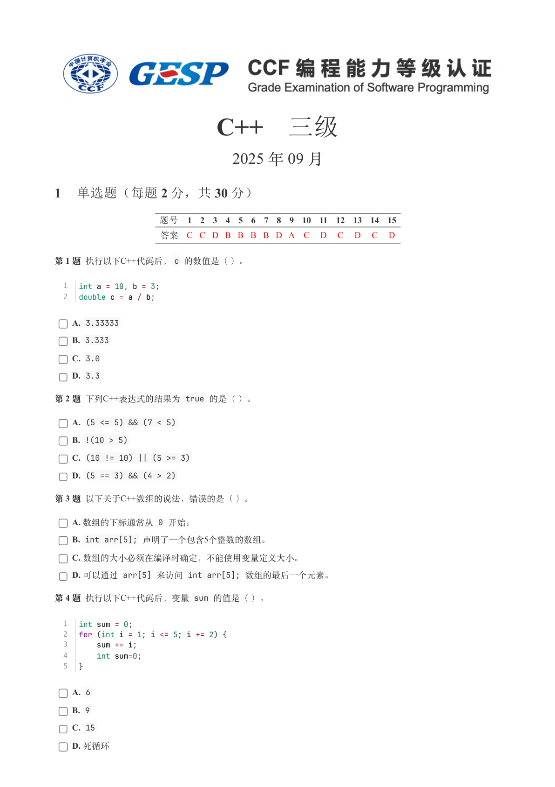
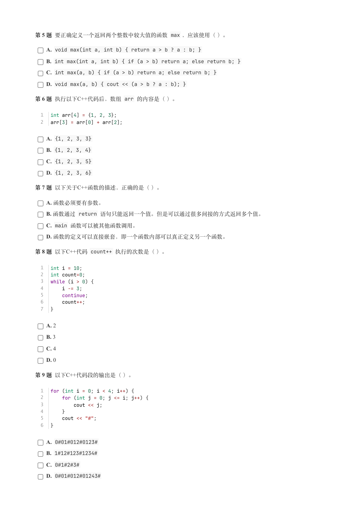
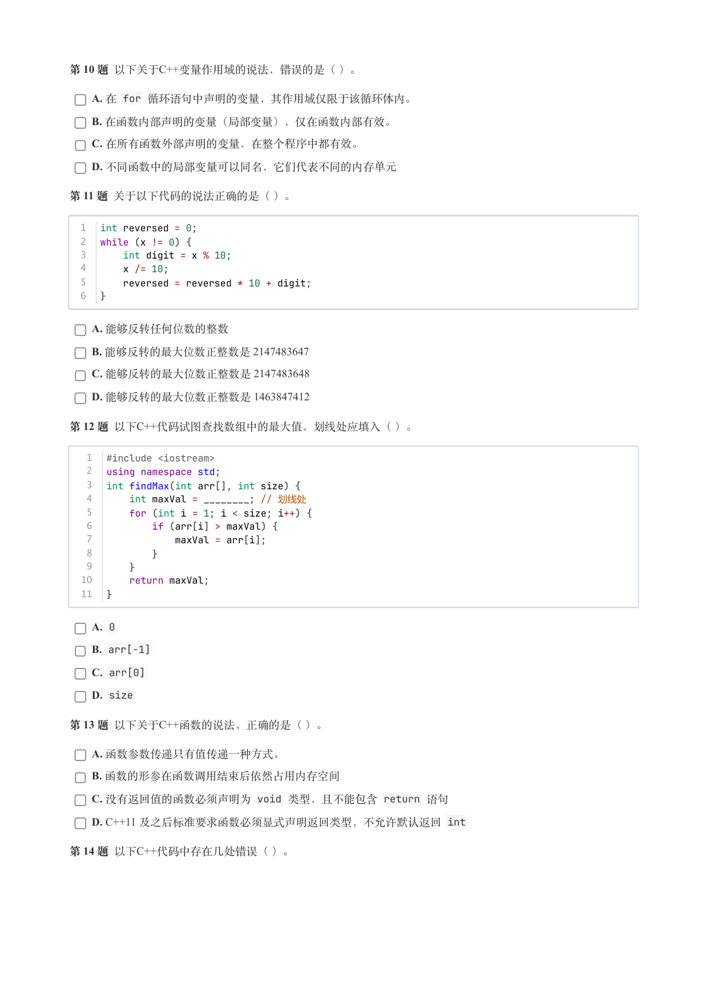
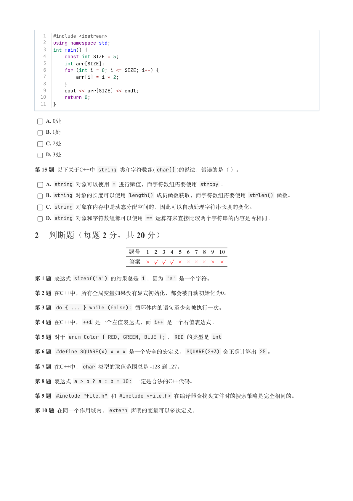
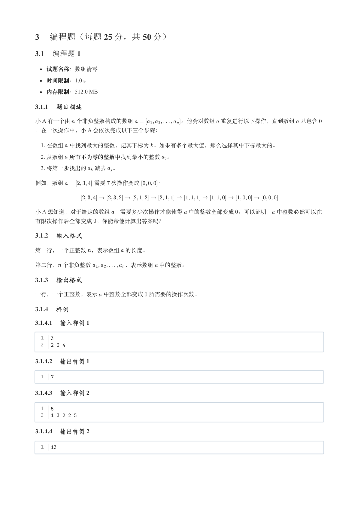
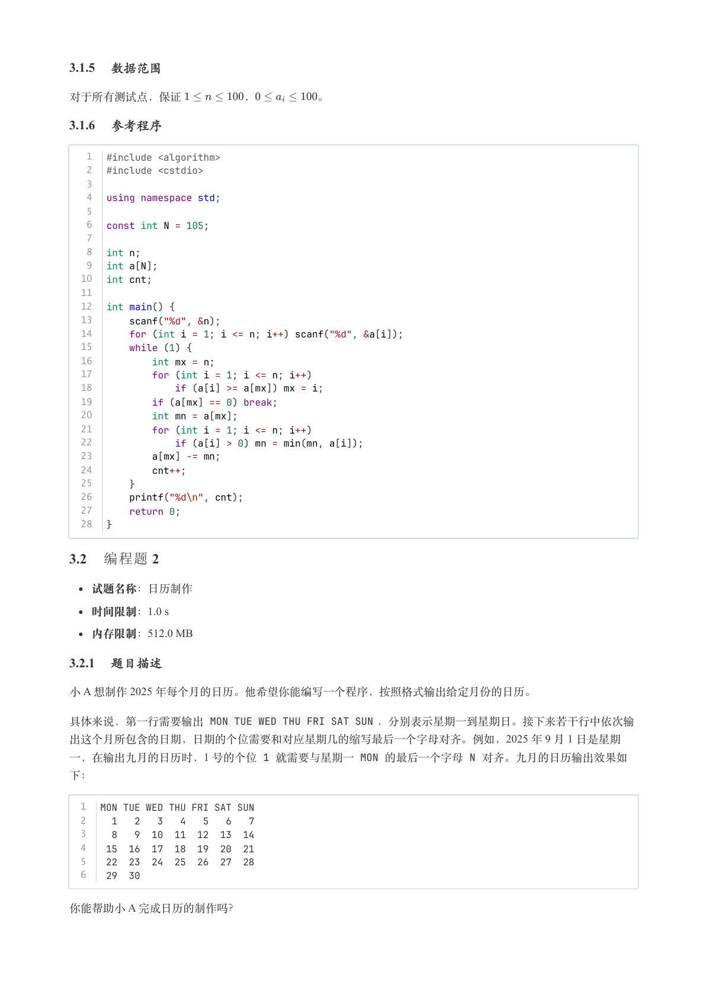
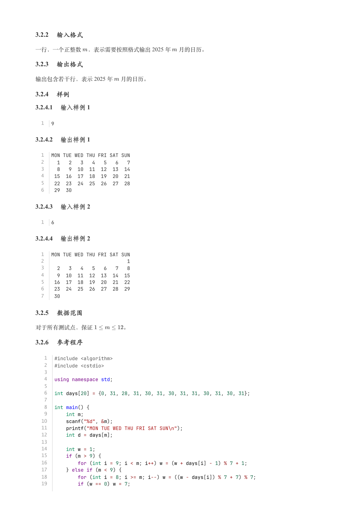
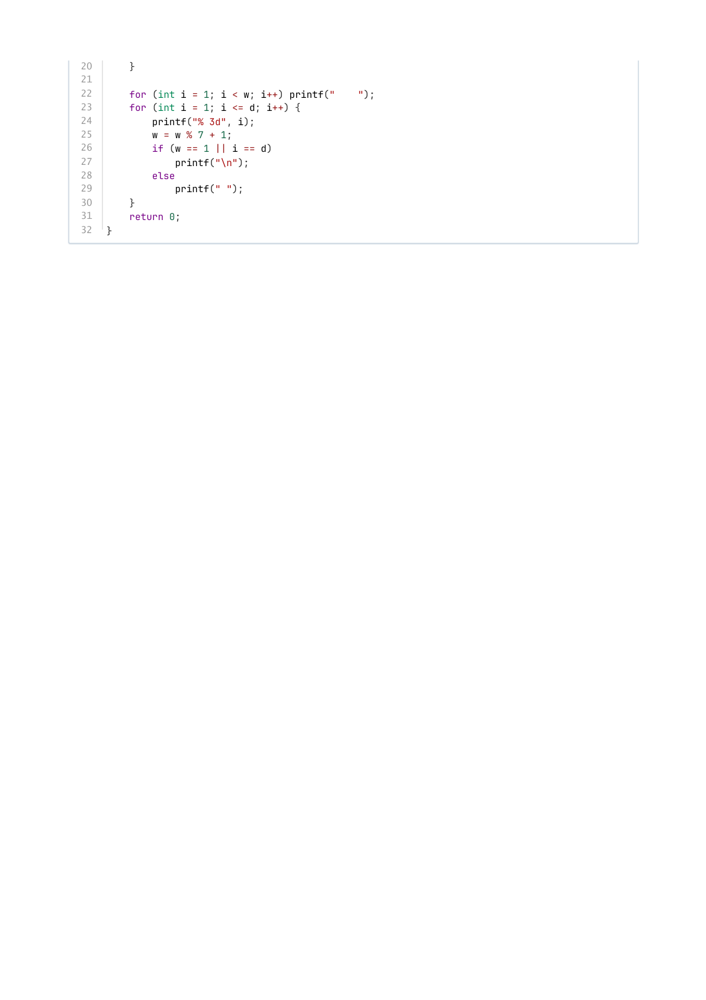

# 2025年9月-C++3级

- 原始 PDF：[`pdfs/2025年9月-C++3级.pdf`](../pdfs/2025年9月-C++3级.pdf)
- 页数：8
- 转换脚本：[`scripts/convert_pdfs_to_markdown.py`](../scripts/convert_pdfs_to_markdown.py)

> 为尽量避免信息丢失，每页均附带页面图片；文本提取结果保留原有顺序与换行特征，个别公式、图形、特殊排版请以页面图片为准。

## 第 1 页



### 提取文本

```
C++　三级

                      2025 年 09 月

1 单选题（每题 2 分，共 30 分）


           题号  1  2  3  4  5  6  7  8  9  10  11  12  13  14  15
            答案 C C D B B B B D A  C  D  C  D  C  D


第 1 题 执行以下C++代码后，c 的数值是（ ）。


  1  int a = 10, b = 3;
  2  double c = a / b;

    A. 3.33333

    B. 3.333

    C. 3.0

    D. 3.3

第 2 题 下列C++表达式的结果为 true 的是（ ）。

    A. (5 <= 5) && (7 < 5)

    B. !(10 > 5)

    C. (10 != 10) || (5 >= 3)

    D. (5 == 3) && (4 > 2)

第 3 题 以下关于C++数组的说法，错误的是（ ）。

    A. 数组的下标通常从 0 开始。

    B. int arr[5]; 声明了一个包含5个整数的数组。

    C. 数组的大小必须在编译时确定，不能使用变量定义大小。

    D. 可以通过 arr[5] 来访问 int arr[5]; 数组的最后一个元素。

第 4 题 执行以下C++代码后，变量 sum 的值是（ ）。


  1  int sum = 0;
  2  for (int i = 1; i <= 5; i += 2) {
  3      sum += i;
  4      int sum=0;
  5  }

    A. 6

    B. 9

    C. 15

    D. 死循环
```

## 第 2 页



### 提取文本

```
第 5 题 要正确定义一个返回两个整数中较大值的函数 max ，应该使用（ ）。

    A. void max(int a, int b) { return a > b ? a : b; }

    B. int max(int a, int b) { if (a > b) return a; else return b; }

    C. int max(a, b) { if (a > b) return a; else return b; }

    D. void max(a, b) { cout << (a > b ? a : b); }

第 6 题 执行以下C++代码后，数组 arr 的内容是（ ）。


  1  int arr[4] = {1, 2, 3};
  2  arr[3] = arr[0] + arr[2];

    A. {1, 2, 3, 3}

    B. {1, 2, 3, 4}

    C. {1, 2, 3, 5}

    D. {1, 2, 3, 6}

第 7 题 以下关于C++函数的描述，正确的是（ ）。

    A. 函数必须要有参数。

    B. 函数通过 return 语句只能返回一个值。但是可以通过很多间接的方式返回多个值。

    C. main 函数可以被其他函数调用。

    D. 函数的定义可以直接嵌套，即一个函数内部可以真正定义另一个函数。

第 8 题 以下C++代码 count++ 执行的次数是（ ）。


  1  int i = 10;
  2  int count=0;
  3  while (i > 0) {
  4      i -= 3;
  5      continue;
  6      count++;
  7  }


    A. 2

    B. 3

    C. 4

    D. 0

第 9 题 以下C++代码段的输出是（ ）。


  1  for (int i = 0; i < 4; i++) {
  2      for (int j = 0; j <= i; j++) {
  3          cout << j;
  4      }
  5      cout << "#";
  6  }

    A. 0#01#012#0123#

    B. 1#12#123#1234#

    C. 0#1#2#3#

    D. 0#01#012#01243#
```

## 第 3 页



### 提取文本

```
第 10 题 以下关于C++变量作用域的说法，错误的是（ ）。

    A. 在 for 循环语句中声明的变量，其作用域仅限于该循环体内。

    B. 在函数内部声明的变量（局部变量），仅在函数内部有效。

    C. 在所有函数外部声明的变量，在整个程序中都有效。

    D. 不同函数中的局部变量可以同名，它们代表不同的内存单元

第 11 题 关于以下代码的说法正确的是（ ）。


  1  int reversed = 0;
  2  while (x != 0) {
  3      int digit = x % 10;
  4      x /= 10;
  5      reversed = reversed * 10 + digit;
  6  }


    A. 能够反转任何位数的整数

    B. 能够反转的最大位数正整数是 2147483647

    C. 能够反转的最大位数正整数是 2147483648

    D. 能够反转的最大位数正整数是 1463847412

第 12 题 以下C++代码试图查找数组中的最大值，划线处应填入（ ）。


   1  #include <iostream>
   2  using namespace std;
   3  int findMax(int arr[], int size) {
   4      int maxVal = ________; // 划线处
   5      for (int i = 1; i < size; i++) {
   6          if (arr[i] > maxVal) {
   7              maxVal = arr[i];
   8          }
   9      }
  10      return maxVal;
  11  }

    A. 0

    B. arr[-1]

    C. arr[0]

    D. size

第 13 题 以下关于C++函数的说法，正确的是（ ）。

    A. 函数参数传递只有值传递一种方式。

    B. 函数的形参在函数调用结束后依然占用内存空间

    C. 没有返回值的函数必须声明为 void 类型，且不能包含 return 语句

    D. C++11 及之后标准要求函数必须显式声明返回类型，不允许默认返回 int

第 14 题 以下C++代码中存在几处错误（ ）。
```

## 第 4 页



### 提取文本

```
1  #include <iostream>
   2  using namespace std;
   3  int main() {
   4      const int SIZE = 5;
   5      int arr[SIZE];
   6      for (int i = 0; i <= SIZE; i++) {
   7          arr[i] = i * 2;
   8      }
   9      cout << arr[SIZE] << endl;
  10      return 0;
  11  }


    A. 0处

    B. 1处

    C. 2处

    D. 3处

第 15 题 以下关于C++中 string 类和字符数组( char[] )的说法，错误的是（ ）。

    A. string 对象可以使用 = 进行赋值，而字符数组需要使用 strcpy 。

    B. string 对象的长度可以使用 length() 成员函数获取，而字符数组需要使用 strlen() 函数。

    C. string 对象在内存中是动态分配空间的，因此可以自动处理字符串长度的变化。

    D. string 对象和字符数组都可以使用 == 运算符来直接比较两个字符串的内容是否相同。

2 判断题（每题 2 分，共 20 分）

                题号  1  2  3  4  5  6  7  8  9  10

                 答案


第 1 题 表达式 sizeof('a') 的结果总是 1 ，因为 'a' 是一个字符。

第 2 题 在C++中，所有全局变量如果没有显式初始化，都会被自动初始化为0。

第 3 题  do { ... } while (false); 循环体内的语句至少会被执行一次。

第 4 题 在C++中，++i 是一个左值表达式，而 i++ 是一个右值表达式。

第 5 题 对于 enum Color { RED, GREEN, BLUE }; ，RED 的类型是 int

第 6 题  #define SQUARE(x) x * x 是一个安全的宏定义，SQUARE(2+3) 会正确计算出 25 。

第 7 题 在C++中，char 类型的取值范围总是 -128 到 127。

第 8 题 表达式 a > b ? a : b = 10; 一定是合法的C++代码。

第 9 题  #include "file.h" 和 #include <file.h> 在编译器查找头文件时的搜索策略是完全相同的。

第 10 题 在同一个作用域内，extern 声明的变量可以多次定义。
```

## 第 5 页



### 提取文本

```
3 编程题（每题 25 分，共 50 分）

3.1 编程题 1


  试题名称：数组清零

   时间限制：1.0 s

   内存限制：512.0 MB

3.1.1 题目描述

小 A 有一个由 个非负整数构成的数组        。他会对数组 重复进行以下操作，直到数组 只包含
。在一次操作中，小 A 会依次完成以下三个步骤：

   1. 在数组 中找到最大的整数，记其下标为 。如果有多个最大值，那么选择其中下标最大的。

   2. 从数组 所有不为零的整数中找到最小的整数 。

   3. 将第一步找出的 减去 。


例如，数组     需要 次操作变成   ：


小 A 想知道，对于给定的数组 ，需要多少次操作才能使得 中的整数全部变成 。可以证明， 中整数必然可以在

有限次操作后全部变成 。你能帮他计算出答案吗？

3.1.2 输入格式

第一行，一个正整数 ，表示数组 的长度。


第二行， 个非负整数      ，表示数组 中的整数。

3.1.3 输出格式

一行，一个正整数，表示 中整数全部变成 所需要的操作次数。

3.1.4 样例

3.1.4.1 输入样例 1

  1  3
  2  2 3 4

3.1.4.2 输出样例 1

  1  7

3.1.4.3 输入样例 2

  1  5
  2  1 3 2 2 5

3.1.4.4 输出样例 2

  1  13
```

## 第 6 页



### 提取文本

```
3.1.5 数据范围

对于所有测试点，保证      ，      。

3.1.6 参考程序

   1  #include <algorithm>
   2  #include <cstdio>
   3
   4  using namespace std;
   5
   6  const int N = 105;
   7
   8  int n;
   9  int a[N];
  10  int cnt;
  11
  12  int main() {
  13      scanf("%d", &n);
  14      for (int i = 1; i <= n; i++) scanf("%d", &a[i]);
  15      while (1) {
  16          int mx = n;
  17          for (int i = 1; i <= n; i++)
  18              if (a[i] >= a[mx]) mx = i;
  19          if (a[mx] == 0) break;
  20          int mn = a[mx];
  21          for (int i = 1; i <= n; i++)
  22              if (a[i] > 0) mn = min(mn, a[i]);
  23          a[mx] -= mn;
  24          cnt++;
  25      }
  26      printf("%d\n", cnt);
  27      return 0;
  28  }

3.2 编程题 2

  试题名称：日历制作

   时间限制：1.0 s

   内存限制：512.0 MB

3.2.1 题目描述

小 A 想制作 2025 年每个月的日历。他希望你能编写一个程序，按照格式输出给定月份的日历。

具体来说，第一行需要输出 MON TUE WED THU FRI SAT SUN ，分别表示星期一到星期日。接下来若干行中依次输
出这个月所包含的日期，日期的个位需要和对应星期几的缩写最后一个字母对齐。例如，2025 年 9 月 1 日是星期
一，在输出九月的日历时，1 号的个位 1 就需要与星期一 MON 的最后一个字母 N 对齐。九月的日历输出效果如

下：


  1  MON TUE WED THU FRI SAT SUN
  2    1   2   3   4   5   6   7
  3    8   9  10  11  12  13  14
  4   15  16  17  18  19  20  21
  5   22  23  24  25  26  27  28
  6   29  30


你能帮助小 A 完成日历的制作吗？
```

## 第 7 页



### 提取文本

```
3.2.2 输入格式

一行，一个正整数 ，表示需要按照格式输出 2025 年 月的日历。

3.2.3 输出格式

输出包含若干行，表示 2025 年 月的日历。

3.2.4 样例

3.2.4.1 输入样例 1

  1  9

3.2.4.2 输出样例 1

  1  MON TUE WED THU FRI SAT SUN
  2    1   2   3   4   5   6   7
  3    8   9  10  11  12  13  14
  4   15  16  17  18  19  20  21
  5   22  23  24  25  26  27  28
  6   29  30

3.2.4.3 输入样例 2

  1  6

3.2.4.4 输出样例 2

  1  MON TUE WED THU FRI SAT SUN
  2                            1
  3    2   3   4   5   6   7   8
  4    9  10  11  12  13  14  15
  5   16  17  18  19  20  21  22
  6   23  24  25  26  27  28  29
  7   30

3.2.5 数据范围

对于所有测试点，保证     。

3.2.6 参考程序

   1  #include <algorithm>
   2  #include <cstdio>
   3
   4  using namespace std;
   5
   6  int days[20] = {0, 31, 28, 31, 30, 31, 30, 31, 31, 30, 31, 30, 31};
   7
   8  int main() {
   9      int m;
  10      scanf("%d", &m);
  11      printf("MON TUE WED THU FRI SAT SUN\n");
  12      int d = days[m];
  13
  14      int w = 1;
  15      if (m > 9) {
  16          for (int i = 9; i < m; i++) w = (w + days[i] - 1) % 7 + 1;
  17      } else if (m < 9) {
  18          for (int i = 8; i >= m; i--) w = ((w - days[i]) % 7 + 7) % 7;
  19          if (w == 0) w = 7;
```

## 第 8 页



### 提取文本

```
20      }
21
22      for (int i = 1; i < w; i++) printf("    ");
23      for (int i = 1; i <= d; i++) {
24          printf("% 3d", i);
25          w = w % 7 + 1;
26          if (w == 1 || i == d)
27              printf("\n");
28          else
29              printf(" ");
30      }
31      return 0;
32  }
```
