# 2025年9月-C++5级

- 原始 PDF：[`pdfs/2025年9月-C++5级.pdf`](../pdfs/2025年9月-C++5级.pdf)
- 页数：12
- 转换脚本：[`scripts/convert_pdfs_to_markdown.py`](../scripts/convert_pdfs_to_markdown.py)

> 为尽量避免信息丢失，每页均附带页面图片；文本提取结果保留原有顺序与换行特征，个别公式、图形、特殊排版请以页面图片为准。

## 第 1 页

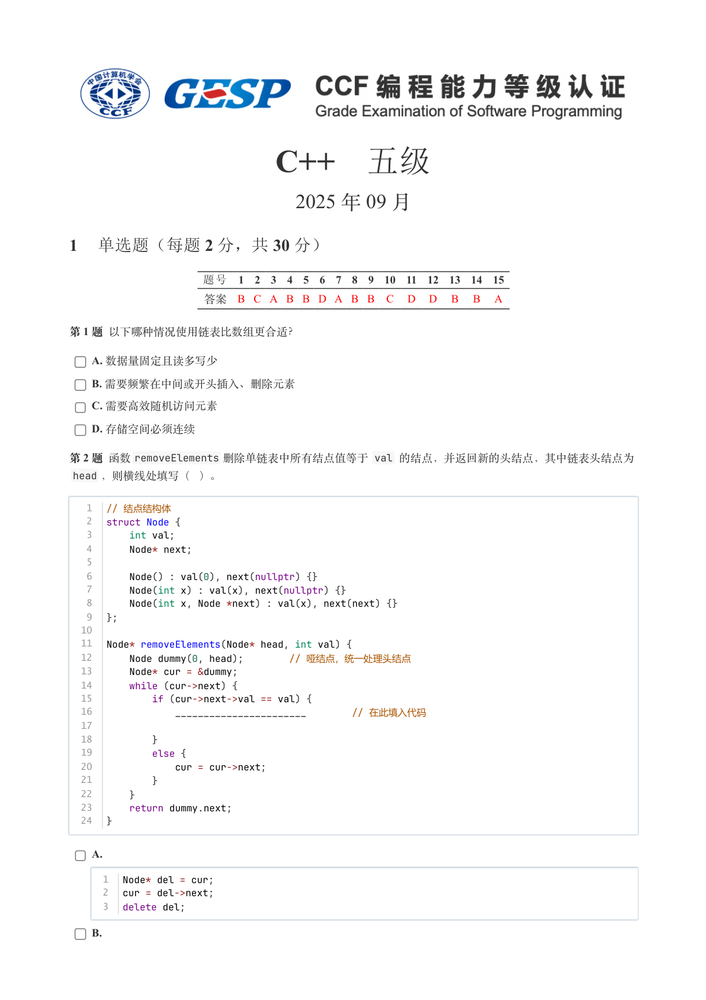

### 提取文本

```
C++　五级

                      2025 年 09 月

1 单选题（每题 2 分，共 30 分）


           题号  1  2  3  4  5  6  7  8  9  10  11  12  13  14  15
            答案 B C A B B D A B B  C  D  D  B  B  A


第 1 题 以下哪种情况使用链表比数组更合适？

    A. 数据量固定且读多写少

    B. 需要频繁在中间或开头插入、删除元素

    C. 需要高效随机访问元素

    D. 存储空间必须连续

第 2 题 函数removeElements 删除单链表中所有结点值等于 val 的结点，并返回新的头结点，其中链表头结点为
 head ，则横线处填写（ ）。


   1  // 结点结构体
   2  struct Node {
   3      int val;
   4      Node* next;
   5
   6      Node() : val(0), next(nullptr) {}
   7      Node(int x) : val(x), next(nullptr) {}
   8      Node(int x, Node *next) : val(x), next(next) {}
   9  };
  10
  11  Node* removeElements(Node* head, int val) {
  12      Node dummy(0, head);        // 哑结点，统一处理头结点
  13      Node* cur = &dummy;
  14      while (cur->next) {
  15          if (cur->next->val == val) {
  16              _______________________        // 在此填入代码
  17
  18          }
  19          else {
  20              cur = cur->next;
  21          }
  22      }
  23      return dummy.next;
  24  }


    A.

      1  Node* del = cur;
      2  cur = del->next;
      3  delete del;

    B.
```

## 第 2 页

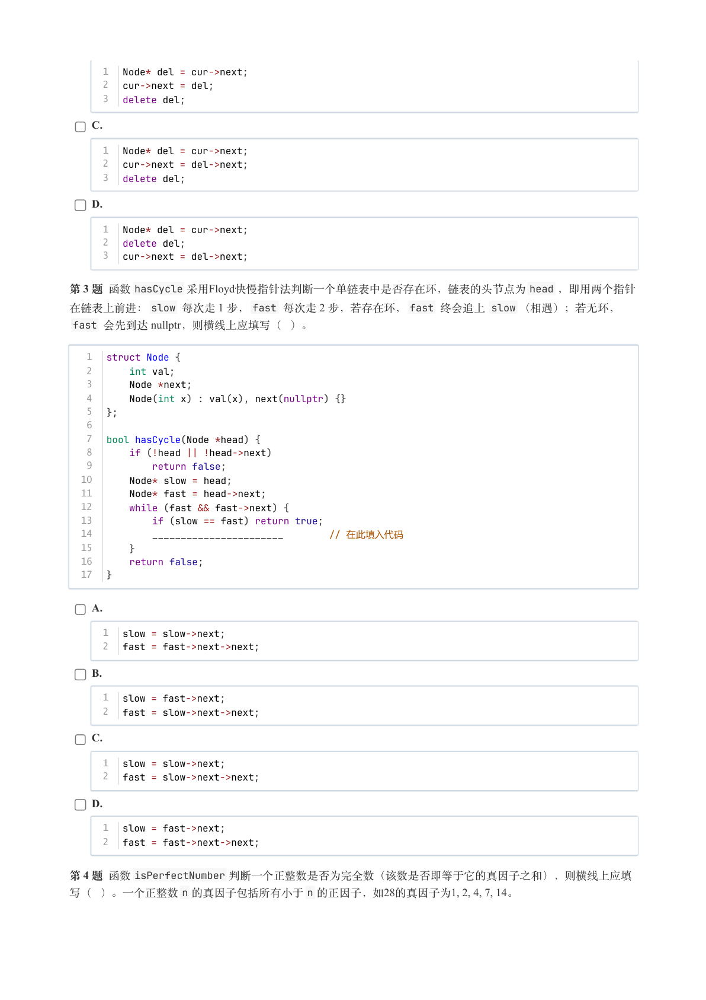

### 提取文本

```
1  Node* del = cur->next;
      2  cur->next = del;
      3  delete del;

    C.

      1  Node* del = cur->next;
      2  cur->next = del->next;
      3  delete del;

    D.

      1  Node* del = cur->next;
      2  delete del;
      3  cur->next = del->next;

第 3 题 函数hasCycle 采用Floyd快慢指针法判断一个单链表中是否存在环，链表的头节点为head ，即用两个指针
在链表上前进：slow 每次走 1 步，fast 每次走 2 步，若存在环，fast 终会追上 slow （相遇）；若无环，
 fast 会先到达 nullptr，则横线上应填写（ ）。


   1  struct Node {
   2      int val;
   3      Node *next;
   4      Node(int x) : val(x), next(nullptr) {}
   5  };
   6
   7  bool hasCycle(Node *head) {
   8      if (!head || !head->next)
   9          return false;
  10      Node* slow = head;
  11      Node* fast = head->next;
  12      while (fast && fast->next) {
  13          if (slow == fast) return true;
  14          _______________________        // 在此填入代码
  15      }
  16      return false;
  17  }


    A.

      1  slow = slow->next;
      2  fast = fast->next->next;

    B.

      1  slow = fast->next;
      2  fast = slow->next->next;

    C.

      1  slow = slow->next;
      2  fast = slow->next->next;

    D.

      1  slow = fast->next;
      2  fast = fast->next->next;

第 4 题 函数isPerfectNumber 判断一个正整数是否为完全数（该数是否即等于它的真因子之和），则横线上应填
写（ ）。一个正整数n 的真因子包括所有小于n 的正因子，如28的真因子为1, 2, 4, 7, 14。
```

## 第 3 页

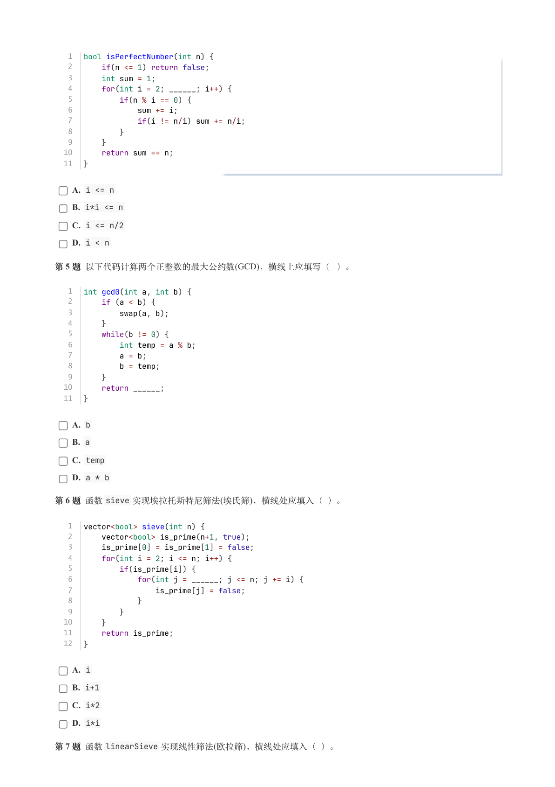

### 提取文本

```
1  bool isPerfectNumber(int n) {
   2      if(n <= 1) return false;
   3      int sum = 1;
   4      for(int i = 2; ______; i++) {
   5          if(n % i == 0) {
   6              sum += i;
   7              if(i != n/i) sum += n/i;
   8          }
   9      }
  10      return sum == n;
  11  }

    A. i <= n

    B. i*i <= n

    C. i <= n/2

    D. i < n

第 5 题 以下代码计算两个正整数的最大公约数(GCD)，横线上应填写（ ）。


   1  int gcd0(int a, int b) {
   2      if (a < b) {
   3          swap(a, b);
   4      }
   5      while(b != 0) {
   6          int temp = a % b;
   7          a = b;
   8          b = temp;
   9      }
  10      return ______;
  11  }

    A. b

    B. a

    C. temp

    D. a * b

第 6 题 函数sieve 实现埃拉托斯特尼筛法(埃氏筛)，横线处应填入（ ）。


   1  vector<bool> sieve(int n) {
   2      vector<bool> is_prime(n+1, true);
   3      is_prime[0] = is_prime[1] = false;
   4      for(int i = 2; i <= n; i++) {
   5          if(is_prime[i]) {
   6              for(int j = ______; j <= n; j += i) {
   7                  is_prime[j] = false;
   8              }
   9          }
  10      }
  11      return is_prime;
  12  }

    A. i

    B. i+1

    C. i*2

    D. i*i

第 7 题 函数linearSieve 实现线性筛法(欧拉筛)，横线处应填入（）。
```

## 第 4 页

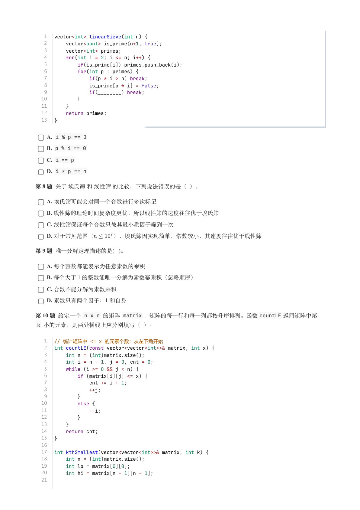

### 提取文本

```
1  vector<int> linearSieve(int n) {
   2      vector<bool> is_prime(n+1, true);
   3      vector<int> primes;
   4      for(int i = 2; i <= n; i++) {
   5          if(is_prime[i]) primes.push_back(i);
   6          for(int p : primes) {
   7              if(p * i > n) break;
   8              is_prime[p * i] = false;
   9              if(________) break;
  10          }
  11      }
  12      return primes;
  13  }

    A. i % p == 0

    B. p % i == 0

    C. i == p

    D. i * p == n

第 8 题 关于 埃氏筛 和 线性筛 的比较，下列说法错误的是（ ）。

    A. 埃氏筛可能会对同一个合数进行多次标记

    B. 线性筛的理论时间复杂度更优，所以线性筛的速度往往优于埃氏筛

    C. 线性筛保证每个合数只被其最小质因子筛到一次

    D. 对于常见范围（   ），埃氏筛因实现简单，常数较小，其速度往往优于线性筛

第 9 题 唯一分解定理描述的是( )。

    A. 每个整数都能表示为任意素数的乘积

    B. 每个大于 1 的整数能唯一分解为素数幂乘积（忽略顺序）

    C. 合数不能分解为素数乘积

    D. 素数只有两个因子：1 和自身

第 10 题 给定一个 n x n 的矩阵 matrix ，矩阵的每一行和每一列都按升序排列。函数countLE 返回矩阵中第
 k 小的元素，则两处横线上应分别填写（ ）。

   1  // 统计矩阵中 <= x 的元素个数：从左下角开始
   2  int countLE(const vector<vector<int>>& matrix, int x) {
   3      int n = (int)matrix.size();
   4      int i = n - 1, j = 0, cnt = 0;
   5      while (i >= 0 && j < n) {
   6          if (matrix[i][j] <= x) {
   7              cnt += i + 1;
   8              ++j;
   9          }
  10          else {
  11              --i;
  12          }
  13      }
  14      return cnt;
  15  }
  16
  17  int kthSmallest(vector<vector<int>>& matrix, int k) {
  18      int n = (int)matrix.size();
  19      int lo = matrix[0][0];
  20      int hi = matrix[n - 1][n - 1];
  21
```

## 第 5 页

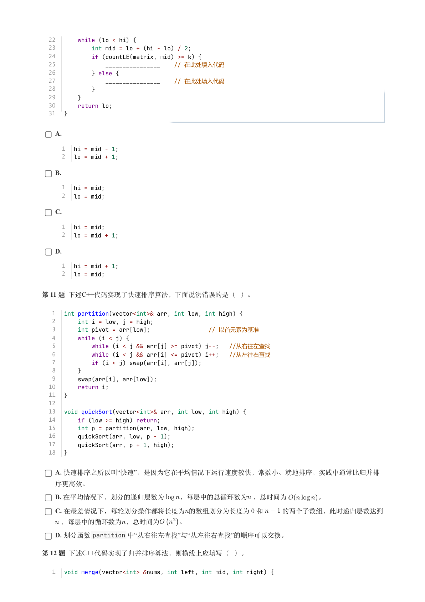

### 提取文本

```
22      while (lo < hi) {
  23          int mid = lo + (hi - lo) / 2;
  24          if (countLE(matrix, mid) >= k) {
  25              ________________    // 在此处填入代码
  26          } else {
  27              ________________    // 在此处填入代码
  28          }
  29      }
  30      return lo;
  31  }


    A.

      1  hi = mid - 1;
      2  lo = mid + 1;

    B.

      1  hi = mid;
      2  lo = mid;

    C.

      1  hi = mid;
      2  lo = mid + 1;

    D.

      1  hi = mid + 1;
      2  lo = mid;


第 11 题 下述C++代码实现了快速排序算法，下面说法错误的是（ ）。


   1  int partition(vector<int>& arr, int low, int high) {
   2      int i = low, j = high;
   3      int pivot = arr[low];                 // 以首元素为基准
   4      while (i < j) {
   5          while (i < j && arr[j] >= pivot) j--;  //从右往左查找
   6          while (i < j && arr[i] <= pivot) i++;  //从左往右查找
   7          if (i < j) swap(arr[i], arr[j]);
   8      }
   9      swap(arr[i], arr[low]);
  10      return i;
  11  }
  12
  13  void quickSort(vector<int>& arr, int low, int high) {
  14      if (low >= high) return;
  15      int p = partition(arr, low, high);
  16      quickSort(arr, low, p - 1);
  17      quickSort(arr, p + 1, high);
  18  }


    A. 快速排序之所以叫“快速”，是因为它在平均情况下运行速度较快，常数小、就地排序，实践中通常比归并排

  序更高效。

    B. 在平均情况下，划分的递归层数为  ，每层中的总循环数为 ，总时间为     。

    C. 在最差情况下，每轮划分操作都将长度为的数组划分为长度为 0 和   的两个子数组，此时递归层数达到

   ，每层中的循环数为，总时间为   。

    D. 划分函数partition 中“从右往左查找”与“从左往右查找”的顺序可以交换。

第 12 题 下述C++代码实现了归并排序算法，则横线上应填写（ ）。


   1  void merge(vector<int> &nums, int left, int mid, int right) {
```

## 第 6 页

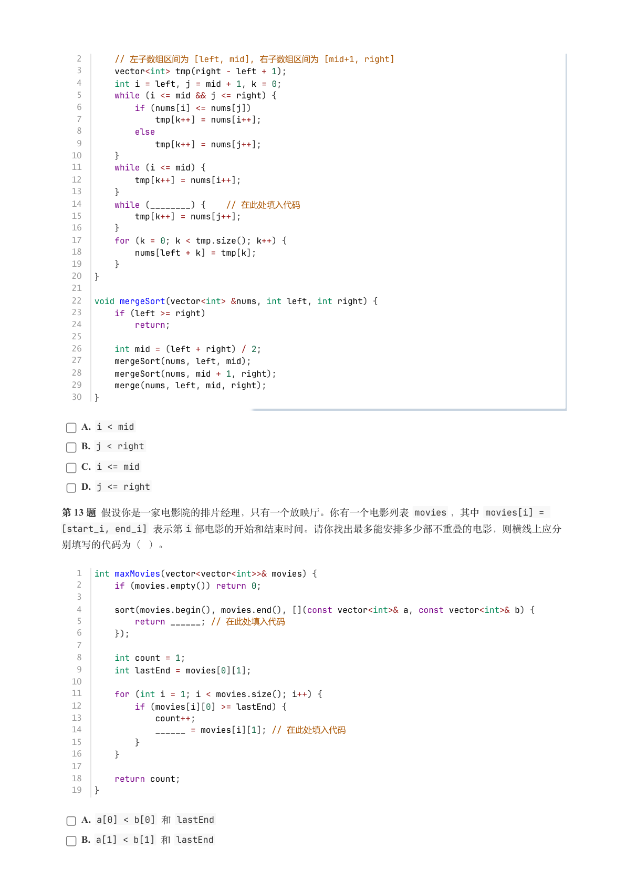

### 提取文本

```
2      // 左子数组区间为 [left, mid], 右子数组区间为 [mid+1, right]
   3      vector<int> tmp(right - left + 1);
   4      int i = left, j = mid + 1, k = 0;
   5      while (i <= mid && j <= right) {
   6          if (nums[i] <= nums[j])
   7              tmp[k++] = nums[i++];
   8          else
   9              tmp[k++] = nums[j++];
  10      }
  11      while (i <= mid) {
  12          tmp[k++] = nums[i++];
  13      }
  14      while (________) {    // 在此处填入代码
  15          tmp[k++] = nums[j++];
  16      }
  17      for (k = 0; k < tmp.size(); k++) {
  18          nums[left + k] = tmp[k];
  19      }
  20  }
  21
  22  void mergeSort(vector<int> &nums, int left, int right) {
  23      if (left >= right)
  24          return;
  25
  26      int mid = (left + right) / 2;
  27      mergeSort(nums, left, mid);
  28      mergeSort(nums, mid + 1, right);
  29      merge(nums, left, mid, right);
  30  }

    A. i < mid

    B. j < right

    C. i <= mid

    D. j <= right

第 13 题 假设你是一家电影院的排片经理，只有一个放映厅。你有一个电影列表 movies ，其中 movies[i] =
[start_i, end_i] 表示第i 部电影的开始和结束时间。请你找出最多能安排多少部不重叠的电影，则横线上应分

别填写的代码为（ ）。


   1  int maxMovies(vector<vector<int>>& movies) {
   2      if (movies.empty()) return 0;
   3
   4      sort(movies.begin(), movies.end(), [](const vector<int>& a, const vector<int>& b) {
   5          return ______; // 在此处填入代码
   6      });
   7
   8      int count = 1;
   9      int lastEnd = movies[0][1];
  10
  11      for (int i = 1; i < movies.size(); i++) {
  12          if (movies[i][0] >= lastEnd) {
  13              count++;
  14              ______ = movies[i][1]; // 在此处填入代码
  15          }
  16      }
  17
  18      return count;
  19  }

    A. a[0] < b[0] 和 lastEnd

    B. a[1] < b[1] 和 lastEnd
```

## 第 7 页

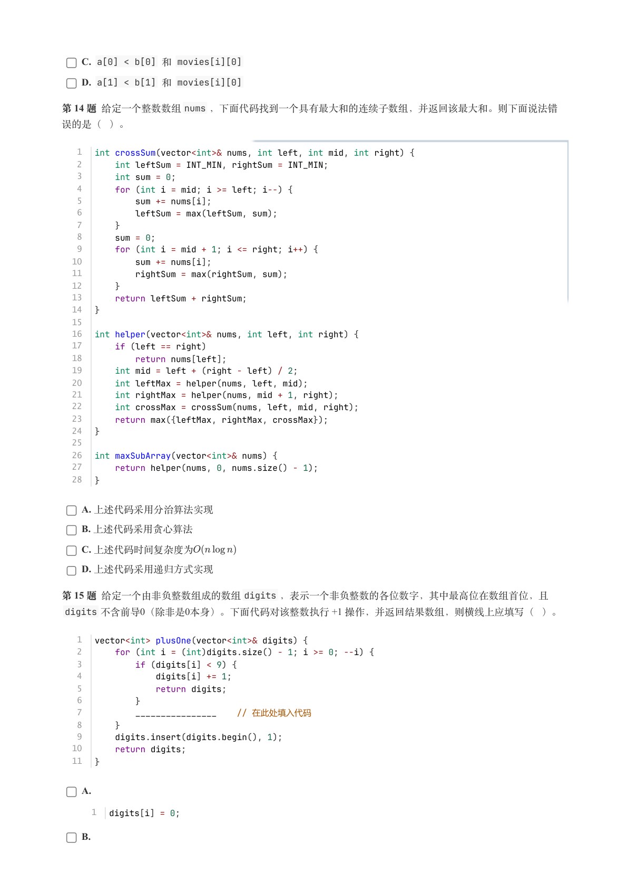

### 提取文本

```
C. a[0] < b[0] 和 movies[i][0]

    D. a[1] < b[1] 和 movies[i][0]

第 14 题 给定一个整数数组nums ，下面代码找到一个具有最大和的连续子数组，并返回该最大和。则下面说法错

误的是（ ）。


   1  int crossSum(vector<int>& nums, int left, int mid, int right) {
   2      int leftSum = INT_MIN, rightSum = INT_MIN;
   3      int sum = 0;
   4      for (int i = mid; i >= left; i--) {
   5          sum += nums[i];
   6          leftSum = max(leftSum, sum);
   7      }
   8      sum = 0;
   9      for (int i = mid + 1; i <= right; i++) {
  10          sum += nums[i];
  11          rightSum = max(rightSum, sum);
  12      }
  13      return leftSum + rightSum;
  14  }
  15
  16  int helper(vector<int>& nums, int left, int right) {
  17      if (left == right)
  18          return nums[left];
  19      int mid = left + (right - left) / 2;
  20      int leftMax = helper(nums, left, mid);
  21      int rightMax = helper(nums, mid + 1, right);
  22      int crossMax = crossSum(nums, left, mid, right);
  23      return max({leftMax, rightMax, crossMax});
  24  }
  25
  26  int maxSubArray(vector<int>& nums) {
  27      return helper(nums, 0, nums.size() - 1);
  28  }


    A. 上述代码采用分治算法实现

    B. 上述代码采用贪心算法

    C. 上述代码时间复杂度为

    D. 上述代码采用递归方式实现

第 15 题 给定一个由非负整数组成的数组digits ，表示一个非负整数的各位数字，其中最高位在数组首位，且
 digits 不含前导0（除非是0本身）。下面代码对该整数执行 +1 操作，并返回结果数组，则横线上应填写（ ）。


   1  vector<int> plusOne(vector<int>& digits) {
   2      for (int i = (int)digits.size() - 1; i >= 0; --i) {
   3          if (digits[i] < 9) {
   4              digits[i] += 1;
   5              return digits;
   6          }
   7          ________________    // 在此处填入代码
   8      }
   9      digits.insert(digits.begin(), 1);
  10      return digits;
  11  }


    A.

      1  digits[i] = 0;

    B.
```

## 第 8 页

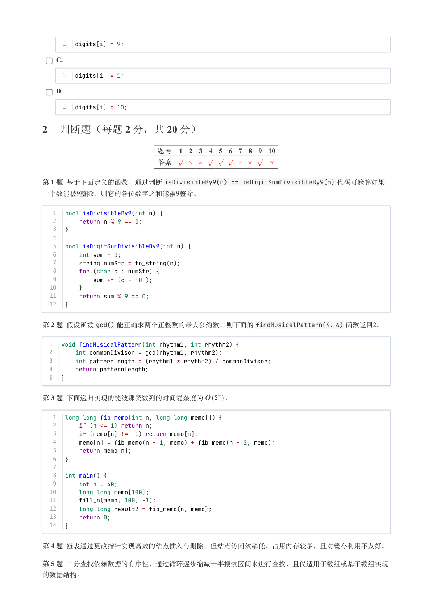

### 提取文本

```
1  digits[i] = 9;

    C.

      1  digits[i] = 1;

    D.

      1  digits[i] = 10;

2 判断题（每题 2 分，共 20 分）


                题号  1  2  3  4  5  6  7  8  9  10

                 答案


第 1 题 基于下面定义的函数，通过判断isDivisibleBy9(n) == isDigitSumDivisibleBy9(n) 代码可验算如果
一个数能被9整除，则它的各位数字之和能被9整除。


   1  bool isDivisibleBy9(int n) {
   2      return n % 9 == 0;
   3  }
   4
   5  bool isDigitSumDivisibleBy9(int n) {
   6      int sum = 0;
   7      string numStr = to_string(n);
   8      for (char c : numStr) {
   9          sum += (c - '0');
  10      }
  11      return sum % 9 == 0;
  12  }

第 2 题 假设函数gcd() 能正确求两个正整数的最大公约数，则下面的findMusicalPattern(4，6) 函数返回2。


  1  void findMusicalPattern(int rhythm1, int rhythm2) {
  2      int commonDivisor = gcd(rhythm1, rhythm2);
  3      int patternLength = (rhythm1 * rhythm2) / commonDivisor;
  4      return patternLength；
  5  }


第 3 题 下面递归实现的斐波那契数列的时间复杂度为   。


   1  long long fib_memo(int n, long long memo[]) {
   2      if (n <= 1) return n;
   3      if (memo[n] != -1) return memo[n];
   4      memo[n] = fib_memo(n - 1, memo) + fib_memo(n - 2, memo);
   5      return memo[n];
   6  }
   7
   8  int main() {
   9      int n = 40;
  10      long long memo[100];
  11      fill_n(memo, 100, -1);
  12      long long result2 = fib_memo(n, memo);
  13      return 0;
  14  }


第 4 题 链表通过更改指针实现高效的结点插入与删除，但结点访问效率低、占用内存较多，且对缓存利用不友好。

第 5 题 二分查找依赖数据的有序性，通过循环逐步缩减一半搜索区间来进行查找，且仅适用于数组或基于数组实现

的数据结构。
```

## 第 9 页

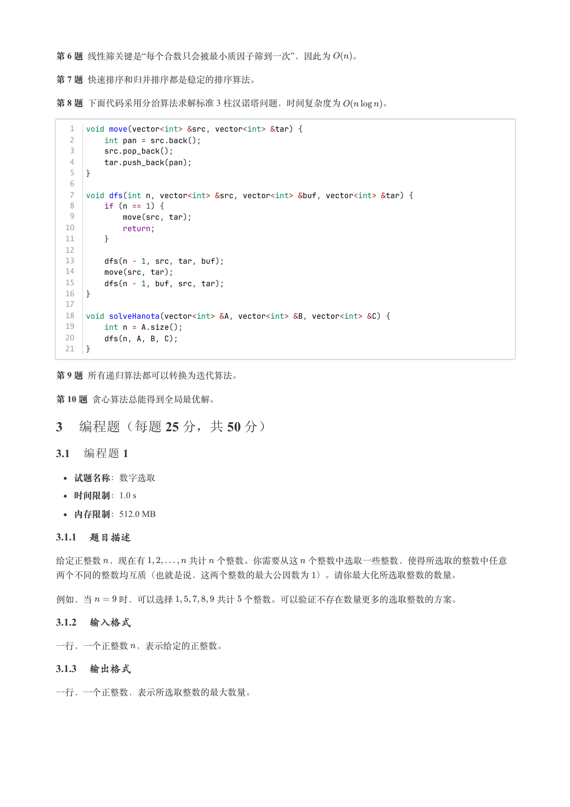

### 提取文本

```
第 6 题 线性筛关键是“每个合数只会被最小质因子筛到一次”，因此为  。

第 7 题 快速排序和归并排序都是稳定的排序算法。

第 8 题 下面代码采用分治算法求解标准 3 柱汉诺塔问题，时间复杂度为     。


   1  void move(vector<int> &src, vector<int> &tar) {
   2      int pan = src.back();
   3      src.pop_back();
   4      tar.push_back(pan);
   5  }
   6
   7  void dfs(int n, vector<int> &src, vector<int> &buf, vector<int> &tar) {
   8      if (n == 1) {
   9          move(src, tar);
  10          return;
  11      }
  12
  13      dfs(n - 1, src, tar, buf);
  14      move(src, tar);
  15      dfs(n - 1, buf, src, tar);
  16  }
  17
  18  void solveHanota(vector<int> &A, vector<int> &B, vector<int> &C) {
  19      int n = A.size();
  20      dfs(n, A, B, C);
  21  }


第 9 题 所有递归算法都可以转换为迭代算法。

第 10 题 贪心算法总能得到全局最优解。

3 编程题（每题 25 分，共 50 分）

3.1 编程题 1


  试题名称：数字选取

   时间限制：1.0 s

   内存限制：512.0 MB

3.1.1 题目描述

给定正整数 ，现在有     共计 个整数。你需要从这 个整数中选取一些整数，使得所选取的整数中任意

两个不同的整数均互质（也就是说，这两个整数的最大公因数为 ）。请你最大化所选取整数的数量。


例如，当   时，可以选择     共计 个整数。可以验证不存在数量更多的选取整数的方案。

3.1.2 输入格式

一行，一个正整数 ，表示给定的正整数。

3.1.3 输出格式

一行，一个正整数，表示所选取整数的最大数量。
```

## 第 10 页

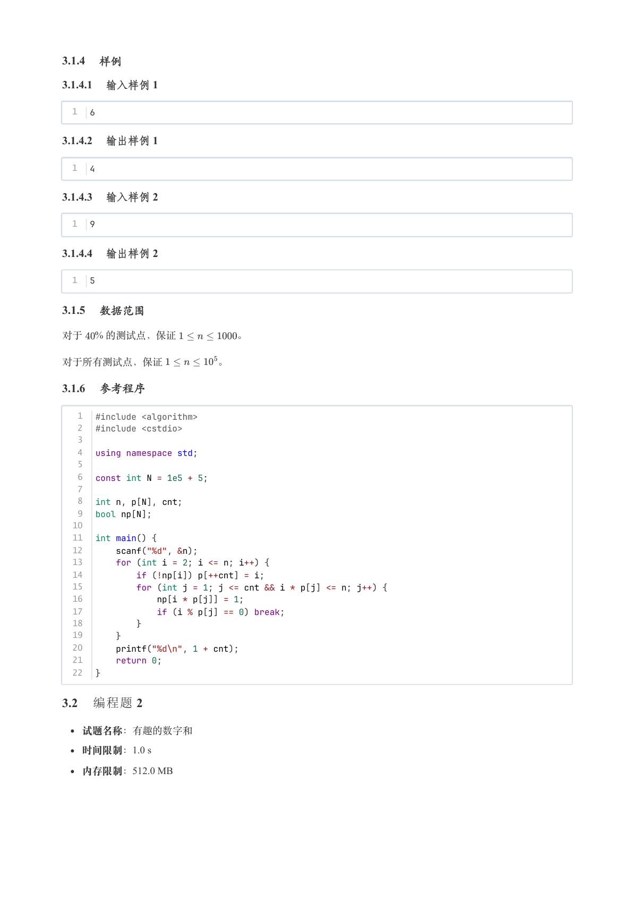

### 提取文本

```
3.1.4 样例

3.1.4.1 输入样例 1

  1  6

3.1.4.2 输出样例 1

  1  4

3.1.4.3 输入样例 2

  1  9

3.1.4.4 输出样例 2

  1  5

3.1.5 数据范围

对于  % 的测试点，保证      。


对于所有测试点，保证      。

3.1.6 参考程序

   1  #include <algorithm>
   2  #include <cstdio>
   3
   4  using namespace std;
   5
   6  const int N = 1e5 + 5;
   7
   8  int n, p[N], cnt;
   9  bool np[N];
  10
  11  int main() {
  12      scanf("%d", &n);
  13      for (int i = 2; i <= n; i++) {
  14          if (!np[i]) p[++cnt] = i;
  15          for (int j = 1; j <= cnt && i * p[j] <= n; j++) {
  16              np[i * p[j]] = 1;
  17              if (i % p[j] == 0) break;
  18          }
  19      }
  20      printf("%d\n", 1 + cnt);
  21      return 0;
  22  }

3.2 编程题 2


  试题名称：有趣的数字和

   时间限制：1.0 s

   内存限制：512.0 MB
```

## 第 11 页

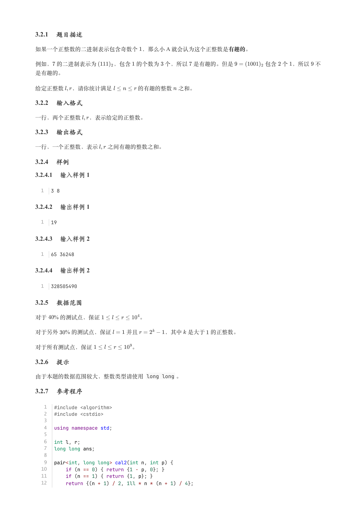

### 提取文本

```
3.2.1 题目描述

如果一个正整数的二进制表示包含奇数个 ，那么小 A 就会认为这个正整数是有趣的。


例如， 的二进制表示为   ，包含 的个数为 个，所以 是有趣的。但是      包含 个 ，所以 不

是有趣的。


给定正整数 ，请你统计满足     的有趣的整数 之和。

3.2.2 输入格式

一行，两个正整数 ，表示给定的正整数。

3.2.3 输出格式

一行，一个正整数，表示  之间有趣的整数之和。

3.2.4 样例

3.2.4.1 输入样例 1

  1  3 8

3.2.4.2 输出样例 1

  1  19

3.2.4.3 输入样例 2

  1  65 36248

3.2.4.4 输出样例 2

  1  328505490

3.2.5 数据范围

对于  % 的测试点，保证       。

对于另外  % 的测试点，保证   并且     ，其中 是大于 的正整数。


对于所有测试点，保证       。

3.2.6 提示

由于本题的数据范围较大，整数类型请使用 long long 。

3.2.7 参考程序

   1  #include <algorithm>
   2  #include <cstdio>
   3
   4  using namespace std;
   5
   6  int l, r;
   7  long long ans;
   8
   9  pair<int, long long> cal2(int n, int p) {
  10      if (n == 0) { return {1 - p, 0}; }
  11      if (n == 1) { return {1, p}; }
  12      return {(n + 1) / 2, 1ll * n * (n + 1) / 4};
```

## 第 12 页

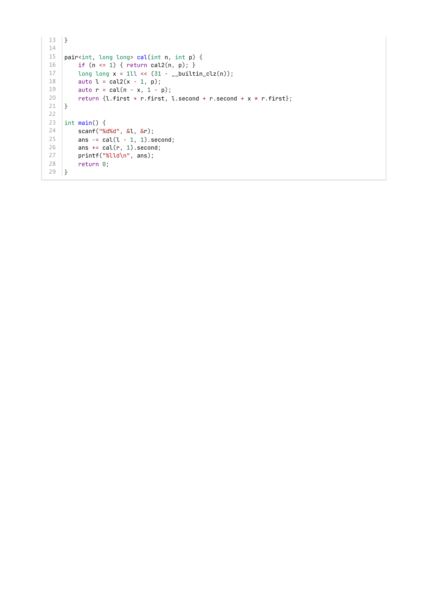

### 提取文本

```
13  }
14
15  pair<int, long long> cal(int n, int p) {
16      if (n <= 1) { return cal2(n, p); }
17      long long x = 1ll << (31 - __builtin_clz(n));
18      auto l = cal2(x - 1, p);
19      auto r = cal(n - x, 1 - p);
20      return {l.first + r.first, l.second + r.second + x * r.first};
21  }
22
23  int main() {
24      scanf("%d%d", &l, &r);
25      ans -= cal(l - 1, 1).second;
26      ans += cal(r, 1).second;
27      printf("%lld\n", ans);
28      return 0;
29  }
```
