# 2025年9月-C++6级

- 原始 PDF：[`pdfs/2025年9月-C++6级.pdf`](../pdfs/2025年9月-C++6级.pdf)
- 页数：11
- 转换脚本：[`scripts/convert_pdfs_to_markdown.py`](../scripts/convert_pdfs_to_markdown.py)

> 为尽量避免信息丢失，每页均附带页面图片；文本提取结果保留原有顺序与换行特征，个别公式、图形、特殊排版请以页面图片为准。

## 第 1 页

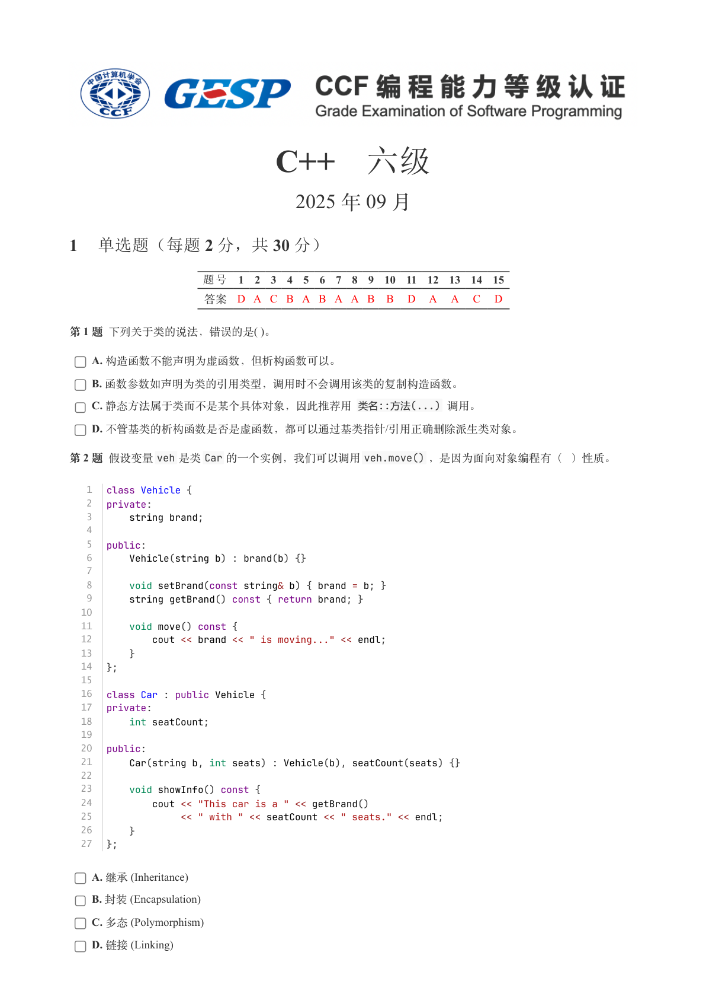

### 提取文本

```
C++　六级

                      2025 年 09 月

1 单选题（每题 2 分，共 30 分）


           题号  1  2  3  4  5  6  7  8  9  10  11  12  13  14  15
            答案 D A C B A B A A B  B  D  A  A  C  D


第 1 题 下列关于类的说法，错误的是( )。

    A. 构造函数不能声明为虚函数，但析构函数可以。

    B. 函数参数如声明为类的引用类型，调用时不会调用该类的复制构造函数。

    C. 静态方法属于类而不是某个具体对象，因此推荐用 类名::方法(...) 调用。

    D. 不管基类的析构函数是否是虚函数，都可以通过基类指针/引用正确删除派生类对象。

第 2 题 假设变量veh 是类Car 的一个实例，我们可以调用veh.move() ，是因为面向对象编程有（ ）性质。


   1  class Vehicle {
   2  private:
   3      string brand;
   4
   5  public:
   6      Vehicle(string b) : brand(b) {}
   7
   8      void setBrand(const string& b) { brand = b; }
   9      string getBrand() const { return brand; }
  10
  11      void move() const {
  12          cout << brand << " is moving..." << endl;
  13      }
  14  };
  15
  16  class Car : public Vehicle {
  17  private:
  18      int seatCount;
  19
  20  public:
  21      Car(string b, int seats) : Vehicle(b), seatCount(seats) {}
  22
  23      void showInfo() const {
  24          cout << "This car is a " << getBrand()
  25               << " with " << seatCount << " seats." << endl;
  26      }
  27  };


    A. 继承 (Inheritance)

    B. 封装 (Encapsulation)

    C. 多态 (Polymorphism)

    D. 链接 (Linking)
```

## 第 2 页

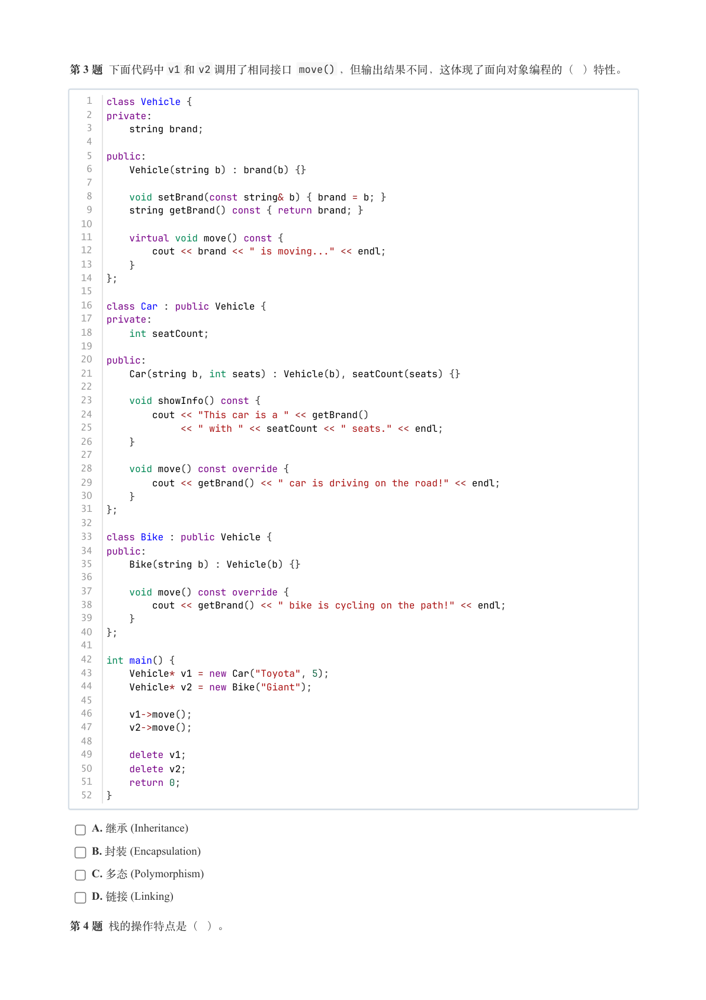

### 提取文本

```
第 3 题 下面代码中v1 和v2 调用了相同接口 move() ，但输出结果不同，这体现了面向对象编程的（ ）特性。


   1  class Vehicle {
   2  private:
   3      string brand;
   4
   5  public:
   6      Vehicle(string b) : brand(b) {}
   7
   8      void setBrand(const string& b) { brand = b; }
   9      string getBrand() const { return brand; }
  10
  11      virtual void move() const {
  12          cout << brand << " is moving..." << endl;
  13      }
  14  };
  15
  16  class Car : public Vehicle {
  17  private:
  18      int seatCount;
  19
  20  public:
  21      Car(string b, int seats) : Vehicle(b), seatCount(seats) {}
  22
  23      void showInfo() const {
  24          cout << "This car is a " << getBrand()
  25               << " with " << seatCount << " seats." << endl;
  26      }
  27
  28      void move() const override {
  29          cout << getBrand() << " car is driving on the road!" << endl;
  30      }
  31  };
  32
  33  class Bike : public Vehicle {
  34  public:
  35      Bike(string b) : Vehicle(b) {}
  36
  37      void move() const override {
  38          cout << getBrand() << " bike is cycling on the path!" << endl;
  39      }
  40  };
  41
  42  int main() {
  43      Vehicle* v1 = new Car("Toyota", 5);
  44      Vehicle* v2 = new Bike("Giant");
  45
  46      v1->move();
  47      v2->move();
  48
  49      delete v1;
  50      delete v2;
  51      return 0;
  52  }


    A. 继承 (Inheritance)

    B. 封装 (Encapsulation)

    C. 多态 (Polymorphism)

    D. 链接 (Linking)

第 4 题 栈的操作特点是（ ）。
```

## 第 3 页

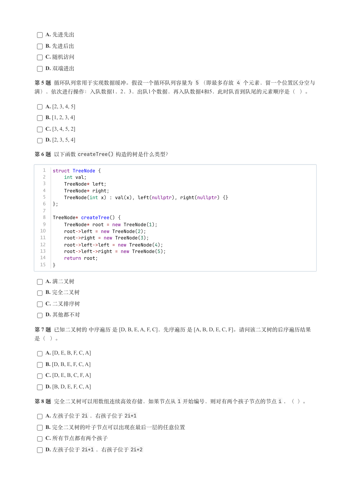

### 提取文本

```
A. 先进先出

    B. 先进后出

    C. 随机访问

    D. 双端进出

第 5 题 循环队列常用于实现数据缓冲。假设一个循环队列容量为 5 （即最多存放 4 个元素，留一个位置区分空与
满），依次进行操作：入队数据1，2，3，出队1个数据，再入队数据4和5，此时队首到队尾的元素顺序是（ ）。

    A. [2, 3, 4, 5]

    B. [1, 2, 3, 4]

    C. [3, 4, 5, 2]

    D. [2, 3, 5, 4]

第 6 题 以下函数createTree() 构造的树是什么类型？


   1  struct TreeNode {
   2      int val;
   3      TreeNode* left;
   4      TreeNode* right;
   5      TreeNode(int x) : val(x), left(nullptr), right(nullptr) {}
   6  };
   7
   8  TreeNode* createTree() {
   9      TreeNode* root = new TreeNode(1);
  10      root->left = new TreeNode(2);
  11      root->right = new TreeNode(3);
  12      root->left->left = new TreeNode(4);
  13      root->left->right = new TreeNode(5);
  14      return root;
  15  }


    A. 满二叉树

    B. 完全二叉树

    C. 二叉排序树

    D. 其他都不对

第 7 题 已知二叉树的 中序遍历 是 [D, B, E, A, F, C]，先序遍历 是 [A, B, D, E, C, F]。请问该二叉树的后序遍历结果

是（ ）。

    A. [D, E, B, F, C, A]

    B. [D, B, E, F, C, A]

    C. [D, E, B, C, F, A]

    D. [B, D, E, F, C, A]

第 8 题 完全二叉树可以用数组连续高效存储，如果节点从1 开始编号，则对有两个孩子节点的节点i ，（ ）。

    A. 左孩子位于2i ，右孩子位于2i+1

    B. 完全二叉树的叶子节点可以出现在最后一层的任意位置

    C. 所有节点都有两个孩子

    D. 左孩子位于2i+1 ，右孩子位于2i+2
```

## 第 4 页

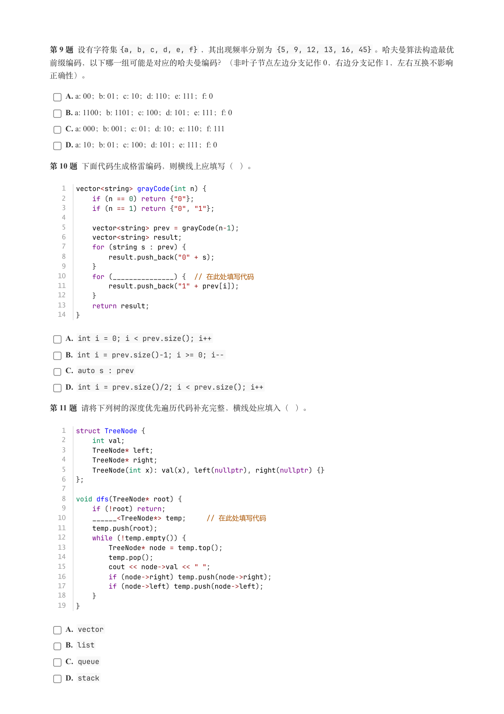

### 提取文本

```
第 9 题 设有字符集{a, b, c, d, e, f} ，其出现频率分别为 {5, 9, 12, 13, 16, 45} 。哈夫曼算法构造最优
前缀编码，以下哪一组可能是对应的哈夫曼编码？（非叶子节点左边分支记作 0，右边分支记作 1，左右互换不影响

正确性）。

    A. a: 00；b: 01；c: 10；d: 110；e: 111；f: 0

    B. a: 1100；b: 1101；c: 100；d: 101；e: 111；f: 0

    C. a: 000；b: 001；c: 01；d: 10；e: 110；f: 111

    D. a: 10；b: 01；c: 100；d: 101；e: 111；f: 0

第 10 题 下面代码生成格雷编码，则横线上应填写（ ）。


   1  vector<string> grayCode(int n) {
   2      if (n == 0) return {"0"};
   3      if (n == 1) return {"0", "1"};
   4
   5      vector<string> prev = grayCode(n-1);
   6      vector<string> result;
   7      for (string s : prev) {
   8          result.push_back("0" + s);
   9      }
  10      for (_______________) {  // 在此处填写代码
  11          result.push_back("1" + prev[i]);
  12      }
  13      return result;
  14  }

    A. int i = 0; i < prev.size(); i++

    B. int i = prev.size()-1; i >= 0; i--

    C. auto s : prev

    D. int i = prev.size()/2; i < prev.size(); i++

第 11 题 请将下列树的深度优先遍历代码补充完整，横线处应填入（ ）。


   1  struct TreeNode {
   2      int val;
   3      TreeNode* left;
   4      TreeNode* right;
   5      TreeNode(int x): val(x), left(nullptr), right(nullptr) {}
   6  };
   7
   8  void dfs(TreeNode* root) {
   9      if (!root) return;
  10      ______<TreeNode*> temp;     // 在此处填写代码
  11      temp.push(root);
  12      while (!temp.empty()) {
  13          TreeNode* node = temp.top();
  14          temp.pop();
  15          cout << node->val << " ";
  16          if (node->right) temp.push(node->right);
  17          if (node->left) temp.push(node->left);
  18      }
  19  }

    A. vector

    B. list

    C. queue

    D. stack
```

## 第 5 页

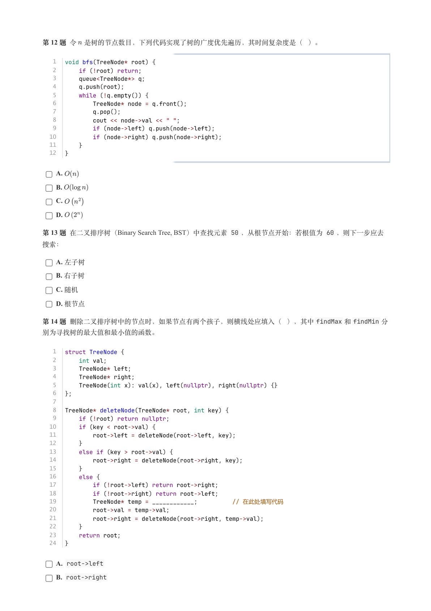

### 提取文本

```
第 12 题 令 是树的节点数目，下列代码实现了树的广度优先遍历，其时间复杂度是（ ）。


   1  void bfs(TreeNode* root) {
   2      if (!root) return;
   3      queue<TreeNode*> q;
   4      q.push(root);
   5      while (!q.empty()) {
   6          TreeNode* node = q.front();
   7          q.pop();
   8          cout << node->val << " ";
   9          if (node->left) q.push(node->left);
  10          if (node->right) q.push(node->right);
  11      }
  12  }


    A.

    B.

    C.

    D.

第 13 题 在二叉排序树（Binary Search Tree, BST）中查找元素 50 ，从根节点开始：若根值为 60 ，则下一步应去

搜索：

    A. 左子树

    B. 右子树

    C. 随机

    D. 根节点

第 14 题 删除二叉排序树中的节点时，如果节点有两个孩子，则横线处应填入（ ），其中findMax 和findMin 分

别为寻找树的最大值和最小值的函数。


   1  struct TreeNode {
   2      int val;
   3      TreeNode* left;
   4      TreeNode* right;
   5      TreeNode(int x): val(x), left(nullptr), right(nullptr) {}
   6  };
   7
   8  TreeNode* deleteNode(TreeNode* root, int key) {
   9      if (!root) return nullptr;
  10      if (key < root->val) {
  11          root->left = deleteNode(root->left, key);
  12      }
  13      else if (key > root->val) {
  14          root->right = deleteNode(root->right, key);
  15      }
  16      else {
  17          if (!root->left) return root->right;
  18          if (!root->right) return root->left;
  19          TreeNode* temp = ____________;          // 在此处填写代码
  20          root->val = temp->val;
  21          root->right = deleteNode(root->right, temp->val);
  22      }
  23      return root;
  24  }

    A. root->left

    B. root->right
```

## 第 6 页

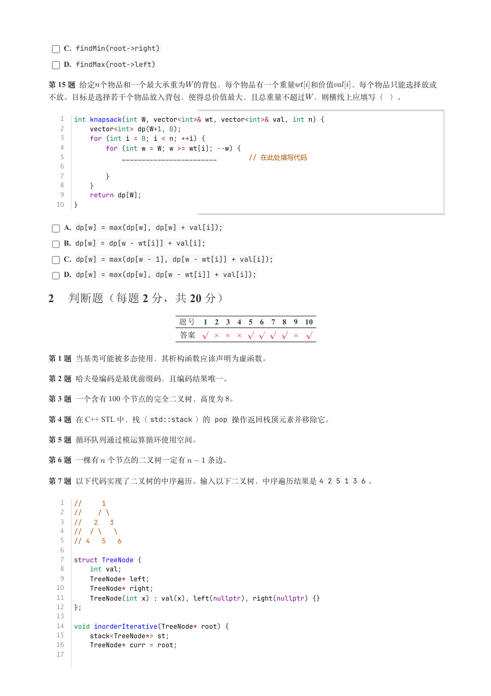

### 提取文本

```
C. findMin(root->right)

    D. findMax(root->left)

第 15 题 给定个物品和一个最大承重为 的背包，每个物品有一个重量  和价值  ，每个物品只能选择放或

不放。目标是选择若干个物品放入背包，使得总价值最大，且总重量不超过 ，则横线上应填写（ ）。


   1  int knapsack(int W, vector<int>& wt, vector<int>& val, int n) {
   2      vector<int> dp(W+1, 0);
   3      for (int i = 0; i < n; ++i) {
   4          for (int w = W; w >= wt[i]; --w) {
   5              ________________________        // 在此处填写代码
   6
   7          }
   8      }
   9      return dp[W];
  10  }

    A. dp[w] = max(dp[w], dp[w] + val[i]);

    B. dp[w] = dp[w - wt[i]] + val[i];

    C. dp[w] = max(dp[w - 1], dp[w - wt[i]] + val[i]);

    D. dp[w] = max(dp[w], dp[w - wt[i]] + val[i]);

2 判断题（每题 2 分，共 20 分）

                题号  1  2  3  4  5  6  7  8  9  10

                 答案


第 1 题 当基类可能被多态使用，其析构函数应该声明为虚函数。

第 2 题 哈夫曼编码是最优前缀码，且编码结果唯一。

第 3 题 一个含有  个节点的完全二叉树，高度为 。

第 4 题 在 C++ STL 中，栈（std::stack ）的 pop 操作返回栈顶元素并移除它。

第 5 题 循环队列通过模运算循环使用空间。

第 6 题 一棵有 个节点的二叉树一定有   条边。

第 7 题 以下代码实现了二叉树的中序遍历。输入以下二叉树，中序遍历结果是4 2 5 1 3 6 。


   1  //     1
   2  //    / \
   3  //   2   3
   4  //  / \   \
   5  // 4   5   6
   6
   7  struct TreeNode {
   8      int val;
   9      TreeNode* left;
  10      TreeNode* right;
  11      TreeNode(int x) : val(x), left(nullptr), right(nullptr) {}
  12  };
  13
  14  void inorderIterative(TreeNode* root) {
  15      stack<TreeNode*> st;
  16      TreeNode* curr = root;
  17
```

## 第 7 页

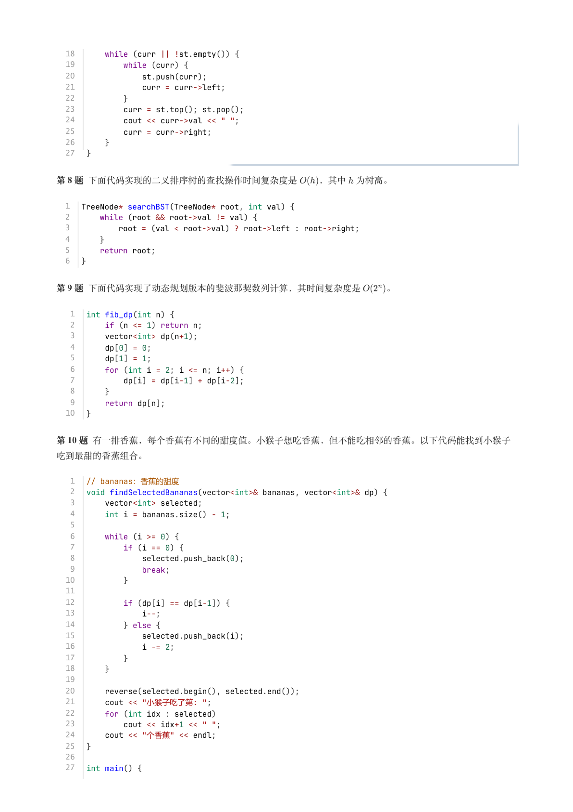

### 提取文本

```
18      while (curr || !st.empty()) {
  19          while (curr) {
  20              st.push(curr);
  21              curr = curr->left;
  22          }
  23          curr = st.top(); st.pop();
  24          cout << curr->val << " ";
  25          curr = curr->right;
  26      }
  27  }


第 8 题 下面代码实现的二叉排序树的查找操作时间复杂度是  ，其中 为树高。


  1  TreeNode* searchBST(TreeNode* root, int val) {
  2      while (root && root->val != val) {
  3          root = (val < root->val) ? root->left : root->right;
  4      }
  5      return root;
  6  }


第 9 题 下面代码实现了动态规划版本的斐波那契数列计算，其时间复杂度是   。


   1  int fib_dp(int n) {
   2      if (n <= 1) return n;
   3      vector<int> dp(n+1);
   4      dp[0] = 0;
   5      dp[1] = 1;
   6      for (int i = 2; i <= n; i++) {
   7          dp[i] = dp[i-1] + dp[i-2];
   8      }
   9      return dp[n];
  10  }


第 10 题 有一排香蕉，每个香蕉有不同的甜度值。小猴子想吃香蕉，但不能吃相邻的香蕉。以下代码能找到小猴子

吃到最甜的香蕉组合。


   1  // bananas：香蕉的甜度
   2  void findSelectedBananas(vector<int>& bananas, vector<int>& dp) {
   3      vector<int> selected;
   4      int i = bananas.size() - 1;
   5
   6      while (i >= 0) {
   7          if (i == 0) {
   8              selected.push_back(0);
   9              break;
  10          }
  11
  12          if (dp[i] == dp[i-1]) {
  13              i--;
  14          } else {
  15              selected.push_back(i);
  16              i -= 2;
  17          }
  18      }
  19
  20      reverse(selected.begin(), selected.end());
  21      cout << "小猴子吃了第: ";
  22      for (int idx : selected)
  23          cout << idx+1 << " ";
  24      cout << "个香蕉" << endl;
  25  }
  26
  27  int main() {
```

## 第 8 页

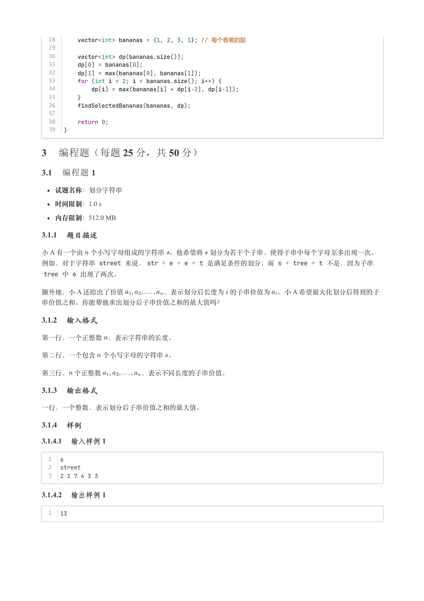

### 提取文本

```
28      vector<int> bananas = {1, 2, 3, 1}; // 每个香蕉的甜
  29
  30      vector<int> dp(bananas.size());
  31      dp[0] = bananas[0];
  32      dp[1] = max(bananas[0], bananas[1]);
  33      for (int i = 2; i < bananas.size(); i++) {
  34          dp[i] = max(bananas[i] + dp[i-2], dp[i-1]);
  35      }
  36      findSelectedBananas(bananas, dp);
  37
  38      return 0;
  39  }

3 编程题（每题 25 分，共 50 分）

3.1 编程题 1

  试题名称：划分字符串

   时间限制：1.0 s

   内存限制：512.0 MB

3.1.1 题目描述

小 A 有一个由 个小写字母组成的字符串 。他希望将 划分为若干个子串，使得子串中每个字母至多出现一次。
例如，对于字符串 street 来说，str + e + e + t 是满足条件的划分；而 s + tree + t 不是，因为子串
 tree 中 e 出现了两次。

额外地，小 A 还给出了价值      ，表示划分后长度为 的子串价值为 。小 A 希望最大化划分后得到的子

串价值之和。你能帮他求出划分后子串价值之和的最大值吗？

3.1.2 输入格式

第一行，一个正整数 ，表示字符串的长度。


第二行，一个包含 个小写字母的字符串 。


第三行， 个正整数      ，表示不同长度的子串价值。

3.1.3 输出格式

一行，一个整数，表示划分后子串价值之和的最大值。

3.1.4 样例

3.1.4.1 输入样例 1

  1  6
  2  street
  3  2 1 7 4 3 3

3.1.4.2 输出样例 1

  1  13
```

## 第 9 页

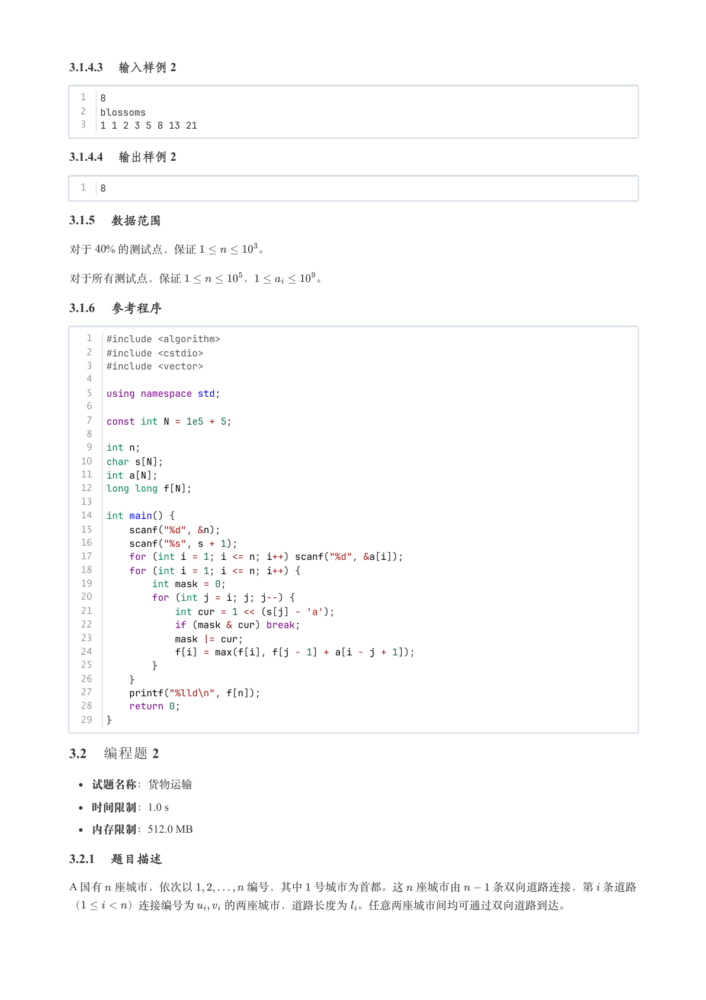

### 提取文本

```
3.1.4.3 输入样例 2

  1  8
  2  blossoms
  3  1 1 2 3 5 8 13 21

3.1.4.4 输出样例 2

  1  8

3.1.5 数据范围

对于  % 的测试点，保证      。


对于所有测试点，保证      ，      。

3.1.6 参考程序

   1  #include <algorithm>
   2  #include <cstdio>
   3  #include <vector>
   4
   5  using namespace std;
   6
   7  const int N = 1e5 + 5;
   8
   9  int n;
  10  char s[N];
  11  int a[N];
  12  long long f[N];
  13
  14  int main() {
  15      scanf("%d", &n);
  16      scanf("%s", s + 1);
  17      for (int i = 1; i <= n; i++) scanf("%d", &a[i]);
  18      for (int i = 1; i <= n; i++) {
  19          int mask = 0;
  20          for (int j = i; j; j--) {
  21              int cur = 1 << (s[j] - 'a');
  22              if (mask & cur) break;
  23              mask |= cur;
  24              f[i] = max(f[i], f[j - 1] + a[i - j + 1]);
  25          }
  26      }
  27      printf("%lld\n", f[n]);
  28      return 0;
  29  }

3.2 编程题 2


  试题名称：货物运输

   时间限制：1.0 s

   内存限制：512.0 MB

3.2.1 题目描述

A 国有 座城市，依次以     编号，其中 号城市为首都。这 座城市由   条双向道路连接，第 条道路

（    ）连接编号为   的两座城市，道路长度为 。任意两座城市间均可通过双向道路到达。
```

## 第 10 页

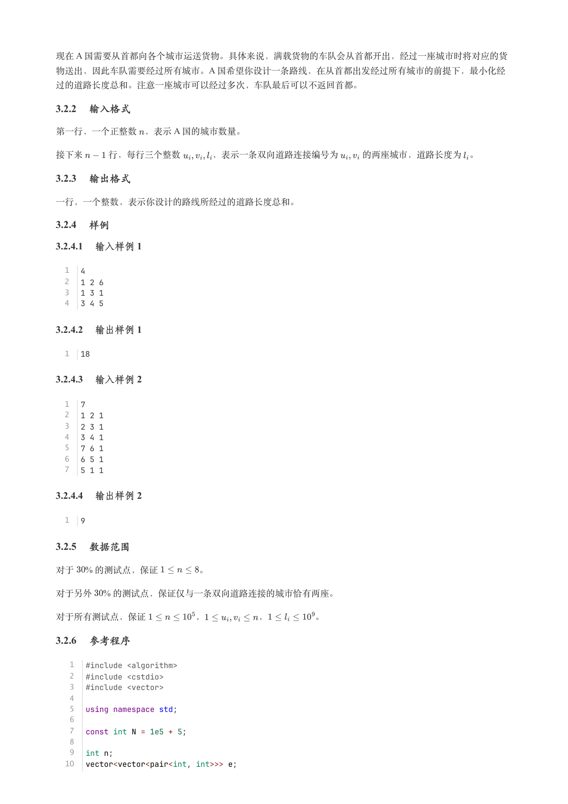

### 提取文本

```
现在 A 国需要从首都向各个城市运送货物。具体来说，满载货物的车队会从首都开出，经过一座城市时将对应的货
物送出，因此车队需要经过所有城市。A 国希望你设计一条路线，在从首都出发经过所有城市的前提下，最小化经

过的道路长度总和。注意一座城市可以经过多次，车队最后可以不返回首都。

3.2.2 输入格式

第一行，一个正整数 ，表示 A 国的城市数量。


接下来   行，每行三个整数    ，表示一条双向道路连接编号为   的两座城市，道路长度为 。

3.2.3 输出格式

一行，一个整数，表示你设计的路线所经过的道路长度总和。

3.2.4 样例

3.2.4.1 输入样例 1

  1  4
  2  1 2 6
  3  1 3 1
  4  3 4 5

3.2.4.2 输出样例 1

  1  18

3.2.4.3 输入样例 2

  1  7
  2  1 2 1
  3  2 3 1
  4  3 4 1
  5  7 6 1
  6  6 5 1
  7  5 1 1

3.2.4.4 输出样例 2

  1  9

3.2.5 数据范围

对于  % 的测试点，保证     。

对于另外  % 的测试点，保证仅与一条双向道路连接的城市恰有两座。


对于所有测试点，保证      ，      ，     。

3.2.6 参考程序

   1  #include <algorithm>
   2  #include <cstdio>
   3  #include <vector>
   4
   5  using namespace std;
   6
   7  const int N = 1e5 + 5;
   8
   9  int n;
  10  vector<vector<pair<int, int>>> e;
```

## 第 11 页

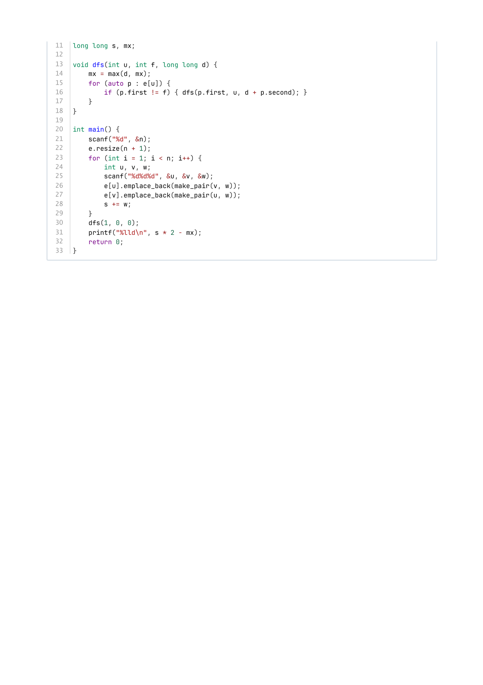

### 提取文本

```
11  long long s, mx;
12
13  void dfs(int u, int f, long long d) {
14      mx = max(d, mx);
15      for (auto p : e[u]) {
16          if (p.first != f) { dfs(p.first, u, d + p.second); }
17      }
18  }
19
20  int main() {
21      scanf("%d", &n);
22      e.resize(n + 1);
23      for (int i = 1; i < n; i++) {
24          int u, v, w;
25          scanf("%d%d%d", &u, &v, &w);
26          e[u].emplace_back(make_pair(v, w));
27          e[v].emplace_back(make_pair(u, w));
28          s += w;
29      }
30      dfs(1, 0, 0);
31      printf("%lld\n", s * 2 - mx);
32      return 0;
33  }
```
