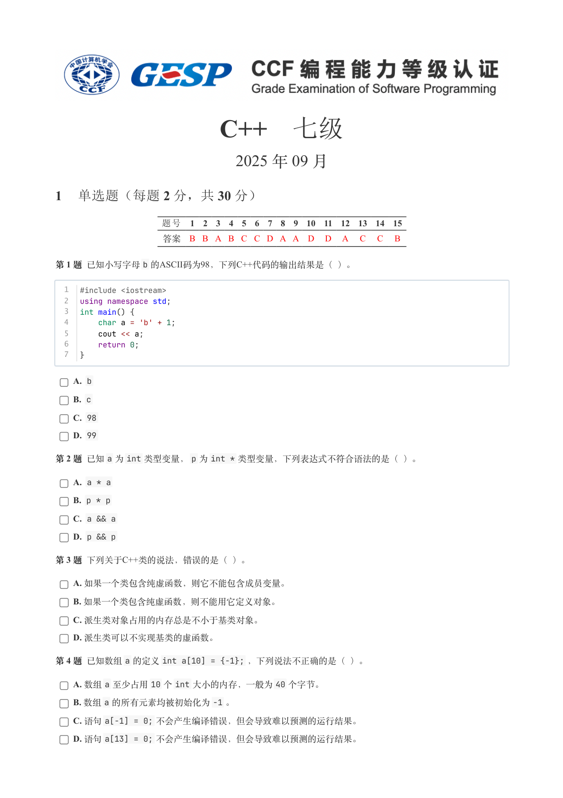
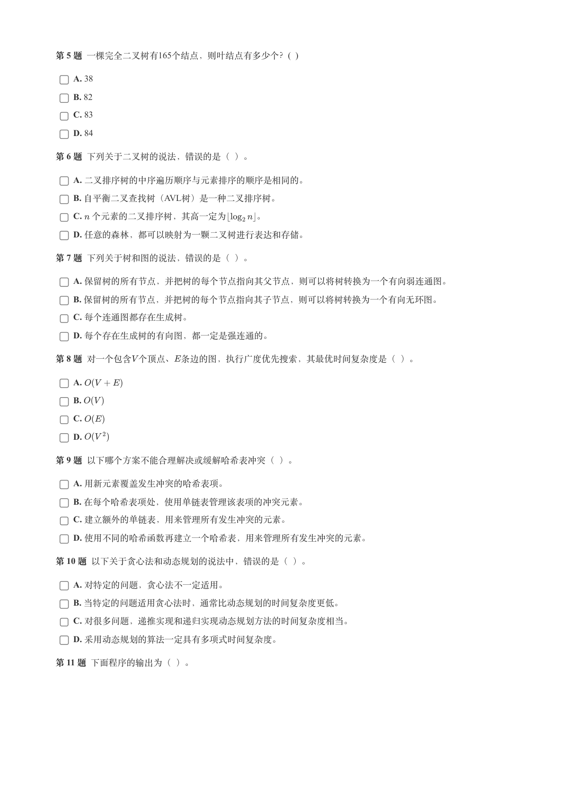
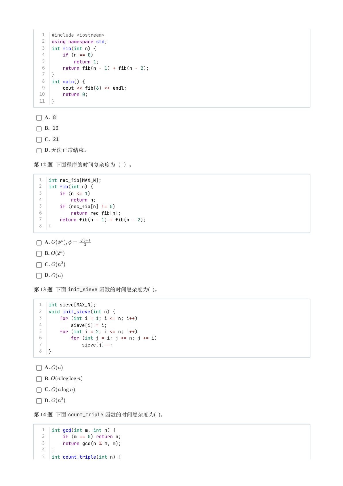
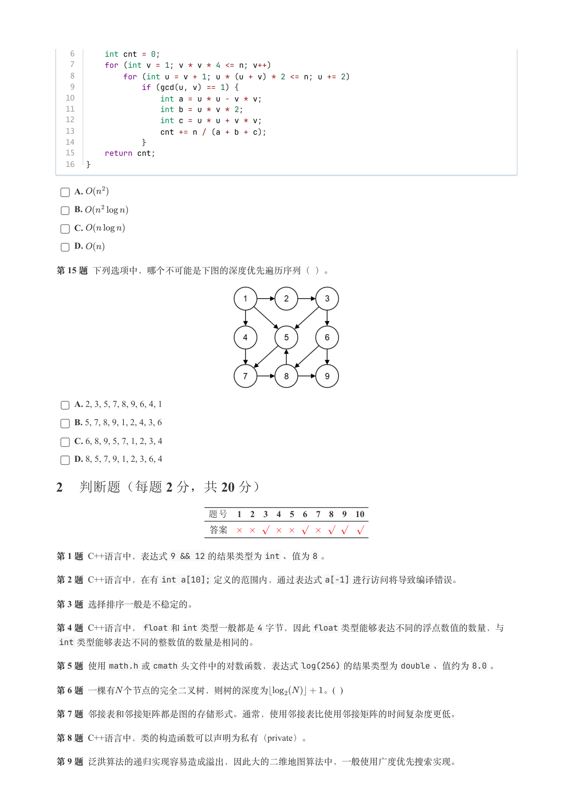
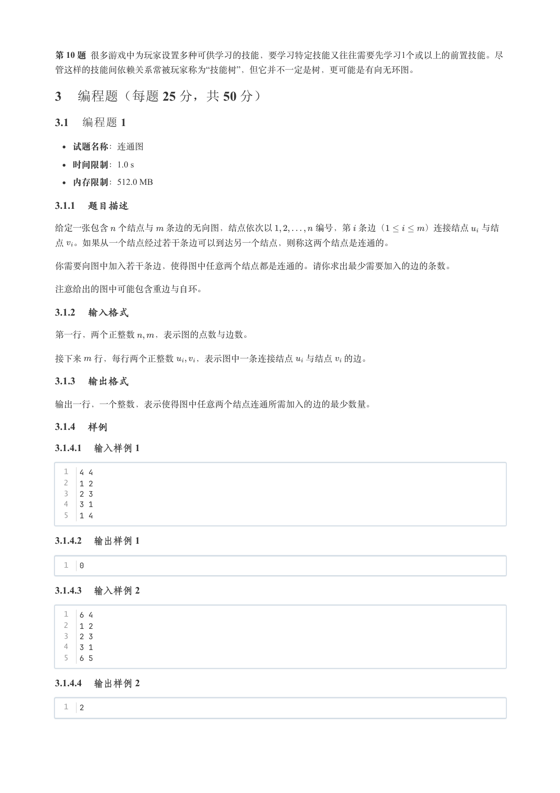
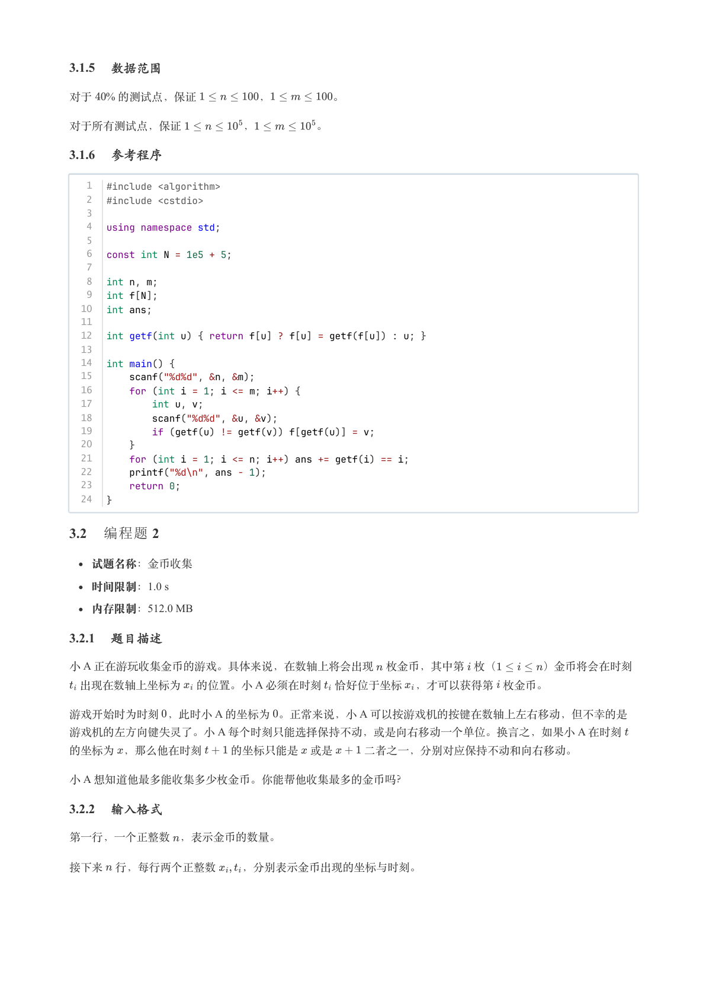
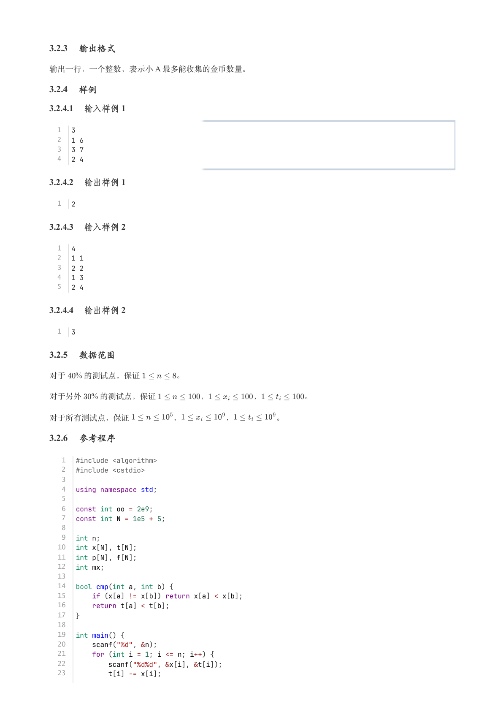
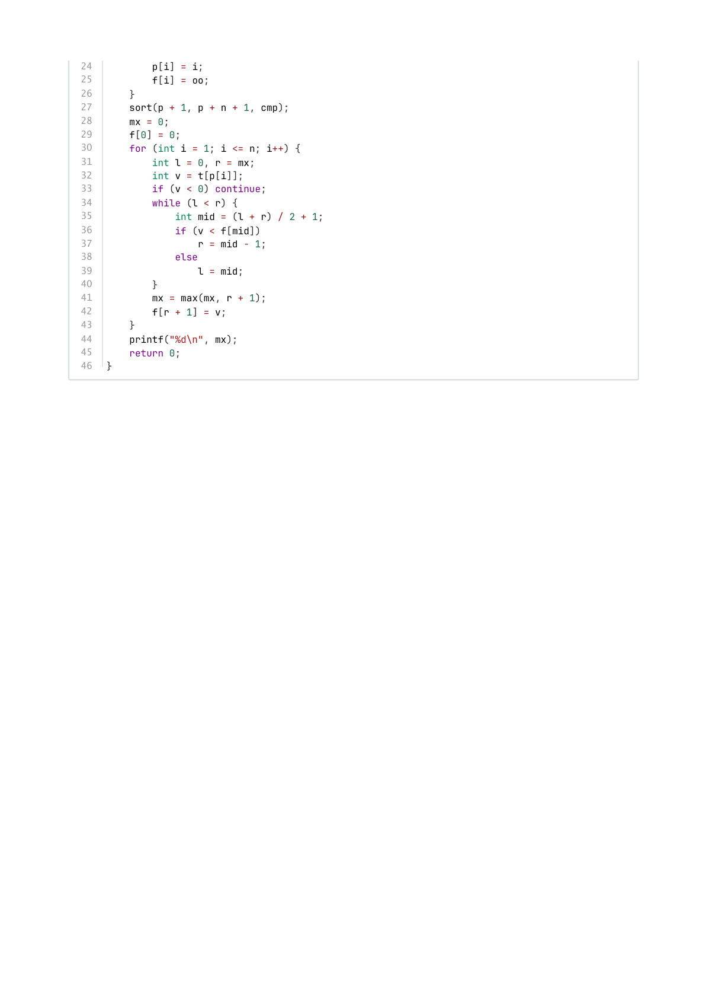

# 2025年9月-C++7级

- 原始 PDF：[`pdfs/2025年9月-C++7级.pdf`](../pdfs/2025年9月-C++7级.pdf)
- 页数：8
- 转换脚本：[`scripts/convert_pdfs_to_markdown.py`](../scripts/convert_pdfs_to_markdown.py)

> 为尽量避免信息丢失，每页均附带页面图片；文本提取结果保留原有顺序与换行特征，个别公式、图形、特殊排版请以页面图片为准。

## 第 1 页



### 提取文本

```
C++　七级

                      2025 年 09 月

1 单选题（每题 2 分，共 30 分）


           题号  1  2  3  4  5  6  7  8  9  10  11  12  13  14  15
            答案 B B A B C C D A A D  D  A  C  C  B


第 1 题 已知小写字母b 的ASCII码为98，下列C++代码的输出结果是（ ）。


  1  #include <iostream>
  2  using namespace std;
  3  int main() {
  4      char a = 'b' + 1;
  5      cout << a;
  6      return 0;
  7  }

    A. b

    B. c

    C. 98

    D. 99

第 2 题 已知a 为int 类型变量，p 为int * 类型变量，下列表达式不符合语法的是（ ）。

    A. a * a

    B. p * p

    C. a && a

    D. p && p

第 3 题 下列关于C++类的说法，错误的是（ ）。

    A. 如果一个类包含纯虚函数，则它不能包含成员变量。

    B. 如果一个类包含纯虚函数，则不能用它定义对象。

    C. 派生类对象占用的内存总是不小于基类对象。

    D. 派生类可以不实现基类的虚函数。​

第 4 题 已知数组a 的定义int a[10] = {-1}; ，下列说法不正确的是（ ）。

    A. 数组a 至少占用10 个int 大小的内存，一般为40 个字节。

    B. 数组a 的所有元素均被初始化为-1 。

    C. 语句a[-1] = 0; 不会产生编译错误，但会导致难以预测的运行结果。

    D. 语句a[13] = 0; 不会产生编译错误，但会导致难以预测的运行结果。
```

## 第 2 页



### 提取文本

```
第 5 题 一棵完全二叉树有165个结点，则叶结点有多少个？(  )

    A. 38

    B. 82

    C. 83

    D. 84

第 6 题 下列关于二叉树的说法，错误的是（ ）。

    A. 二叉排序树的中序遍历顺序与元素排序的顺序是相同的。

    B. 自平衡二叉查找树（AVL树）是一种二叉排序树。

    C. 个元素的二叉排序树，其高一定为   。

    D. 任意的森林，都可以映射为一颗二叉树进行表达和存储。

第 7 题 下列关于树和图的说法，错误的是（ ）。

    A. 保留树的所有节点，并把树的每个节点指向其父节点，则可以将树转换为一个有向弱连通图。

    B. 保留树的所有节点，并把树的每个节点指向其子节点，则可以将树转换为一个有向无环图。

    C. 每个连通图都存在生成树。

    D. 每个存在生成树的有向图，都一定是强连通的。

第 8 题 对一个包含个顶点、条边的图，执行广度优先搜索，其最优时间复杂度是（ ）。

    A.

    B.

    C.

    D.

第 9 题 以下哪个方案不能合理解决或缓解哈希表冲突（ ）。

    A. 用新元素覆盖发生冲突的哈希表项。

    B. 在每个哈希表项处，使用单链表管理该表项的冲突元素。

    C. 建立额外的单链表，用来管理所有发生冲突的元素。

    D. 使用不同的哈希函数再建立一个哈希表，用来管理所有发生冲突的元素。

第 10 题 以下关于贪心法和动态规划的说法中，错误的是（ ）。

    A. 对特定的问题，贪心法不一定适用。

    B. 当特定的问题适用贪心法时，通常比动态规划的时间复杂度更低。

    C. 对很多问题，递推实现和递归实现动态规划方法的时间复杂度相当。

    D. 采用动态规划的算法一定具有多项式时间复杂度。

第 11 题 下面程序的输出为（ ）。
```

## 第 3 页



### 提取文本

```
1  #include <iostream>
   2  using namespace std;
   3  int fib(int n) {
   4      if (n == 0)
   5          return 1;
   6      return fib(n - 1) + fib(n - 2);
   7  }
   8  int main() {
   9      cout << fib(6) << endl;
  10      return 0;
  11  }

    A. 8

    B. 13

    C. 21

    D. 无法正常结束。

第 12 题 下面程序的时间复杂度为（ ）。


  1  int rec_fib[MAX_N];
  2  int fib(int n) {
  3      if (n <= 1)
  4          return n;
  5      if (rec_fib[n] != 0)
  6          return rec_fib[n];
  7      return fib(n - 1) + fib(n - 2);
  8  }


    A.

    B.

    C.

    D.

第 13 题 下面init_sieve 函数的时间复杂度为( )。


  1  int sieve[MAX_N];
  2  void init_sieve(int n) {
  3      for (int i = 1; i <= n; i++)
  4          sieve[i] = i;
  5      for (int i = 2; i <= n; i++)
  6          for (int j = i; j <= n; j += i)
  7              sieve[j]--;
  8  }


    A.

    B.

    C.

    D.

第 14 题 下面count_triple 函数的时间复杂度为( )。


   1  int gcd(int m, int n) {
   2      if (m == 0) return n;
   3      return gcd(n % m, m);
   4  }
   5  int count_triple(int n) {
```

## 第 4 页



### 提取文本

```
6      int cnt = 0;
   7      for (int v = 1; v * v * 4 <= n; v++)
   8          for (int u = v + 1; u * (u + v) * 2 <= n; u += 2)
   9              if (gcd(u, v) == 1) {
  10                  int a = u * u - v * v;
  11                  int b = u * v * 2;
  12                  int c = u * u + v * v;
  13                  cnt += n / (a + b + c);
  14              }
  15      return cnt;
  16  }


    A.

    B.

    C.

    D.

第 15 题 下列选项中，哪个不可能是下图的深度优先遍历序列（ ）。


    A. 2, 3, 5, 7, 8, 9, 6, 4, 1

    B. 5, 7, 8, 9, 1, 2, 4, 3, 6

    C. 6, 8, 9, 5, 7, 1, 2, 3, 4

    D. 8, 5, 7, 9, 1, 2, 3, 6, 4

2 判断题（每题 2 分，共 20 分）

                题号  1  2  3  4  5  6  7  8  9  10

                 答案


第 1 题 C++语言中，表达式9 && 12 的结果类型为int 、值为8 。

第 2 题 C++语言中，在有int a[10]; 定义的范围内，通过表达式a[-1] 进行访问将导致编译错误。

第 3 题 选择排序一般是不稳定的。

第 4 题 C++语言中，float 和int 类型一般都是4 字节，因此float 类型能够表达不同的浮点数值的数量，与
 int 类型能够表达不同的整数值的数量是相同的。

第 5 题 使用math.h 或cmath 头文件中的对数函数，表达式log(256) 的结果类型为double 、值约为8.0 。

第 6 题 一棵有 个节点的完全二叉树，则树的深度为         。(  )

第 7 题 邻接表和邻接矩阵都是图的存储形式。通常，使用邻接表比使用邻接矩阵的时间复杂度更低。

第 8 题 C++语言中，类的构造函数可以声明为私有（private）。

第 9 题 泛洪算法的递归实现容易造成溢出，因此大的二维地图算法中，一般使用广度优先搜索实现。
```

## 第 5 页



### 提取文本

```
第 10 题 很多游戏中为玩家设置多种可供学习的技能，要学习特定技能又往往需要先学习1个或以上的前置技能。尽
管这样的技能间依赖关系常被玩家称为“技能树”，但它并不一定是树，更可能是有向无环图。

3 编程题（每题 25 分，共 50 分）

3.1 编程题 1


  试题名称：连通图

   时间限制：1.0 s

   内存限制：512.0 MB

3.1.1 题目描述

给定一张包含 个结点与 条边的无向图，结点依次以     编号，第 条边（    ）连接结点 与结

点 。如果从一个结点经过若干条边可以到达另一个结点，则称这两个结点是连通的。


你需要向图中加入若干条边，使得图中任意两个结点都是连通的。请你求出最少需要加入的边的条数。


注意给出的图中可能包含重边与自环。

3.1.2 输入格式

第一行，两个正整数  ，表示图的点数与边数。


接下来 行，每行两个正整数  ，表示图中一条连接结点 与结点 的边。

3.1.3 输出格式

输出一行，一个整数，表示使得图中任意两个结点连通所需加入的边的最少数量。

3.1.4 样例

3.1.4.1 输入样例 1

  1  4 4
  2  1 2
  3  2 3
  4  3 1
  5  1 4

3.1.4.2 输出样例 1

  1  0

3.1.4.3 输入样例 2

  1  6 4
  2  1 2
  3  2 3
  4  3 1
  5  6 5

3.1.4.4 输出样例 2

  1  2
```

## 第 6 页



### 提取文本

```
3.1.5 数据范围

对于  % 的测试点，保证      ，      。


对于所有测试点，保证      ，      。

3.1.6 参考程序

   1  #include <algorithm>
   2  #include <cstdio>
   3
   4  using namespace std;
   5
   6  const int N = 1e5 + 5;
   7
   8  int n, m;
   9  int f[N];
  10  int ans;
  11
  12  int getf(int u) { return f[u] ? f[u] = getf(f[u]) : u; }
  13
  14  int main() {
  15      scanf("%d%d", &n, &m);
  16      for (int i = 1; i <= m; i++) {
  17          int u, v;
  18          scanf("%d%d", &u, &v);
  19          if (getf(u) != getf(v)) f[getf(u)] = v;
  20      }
  21      for (int i = 1; i <= n; i++) ans += getf(i) == i;
  22      printf("%d\n", ans - 1);
  23      return 0;
  24  }

3.2 编程题 2


  试题名称：金币收集

   时间限制：1.0 s

   内存限制：512.0 MB

3.2.1 题目描述

小 A 正在游玩收集金币的游戏。具体来说，在数轴上将会出现 枚金币，其中第 枚（    ）金币将会在时刻
 出现在数轴上坐标为 的位置。小 A 必须在时刻 恰好位于坐标 ，才可以获得第 枚金币。

游戏开始时为时刻 ，此时小 A 的坐标为 。正常来说，小 A 可以按游戏机的按键在数轴上左右移动，但不幸的是
游戏机的左方向键失灵了。小 A 每个时刻只能选择保持不动，或是向右移动一个单位。换言之，如果小 A 在时刻

的坐标为 ，那么他在时刻   的坐标只能是 或是   二者之一，分别对应保持不动和向右移动。

小 A 想知道他最多能收集多少枚金币。你能帮他收集最多的金币吗？

3.2.2 输入格式

第一行，一个正整数 ，表示金币的数量。


接下来 行，每行两个正整数  ，分别表示金币出现的坐标与时刻。
```

## 第 7 页



### 提取文本

```
3.2.3 输出格式

输出一行，一个整数，表示小 A 最多能收集的金币数量。

3.2.4 样例

3.2.4.1 输入样例 1

  1  3
  2  1 6
  3  3 7
  4  2 4

3.2.4.2 输出样例 1

  1  2

3.2.4.3 输入样例 2

  1  4
  2  1 1
  3  2 2
  4  1 3
  5  2 4

3.2.4.4 输出样例 2

  1  3

3.2.5 数据范围

对于  % 的测试点，保证     。

对于另外  % 的测试点，保证      ，      ，     。


对于所有测试点，保证      ，      ，     。

3.2.6 参考程序

   1  #include <algorithm>
   2  #include <cstdio>
   3
   4  using namespace std;
   5
   6  const int oo = 2e9;
   7  const int N = 1e5 + 5;
   8
   9  int n;
  10  int x[N], t[N];
  11  int p[N], f[N];
  12  int mx;
  13
  14  bool cmp(int a, int b) {
  15      if (x[a] != x[b]) return x[a] < x[b];
  16      return t[a] < t[b];
  17  }
  18
  19  int main() {
  20      scanf("%d", &n);
  21      for (int i = 1; i <= n; i++) {
  22          scanf("%d%d", &x[i], &t[i]);
  23          t[i] -= x[i];
```

## 第 8 页



### 提取文本

```
24          p[i] = i;
25          f[i] = oo;
26      }
27      sort(p + 1, p + n + 1, cmp);
28      mx = 0;
29      f[0] = 0;
30      for (int i = 1; i <= n; i++) {
31          int l = 0, r = mx;
32          int v = t[p[i]];
33          if (v < 0) continue;
34          while (l < r) {
35              int mid = (l + r) / 2 + 1;
36              if (v < f[mid])
37                  r = mid - 1;
38              else
39                  l = mid;
40          }
41          mx = max(mx, r + 1);
42          f[r + 1] = v;
43      }
44      printf("%d\n", mx);
45      return 0;
46  }
```
