# 2025年9月-C++8级

- 原始 PDF：[`pdfs/2025年9月-C++8级.pdf`](../pdfs/2025年9月-C++8级.pdf)
- 页数：11
- 转换脚本：[`scripts/convert_pdfs_to_markdown.py`](../scripts/convert_pdfs_to_markdown.py)

> 为尽量避免信息丢失，每页均附带页面图片；文本提取结果保留原有顺序与换行特征，个别公式、图形、特殊排版请以页面图片为准。

## 第 1 页

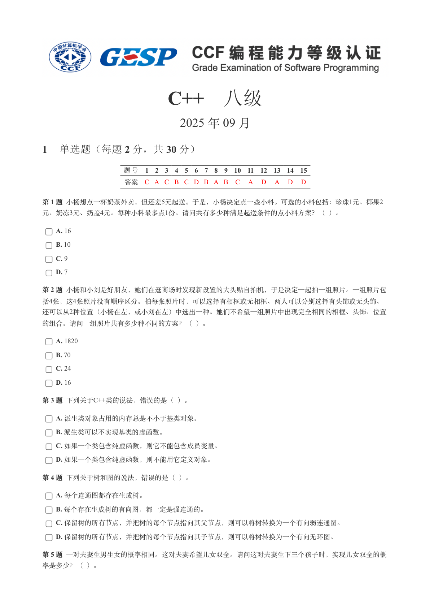

### 提取文本

```
C++　八级

                      2025 年 09 月

1 单选题（每题 2 分，共 30 分）


           题号  1  2  3  4  5  6  7  8  9  10  11  12  13  14  15
            答案 C A C B C D B A B  C  A  D  A  D  D


第 1 题 小杨想点一杯奶茶外卖，但还差5元起送。于是，小杨决定点一些小料。可选的小料包括：珍珠1元、椰果2
元、奶冻3元、奶盖4元。每种小料最多点1份。请问共有多少种满足起送条件的点小料方案？（ ）。

    A. 16

    B. 10

    C. 9

    D. 7

第 2 题 小杨和小刘是好朋友，她们在逛商场时发现新设置的大头贴自拍机，于是决定一起拍一组照片。一组照片包
括4张，这4张照片没有顺序区分。拍每张照片时，可以选择有相框或无相框、两人可以分别选择有头饰或无头饰、
还可以从2种位置（小杨在左，或小刘在左）中选出一种。她们不希望一组照片中出现完全相同的相框、头饰、位置

的组合。请问一组照片共有多少种不同的方案？（ ）。

    A. 1820

    B. 70

    C. 24

    D. 16

第 3 题 下列关于C++类的说法，错误的是（ ）。

    A. 派生类对象占用的内存总是不小于基类对象。

    B. 派生类可以不实现基类的虚函数。

    C. 如果一个类包含纯虚函数，则它不能包含成员变量。

    D. 如果一个类包含纯虚函数，则不能用它定义对象。

第 4 题 下列关于树和图的说法，错误的是（ ）。

    A. 每个连通图都存在生成树。

    B. 每个存在生成树的有向图，都一定是强连通的。

    C. 保留树的所有节点，并把树的每个节点指向其父节点，则可以将树转换为一个有向弱连通图。

    D. 保留树的所有节点，并把树的每个节点指向其子节点，则可以将树转换为一个有向无环图。

第 5 题 一对夫妻生男生女的概率相同。这对夫妻希望儿女双全。请问这对夫妻生下三个孩子时，实现儿女双全的概

率是多少？（ ）。
```

## 第 2 页

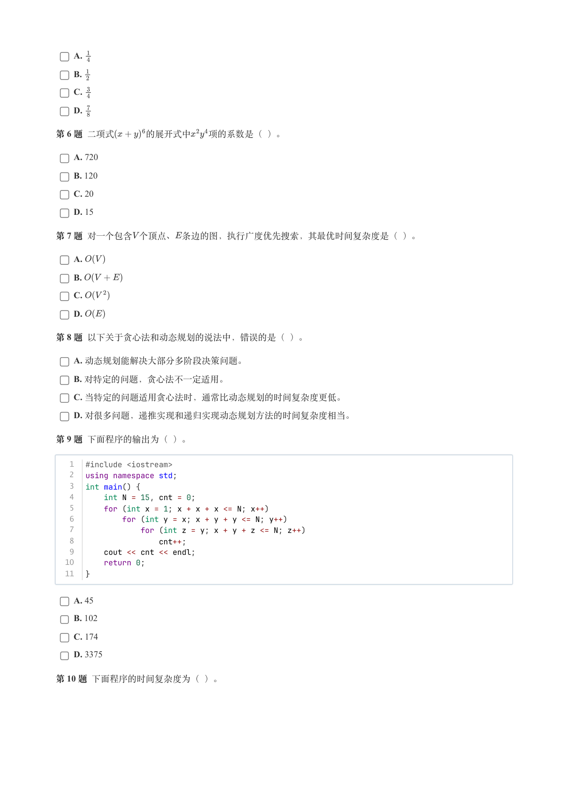

### 提取文本

```
A.

    B.

    C.

    D.

第 6 题 二项式    的展开式中  项的系数是（ ）。

    A. 720

    B. 120

    C. 20

    D. 15

第 7 题 对一个包含个顶点、条边的图，执行广度优先搜索，其最优时间复杂度是（ ）。

    A.

    B.

    C.

    D.

第 8 题 以下关于贪心法和动态规划的说法中，错误的是（ ）。

    A. 动态规划能解决大部分多阶段决策问题。

    B. 对特定的问题，贪心法不一定适用。

    C. 当特定的问题适用贪心法时，通常比动态规划的时间复杂度更低。

    D. 对很多问题，递推实现和递归实现动态规划方法的时间复杂度相当。

第 9 题 下面程序的输出为（ ）。


   1  #include <iostream>
   2  using namespace std;
   3  int main() {
   4      int N = 15, cnt = 0;
   5      for (int x = 1; x + x + x <= N; x++)
   6          for (int y = x; x + y + y <= N; y++)
   7              for (int z = y; x + y + z <= N; z++)
   8                  cnt++;
   9      cout << cnt << endl;
  10      return 0;
  11  }


    A. 45

    B. 102

    C. 174

    D. 3375

第 10 题 下面程序的时间复杂度为（ ）。
```

## 第 3 页

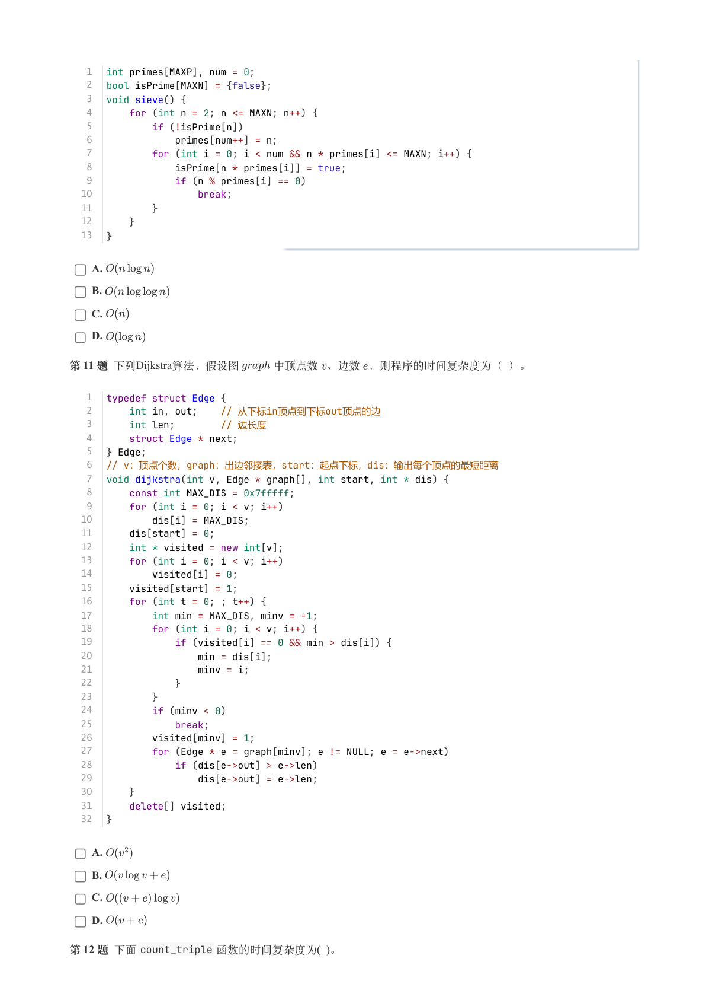

### 提取文本

```
1  int primes[MAXP], num = 0;
   2  bool isPrime[MAXN] = {false};
   3  void sieve() {
   4      for (int n = 2; n <= MAXN; n++) {
   5          if (!isPrime[n])
   6              primes[num++] = n;
   7          for (int i = 0; i < num && n * primes[i] <= MAXN; i++) {
   8              isPrime[n * primes[i]] = true;
   9              if (n % primes[i] == 0)
  10                  break;
  11          }
  12      }
  13  }


    A.

    B.

    C.

    D.

第 11 题 下列Dijkstra算法，假设图   中顶点数 、边数 ，则程序的时间复杂度为（ ）。


   1  typedef struct Edge {
   2      int in, out;    // 从下标in顶点到下标out顶点的边
   3      int len;        // 边长度
   4      struct Edge * next;
   5  } Edge;
   6  // v：顶点个数，graph：出边邻接表，start：起点下标，dis：输出每个顶点的最短距离
   7  void dijkstra(int v, Edge * graph[], int start, int * dis) {
   8      const int MAX_DIS = 0x7fffff;
   9      for (int i = 0; i < v; i++)
  10          dis[i] = MAX_DIS;
  11      dis[start] = 0;
  12      int * visited = new int[v];
  13      for (int i = 0; i < v; i++)
  14          visited[i] = 0;
  15      visited[start] = 1;
  16      for (int t = 0; ; t++) {
  17          int min = MAX_DIS, minv = -1;
  18          for (int i = 0; i < v; i++) {
  19              if (visited[i] == 0 && min > dis[i]) {
  20                  min = dis[i];
  21                  minv = i;
  22              }
  23          }
  24          if (minv < 0)
  25              break;
  26          visited[minv] = 1;
  27          for (Edge * e = graph[minv]; e != NULL; e = e->next)
  28              if (dis[e->out] > e->len)
  29                  dis[e->out] = e->len;
  30      }
  31      delete[] visited;
  32  }


    A.

    B.

    C.

    D.

第 12 题 下面count_triple 函数的时间复杂度为( )。
```

## 第 4 页

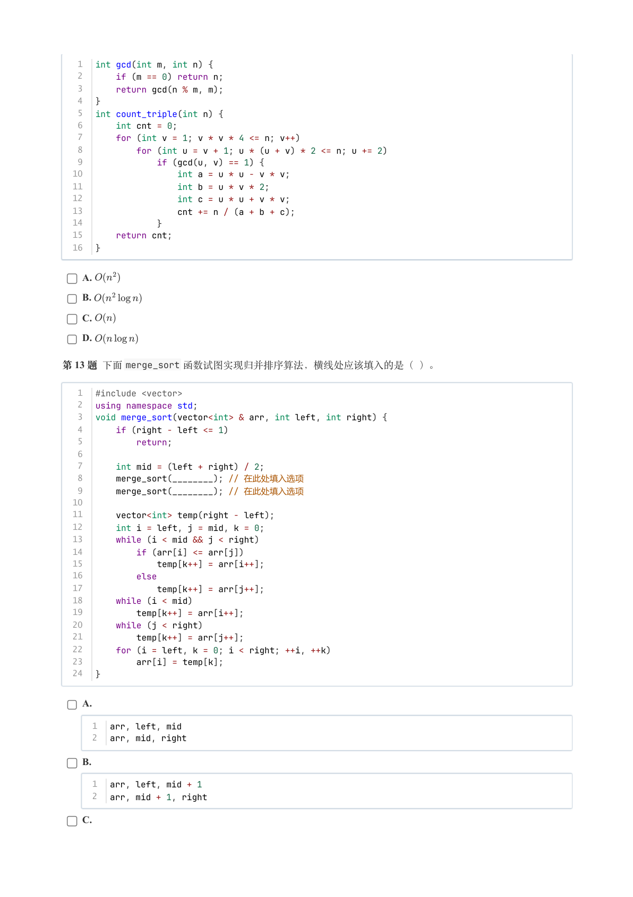

### 提取文本

```
1  int gcd(int m, int n) {
   2      if (m == 0) return n;
   3      return gcd(n % m, m);
   4  }
   5  int count_triple(int n) {
   6      int cnt = 0;
   7      for (int v = 1; v * v * 4 <= n; v++)
   8          for (int u = v + 1; u * (u + v) * 2 <= n; u += 2)
   9              if (gcd(u, v) == 1) {
  10                  int a = u * u - v * v;
  11                  int b = u * v * 2;
  12                  int c = u * u + v * v;
  13                  cnt += n / (a + b + c);
  14              }
  15      return cnt;
  16  }


    A.

    B.

    C.

    D.

第 13 题 下面merge_sort 函数试图实现归并排序算法，横线处应该填入的是（ ）。


   1  #include <vector>
   2  using namespace std;
   3  void merge_sort(vector<int> & arr, int left, int right) {
   4      if (right - left <= 1)
   5          return;
   6
   7      int mid = (left + right) / 2;
   8      merge_sort(________); // 在此处填入选项
   9      merge_sort(________); // 在此处填入选项
  10
  11      vector<int> temp(right - left);
  12      int i = left, j = mid, k = 0;
  13      while (i < mid && j < right)
  14          if (arr[i] <= arr[j])
  15              temp[k++] = arr[i++];
  16          else
  17              temp[k++] = arr[j++];
  18      while (i < mid)
  19          temp[k++] = arr[i++];
  20      while (j < right)
  21          temp[k++] = arr[j++];
  22      for (i = left, k = 0; i < right; ++i, ++k)
  23          arr[i] = temp[k];
  24  }


    A.

      1  arr, left, mid
      2  arr, mid, right

    B.

      1  arr, left, mid + 1
      2  arr, mid + 1, right

    C.
```

## 第 5 页

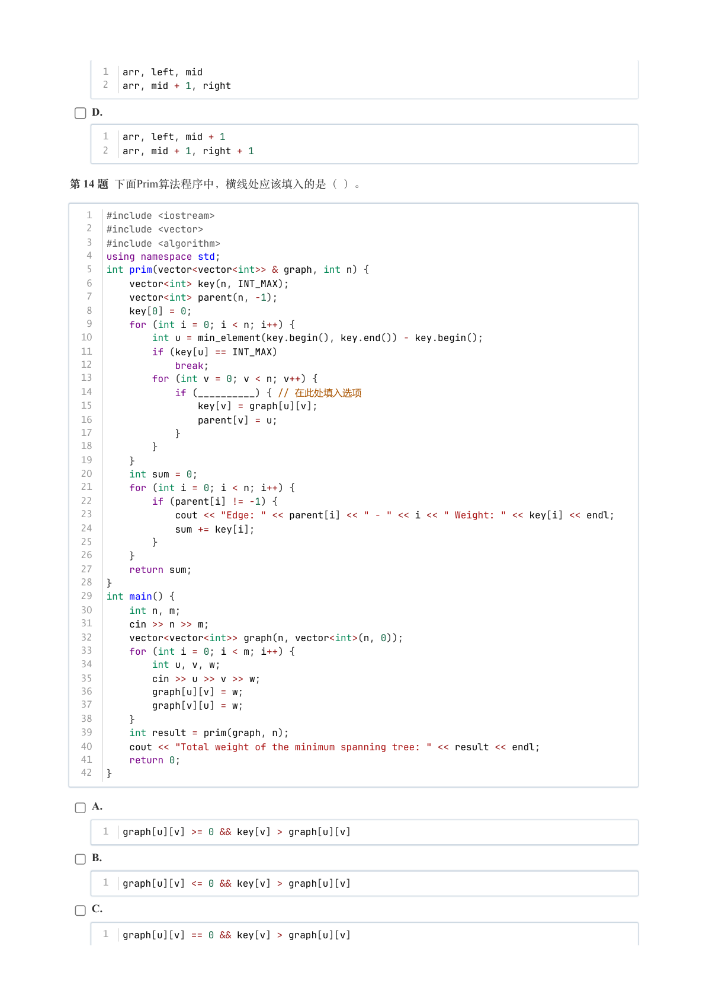

### 提取文本

```
1  arr, left, mid
      2  arr, mid + 1, right

    D.

      1  arr, left, mid + 1
      2  arr, mid + 1, right + 1


第 14 题 下面Prim算法程序中，横线处应该填入的是（ ）。


   1  #include <iostream>
   2  #include <vector>
   3  #include <algorithm>
   4  using namespace std;
   5  int prim(vector<vector<int>> & graph, int n) {
   6      vector<int> key(n, INT_MAX);
   7      vector<int> parent(n, -1);
   8      key[0] = 0;
   9      for (int i = 0; i < n; i++) {
  10          int u = min_element(key.begin(), key.end()) - key.begin();
  11          if (key[u] == INT_MAX)
  12              break;
  13          for (int v = 0; v < n; v++) {
  14              if (__________) { // 在此处填入选项
  15                  key[v] = graph[u][v];
  16                  parent[v] = u;
  17              }
  18          }
  19      }
  20      int sum = 0;
  21      for (int i = 0; i < n; i++) {
  22          if (parent[i] != -1) {
  23              cout << "Edge: " << parent[i] << " - " << i << " Weight: " << key[i] << endl;
  24              sum += key[i];
  25          }
  26      }
  27      return sum;
  28  }
  29  int main() {
  30      int n, m;
  31      cin >> n >> m;
  32      vector<vector<int>> graph(n, vector<int>(n, 0));
  33      for (int i = 0; i < m; i++) {
  34          int u, v, w;
  35          cin >> u >> v >> w;
  36          graph[u][v] = w;
  37          graph[v][u] = w;
  38      }
  39      int result = prim(graph, n);
  40      cout << "Total weight of the minimum spanning tree: " << result << endl;
  41      return 0;
  42  }


    A.

      1  graph[u][v] >= 0 && key[v] > graph[u][v]

    B.

      1  graph[u][v] <= 0 && key[v] > graph[u][v]

    C.

      1  graph[u][v] == 0 && key[v] > graph[u][v]
```

## 第 6 页

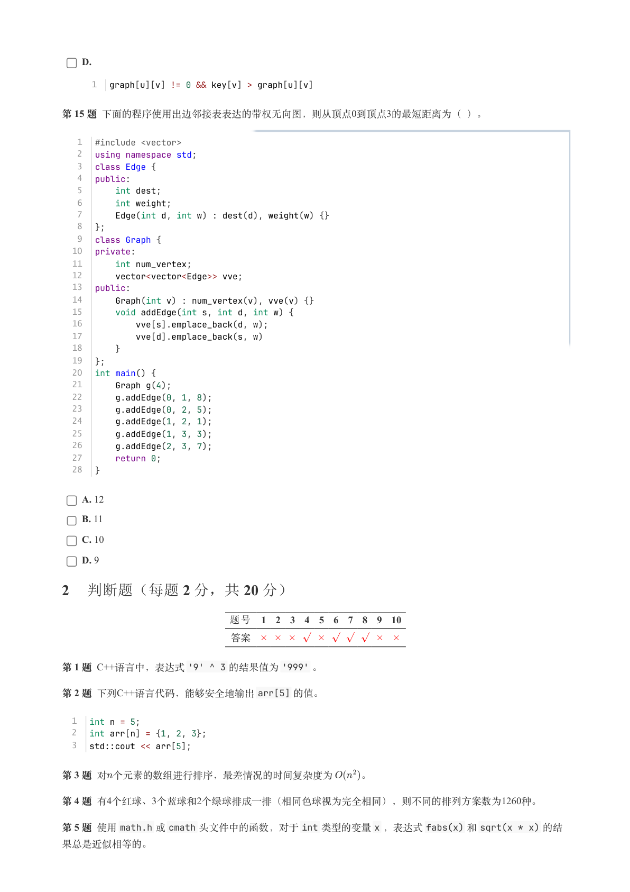

### 提取文本

```
D.

      1  graph[u][v] != 0 && key[v] > graph[u][v]


第 15 题 下面的程序使用出边邻接表表达的带权无向图，则从顶点0到顶点3的最短距离为（ ）。


   1  #include <vector>
   2  using namespace std;
   3  class Edge {
   4  public:
   5      int dest;
   6      int weight;
   7      Edge(int d, int w) : dest(d), weight(w) {}
   8  };
   9  class Graph {
  10  private:
  11      int num_vertex;
  12      vector<vector<Edge>> vve;
  13  public:
  14      Graph(int v) : num_vertex(v), vve(v) {}
  15      void addEdge(int s, int d, int w) {
  16          vve[s].emplace_back(d, w);
  17          vve[d].emplace_back(s, w)
  18      }
  19  };
  20  int main() {
  21      Graph g(4);
  22      g.addEdge(0, 1, 8);
  23      g.addEdge(0, 2, 5);
  24      g.addEdge(1, 2, 1);
  25      g.addEdge(1, 3, 3);
  26      g.addEdge(2, 3, 7);
  27      return 0;
  28  }


    A. 12

    B. 11

    C. 10

    D. 9

2 判断题（每题 2 分，共 20 分）

                题号  1  2  3  4  5  6  7  8  9  10

                 答案


第 1 题 C++语言中，表达式'9' ^ 3 的结果值为'999' 。

第 2 题 下列C++语言代码，能够安全地输出arr[5] 的值。


  1  int n = 5;
  2  int arr[n] = {1, 2, 3};
  3  std::cout << arr[5];


第 3 题 对个元素的数组进行排序，最差情况的时间复杂度为   。

第 4 题 有4个红球、3个蓝球和2个绿球排成一排（相同色球视为完全相同），则不同的排列方案数为1260种​。

第 5 题 使用math.h 或cmath 头文件中的函数，对于int 类型的变量x ，表达式fabs(x) 和sqrt(x * x) 的结

果总是近似相等的。
```

## 第 7 页

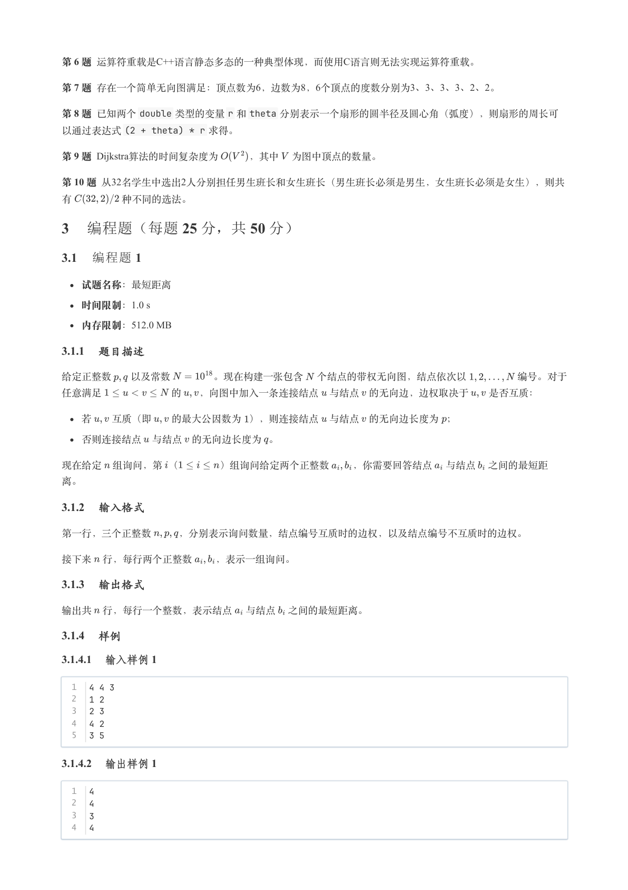

### 提取文本

```
第 6 题 运算符重载是C++语言静态多态的一种典型体现，而使用C语言则无法实现运算符重载。

第 7 题 存在一个简单无向图满足：顶点数为6，边数为8，6个顶点的度数分别为3、3、3、3、2、2。

第 8 题 已知两个double 类型的变量r 和theta 分别表示一个扇形的圆半径及圆心角（弧度），则扇形的周长可
以通过表达式(2 + theta) * r 求得。

第 9 题 Dijkstra算法的时间复杂度为    ​，其中 为图中顶点的数量。

第 10 题 从32名学生中选出2人分别担任男生班长和女生班长（男生班长必须是男生，女生班长必须是女生），则共

有     种不同的选法。

3 编程题（每题 25 分，共 50 分）

3.1 编程题 1


  试题名称：最短距离

   时间限制：1.0 s

   内存限制：512.0 MB

3.1.1 题目描述

给定正整数  以及常数    。现在构建一张包含 个结点的带权无向图，结点依次以     编号。对于

任意满足       的  ，向图中加入一条连接结点 与结点 的无向边，边权取决于  是否互质：


  若  互质（即  的最大公因数为 ），则连接结点 与结点 的无向边长度为 ；

  否则连接结点 与结点 的无向边长度为 。


现在给定 组询问，第 （    ）组询问给定两个正整数  ，你需要回答结点 与结点 之间的最短距

离。

3.1.2 输入格式

第一行，三个正整数   ，分别表示询问数量，结点编号互质时的边权，以及结点编号不互质时的边权。


接下来 行，每行两个正整数  ，表示一组询问。

3.1.3 输出格式

输出共 行，每行一个整数，表示结点 与结点 之间的最短距离。

3.1.4 样例

3.1.4.1 输入样例 1

  1  4 4 3
  2  1 2
  3  2 3
  4  4 2
  5  3 5

3.1.4.2 输出样例 1

  1  4
  2  4
  3  3
  4  4
```

## 第 8 页

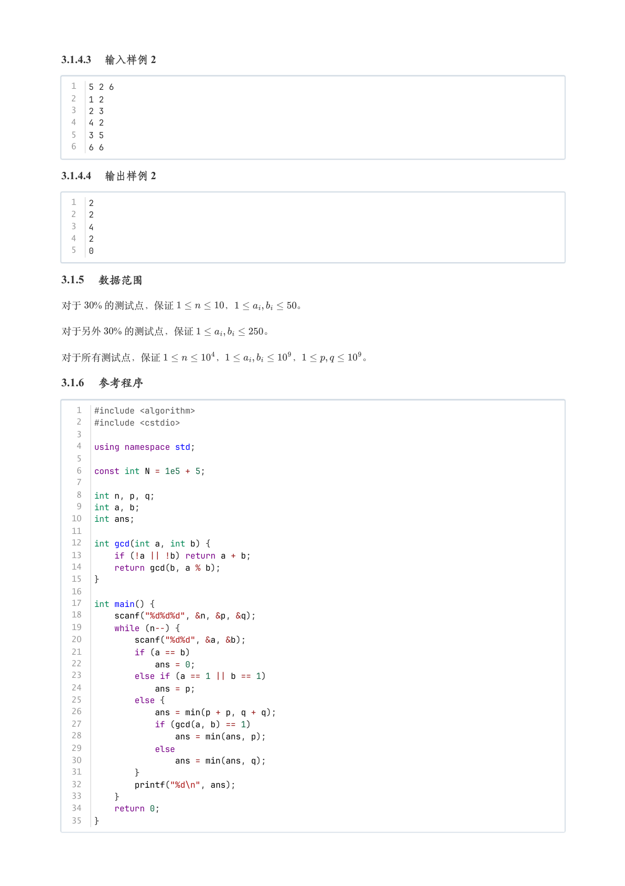

### 提取文本

```
3.1.4.3 输入样例 2

  1  5 2 6
  2  1 2
  3  2 3
  4  4 2
  5  3 5
  6  6 6

3.1.4.4 输出样例 2

  1  2
  2  2
  3  4
  4  2
  5  0

3.1.5 数据范围

对于  % 的测试点，保证     ，      。

对于另外  % 的测试点，保证       。


对于所有测试点，保证      ，       ，      。

3.1.6 参考程序

   1  #include <algorithm>
   2  #include <cstdio>
   3
   4  using namespace std;
   5
   6  const int N = 1e5 + 5;
   7
   8  int n, p, q;
   9  int a, b;
  10  int ans;
  11
  12  int gcd(int a, int b) {
  13      if (!a || !b) return a + b;
  14      return gcd(b, a % b);
  15  }
  16
  17  int main() {
  18      scanf("%d%d%d", &n, &p, &q);
  19      while (n--) {
  20          scanf("%d%d", &a, &b);
  21          if (a == b)
  22              ans = 0;
  23          else if (a == 1 || b == 1)
  24              ans = p;
  25          else {
  26              ans = min(p + p, q + q);
  27              if (gcd(a, b) == 1)
  28                  ans = min(ans, p);
  29              else
  30                  ans = min(ans, q);
  31          }
  32          printf("%d\n", ans);
  33      }
  34      return 0;
  35  }
```

## 第 9 页

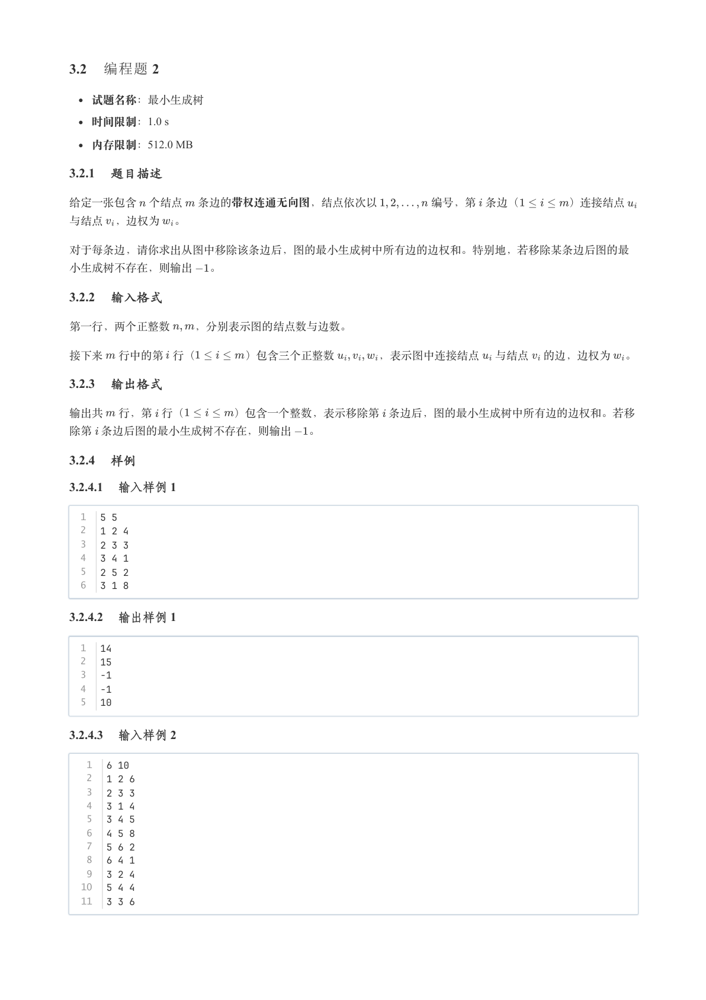

### 提取文本

```
3.2 编程题 2


  试题名称：最小生成树

   时间限制：1.0 s

   内存限制：512.0 MB

3.2.1 题目描述

给定一张包含 个结点 条边的带权连通无向图，结点依次以     编号，第 条边（    ）连接结点

与结点 ，边权为 。


对于每条边，请你求出从图中移除该条边后，图的最小生成树中所有边的边权和。特别地，若移除某条边后图的最

小生成树不存在，则输出  。

3.2.2 输入格式

第一行，两个正整数  ，分别表示图的结点数与边数。


接下来 行中的第 行（    ）包含三个正整数    ，表示图中连接结点 与结点 的边，边权为 。

3.2.3 输出格式

输出共 行，第 行（    ）包含一个整数，表示移除第 条边后，图的最小生成树中所有边的边权和。若移

除第 条边后图的最小生成树不存在，则输出  。

3.2.4 样例

3.2.4.1 输入样例 1

  1  5 5
  2  1 2 4
  3  2 3 3
  4  3 4 1
  5  2 5 2
  6  3 1 8

3.2.4.2 输出样例 1

  1  14
  2  15
  3  -1
  4  -1
  5  10

3.2.4.3 输入样例 2

   1  6 10
   2  1 2 6
   3  2 3 3
   4  3 1 4
   5  3 4 5
   6  4 5 8
   7  5 6 2
   8  6 4 1
   9  3 2 4
  10  5 4 4
  11  3 3 6
```

## 第 10 页

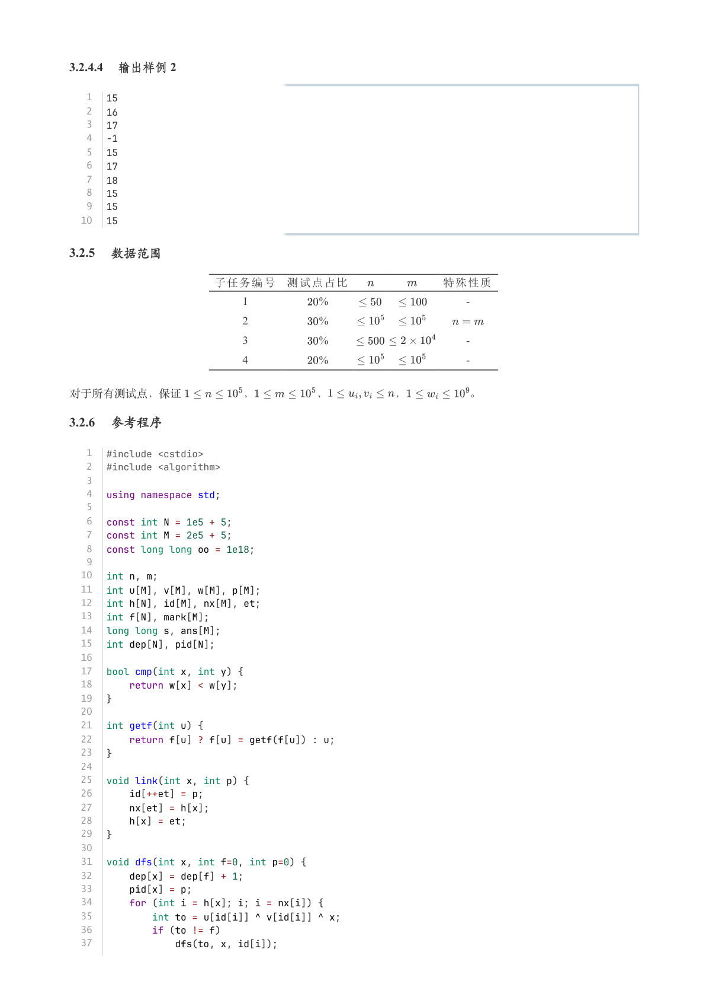

### 提取文本

```
3.2.4.4 输出样例 2

   1  15
   2  16
   3  17
   4  -1
   5  15
   6  17
   7  18
   8  15
   9  15
  10  15

3.2.5 数据范围

            子任务编号 测试点占比        特殊性质

                               1        %                                     -

                               2        %

                               3        %                                     -

                               4        %                                     -


对于所有测试点，保证      ，      ，      ，      。

3.2.6 参考程序

   1  #include <cstdio>
   2  #include <algorithm>
   3
   4  using namespace std;
   5
   6  const int N = 1e5 + 5;
   7  const int M = 2e5 + 5;
   8  const long long oo = 1e18;
   9
  10  int n, m;
  11  int u[M], v[M], w[M], p[M];
  12  int h[N], id[M], nx[M], et;
  13  int f[N], mark[M];
  14  long long s, ans[M];
  15  int dep[N], pid[N];
  16
  17  bool cmp(int x, int y) {
  18      return w[x] < w[y];
  19  }
  20
  21  int getf(int u) {
  22      return f[u] ? f[u] = getf(f[u]) : u;
  23  }
  24
  25  void link(int x, int p) {
  26      id[++et] = p;
  27      nx[et] = h[x];
  28      h[x] = et;
  29  }
  30
  31  void dfs(int x, int f=0, int p=0) {
  32      dep[x] = dep[f] + 1;
  33      pid[x] = p;
  34      for (int i = h[x]; i; i = nx[i]) {
  35          int to = u[id[i]] ^ v[id[i]] ^ x;
  36          if (to != f)
  37              dfs(to, x, id[i]);
```

## 第 11 页

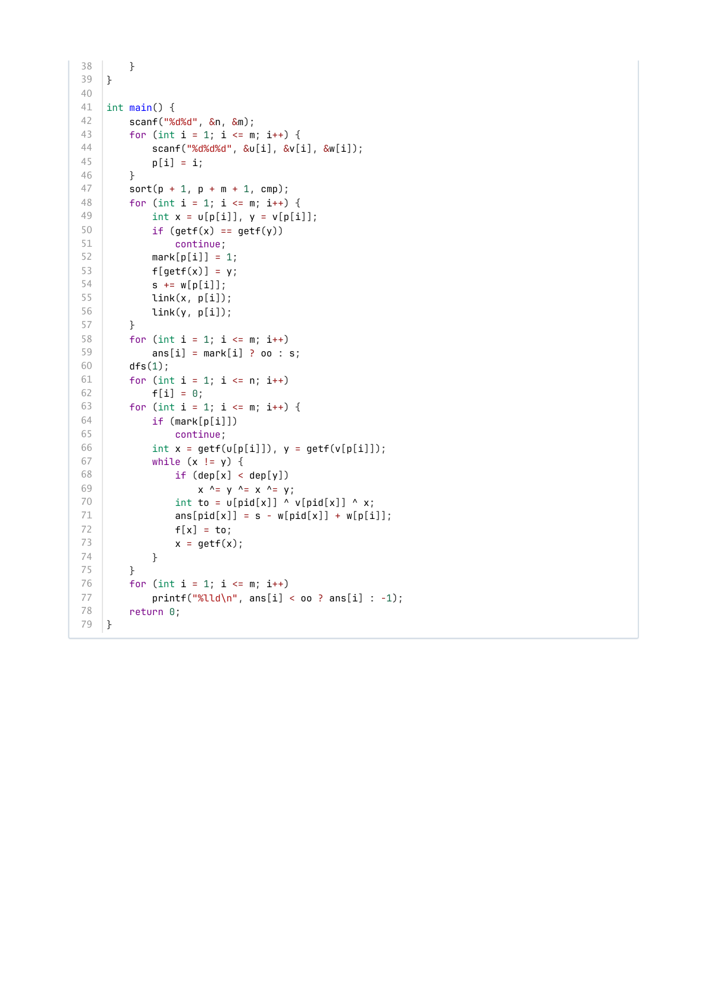

### 提取文本

```
38      }
39  }
40
41  int main() {
42      scanf("%d%d", &n, &m);
43      for (int i = 1; i <= m; i++) {
44          scanf("%d%d%d", &u[i], &v[i], &w[i]);
45          p[i] = i;
46      }
47      sort(p + 1, p + m + 1, cmp);
48      for (int i = 1; i <= m; i++) {
49          int x = u[p[i]], y = v[p[i]];
50          if (getf(x) == getf(y))
51              continue;
52          mark[p[i]] = 1;
53          f[getf(x)] = y;
54          s += w[p[i]];
55          link(x, p[i]);
56          link(y, p[i]);
57      }
58      for (int i = 1; i <= m; i++)
59          ans[i] = mark[i] ? oo : s;
60      dfs(1);
61      for (int i = 1; i <= n; i++)
62          f[i] = 0;
63      for (int i = 1; i <= m; i++) {
64          if (mark[p[i]])
65              continue;
66          int x = getf(u[p[i]]), y = getf(v[p[i]]);
67          while (x != y) {
68              if (dep[x] < dep[y])
69                  x ^= y ^= x ^= y;
70              int to = u[pid[x]] ^ v[pid[x]] ^ x;
71              ans[pid[x]] = s - w[pid[x]] + w[p[i]];
72              f[x] = to;
73              x = getf(x);
74          }
75      }
76      for (int i = 1; i <= m; i++)
77          printf("%lld\n", ans[i] < oo ? ans[i] : -1);
78      return 0;
79  }
```
